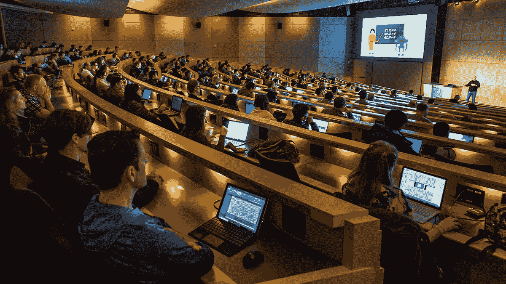
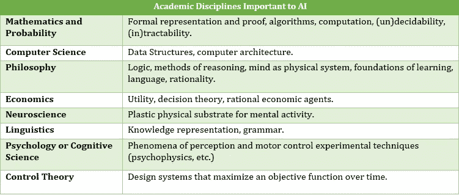
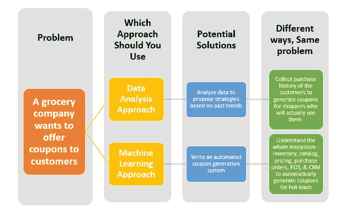

# 给新的和有抱负的人工智能工程师的 7 条重要建议

> 原文：<https://medium.com/analytics-vidhya/7-important-advices-for-the-new-and-aspiring-ai-engineers-1f4bd565704d?source=collection_archive---------2----------------------->

人工智能工程师是当今各行各业最受欢迎的职位之一。想发展人工智能事业吗？坚持住！

当涉及到人工智能这样一个新的、但热门的领域时，你可能想收集所有你能得到的建议。因为，今天有意义的东西，明年可能就会失效。

从最底层的有志之士到晋升到高级职位的专业人士，甚至是那些规划自己业务的人——这里有一些精选的永恒的建议，适用于你作为人工智能工程师的任何阶段。

**在我们进入这些明智的人工智能建议之前，让我们看看一些最新的统计数据。**

> *在过去的几年里，人工智能专家的招聘量每年增长 74%。——领英 2020 年新兴工作报告*

根据该报告，越来越多的企业正在转向自动化，进一步推动了对人工智能工程师的需求。在后新冠肺炎时代，这一趋势将会增强。

将这些建议包含在你的职业规划和日常人工智能项目中，以变得更加细致和有效。

# 👉1.掌握这些基本面。

你工作的框架和你使用的库可能会改变和升级，但是某些人工智能基础知识没有截止日期。

> ***应用统计方法和*** [***ML 算法***](http://brainstormingbox.org/types-of-machine-learning-a-beginners-guide/) ***都成为了易配库。变得重要的是知道何时以及为什么你应该使用一个方法，以及它隐含的假设。***

构成最大似然算法和模型基础的学科的基本知识将帮助你更好地理解你的问题，并从不同的角度看待它。

人工智能借鉴了许多学科——数学、统计学、计算机科学、哲学、经济学、神经科学、心理学、控制理论设计和语言学。虽然人工智能工程师通常拥有强大的计算机科学、编码和编程背景，以及数学诀窍，但熟悉其他学科的一些重要概念可以让他们更有效率。

# 👉2.构建您的生态系统知识。

尽管人工智能专家热爱编程，但他们很容易迷失在细节中。一个人工智能输出，在地面上，实际上是一个工作的软件。作为一名 [**人工智能工程师**](https://www.artiba.org/blog/the-artificial-intelligence-engineer-career-roadmap-all-you-need-to-know) 需要了解你为之设计系统的整个生态系统。

这就是人工智能专家的方法与数据科学家的不同之处。您正在编写代码的领域的领域知识将帮助您有效地利用问题陈述的 ML 算法。

> 人工智能工程师需要深入思考一个问题，这除了需要熟悉工具和技术之外，还需要他们所在的生态系统的工作知识。

数据分析 ***vs*** 机器学习方法

# 👉3.选择任何工具——但是要精通它。

当开始进入这个领域时，许多人工智能的追求者发现自己被种类繁多的 [**人工智能工具、库和平台**](https://dzone.com/articles/ai-tools-and-libraries) **所迷惑。**

> ***分析麻痹在有抱负的人工智能工程师中很常见。比起你对工具、库和平台的选择，你在这些方面的流畅性更有价值。***

你可以选择 [**Python 作为语言选择**](https://www.artiba.org/blog/choosing-your-first-programming-language-python-and-ruby) ，而 PyBrain 和它的库，可以选择任何其他语言(Lisp、R、Prolog、Java)和平台的组合。

强调“可部署”算法的原型，并就问题陈述提出引人入胜的问题。此外，人工智能工程师应该通过每天花一些时间探索博客和人工智能新闻来跟踪人工智能和人工智能的新发展和最新进展。

# 👉4.参与人工智能专家社区。

人工智能社区正在围绕世界级的开源机器学习服务进行建设。这些社区提供复杂的代码供每个人上传和学习。利用他们的专业知识，把你的工作放在专家的世界里，比如 GitHub，从那里你可以得到有价值的反馈。密切关注谷歌 、微软和其他行业领袖的汽车服务。

> 作为一种实践，许多人工智能工程师在一天结束时将他们的代码放在 GitHub 上，以听取其他专家对他们工作的看法。

从人工智能专家社区的图书馆的容易获得性中得到的另一个教训是，除非你正在处理一个非常具体的问题，否则从头开始构建模型是没有必要的。因此，您可以使用将最先进模型的代码浓缩成几行的库—比如说 [**PyTorch hub**](https://pytorch.org/hub/) ， [**TensorFlowhub**](https://www.tensorflow.org/hub) 。

# 👉5.掌握数据科学技术。

数据仍然是人工智能工程师生活的一大部分。

想象一下，你得到数据，操纵它到正确的形状，然后转向你的模型却发现自己被卡住了。有错配。你的下一步是解决这个问题。这个过程比你想象的要老套，而且是反复的，可能会让人不知所措。

> 人工智能工程师的大部分时间都花在确保数据为建模做好准备。

不要犯以首先完善数据为代价试图完善模型的错误。建模是关于寻找看不见的实例的相关性和预测属性，但是这个过程的一个关键部分是你的模型的准确性，这在很大程度上取决于数据。

据说，准备数据所花费的精力是一般人的三倍。了解整个过程的基本细节——从数据收集到操作、建模、模型评估到部署。当你最终开始工作时，你会发现自己身兼数职。

# 👉6.提高你的沟通技巧。

你可能会惊讶地知道，对于人工智能工程师的所有障碍来说，沟通问题甚至超过了技术要求。

虽然大多数行业领导者已经意识到人工智能的奇迹，但少数人实际上明白它是如何工作的，以及人工智能的潜力和局限性是什么。

你可能会发现，理解客户想要什么，让客户明白人工智能能做什么，不能做什么，是一个漫长的旅程。

> ***机器学习和人工智能是不断进化的领域。它能提供许多东西，但有些还不能。你能否获得可实现的项目取决于你的沟通。***

解决沟通困境的一个方法是保持稳定的沟通——在你的队友之间以及与客户之间。定期联系基地。发送已完成工作和下一步工作的最新信息。使用项目管理软件改善内部沟通。对人工智能工程师来说，完善沟通比他们意识到的要重要得多。

# 👉7.参加认证并完成它。

追求一个在线认证就够了吗？不，但这是个开始。

> ***我来告诉你一个黑客吧！没有一个单一的学位或证书可以让你为人工智能工作做好准备。***

然而，它会让你开始，关闭来自大量且经常是铺天盖地的网上信息的噪音，并在尽可能短的时间内指引你到达你的目标。

请记住，您将需要遍历在笔记本中编写模型的间隙，以使它们成为产品级的。部署是艰难的，需要实践经验。

> *开始，用一个* [***AI 认证***](https://www.artiba.org/certification/artificial-intelligence-certification)**打造一个结构化的 AI 骨干，坚持下去，直到完成。在课程期间，用实践能力武装自己，并作为一名人工智能工程师建立自己的投资组合——用你在认证计划中开发的模型和个人项目。**

*让你自己开始并保持在一个以闪电般的速度扩展的学科的最前沿！*