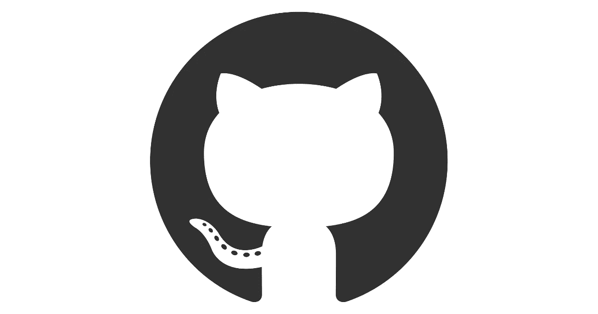
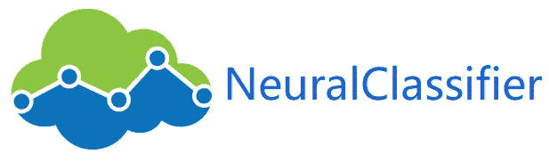
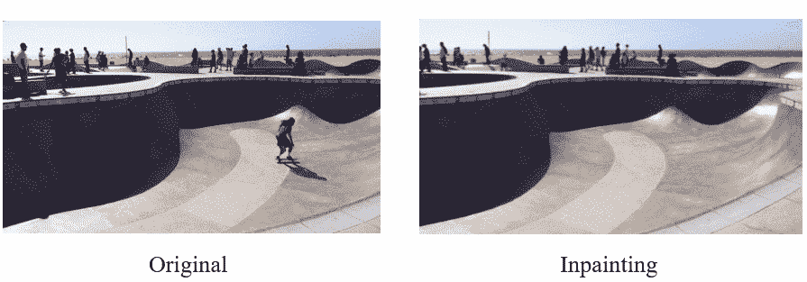
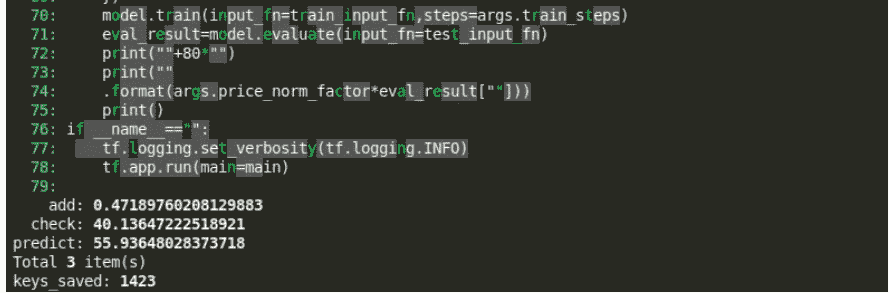
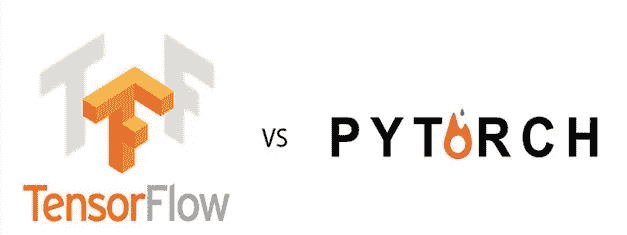
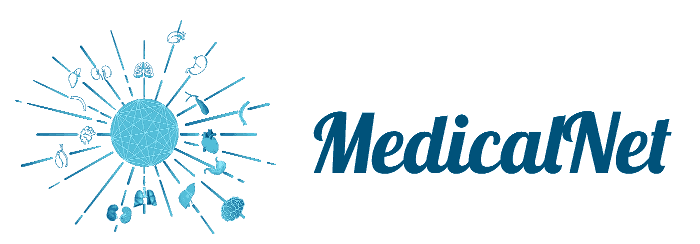

# 7 个创新的机器学习 GitHub 项目

> 原文：<https://medium.com/analytics-vidhya/7-innovative-machine-learning-github-projects-dcfeb68076a4?source=collection_archive---------2----------------------->


在过去的几年里，我为数据科学职位进行了大量的[面试。有一点很突出——有抱负的机器学习专业人士没有足够关注那些会让他们脱颖而出的项目。](https://courses.analyticsvidhya.com/courses/ace-data-science-interviews??utm_source=blog&utm_medium=7-innovative-machine-learning-github-projects-in-python)

不，我不是指在线竞赛和黑客马拉松(尽管这总是展示的加分点)。我说的是您应该使用刚刚发布的库和框架进行的即兴实验。这向面试官展示了两点:

*   你对机器学习有着无法抑制的好奇心。这是成为一名成功的数据科学家的重要方面
*   你不害怕尝试新的算法和技术

猜猜哪个平台有最新的[机器学习](https://courses.analyticsvidhya.com/courses/applied-machine-learning-beginner-to-professional/?utm_source=blog&utm_medium=7-innovative-machine-learning-github-projects-in-python)开发和代码？没错——GitHub！

所以我们来看看上个月发布的七大机器学习 GitHub 项目。这些项目横跨机器学习的长度和宽度，包括与[自然语言处理(NLP)](https://courses.analyticsvidhya.com/courses/natural-language-processing-nlp/?utm_source=blog&utm_medium=7-innovative-machine-learning-github-projects-in-python) 、[计算机视觉](https://courses.analyticsvidhya.com/courses/computer-vision-using-deep-learning-version2/?utm_source=blog&utm_medium=7-innovative-machine-learning-github-projects-in-python)、大数据等相关的项目。

# 顶级机器学习 GitHub 项目



# py torch-变形金刚 (NLP)

老实说，自然语言处理(NLP)的威力让我大吃一惊。几年前我开始在数据科学领域工作，NLP 的发展和改变了我们处理文本的方式——它几乎无法描述。

PyTorch-Transformers 是最新的 NLP 库。它在各种 NLP 任务中击败了所有以前的基准。我真正喜欢 PyTorch 变压器的是，它包含 PyTorch 实现、预训练模型权重和其他重要组件，可以让您快速入门。

之前，你可能会对运行最先进的模型所需的荒谬的计算能力感到沮丧。我知道我是(不是每个人都有谷歌的资源！).PyTorch-Transformers 在很大程度上根除了这个问题，使我们这样的人能够构建最先进的 NLP 模型。

这里有几篇深入的文章，帮助您开始使用 PyTorch-Transformers(以及 NLP 中预训练模型的概念):

*   PyTorch-Transformers 简介:一个不可思议的最新自然语言处理库(带 Python 代码)
*   [8 个优秀的预训练模型让你开始学习自然语言处理](https://www.analyticsvidhya.com/blog/2019/03/pretrained-models-get-started-nlp/?utm_source=blog&utm_medium=7-innovative-machine-learning-github-projects-in-python)
*   [py torch 简介——一个简单而强大的深度学习库](https://www.analyticsvidhya.com/blog/2018/02/pytorch-tutorial/?utm_source=blog&utm_medium=7-innovative-machine-learning-github-projects-in-python)

# 神经分类器 (NLP)

文本数据的多标签分类在现实世界中是一个相当大的挑战。当我们处理早期的 NLP 问题时，我们通常处理单标签任务。在真实世界的数据中，这个水平上升了几个等级。

> *在多标签分类问题中，一个实例/记录可以有多个标签，并且每个实例的标签数量不固定。*

NeuralClassifier 使我们能够快速实现用于分层多标签分类任务的神经模型。我个人喜欢 NeuralClassifier 的地方在于它提供了我们所熟悉的种类繁多的文本编码器，比如 FastText，RCNN，Transformer encoder 等等。



我们可以使用 NeuralClassifier 执行以下分类任务:

*   二元文本分类
*   多类文本分类
*   多标签文本分类
*   分层(多标签)文本分类

下面是两篇关于多标签分类到底是什么以及如何在 Python 中执行多标签分类的优秀文章:

*   [使用自然语言处理预测电影类型——多标签分类的精彩介绍](https://www.analyticsvidhya.com/blog/2019/04/predicting-movie-genres-nlp-multi-label-classification/?utm_source=blog&utm_medium=7-innovative-machine-learning-github-projects-in-python)
*   [在 Python 中构建您的第一个多标签图像分类模型](https://www.analyticsvidhya.com/blog/2019/04/build-first-multi-label-image-classification-model-python/?utm_source=blog&utm_medium=7-innovative-machine-learning-github-projects-in-python)

# [TDEngine](https://github.com/taosdata/TDengine) (大数据)


这个 TDEngine 库上个月获得了 GitHub 上所有新项目中最多的星星。不到一个月接近一万颗星。让那件事过去一会儿。

**TDEngine 是一个开源的大数据平台**，旨在:

*   物联网
*   联网汽车
*   工业物联网
*   IT 基础设施等等。

TDEngine 本质上提供了一整套与数据工程相关的任务。我们可以以超快的速度完成这一切(10 倍的查询处理速度和 1/5 的计算量)。

(目前)有一个警告— *TDEngine 只支持在 Linux 上执行*。这个 GitHub 库包括完整的文档和带代码的入门指南。

我建议查看我们面向数据工程师的综合资源指南:

*   [想成为数据工程师？这里有一个全面的资源列表，可以开始使用](https://www.analyticsvidhya.com/blog/2018/11/data-engineer-comprehensive-list-resources-get-started/?utm_source=blog&utm_medium=7-innovative-machine-learning-github-projects-in-python)

# [视频对象移除](https://github.com/zllrunning/video-object-removal)(计算机视觉)

你处理过图像数据吗？操纵和处理图像的计算机视觉技术相当先进。图像的目标检测被认为是成为计算机视觉专家的基本步骤。

那么视频呢？当我们被要求简单地在视频中的物体周围画出边界框时，难度就上升了几个等级。对象的动态方面使得整个概念更加复杂。

所以，想象一下当我看到这个 GitHub 库时我有多高兴。**我们只需要在视频中的物体周围画一个包围盒就可以把它去掉。**真的就这么简单！以下是这个项目如何运作的几个例子:



如果您是计算机视觉领域的新手，这里有一些资源可以帮助您入门:

*   [基本物体检测算法的逐步介绍](https://www.analyticsvidhya.com/blog/2018/10/a-step-by-step-introduction-to-the-basic-object-detection-algorithms-part-1/?utm_source=blog&utm_medium=7-innovative-machine-learning-github-projects-in-python)
*   [计算机视觉使用深度学习 2.0 课程](https://courses.analyticsvidhya.com/courses/computer-vision-using-deep-learning-version2/?utm_source=blog&utm_medium=7-innovative-machine-learning-github-projects-in-python)

# [Python 自动完成](https://github.com/vpj/python_autocomplete)(编程)

你会喜欢这个机器学习 GitHub 项目的。作为数据科学家，我们的整个角色都围绕着实验算法(嗯，我们大多数人)。**这个项目是关于一个简单的 LSTM 模型如何自动完成 Python 代码。**

下面用灰色突出显示的代码是 LSTM 模型填充的内容(结果在图像的底部):



正如开发者所说:

> 在清除 python 代码中的注释、字符串和空行之后，我们对其进行训练和预测。在对 python 代码进行标记化之后，对模型进行训练。这似乎比使用字节对编码的字符级预测更有效。

如果您曾经花费(浪费)时间写出普通的 Python 代码，这可能正是您正在寻找的。它仍然处于非常早期的阶段，所以要对一些问题持开放态度。

如果你想知道 LSTM 到底是什么，你应该看看这篇介绍性文章:

*   [深度学习精要:长短期记忆介绍(LSTM)](https://www.analyticsvidhya.com/blog/2017/12/fundamentals-of-deep-learning-introduction-to-lstm/?utm_source=blog&utm_medium=7-innovative-machine-learning-github-projects-in-python)

# [TF pyth—tensor flow to py torch to tensor flow](https://github.com/BlackHC/tfpyth)(编程)

TensorFlow 和 PyTorch 都有强大的用户群体。但 PyTorch 令人难以置信的采用率应该会在未来一两年内超越 TensorFlow。*注意:这并不是对 TensorFlow 的否定，tensor flow 是相当可靠的。*

因此，如果你已经在 TensorFlow 中编写了任何代码，并在 PyTorch 中编写了单独的代码，并且希望将这两者结合起来训练一个模型，那么 *tfpyth* 框架就是为你准备的。关于 tfpyth 最好的部分是我们不需要重写早期的代码。



这个 GitHub 库包括一个结构良好的例子，展示了如何使用 *tfpyth* 。在 TensorFlow vs. PyTorch 的辩论中，这绝对是一个令人耳目一新的外观，不是吗？

安装 *tfpyth* 容易吗:

```
pip install tfpyth
```

下面是一些深入了解 TensorFlow 和 PyTorch 工作原理的文章:

*   [深度学习指南:使用 Python 中的 TensorFlow 实现神经网络简介](https://www.analyticsvidhya.com/blog/2016/10/an-introduction-to-implementing-neural-networks-using-tensorflow/?utm_source=blog&utm_medium=7-innovative-machine-learning-github-projects-in-python)
*   [py torch 简介——一个简单而强大的深度学习库](https://www.analyticsvidhya.com/blog/2018/02/pytorch-tutorial/?utm_source=blog&utm_medium=7-innovative-machine-learning-github-projects-in-python)

# [医学网](https://github.com/Tencent/MedicalNet)

我把迁移学习和自然语言处理联系在一起。这是我的错——我太专注于新的发展了，以至于我想象不出迁移学习还可以应用在其他什么地方。所以当我看到这个奇妙的医疗网络项目时，我非常激动。



这个 GitHub 存储库包含'[Med3D:Transfer Learning for 3D Medical Image Analysis](https://arxiv.org/abs/1904.00625)论文的 PyTorch 实现。这个机器学习项目聚合了具有不同模态、目标器官和病理的医学数据集，以建立相对较大的数据集。

正如我们所知，我们的深度学习模型(通常)需要大量的训练数据。因此，腾讯发布的 MedicalNet 是一个出色的开源项目，我希望很多人都参与其中。

MedicalNet 的开发者已经发布了基于 23 个数据集的四个预训练模型。如果你需要迁移学习，这里有一个直观的介绍:

*   [迁移学习&在深度学习中使用预训练模型的艺术](https://www.analyticsvidhya.com/blog/2017/06/transfer-learning-the-art-of-fine-tuning-a-pre-trained-model/?utm_source=blog&utm_medium=7-innovative-machine-learning-github-projects-in-python)

# 结束注释

我们这里有相当多的机器学习项目。我在每个 GitHub 项目之后都提供了教程、指南和资源。

我有一个要求——选择您感兴趣的项目，浏览教程，然后应用特定的库来解决问题。例如，您可以使用 NeuralClassifier 存储库，并使用它来解决多标签分类问题。

这将有助于你拓宽对主题的理解，扩展你目前的技能。双赢的局面！让我知道你的想法，你在上面列表中最喜欢的项目，以及你在下面评论区的反馈。

*原载于 2019 年 8 月 2 日*[*【https://www.analyticsvidhya.com】*](https://www.analyticsvidhya.com/blog/2019/08/7-innovative-machine-learning-github-projects-in-python/)*。*