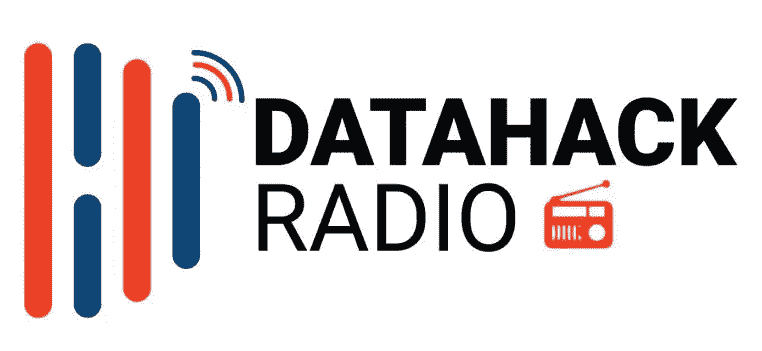

# 采访机器学习和数据科学领域的顶级领导者的 7 点收获

> 原文：<https://medium.com/analytics-vidhya/7-learnings-from-interviewing-top-leaders-in-machine-learning-and-data-science-9c585f7a8400?source=collection_archive---------1----------------------->

[data hack Radio](https://soundcloud.com/datahack-radio)|[iTunes](https://itunes.apple.com/in/podcast/datahack-radio/id1397786677?mt=2)

> 通过三种方法我们可以学到智慧:**第一，通过反思，这是最高尚的**；第二，通过模仿，这是最容易的；而**第三，凭经验，也是最苦的**。
> 
> ——孔子

3 个月前，我们开始了 DataHack Radio。你们中的一些人可能会问——为什么又是一个关于数据科学的播客？答案和 5 年前我开始分析时一样:

> *创建播客有助于我们向该领域的顶尖人才学习，并与社区分享。这有助于我们建立一个视角，而这可能需要我们自己花很多年才能建立起来。*

所以，现在我们有了几集，这是一个很好的时间来反映我学到了什么，并与我们的社区分享:

1.  **行业中的最高领导者来自不同的背景，并促进多元化。Anthony Goldbloom 和 Emily Sands Glassberg 都是经济学家，Marios 来自金融和会计专业，Carla Gentry 学习数学。当一些人爱上数据科学时，他们甚至不知道编程。底线是，数据科学作为一个领域，通过让不同背景的人走到一起，实际上会变得更好。你不是计算机科学毕业生，并不意味着你不能成为一名数据科学家。**
2.  **高层领导总是在学习新的工具和技术。我认为安东尼的那一集在这一点上很突出。Kaggle 不仅通过竞赛不断地支持研究，他们还不断地开发内核，为他们的社区带来最新的发展。Anthony 描述了 Kaggle 如何使人们能够创建、测试和推广各种工具和技术，以及 XGBoost 如何在 Kaggle 上流行起来。**
3.  了解工具和技术是重要的，但是仅仅这样并不能让你达到顶峰。你需要了解在商业中实现机器学习的挑战。我喜欢艾米丽描述她的项目和见解的方式——她如何定义问题，底层数据结构以及它使 Coursera 实现了什么。
4.  许多世界性的问题仍然需要数据收集、数据清洗、数据扩充并为工作做好准备。与[医生阿维克·萨卡](https://soundcloud.com/datahack-radio/episode-7-dr-avik-sarkar)的那一集在这里很突出。他的团队正在解决的大多数问题包括通过各种一级、二级和三级来源收集数据。他正在研究的一个问题包括印度农民的预测产量管理。他的团队正在研究卫星图像数据、天气数据、各种市场的定价和过去的产量数据，以帮助农民在合适的时间种植作物。
5.  **数据隐私是这些专业人士的头等大事。**与卡拉·金特里的[讨论清楚地表明了这一点。我们谈到 GDPR 是隐私进化方式的早期变化之一。她预计未来几年将有更多这样的变化，并要求数据科学家承担责任，确保我们为客户进行正确的数据科学，同时尊重他们的隐私。](https://soundcloud.com/datahack-radio/episode-4-carla-gentry)
6.  **协作学习和构建开源是数据科学的未来。显然，Kaggle 在这方面处于领先地位——开放数据集、内核和论坛。但是，这是贯穿这些采访的一个共同主题— [Kiran 提到](https://soundcloud.com/datahack-radio/episode-5-kiran-r)他的团队正在为 EDA 构建一个开源库， [Tarry Singh](https://soundcloud.com/datahack-radio/episode-2-tarry-singh) 和 Marios 详细讨论了这一点。Tarry Singh 通过他的工作室让世界各地的人们都能参与进来，Marios 讲述了他从数据科学的民主化中获益良多。**
7.  **竞赛本身并不是目的，但它们仍然为您提供了一个绝佳的平台**来测试您的数据科学概念，并为加速学习做好准备。Anthony，Marios 和 Kiran 都同意，有些时候比赛可能没有反映出现实生活中的挑战。

这些是我认为最重要的学习。每一集和每一次讨论都有更多的内容。

如果你听过这些，你学到的最重要的东西是什么？一定要和我们分享。直到那时——继续学习