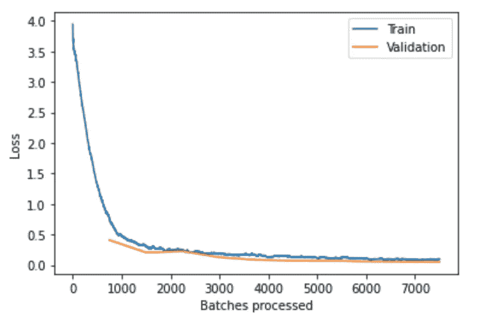

# 你应该绝对了解 fast.ai 深度学习库的 7 个理由

> 原文：<https://medium.com/analytics-vidhya/7-reasons-why-you-should-absolutely-know-about-fast-ai-deep-learning-library-890cf4e293de?source=collection_archive---------24----------------------->


Radek Grzybowski 在 [Unsplash](https://unsplash.com?utm_source=medium&utm_medium=referral) 上的照片

如果你是深度学习或机器学习的实践者，那就留下来吧。在这篇文章中，我将向你介绍一个名为 fast.ai 的令人敬畏的库，它有助于你的训练和模型构建过程。Fast.ai 就像 pytorch 的包装器一样，是用 python 编写的。它增加了一些额外的功能，这些功能将在下面描述，使您在传统的深度学习任务中更有效率。所以，如果你还不知道 fast.ai，你应该知道为什么。

# **1。更少的代码行**

深度学习或者说人工智能社区似乎有一种让一切变得更难的趋势。我不知道这是否是人们接管的不安全感，如果人工智能很容易，每个人都会开始这样做，或者他们实际上喜欢控制一切，或者也许他们只是喜欢自己实现一切。我也是同类，写很长的 python 脚本，试图从零开始想出一个模型等等。相信我，这些都不重要，唯一重要的是结果，以及你是怎么做到的。例如，如果你只想使用像 *keras* 这样的高级 api，而对基础知识一无所知，你将无法诊断你的模型。另一方面，如果你喜欢自己完成所有的事情，你会浪费大量的时间去完成最简单的事情。Fast.ai 库提供了一种非常简单的方法，仅用 15 行代码就可以达到最先进的精度。

看起来需要更少的时间，信不信由你，这就是在 fast.ai 中创建一个好的图像分类器所需的时间。数据是根文件夹，其中有你想要分类的图像，这些图像根据它们的类别被分离到不同的文件夹中。

# **2。一个循环学习**

Fast.ai 库利用了著名的单周期学习，这使得神经网络的学习过程更快。有太多的*优化器*，它们倾向于调整*学习速率或梯度步骤*，以使学习过程更快、更有效。有一个*动量*，它利用了这样一个想法，如果先前的梯度在相同的方向上，就采取较大的步长，如果你得到与先前计算的梯度相反的方向，就采取较小的步长。有 *ADAM* 和 *ADAGRAD* 为所有维度提出不同的“*有效学习率”*的想法，并在我们进行的过程中修改学习率。然而，我发现成熟的 ADAM 有时比最简单的优化器——随机梯度下降法——表现更差。一个周期学习并不是一个不同的优化器，而是一种逐渐增加学习率，然后在每个时期再次降低学习率的方法，以确保您永远不会陷入任何局部最优。它不是不可战胜的或神奇的，它仍然会给你带来一些问题，但一个周期的学习肯定会让生活变得简单得多。

```
#get the gist of how learning rate is varied over a single cyclelearn.recorder.plot_lr() #after training process
```


# 3.LR 取景器

没错，你没看错， ***【学习率查找器】*** 。深度学习的教父之一 Yoshua Bengio 说，学习率是唯一最重要的超参数，我喜欢遵循他的每一条黄金建议。很多时候，你想出了一个不错的模型，你有世界上所有你需要的数据来解决你的问题，但似乎没有什么工作。嗯，我的朋友，那是因为你把你的*学习速度*设置错了。除了监控每个时期后的损失，看看你的损失发生了什么，你可以相应地增加或减少损失，你什么也做不了。当你的单个*纪元*需要几十秒左右的时间时，这似乎很有趣，但当这个数字开始上升到几分钟，更不用说几个小时时，这就相当令人沮丧了。不再沮丧，fast.ai 来拯救。快速人工智能有一个令人惊叹的功能，称为 *LR* finder，它试图用一系列不同的学习率训练你的模型，并返回你一个漂亮的图，Y 轴上有*损失*，x 轴上有 *LR* 。基本思想是在图最陡的地方使用学习率，同时降低损失。我猜那些快人工智能的小伙子是从霍格沃茨什么的来的。

```
#after creating your learner object learn.lr_find()
learn.recorder.plot()
```


用 resnet18 和 MNIST 调用 lr_find 得到这个图。最陡下坡在 0.001 和 0.01 之间

# 4.他们记录一切

没有更多的`from keras import callbacks` Fast.ai 有这个漂亮的*学习者*对象，它将你的模型和数据绑定在一起，你训练这些*学习者*对象。它们似乎记录了你需要的每一点重要信息。所以下次你忘记导入*回调*或者不想浏览文档找到你需要的必要功能，那么 fast.ai 会支持你。

```
learn.recorder.plot_losses()
```



```
learn.recorder.plot_metrics()
```


# 5.用一半的内存和两倍的速度训练

我们钟爱的深度学习模型的训练一般发生在 32 位。综上所述，训练只不过是一系列 32 位浮点数的乘法运算。如果我们谈论的是预先训练的模型，这些数字通常会达到几千万。有时你可能会以一个*‘CUDA 内存不足错误’*结束，这仅仅意味着你的 *gpu* 已经用完了内存，你必须重启你的内核来让一切恢复正常。如果你在第一个时期遇到这个错误，那么你应该减少你的批量。Fast.ai 库提供了一个非常简单的方法，让这些挫折减少一半。fast.ai 中的 *learner* 对象负责您的训练过程，它允许您选择将数字的大小减少到 16 位浮点数，这不仅在您的 gpu 上占用更少的空间，而且将训练时间减少了一半，因为乘法运算速度提高了 2 倍。最好的部分是，你不必去英伟达网站下载一堆脚本来实现这一点。我们只是在创建*学习者*对象时指定它。

```
learn = cnn_learner(data, models.resnet34, 
                          metrics = accuracy).to_fp16()
# Boom! Done!
```

# 6.微小的改进让你更有效率

还记得从 kaggle 或 HackerEarth 下载数据集的日子吗，它带有一个*训练*和*测试*文件夹。fast ai 中的*数据束*对象，也就是你如何在 fast.ai 中向模型提供数据，将一个*训练集*和*验证集*以及一个可选的*测试集*绑定在一起，并猜测它从你的训练集中随机采样的内容，并自己创建一个验证集。如果我们想特别选择我们的验证集，我们甚至可以提供一个文件。如果您想要查看您的图像分类数据集，只需调用 *show_batch* 函数和您想要查看的图像数量。**数据块 API** 似乎允许你从你拥有的任何格式的数据中创建你的*数据束*。不再需要为这些任务编写定制的生成器。

```
data.show_batch(rows = 3, figsize = (5, 5)
#data is your data bunch object
```


如果你正在使用 pytorch 的*数据加载器*，这里是你如何绘图


# 7.社区

Fast.ai 有一个伟大的学习者和实践者社区，如果你在任何地方卡住了，他们都非常乐意帮助你，这似乎不太可能，因为它太干净了。如果你正在使用 fast.ai 深度学习库，你必须做的最困难的事情是找出一种方法，从你手头的数据中创建一个*数据束*对象。我建议通读一下**数据块 API** [文档](https://docs.fast.ai/data_block.html)来掌握它的窍门，剩下的就像打印一样简单(“Hello World！”).fast.ai 社区最好的一点是他们的创建者活跃在他们的论坛上。如果你是一个 *pythonista* 并且知道如何处理事情，那么好消息是，Fast ai 是用 python 编写的，仅仅是一个对 *pytorch* 的包装。如果文档看起来有点混乱，人们可以简单地查看源代码。

杰瑞米·霍华德和 fast.ai 的人们创造了这么棒的图书馆和 MOOC 来传播意识和培训人们。如果你是深度学习从业者或者数据科学爱好者，我强烈推荐你去看看。

如果你喜欢这本书，请给它一个掌声，或者你知道 50！