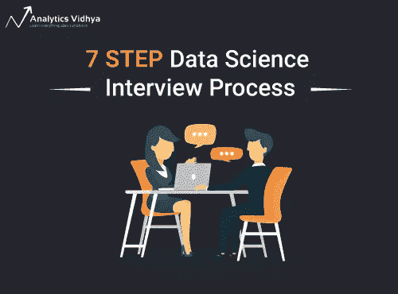
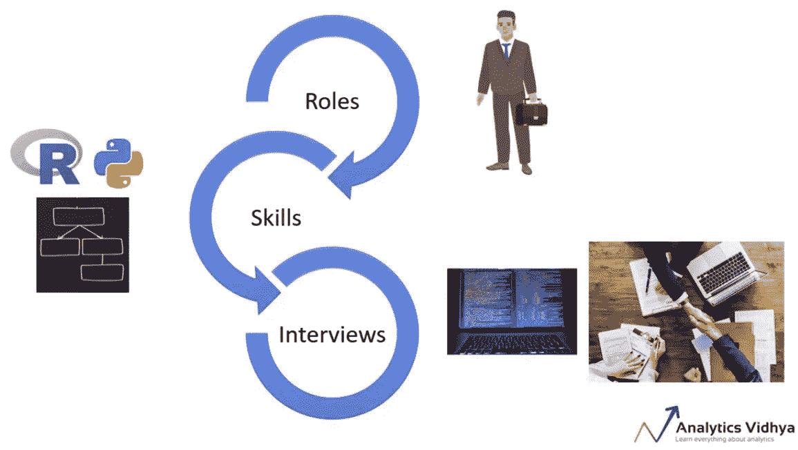
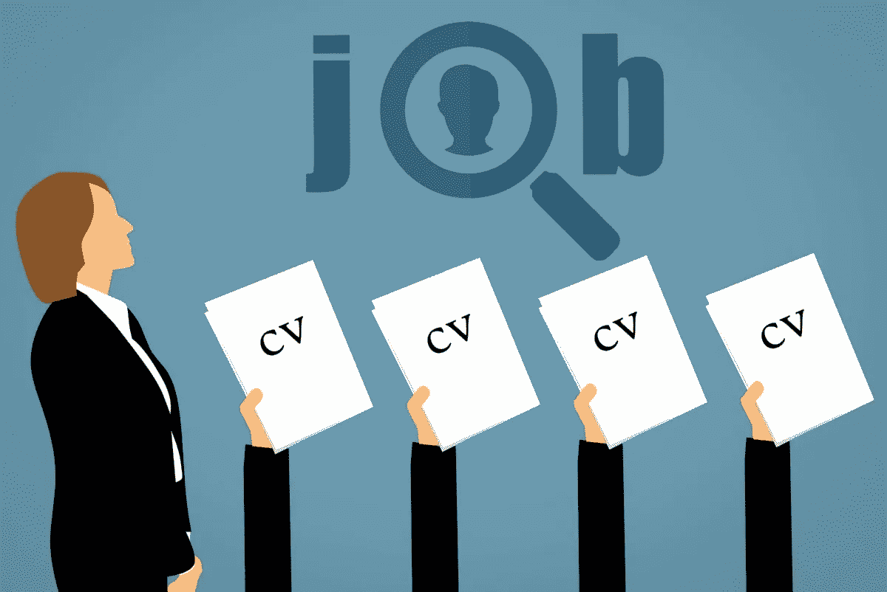

# 成功进行数据科学面试的 7 步流程！

> 原文：<https://medium.com/analytics-vidhya/7-step-process-to-ace-data-science-interviews-9d8a38134b1f?source=collection_archive---------0----------------------->

# 介绍

您是否希望在数据科学领域有所突破，但却难以通过面试？你害怕参加[数据科学面试](https://courses.analyticsvidhya.com/courses/ace-data-science-interviews?utm_medium=7steparticle&utm_source=blog)吗？或者你只是不确定在这些面试中会遇到什么？

你甚至可能知道与工作相关的数据科学工具和技术。但是雇主一直拒绝你。对于一个看似入门级的角色，当工作描述需要多年的经验时，这当然没有帮助！

我去过那里。我有丰富的学习和开发背景，一个非技术和非数据科学领域。在最终获得 Analytics Vidhya 的数据科学职位之前，我花了几个月的辛勤工作和严格的努力，以及无数次拙劣的面试。

我在这篇文章中的目的是列出一个框架，我们已经想出了这个框架来帮助你赢得数据科学面试。我们借鉴了自己的经验，并联系了多位数据科学专家，精心打造了这一全面的 7 步框架。它已经帮助包括我在内的许多人简化了他们的数据科学面试准备。

**这个框架是“** [**王牌数据科学访谈**](https://courses.analyticsvidhya.com/courses/ace-data-science-interviews?utm_medium=7steparticle&utm_source=blog) **”课程的一部分。本课程是根据我们参加的数百次面试以及与公司的合作创建的，旨在帮助他们寻找数据科学人才。**

# 以下是 7 步数据科学面试流程

这个 7 步过程从你开始研究你感兴趣的不同角色的阶段开始。它一直延续到面对面的面试结束。

请记住，这是一个全面的框架。你可能不需要经历面试过程中的每一步。

1.  了解不同的角色、技能和面试
2.  为面试做好准备——打造你的数字形象
3.  准备好简历，开始申请吧！
4.  电话筛选
5.  完成作业
6.  面对面互动
7.  面试后的步骤

在本文中，我们将分析所有这些步骤，并看看人们在每个步骤中犯的错误。此外，**所有这 7 个步骤都整齐地打包在本文末尾的一个精彩的图解信息图中。在整个面试准备过程中，把它放在手边！**

# 1.了解数据科学中的不同角色、技能和面试

你选好你想在数据科学领域从事的工作了吗？我从大多数人那里得到的最常见的答案是“我想成为一名数据科学家”。数据科学还有什么？

您需要了解的第一件事是，在数据科学生态系统中有各种各样的角色。典型的数据科学项目的生命周期由几个功能组成。数据科学家只是成功的数据科学项目的一个组成部分。下面快速浏览一下目前存在的不同工作角色:

*   数据工程师
*   数据科学家
*   商业分析员
*   数据分析师
*   数据可视化工具(讲故事的人)
*   统计员
*   数据科学经理
*   数据架构师
*   机器学习工程师
*   计算机视觉工程师

我可以继续说下去，但你应该明白。我建议花时间研究这些不同的角色，并找出一个你认为适合自己的角色。我们精心制作了一份直观的问题表，作为' [Ace 数据科学面试](https://courses.analyticsvidhya.com/courses/ace-data-science-interviews?utm_medium=7steparticle&utm_source=blog)'课程的一部分，帮助您做出决定。

下一步是了解这些角色所需的技能。例如，对于一个数据工程师的角色，你需要有很强的 Python 和软件工程背景——但是沟通技巧并不那么重要。另一方面，如果你想进入业务分析师的角色，你需要有良好的沟通和解决问题的技能。你可能不需要了解 Python。

既然你已经知道了你想要追求的角色，以及达到这个目标需要什么样的技能，那么就有必要对你可能面临的面试类型进行规划。同样，这些面试会因角色而异

数据科学家将被盘问他/她的机器学习知识、对工具的掌握、领域专业知识、沟通技巧等。数据工程师将主要测试他/她的软件工程和编程技能。理解你的角色所期望的不同的细微差别，并做好相应的准备。

# 人们在这个阶段常犯的错误

我将回到我最初的问题，您认为自己在数据科学中处于什么角色？我见过的大多数人在这个阶段都会犯一个巨大的错误。他们没有花时间去理解这些不同角色的细微差别。

因此，不管是什么角色，他们的面试准备都是一样的。不要犯这种错误！即使面试形式是一样的，面试官的期望也会根据你选择的角色而改变。

我的建议是和你关系网中从事这一领域的人谈谈。向他们请教他们对每个角色的理解。你也可以在这篇文章下面给我留下你的问题——我很乐意回答任何问题。

# 2.为面试做好准备——打造你的数字形象

到目前为止你尽职调查了吗？很好，因为是时候进入第二步了——建立你的数字形象。

我们采访过的 80%以上的招聘人员承认，他们会在给应聘者打电话进行面试之前查看他们在 LinkedIn 上的个人资料。没错，我们正生活在一场数字革命中。仅仅依靠一两页的简历是不够的。招聘公司想要证据来支持你简历中的说法。

好消息是，这样做并不缺乏选择:

*   **你应该有一个 LinkedIn 个人资料。**它应该根据你申请的职位进行更新和优化。在展示非技术背景的同时申请数据科学家职位，不会给人留下正确的印象
*   **创建一个 GitHub 账户。**编程是数据科学机器中至关重要的一环。将你的代码和项目上传到 GitHub 有助于招聘人员直接看到你的工作。没有什么比一段有据可查的代码更有说服力了！
*   **定期在 Quora 上回答数据科学相关问题。这传达了你对主题的理解**
*   **开始以博客的形式发布你的学习成果。**学到了新东西？写写吧。把它放在外面。征求社区的反馈。这就是你如何建立信誉，增加获得面试机会的方法
*   **申请在见面会和会议上发言。**通过参加 DataHack Summit 等活动，在数据科学社区建立您的声誉。如果你能成为一名演讲者，工作机会可能就会滚滚而来

选择是无穷无尽的！你需要根据你想要申请的职位和你自己的优势来选择媒介(例如，一个商业分析师可能不需要 GitHub 账户)。

# 人们在这个阶段常犯的错误

不要把这一步留到最后！我见过有人在申请工作前几个小时创建 GitHub 个人资料。当你在做或申请面试的时候，你不会拥有想要的数字影响力。这最后一分钟的冲刺根本没有留下足够的时间来根据角色要求优化你的细节。

同样的故事也适用于 LinkedIn。建立你的人际网络需要耐心和承诺。我花了一年多的时间与数据科学领域的合适人员建立联系，并在那里建立了我的档案。

我们的建议是— **你需要在申请工作前至少 6 个月这样做。这不仅能确保你有足够的时间来树立自己的形象，还能减轻整个过程的压力。**

# 3.准备好你的简历并开始申请

如果我必须选择数据科学过程中最困难的一步，那就是这个。是的，我把这个放在面对面的技术面试之上。你可以学习和温习一下你的数据科学知识。但是制作一份完美的简历呢？那完全是另一回事。

我相信你们很多人都会同意。每个招聘人员和招聘经理都有自己判断候选人的标准。所以设计一份简洁明快的简历是你首先要考虑的。几个小技巧可以做到这一点:

*   确保你的简历反映了这份工作所需的相关技能。你可能是一个 PowerPoint 高手，但这不应该是你作为数据工程师的关键技能
*   为不同的角色创建不同的简历。和人力资源或者公司的校友谈谈，看看他们的期望是什么。与老牌公司相比，初创公司通常会有非常不同的实践期望

一旦你的简历准备好了，扩大你的求职范围。请记住，工作门户不是申请数据科学职位的唯一途径！事实上，这是最没有效率的求职方式。有超过 9 种不同的求职方式，求职门户恰好是其中之一。

在“ [Ace 数据科学面试](https://courses.analyticsvidhya.com/courses/ace-data-science-interviews?utm_medium=7steparticle&utm_source=blog)课程中，我们将逐一讨论这 9 种方式。这包括优化你的申请的技巧和诀窍，以便获得梦想中的面试！

# 人们在这个阶段常犯的错误

这个很简单——我看到人们在这个阶段犯的最常见的错误是他们开始被动地找工作。他们做所有艰苦的工作，花费数天或数周学习正确的东西，然后由于不知道如何申请而浪费掉。

我们大多数人通常从办公室回来，然后登录几个流行的工作门户网站并在那里申请。毕竟，这很容易。你的简历已经上传了——你所要做的就是找到一份相关的工作，然后点击一个按钮。这种策略不再奏效。招聘人员在门户网站上会有数百份申请，看起来几乎都一样。

不可能区分这两者。这变成了一场碰运气的游戏。即使这个策略奏效，你也要过几个月才能从这个渠道获得任何有意义的东西。

伙计们，我们正处于数字时代！发挥创造力！你花了那么多时间在第二步中建立你的关系网，好好利用它。大多数数据科学面试将通过非工作门户渠道进行。

# 4.电话筛选

如果你已经达到了这个阶段——恭喜你自己！是时候与招聘人员进行第一次真正的互动了。

根据公司的不同，可能只给招聘人员打电话，或者只给招聘经理打电话(或者两者都打)。但是基本原理是一样的。如果招聘经理在接电话，你应该预料到在这个过程中会有一些技术问题。

由于这是一个电话或虚拟的通话安排，您可以准备好大多数常见问题的答案。不过，我不建议直接从屏幕上读。你应该做好大致的准备，然后从这里开始。

像对待其他步骤一样认真对待这一轮。一种随意的氛围足以让招聘者失去兴趣。此外，在接电话的房间里，尽量减少干扰。您也可以在整个通话过程中做笔记，以供日后参考。我已经给出了一个全面的在课程中通过电话面试的注意事项。

# 人们在这个阶段常犯的错误

太多的人在这个阶段没有提出问题。这是一个很好的机会，可以让你更好地了解这个角色、公司以及你在这个生态系统中的位置。不要老是问“工作时间是什么时候”这样的问题！展示你对这个角色的好奇心和热情。

你应该准备好提出你在公开信息中找不到的问题。这些都是小事，但在整体计划中却积累了大量的时间。招聘经理会感谢你的兴趣。这就是建立融洽关系的方法。

# 5.完成作业

如果电话面试进展顺利，你很有可能会被要求完成一项任务。现在不是每个公司都有这一轮。它因角色和项目而异。但最好有所准备，对吧？

你可能会面临以下类型的任务:

*   **带回家:**通常会给你一个问题陈述和一个数据集，并要求你解决挑战。带回家的作业可以有几天的期限
*   **现场:**这通常会整合到现场面试中。你可能会被要求在这上面花费 3-8 个小时

通常情况下，这些作业就像过滤器一样，通常是基本的，以确保你拥有你简历上声称的技能。提交的形式可以是演示文稿、Jupyter 笔记本或在自我评估平台上提交。

# 人们在这个阶段常犯的错误

有抱负的数据科学专业人士往往只能满足任务中的最低期望。被要求建立模型？当然，这是一份关于结果的报告。大多数候选人不会想到超越这一点，也许是探索数据和辨别模式。

不管任务是什么，你都应该多做一点努力来解决问题。不要仅仅停留在做被期待的事情上。这是你在面对面面试开始前给招聘经理留下深刻印象的机会。

这些任务将与你申请的角色密切相关。这是一个探索你潜在兴趣的绝佳机会。如果你的电话会谈不太顺利，这给了你一个回到正轨的机会。

# 6.面对面互动

你已经研究了这个职位，制作了一份简洁精致的简历，成功地申请并通过了电话面试和任务分配。你知道接下来会发生什么——终于到了面对面面试的时间了！

你可以放心地面对多轮和多种形式的互动。在这些回合中，你会遇到很多人。现场面试可能需要半天到一整天才能完成。你可能接触的不同的人:

*   招聘经理
*   数据科学项目团队
*   项目经理/负责人
*   其他利益相关方
*   人力资源人员

一位亲力亲为的招聘经理也可以让你整天和团队坐在一起，就一个问题进行头脑风暴。我们之前看到的分配环节也可能影响到这一阶段。

将根据你的结构化思维、分析和逻辑推理、解谜技能、编程知识、机器学习技术等方面对你进行评判。在数据科学面试中，使用白板已经变得非常普遍。写下 SQL 查询，或者解释你的思维过程——为所有这些方面做好准备。

看看这个[**综合面试指南**](https://www.analyticsvidhya.com/blog/2018/06/comprehensive-data-science-machine-learning-interview-guide/) 准备各种面试轮次和问题

# 人们在这个阶段常犯的错误

我最讨厌的一点是候选人没有问出有意义的问题。我知道我们在电话采访中谈到了这一点，但在面对面的场合，这一点更为重要。问问题是对这个角色好奇和感兴趣的表现。如果你在上一轮面试中已经问了关于这个职位的问题，你可以随时问面试官关于他们在公司的经历。

现场面试可能会相当累人。他们太多了！候选人有时没有预料到这一点，并在一天的中途开始失去注意力。心理准备和其他的一样重要。耐心是一种美德，数据科学专业人员应该拥有大量的耐心。

# 7.面试后的步骤

最后，一旦你参加了面对面的面试，你应该写一封感谢信。此外，确保你兑现了你可能做出的任何承诺，比如分享过去的演示文稿或一段代码。你已经完成了艰苦的工作，现在是时候结束工作，把梦想中的角色带回家了！

# 人们在这个阶段常犯的错误

不管你觉得面试进行得如何，在这个阶段你都不应该表现得不专业。是的，即使你发了感谢信后没有收到面试官的回复。

这可能会让人觉得绝望。数据科学社区仍然是一个小世界，你的声誉将先于你。不要做任何有损你未来获得另一次面试机会的事情。

# 结束注释和信息图

这就是数据科学面试的 7 步框架！以下是一些你应该浏览的资源，以增加你在下一次数据科学面试中胜出的机会:

正如所承诺的，这是我们根据这个 7 步框架制作的信息图。下载它，保存它，并将其作为您下一次数据科学面试准备的清单！

*原载于 2019 年 2 月 19 日*[*【https://www.analyticsvidhya.com】*](https://www.analyticsvidhya.com/blog/2019/02/7-step-process-ace-data-science-interviews/)*。*