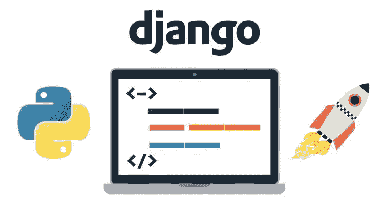
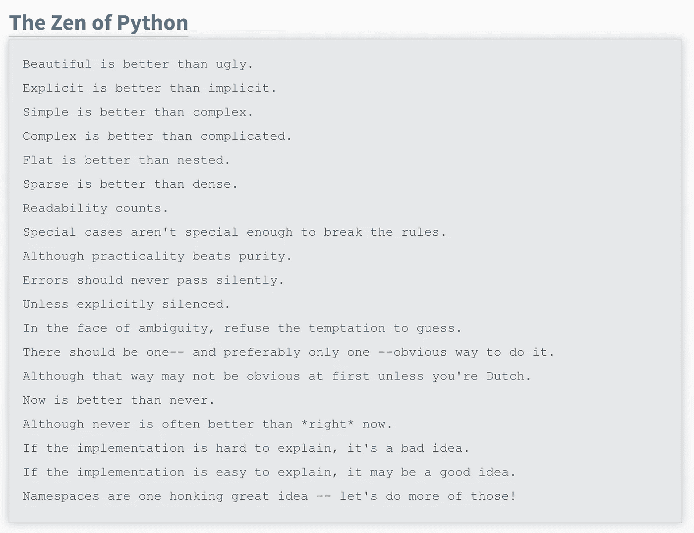

# 确保 Django 项目成功的 7 个技巧和更多内容

> 原文：<https://medium.com/analytics-vidhya/7-tips-and-more-to-ensure-a-successful-django-project-331a8d5746a3?source=collection_archive---------7----------------------->

# Django 开发人员应该知道的工具和技巧



多年来，作为一名 Python-Django 开发人员，我遇到了一些常见的问题，并整理了一些技巧或建议，以确保一切按预期进行。

鉴于 Python 作为编程语言的成功及其在人工智能和机器学习方面的应用，许多公司都选择将 Python 用于他们的网络平台。Python 最流行和最强大的 web 框架“Django”由于其广泛的库、安全性、可伸缩性和丰富的文档，已经使 Python 开发人员的生活变得更加容易和快捷。

所谓的“有期限的完美主义者网络框架”确实名副其实。

虽然涉及 Django 世界的许多集成和可能性可能会让人不知所措，但这里有一些技巧可以让您的 Django 开发尽可能简单。

> ***提示# 1:*** *遵循姜戈*哲学

Django 面向敏捷和快速的开发。它旨在让开发人员创建更少的代码，并在编程层之间实现更高的一致性。尽你所能:遵循 Django 哲学，这将确保你遵循良好的实践。



*如果你不熟悉 Django 的哲学，可以在这里查阅:*[*https://docs . Django project . com/en/2.1/misc/design-philosophy/*](https://docs.djangoproject.com/en/2.1/misc/design-philosophies/)

*禅宗之蟒:*[*https://www.python.org/dev/peps/pep-0020/*](https://www.python.org/dev/peps/pep-0020/)

> ***提示# 2:*** *使用现有应用*

不要重新发明轮子:使用第三方库。如果你正面临一个共同的问题，有可能其他人已经先解决了它。首先寻找 django 官方版本或第三方库。这将节省您的时间，并确保多个 Django 开发人员已经测试过这些库的安全性。

姜戈套餐:[https://djangopackages.org/](https://djangopackages.org/)

> ***提示# 3:*** *为每个项目创建一个虚拟环境。*

这使得部署和将环境复制到不同的机器和服务器变得更加容易。

安装 virtualenvwrapper (python3):

`pip3 install virtualenvwrapper`

创建新的虚拟环境:

`mkvirtualenv <project name>`

使用虚拟环境

`source activate`

要停止:

`deactivate`

由于每个 python 项目都有自己的依赖库，拥有一个虚拟环境将使部署更加安全和顺畅。您可以使用 pip 命令在可视化环境中安装这些库。

此外，您可以使用以下命令:

`pip3 freeze > requirements.txt`

后来`pip3 install -r requirements.txt`

遵循 django 哲学，您应该使用以下逻辑保留项目的框架:

*项目- >网页*

我们应该尝试为每个应用程序功能创建一个目录。

> ***提示# 4:*** *应用推荐*

很多小应用比巨型应用好。这是为了重复利用应用程序和代码

你应该能够用一句话解释一个应用程序的功能，如果这还不够，那么就分成不同的应用程序。

关于应用命名:保持简短，尽量使用单个单词。

> ***提示# 5:*** *按环境划分设置文件*

创建一个基本设置文件，并将每个环境保存在一个文件夹中。例如:

**base.py** (或 settings.py)

```
# along with the other settings.py variables ...def _add_installed_app(app_name):
 global INSTALLED_APPS installed_apps = list(INSTALLED_APPS)
 installed_apps.append(app_name)
 INSTALLED_APPS = tuple(installed_apps)ADD_INSTALLED_APP = _add_installed_app
```

**development.py**

```
from base import *ADD_INSTALLED_APP('debug_toolbar')
```

**production.py**

```
from base import *
```

> ***小贴士# 6:*** *把自己的观点尽量缩小*

Django 是一个模型-模板-视图框架。避免在 html 模板中添加任何逻辑。试着跟随:胖模特瘦观点。

尽量保持视图代码最少。视图应该只有很少的逻辑或验证代码。把你所有的逻辑，验证，过程放在模型里面。表示层应该只用于用户界面。这样会更容易维护，也更有条理。

保持模板的可维护性。

Django HTML 模板是有限的，如果有很强的理由说明为什么您需要向视图添加一些逻辑，请使用 JINJA2。将此视为例外，仅对那些视图使用 jinja2。

*更多关于金佳:*[*http://jinja.pocoo.org/docs/2.10/switching/*](http://jinja.pocoo.org/docs/2.10/switching/)

> ***提示# 7:*** *部署*

使用 python 专用服务器。虽然您可以使用 Apache 来部署 Django 项目，但是它并不那么好用，因为它不是专门为 python 构建的。

使用 Nginx 或其他 CDN。Nginx 使得配置更容易，对于 python 项目有更好的性能。

*你可以混合 web 服务器，使用 Nginx + gunicorn 和 Supervisor 来保持它的活力。*

> **一些有用的工具:**

***南:*** 南对于数据库迁移来说派上了用场。当您的模型改变时，它会跟踪新老模型，以便您在需要时可以轻松恢复。它是可定制的，所以你可以使用它前进或后退。用它来避免事故。

***Fabric:*** 自动部署和迁移的工具。在不同的服务器之间进行部署非常有用。因为它是 python 代码，所以可以毫不费力地与 python 集成。

***芹菜:*** 任务队列管理器用于异步任务。一般来说，涉及输入输出过程的任务执行起来较慢。例如，创建 PDF 发票、发送复杂的电子邮件、生成代码和其他繁重的任务会使网站变慢。如果你的页面需要一些时间来处理一些事情，那么用户可能会不耐烦的重复提交或者放弃你的网站。使用 celery，您可以执行那些不需要实时回复的任务，并将其添加到队列中。

***Redis:*** Redis 作为 nosql 数据库工作。它将数据存储在高速缓冲存储器中。它最大的一个优点是你可以用它进行会话。它将查询保存到数据库，使应用程序运行更快。您可以使用它来监视或任何需要计数器的进程。它可以用来创建统计数据，实时计算和投掷。

***宁谧。*** 对外服务。对日志创建和 cookies 很有用。它将数据发送到服务器，您可以在以后对其进行可视化。在寻找可能的 bug 时，这很方便。你可以做回溯，日志，集成到 Github 甚至自动生成票据(你也可以集成到其他流行的帮助台工具)。

***多余:***

一些调试工具:

*   *iPython:*[*https://ipython.org/*](https://ipython.org/)
*   *Ipdb:*[](https://pypi.org/project/ipdb/)
*   *【https://django-debug-toolbar.readthedocs.io/en/latest/】Django 调试工具栏:[](https://django-debug-toolbar.readthedocs.io/en/latest/)*

**更多额外的:**

**这里有一个页面，你可以出售你的源代码，赚取一些额外的钱:[www.piecex.com](https://piecex.page.link/mdm)，它是人工智能驱动的，非常漂亮。来看看:【www.piecex.com】T2**