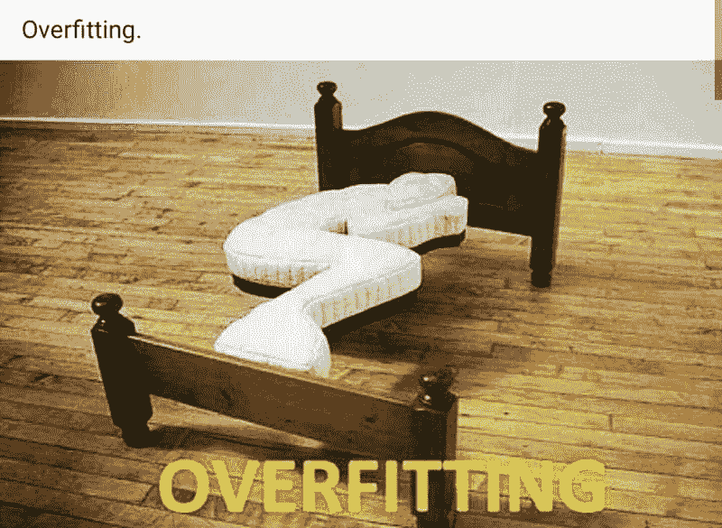
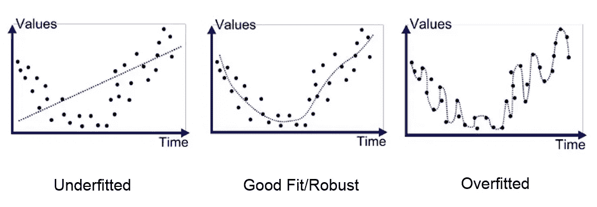
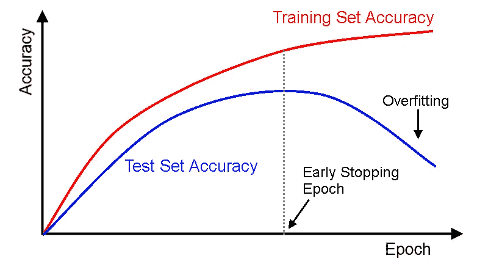
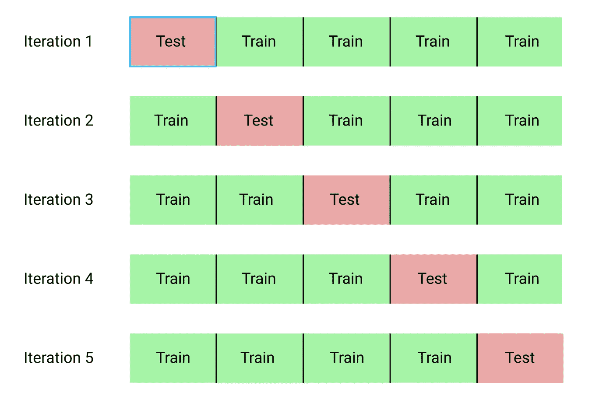
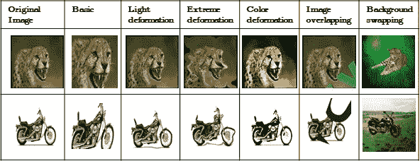
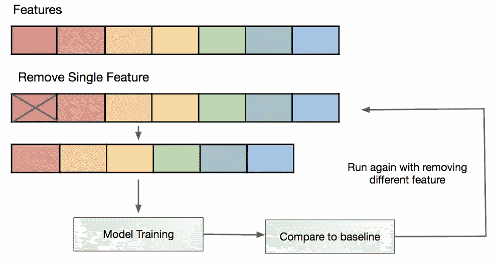
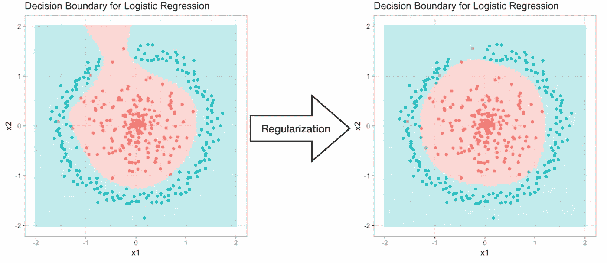
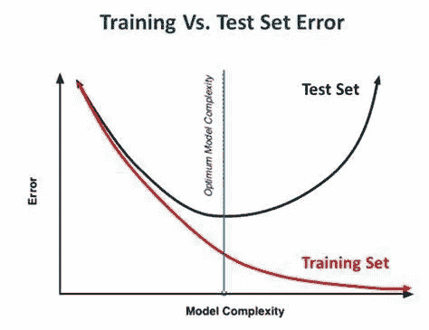

# 避免过度拟合的 7 种方法

> 原文：<https://medium.com/analytics-vidhya/7-ways-to-avoid-overfitting-9ff0e03554d3?source=collection_archive---------3----------------------->

过拟合是机器学习中的一个常见问题。当您的模型开始与训练数据过于接近时，就会出现这种情况。在这篇文章中，我解释了如何避免过度拟合。

过度拟合是数据科学家的困扰。在解释我们可以用来克服过度拟合的方法之前，让我们看看如何检测它。

# 如何知道一个模特是否过度拟合？

在数据科学中，完美的数据是不存在的。你总是有噪音和不准确。当一个模型开始学习这种噪音时，它会过度拟合。结果是一个有偏见的模型，你不能一概而论。

实际上，过度拟合的模型通常很容易被发现。当测试数据集上的误差开始增加时，就会发生过拟合。通常，如果定型数据上的错误比测试数据集上的错误小得多，则您的模型可能学到了太多东西。

# 我们如何避免过度拟合？

幸运的是，有几种技术可以避免过度拟合。在这一部分我们将介绍主要的方法。

## 交叉验证

避免过度拟合的最有效方法之一是交叉验证。

这个方法和我们平时做的不一样。我们使用将数据一分为二，交叉验证将训练数据分成几组。想法是在除了每一步的一个集合之外的所有集合上训练模型。如果我们有 k 个测试集，我们将在每一步用一个新的测试集训练模型 k 次。这种交叉验证技术被称为 k-fold。

我承认我卖给你一个交叉验证的梦想🙂

K-fold 主要用于评估一个模型的性能。这种技术允许选择正确的学习机模型。当谈到避免过拟合时，这种方法主要用于更有效地检测它。尤其是当基本指标不够时。

## 添加培训数据

显然，最好的解决方案是增加训练数据的大小。训练集上的样本越多，模型的效率就越高。反之，如果用少量数据训练模型，很可能会有偏差。

不幸的是，大多数时候我们所有可用的数据都已经被使用了。为了解决这个问题，我们可以使用*数据增强*技术。

这个想法很简单。我们对训练数据集做了一些小的改动，以增加样本的多样性。

例如，在计算机视觉中，我们有图像作为训练数据。我们可以创建过滤器来稍微修改颜色。我们可以旋转图像或拉伸线条。这降低了过度拟合的风险。

## 移除功能

提高机器学习模型性能的技术之一是正确选择特征。

想法是移除所有不添加任何信息的特征。例如，如果两个变量相关，最好去掉其中一个。如果某个要素的方差太低，它不会对我们的研究产生任何影响，但会扭曲结果。

通过这种方式，我们尽可能地简化了数据，提高了模型的性能，降低了过度拟合的风险。

一种方法是多次训练模型。每次我们移除一个特征并研究对模型训练的影响。该技术只能用于具有少量要素的数据。

在有太多特征的数据集上，我们需要实现降维方法。

## 正则化方法

正则化方法是降低机器学习模型整体复杂性的技术。它们减少了方差，从而降低了过度拟合的风险。

这里有一个逻辑回归的例子。我们看到，在正则化之前，模型是过度拟合的。正规化解决了问题。

正则化方法允许在不增加偏差的情况下显著降低模型的方差。我们将在最后一节回到偏差/方差的困境。

存在许多正则化技术:

1.  腰神经 2
2.  山脉
3.  L2
4.  套索

[这篇关于 Medium 的文章](https://towardsdatascience.com/regularization-in-machine-learning-76441ddcf99a)展示了我们如何选择正则化方法。

## 从设计简单的模型开始

你的模型越简单，你就越能避免过度拟合。大多数应用都可以用简单的模型来解决。想想吧！

## 提前停止

提前停止是一个非常直观的技巧。简单来说，就是在训练过度之前停止它。

这就需要找到最佳的训练时间。以避免欠拟合和过拟合。

过早停止通常与统计学中著名的偏差/方差困境有关。在机器学习中，我们讨论了欠适应/过适应困境。

这种技术主要用于深度学习，用于训练神经网络。对于其他机器学习模型，如随机森林或 SVM，正则化技术往往更适合。

总之，避免过度拟合是一个优秀的数据科学家必须掌握的艺术。这些不同的技术在大多数情况下都非常有效。然而，对你所使用的模型的理论方面有一个很好的理解仍然是最安全的方法。即使这需要深入研究机器学习的理论…