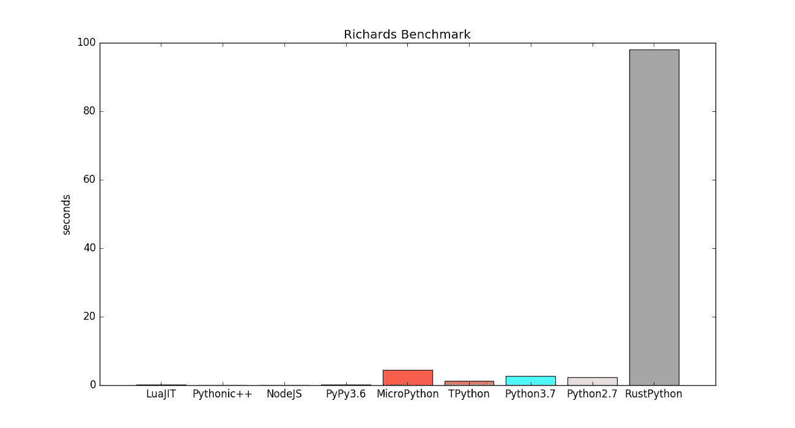
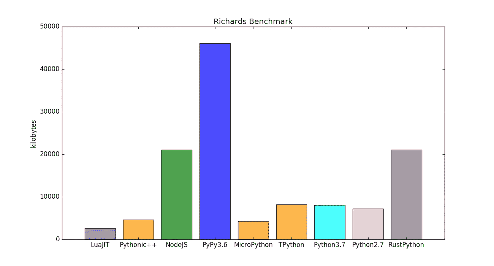
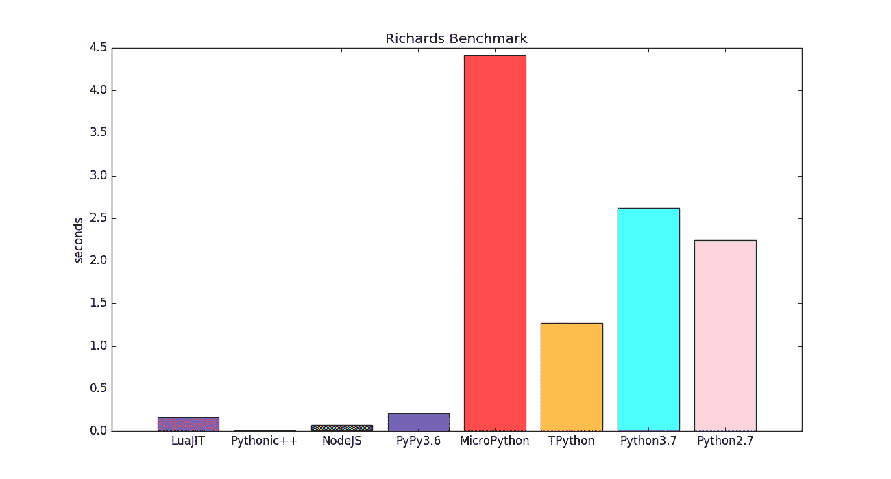

# 比 RustPython 快 77 倍

> 原文：<https://medium.com/analytics-vidhya/77x-faster-than-rustpython-f8331c46aea1?source=collection_archive---------7----------------------->

在搜索 Richards 基准测试的纯 Rust 版本时，我只能找到，“早在 2010 年 4 月，Russ Cox 就慷慨地提出，只有*fann kuch-redux、fasta、k-nucleotide、mandlebrot、nbody、reverse-complement 和 spectral-norm 接近于*fair*comparisons[【1】](https://benchmarksgame-team.pages.debian.net/benchmarksgame/fastest/rust.html)。请注意，Richards 基准测试没有出现在这个列表中，Rust 开发人员害怕什么？*

RustPython，或者 Rust，或者两者都有根本的问题吗？Google 最初使用 Richards 基准优化了 V8 JIT，因为这是一个很好的测试多态性和类如何被经常使用的测试。在 Python 版本中，基类`Task`包含由`runTask`方法调用的抽象方法`fn`，子类必须重载`fn`方法。由于这种抽象，解释器将不得不更加努力地分派方法调用，并且在试图生成有效的字节码时不能提前假定太多。让我们来看看内存使用情况。

内存使用是我们所期望的，NodeJS 和 PyPy，重型 JIT，消耗更多的内存。RustPython 的缓慢并不是因为内存不足的瓶颈，它应该能够高效地使用 CPU 缓存。快速看一下 RustPython 的源代码，我可以看到部分问题是[太多的抽象层](https://github.com/RustPython/RustPython/blob/master/vm/src/pyobject.rs)，大部分代码涉及[繁重的面向对象设计](https://github.com/RustPython/RustPython/blob/master/vm/src/vm.rs)，而不是优化。它们在大多数函数之间传递的主要对象类型是“PyObjectRef ”,它只是一个引用计数容器。这与 TPython 中的主要类型非常不同，TPython 中的主要类型是`tp_obj`一个经典的[联合](https://en.wikipedia.org/wiki/Union_type)，它是 16 个字节，总是使用堆栈内存传递，并保存 6 位类型数据和 2 位魔术数据。有了这种高效的[联合](https://stackoverflow.com/questions/14481469/where-to-use-union-class-and-struct/14482478)，TPython 通常可以避免堆分配，可以使用堆栈内存来代替；这也允许垃圾收集器避免小的字符串、数字和其他适合 16 个字节的类型。

# 比 Python 快 2 倍

有几个原因可以解释为什么 [TPython](https://gitlab.com/hartsantler/tpythonpp) 比 Python3 快 2 倍。一个主要因素是 TPython 是 Python 语言的一个子集，不是动态的。Phil Hassey 最初的 TinyPy 解释器非常动态，但是我更喜欢严格的规则和更简单的语言，所以我去掉了大部分动态特性。这允许生成更优化的字节码，因为字节码编译器可以在编译时做出更多假设。更专门化的字节码直接加速了 VM，它基本上只是一个巨大的`switch/case` 块集合，将尽可能多的逻辑内联到主解释器循环中。Clang with [PGO](https://en.wikipedia.org/wiki/Profile-guided_optimization) 特别擅长于优化 switch/case 语句，当它看到你的脚本如何执行时，实际上——部分提前编译你的脚本。