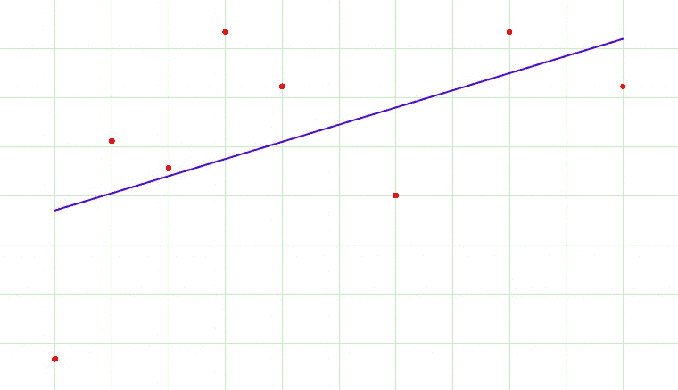

# 与深度学习相关的 8 个基本术语

> 原文：<https://medium.com/analytics-vidhya/8-basic-terms-related-to-deep-learning-ea6f03662c38?source=collection_archive---------10----------------------->

> ***卷积:***

卷积是对两个函数( *f* 和 *g* )的数学运算，产生第三个函数(f*g ),表示一个函数的形状如何被另一个函数修改。术语*卷积*既指结果函数，也指计算它的过程。它被定义为两个函数的乘积在一个被反转和移位后的积分。并且对所有移位值进行积分计算，产生卷积函数。

[科学高清照片](https://unsplash.com/@scienceinhd?utm_source=medium&utm_medium=referral)上 [Unsplash](https://unsplash.com?utm_source=medium&utm_medium=referral)

> ***超参数:***

超参数是一个参数，其值用于控制学习过程。它可以被分类为模型超参数，这些超参数在使机器适应训练集时不能被推断，因为它们涉及模型选择任务，或者算法超参数，这些超参数原则上对模型的性能没有影响，但是影响学习过程的速度和质量。

在 [Unsplash](https://unsplash.com?utm_source=medium&utm_medium=referral) 上[似曾相识](https://unsplash.com/@acevu?utm_source=medium&utm_medium=referral)的照片

> ***跨步:***

跨距是在输入矩阵上移动的像素数。当步幅为 1 时，我们一次移动一个像素的过滤器。当步幅为 2 时，我们每次将过滤器移动 2 个像素，依此类推。

> ***填充:***

它指的是 CNN 的过滤器/内核处理图像时添加到图像中的像素数量。

照片由[雅各布·欧文斯](https://unsplash.com/@jakobowens1?utm_source=medium&utm_medium=referral)在 [Unsplash](https://unsplash.com?utm_source=medium&utm_medium=referral) 拍摄

> ***深度神经网络:***

深度神经网络(DNN)是一种具有一定复杂程度的人工神经网络(ANN)，是一种在输入和输出层之间具有多层的神经网络。深度神经网络使用复杂的数学模型以复杂的方式处理数据。

在 [Unsplash](https://unsplash.com?utm_source=medium&utm_medium=referral) 上 [NeONBRAND](https://unsplash.com/@neonbrand?utm_source=medium&utm_medium=referral) 拍摄的照片

> ***多层感知器:***

它是一类前馈人工神经网络(ANN)。它由非线性激活节点的三层或更多层(输入层和输出层，具有一个或多个*隐藏层*)组成。多层感知器通常应用于监督学习问题，它们在一组输入-输出对上进行训练，并学习对这些输入和输出之间的相关性(或依赖性)进行建模。

过度拟合

> ***过拟合:***

它是与特定数据集过于接近或精确对应的分析结果，因此可能无法拟合额外的数据或可靠地预测未来的观察结果。当模型学习了训练数据中的细节和噪声，以至于对模型在新数据上的性能产生负面影响时，就会发生这种情况。

照片由[内森·安德森](https://unsplash.com/@nathananderson?utm_source=medium&utm_medium=referral)在 [Unsplash](https://unsplash.com?utm_source=medium&utm_medium=referral) 上拍摄

> ***滤镜:***

由权重向量表示的过滤器(也称为内核和卷积神经元)是通过滑动窗口应用于数据的小单元。

如有疑问，欢迎在评论中写下💬下面的部分。可以在[*LinkedIn*](https://www.linkedin.com/in/ayantika-sarkar/)*上联系我！！*

*感谢您的阅读！祝你有美好的一天😃*