# 每个数据科学家都应该知道的关于线性代数的 8 个基本知识

> 原文：<https://medium.com/analytics-vidhya/8-basic-things-about-linear-algebra-that-every-data-scientist-should-know-c5a266587cac?source=collection_archive---------12----------------------->

## Python 的标量、矢量、矩阵、张量和收缩——数据科学指南

布鲁斯·马斯在 [Unsplash](https://unsplash.com/s/photos/thinking?utm_source=unsplash&utm_medium=referral&utm_content=creditCopyText) 上的照片

学习数据科学需要多少数学一直是数据科学学习者的疑问。我可以说你可能想学多少就学多少，但是覆盖线性代数基础知识是必不可少的。漂浮在数学表面的人不会体验到它真正的美。数学的美永远像海洋一样深藏在心底。但是如果你想深入水下，在此之前你应该知道如何浮在水面上。本文将引导你浮于线性代数的表面。

我将每个机器学习学习者都应该知道的一些线性代数基础知识总结为快速八点。我只是希望这篇文章逐行提供信息。让我们游泳吧…

> 线性代数是数据的数学

1.  **标量:→** 标量是一个只有量值的量。它是一个单一的实数，可以是负数也可以是正数。它只讲幅度(大小)，不讲方向。这是一个维度较少的结构。它是秩为 0 的张量，形状为 1*1。

例 1:数字 5 是一个标量。你的年龄是一个标量。

例子 2:把标量想象成一个你买来帮助你的迷你机器人。假设你从美国旅行到印度，你在 Scalar 询问你的旅行细节。

你:嘿标量，给我一些关于我今天旅行的细节？

标量:你已经行驶了 13，568 公里。

如我所说，他只给你关于震级的细节。

在 Python 中，

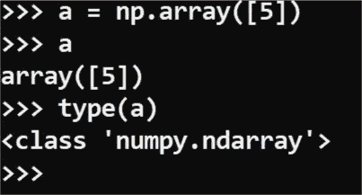

Python 中的标量表示

**底线**:把一个标量想象成几何中的一个点。

2.**矢量** : →矢量是一个既有大小又有方向的量。这两者都有。简而言之，列表是向量。**行向量**和**列向量**是向量的类型。它是秩为 1 的张量，维数为 **1*m** (行向量)或 **m*1** (列向量)。

向量是矩阵的子集，这意味着我们可以用向量组成矩阵。最常见的是用小写字母表示。

例子:现在把一个向量想象成一个迷你机器人。现在让我们问他同样的旅行细节。

嘿向量，给我一些关于我今天旅行的细节？

矢量:嘿，老板，你从东到西已经走了 13，568 公里(用机器人的声音)。

好吗？

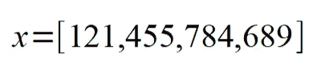

单行矩阵

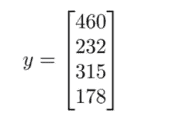

列向量

在 Python 中，

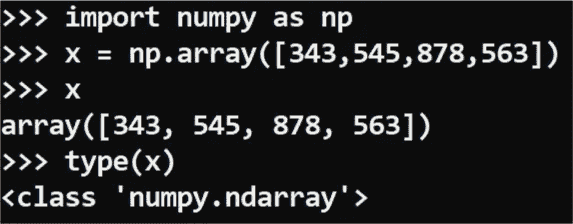

python 中的矢量表示

**底线**:把向量想象成几何中的一条线。

3.**矩阵:→** 它是以行和列的形式排列的数字的矩形阵列。它是一个二维结构。它是秩为 2 的张量，维数为 m*n，我们可以用向量做一个矩阵(每一行每一列都是向量)。

这里的主要规则是先行后列。通常矩阵用大写字母表示。我们可以用代表行号后跟列号的数字来表示矩阵中的特定元素。两个数字都应该在字母的下标中，像这样 **Aij** 。

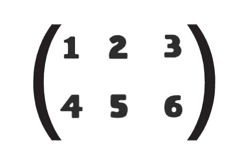

[数]矩阵

上述矩阵的维数为 2*3(两行三列)。

要引用矩阵中的元素，

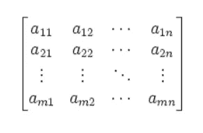

简单吧？

在 Python 中，

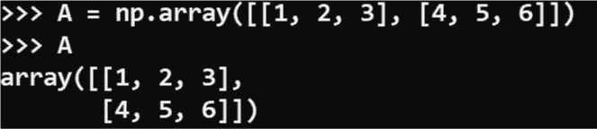

python 中的矩阵表示

不像矩阵，在 python 中索引是从零开始的。

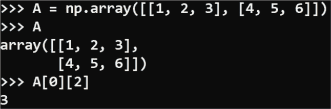

矩阵索引

零表示这里的第一行，二表示第一行的第三项。要了解更多关于 python 索引的信息，[点击这里](https://www.w3schools.com/python/numpy_array_indexing.asp)。

如果你深入观察，你会发现所有这些的张量秩是它们自身的维度。

4.**张量** : →张量是一个 n 维数组。一般来说，张量是排列在一个规则网格上的一组数字，网格的轴数是可变的。它像矩阵一样用大写字母表示。

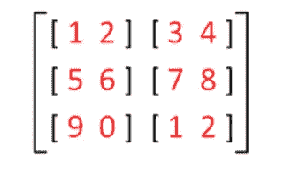

张量

在 Python 中，

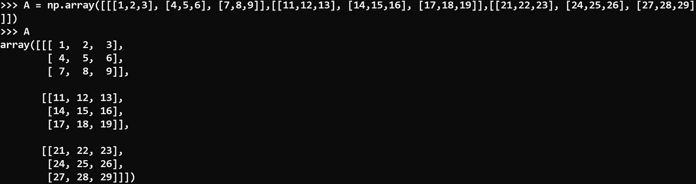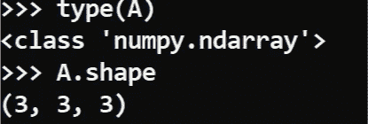

python 中的张量表示

5.**转置** : →转置是通过将行翻转成列来从常规矩阵形成新矩阵的方法，反之亦然。它由矩阵上标的字母 T 表示。

例如，如果 A 是矩阵，A 的转置表示为，

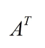

让我们转置一个示例矩阵 A，

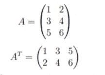

矩阵 A 的转置

在 Python 中，

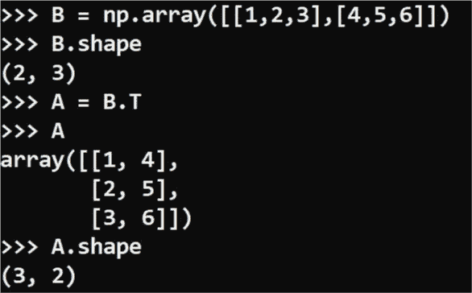

矩阵转置

6.**加法和减法** : →我们可以对标量、向量、矩阵和张量执行基本的算术运算，如加法和减法。但是你应该遵守一些严格的规则。

规则:

1.  这两个向量应该在相同的维度上。
2.  两个矩阵的维数应该相同。
3.  两个张量应该在同一个维度上。

加法公式:

标量-标量

c = (a+b)

向量向量

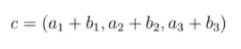

3*1 矢量

矩阵-矩阵

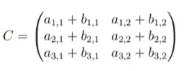

3*2 矩阵

张量-张量

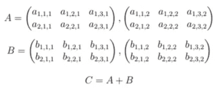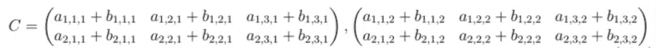

2*3*2 张量

减法公式:

标量-标量:

c = (a-b)

向量-向量:

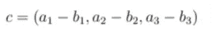

3*1 矢量

矩阵-矩阵:

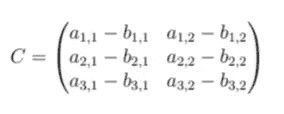

3*2 矩阵

张量-张量:

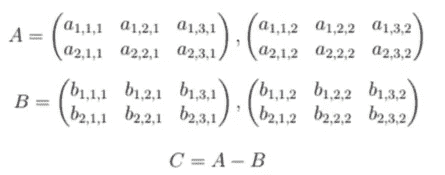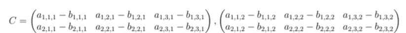

2*3*2 张量

7.**乘法和点积** : →就像我们做加法和减法一样，我们也可以做乘法运算和点积，但是这个概念并没有那么简单。让我们深入挖掘。

1.  标量只是一个实数，所以我们显然可以用标量、向量、矩阵和张量来乘实数。
2.  两个相同长度的向量可以相乘。与加法和减法一样，乘法运算也是按元素执行的。
3.  同样的维数法则也适用于矩阵和张量。

**术语提醒**:逐元素乘法也称为**哈达玛运算。**

4.标量可以通过将两个向量的乘积相加来产生。这种运算称为点积(我们用点来代替乘法运算符)。

示例:

如果 c = a.b，那么

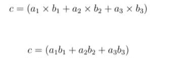

向量-向量点积

这里的结果 C 是标量。

5.一般来说，矩阵乘法也称为矩阵点积。这里一个向量可以与矩阵相乘，只要它们之间存在点积，结果就是向量的形式。

点积是用我们做工具，打破同维倍增壁垒。

示例:

如果 c = A.v，则

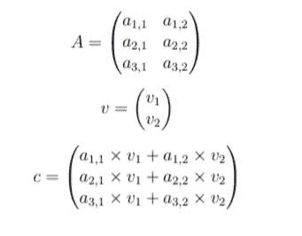

向量矩阵点积

在 Python 中，只是我们使用函数 ***dot()*** 来使其发生 ***。***

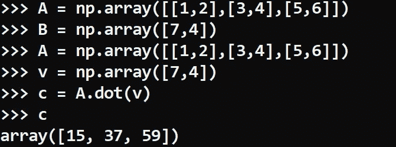

Python 中的点积

8.**逆** : →逆是线性代数的简单概念。反向工作与往复工作相同。

数字 3 的倒数是多少？

1/3，对吧？

1/3 也可以写成 3 的-1 次方。这和逆运算的工作原理是一样的。

我们总是用字母(矩阵)上标上的-1 来表示逆矩阵。假设 A 是矩阵，矩阵的逆矩阵是，

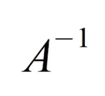

矩阵 A 的逆矩阵

当我们把一个矩阵和它的逆矩阵相乘时，我们总是得到一个。如果是在矩阵的情况下，我们得到一个单位矩阵。

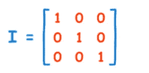

3*3 相同矩阵

在 Python 中，使用 numpy.linalg 库中的 ***inv()*** 函数做逆运算。

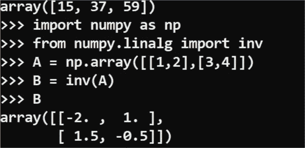

Python 中的逆运算

**参考文献**:

1.  吴恩达在 Coursera 的线性代数评论。
2.  杰森·布朗利的《机器学习线性代数基础》。
3.  网站—[mathsisfun.com](http://www.mathsisfun.com)