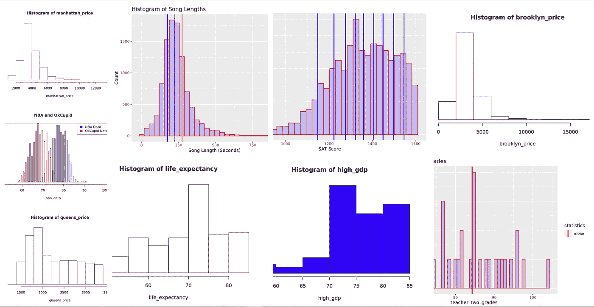

# 用 R 解释的 8 个描述性统计概念

> 原文：<https://medium.com/analytics-vidhya/8-descriptive-statistics-concepts-explained-using-r-8e0d28115fcd?source=collection_archive---------1----------------------->

用 R 解释的 8 个描述性统计概念

## 集中趋势、分散和位置的度量

## 序幕

我决定把原来关于统计学的文章分成两部分。

在本文的第一篇中，您会发现常见的描述性统计概念:

*   集中趋势的测量:平均…