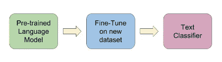
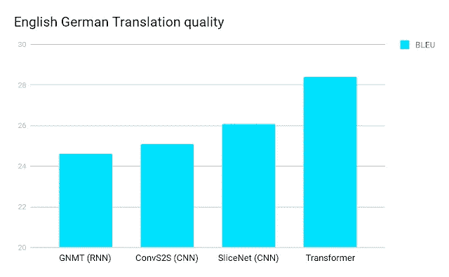
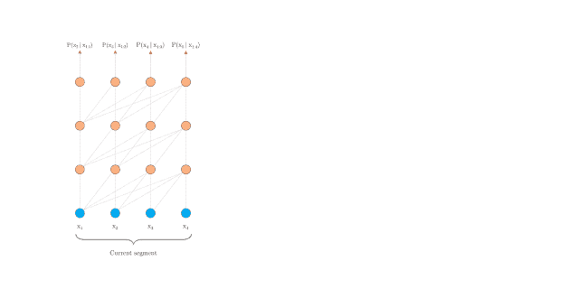
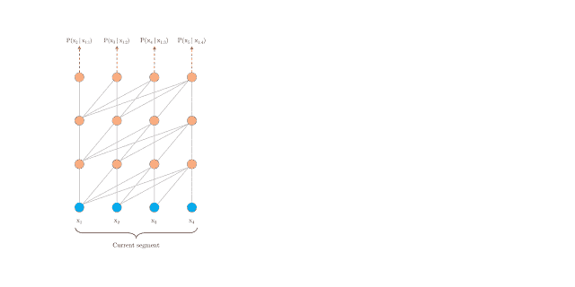
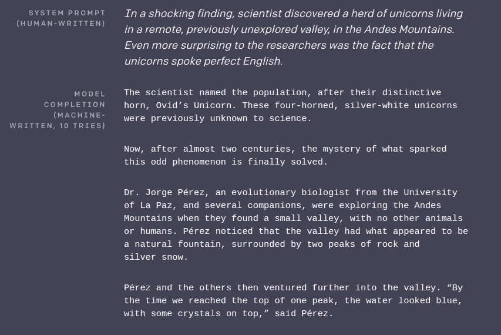
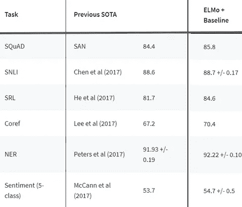
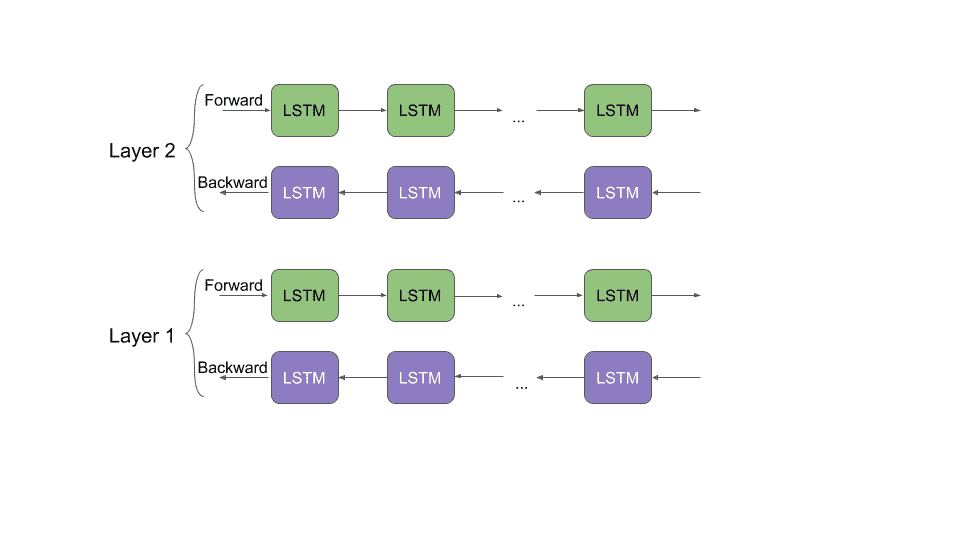
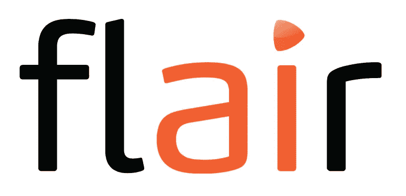
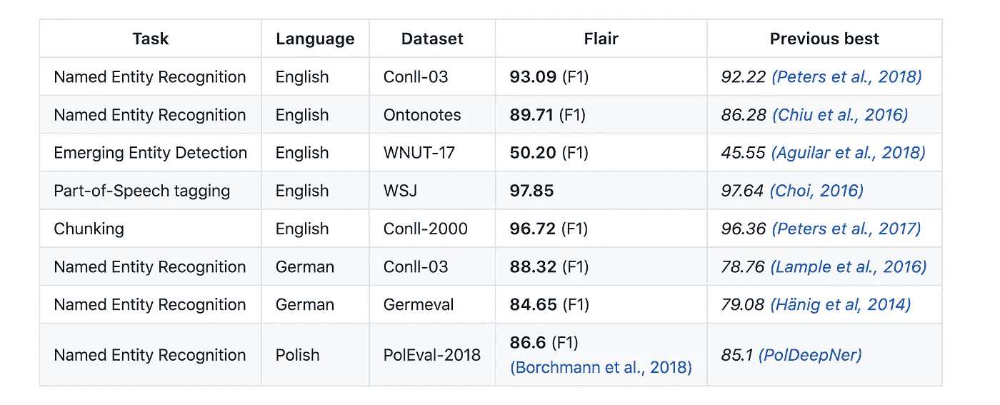
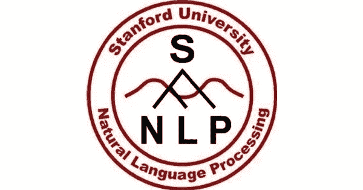

# 8 个优秀的预训练模型，帮助您开始自然语言处理(NLP)

> 原文：<https://medium.com/analytics-vidhya/8-pretrained-models-to-learn-natural-language-processing-nlp-5f14d82e9621?source=collection_archive---------2----------------------->

如今，自然语言处理(NLP)应用程序已经变得无处不在。我似乎经常偶然发现以这样或那样的形式利用 NLP 的网站和应用程序。简而言之，这是参与 NLP 领域的绝佳时机。

NLP 采用率的快速增长很大程度上要归功于通过预训练模型实现的[迁移学习概念。在 NLP 的环境中，迁移学习本质上是在一个数据集上训练模型，然后调整该模型以在不同的数据集上执行不同的 NLP 功能的能力。](https://www.analyticsvidhya.com/blog/2017/06/transfer-learning-the-art-of-fine-tuning-a-pre-trained-model/?utm_source=blog&utm_medium=top-pretrained-models-nlp-article)

这一突破使事情变得非常容易和简单，尤其是对于那些没有时间和资源从头开始构建 NLP 模型的人。对于想要学习或过渡到 NLP 的初学者来说，它也是完美的。

# 为什么使用预训练模型？

*   作者已经努力为您设计了一个基准模型！我们可以在自己的 NLP 数据集上使用预先训练的模型，而不是从头开始构建模型来解决类似的 NLP 问题
*   需要进行一些微调，但这可以节省我们大量的时间和计算资源

在本文中，我展示了一些顶级的预训练模型，您可以使用它们开始您的 NLP 之旅，并复制该领域的最新研究成果。你可以点击这里查看我关于计算机视觉[顶级预训练模型的文章。](https://www.analyticsvidhya.com/blog/2018/07/top-10-pretrained-models-get-started-deep-learning-part-1-computer-vision/?utm_source=blog&utm_medium=top-pretrained-models-nlp-article)

*如果你是 NLP 初学者，我推荐参加我们的热门课程——‘使用 Python 的**[*NLP’。*](https://courses.analyticsvidhya.com/courses/natural-language-processing-nlp?utm_source=blog&utm_medium=top-pretrained-models-nlp-article)*

# *本文涉及的预训练 NLP 模型*

*我根据应用将预训练模型分为三个不同的类别:*

*   ***多用途 NLP 模型***
*   *乌尔菲特*
*   *变压器*
*   *谷歌的伯特*
*   *变压器-XL*
*   *OpenAI 的 GPT-2*
*   ***单词嵌入***
*   *工程与后勤管理局*
*   *天资*
*   ***其他预训练模型***
*   *斯坦福大学*

# *多用途 NLP 模型*

*多用途模型是 NLP 世界的话题。这些模型推动了我们兴奋不已的自然语言处理应用——机器翻译、问答系统、聊天机器人、情感分析等。这些多用途 NLP 模型的一个核心组成部分是语言建模的概念。*

*简单地说，语言模型的目的是预测序列中的下一个单词或字符。当我们看到这里的每个模型时，我们就会明白这一点。*

*如果你是一个 NLP 爱好者，你会喜欢这个部分。现在，让我们深入研究 5 个最先进的多用途 NLP 模型框架。我提供了研究论文的链接和每个模型的预训练模型。去探索它们吧！*

# *[乌尔姆菲特](https://github.com/fastai/fastai/tree/master/courses/dl2/imdb_scripts)*

*ULMFiT 是由 fast.ai 的[杰瑞米·霍华德](https://medium.com/u/34ab754f8c5e?source=post_page-----5f14d82e9621--------------------------------) DeepMind 的[塞巴斯蒂安鲁德](https://medium.com/u/e3999e445181?source=post_page-----5f14d82e9621--------------------------------)提出并设计的。你可以说 ULMFiT 是去年启动迁移学习聚会的版本。*

*正如我们在本文的[中所介绍的，ULMFiT 使用新颖的 NLP 技术实现了最先进的结果。这种方法包括将在](https://www.analyticsvidhya.com/blog/2018/11/tutorial-text-classification-ulmfit-fastai-library/) [Wikitext 103 数据集](https://einstein.ai/research/the-wikitext-long-term-dependency-language-modeling-dataset)上训练的预训练语言模型微调到新的数据集，以使其不会忘记之前学习的内容。*

**

*ULMFiT 在文本分类任务上优于许多先进的技术。我喜欢 ULMFiT 的一点是，它只需要很少的例子就能产生这些令人印象深刻的结果。让像你我这样的人更容易理解并在我们的机器上实现它！*

*如果你想知道，ULMFiT 代表通用语言模型微调。“通用”这个词用在这里很恰当——这个框架可以应用于几乎所有的 NLP 任务。*

# *了解和阅读有关 ULMFiT 更多信息的资源:*

*   *[使用 Python 中的 ULMFiT 和 fastai 库进行文本分类(NLP)的教程](https://www.analyticsvidhya.com/blog/2018/11/tutorial-text-classification-ulmfit-fastai-library/?utm_source=blog&utm_medium=top-pretrained-models-nlp-article)*
*   *[ul mfit 的预训练模型](https://www.paperswithcode.com/paper/universal-language-model-fine-tuning-for-text)*
*   *[研究论文](https://arxiv.org/abs/1801.06146)*

# *[变压器](https://github.com/tensorflow/models/tree/master/official/transformer)*

*变压器架构是 NLP 中几乎所有最新主要发展的核心。它是由谷歌在 2017 年推出的。当时，递归神经网络(RNN)被用于语言任务，如机器翻译和问答系统。*

*这种变压器架构优于 RNNs 和 CNN(卷积神经网络)。训练模型所需的计算资源也减少了。对 NLP 的每个人都是双赢。看看下面的对比:*

**

*根据谷歌的说法，Transformer“应用了一种自我关注机制，直接模拟句子中所有单词之间的关系，而不管它们各自的位置”。它使用固定大小的上下文(也就是前面的单词)来实现。复杂到拿不到？我们举个例子来简化一下这个。*

*"她在河岸上发现了贝壳。"模型需要明白，这里的“银行”指的是岸，而不是金融机构。Transformer 一步就明白了这一点。我鼓励你阅读我下面链接的全文，以了解这是如何工作的。它会让你大吃一惊。*

*下面的动画精彩地展示了 Transformer 如何处理机器翻译任务:*

**

*谷歌去年发布了名为[通用变形金刚](https://arxiv.org/pdf/1807.03819v3.pdf)的变形金刚改良版。还有一个更新更直观的版本，叫做 Transformer-XL，我们将在下面介绍。*

# *学习和阅读更多关于 Transformer 的资源:*

*   *[谷歌官方博文](https://ai.googleblog.com/2017/08/transformer-novel-neural-network.html)*
*   *[变压器的预训练模型](https://www.paperswithcode.com/paper/attention-is-all-you-need)*
*   *[研究论文](https://arxiv.org/abs/1706.03762)*

# *[谷歌的伯特](https://github.com/google-research/bert)*

*自从 Google 发布了他们的结果，然后开源了背后的代码，BERT 框架就一直在掀起波澜。我们可以争论这是否标志着“NLP 的新时代”，但是毫无疑问，BERT 是一个非常有用的框架，可以很好地概括各种 NLP 任务。*

**

*伯特(BERT)是一个词的两个方面(左和右)的缩写，它考虑的是一个词的上下文。以前所有的努力都是一次考虑一个单词的一边——要么是左边，要么是右边。这种双向性有助于模型更好地理解使用单词的上下文。此外，BERT 被设计为进行多任务学习，也就是说，它可以同时执行不同的 NLP 任务。*

*BERT 是第一个用于预训练 NLP 模型的无监督、深度双向系统。它仅使用纯文本语料库进行训练。*

*在它发布的时候，BERT 在 11 个自然语言处理(NLP)任务上产生了最先进的结果。相当大的壮举！只需几个小时(在单个 GPU 上)，就可以使用 BERT 训练出自己的 NLP 模型(比如问答系统)。*

# *学习和阅读更多关于 BERT 的资源:*

*   *[谷歌官方博文](https://ai.googleblog.com/2018/11/open-sourcing-bert-state-of-art-pre.html)*
*   *【BERT 的预训练模型*
*   *[研究论文](https://arxiv.org/pdf/1810.04805.pdf)*

# *[谷歌的 Transformer-XL](https://github.com/kimiyoung/transformer-xl)*

*从长期来看，谷歌的这次发布可能是 NLP 非常重要的一次发布。如果你是初学者，这个概念可能会变得有点棘手，所以我鼓励你多读几遍来掌握它。我还在本节下面提供了多种资源来帮助您开始使用 Transformer-XL。*

*想象一下，你正在看一本书，突然一个单词或句子出现在书的开头。现在，你或我都可以回忆起那是什么。但可以理解的是，一台机器很难对长期依赖进行建模。*

*如上所述，一种方法是使用变压器。但是它们是用固定长度的上下文实现的。换句话说，如果使用这种方法，就没有太多的灵活性。*

*Transformer-XL 很好地弥合了这一差距。由谷歌人工智能团队开发，它是一种新颖的 [NLP](https://courses.analyticsvidhya.com/courses/natural-language-processing-nlp?utm_source=blog&utm_medium=top-pretrained-models-nlp-article) 架构，帮助机器理解超出固定长度限制的上下文。 **Transformer-XL 比典型变压器快 1800 倍。***

*通过谷歌发布的以下两张 gif 图，你会明白这种区别:*

**

**普通变压器**

**

**Transformer-XL**

*Transformer-XL，正如您现在可能已经预测到的，在各种语言建模基准/数据集上实现了新的最先进的结果。这里有一个取自他们页面的小表格来说明这一点:*

*方法 enwiki8 text8 十亿字 WT-103 PTB (w/o finetuning)此前最好 1.06 1.13 23.7 20.5 55.5 Transformer-XL**0.99****1.08****21.8****18.3****54.5***

*Transformer-XL GitHub 存储库，上面有链接，下面会提到，包含 PyTorch 和 TensorFlow 中的代码。*

# *学习和阅读更多关于 Transformer-XL 的资源:*

*   *[谷歌官方博文](https://ai.googleblog.com/2019/01/transformer-xl-unleashing-potential-of.html)*
*   *[变压器-XL 的预调模型](https://www.paperswithcode.com/paper/transformer-xl-attentive-language-models)*
*   *[研究论文](https://arxiv.org/abs/1901.02860)*

# *[OpenAI 的 GPT-2](https://github.com/openai/gpt-2)*

*现在，这是一个非常有争议的条目。一些人可能会认为 GPT-2 的发布是 OpenAI 的一个营销噱头。我当然明白他们从哪里来。然而，我认为至少尝试一下 OpenAI 已经发布的代码是很重要的。*

**

*首先，给那些不知道我在说什么的人一些背景。OpenAI 在 2 月份写了一篇博文(链接如下)，他们声称已经设计了一个名为 GPT-2 的 NLP 模型，这个模型非常好，以至于他们因为担心恶意使用而无法发布完整版本。这当然引起了社区的关注。*

*GPT-2 被训练来预测 40GB 互联网文本数据中的下一个出现的单词。这个框架也是一个基于 transformer 的模型，在 800 万个网页的数据集上进行训练。他们在网站上公布的结果令人震惊。该模型能够根据我们输入的几句话编织一个完全清晰的故事。看看这个例子:*

**

*不可思议吧。*

*开发人员发布了一个小得多的 GPT-2 版本，供研究人员和工程师测试。原始模型有 15 亿个参数——开源样本模型有 1.17 亿个。*

# *了解和阅读更多关于 GPT-2 的资源:*

*   *[OpenAI 官方博文](https://openai.com/blog/better-language-models/)*
*   *[GPT-2 的预训练模型](https://github.com/openai/gpt-2)*
*   *[研究论文](https://d4mucfpksywv.cloudfront.net/better-language-models/language-models.pdf)*

# *单词嵌入*

*我们使用的大多数机器学习和深度学习算法都无法直接处理字符串和纯文本。这些技术要求我们将文本数据转换成数字，然后才能执行任何任务(例如回归或分类)。*

*因此，简单地说，单词嵌入是被转换成数字以执行 NLP 任务的文本块。单词基本格式通常尝试使用字典将单词映射到向量。*

*在下一篇文章中，你可以更深入地了解单词嵌入，它的不同类型，以及如何在数据集上使用它们。如果你不熟悉这个概念，我认为这个指南是必读的:*

*在这一节中，我们将看看 NLP 的两种最先进的单词嵌入。我还提供了教程链接，这样你可以对每个主题有一个实际的理解。*

# *埃尔莫*

*不，这个埃尔莫不是《芝麻街》中那个(公认的令人敬畏的)角色。但是这个 ELMo，语言模型嵌入的缩写，在构建 NLP 模型的上下文中非常有用。*

*ELMo 是一种在向量和嵌入中表示单词的新方法。这些 ELMo 单词嵌入帮助我们在多个 NLP 任务上实现了最先进的结果，如下所示:*

**

*让我们花一点时间来理解 ELMo 是如何工作的。回想一下我们之前讨论的双向语言模型。根据这篇文章的提示，“ELMo 单词向量是在两层双向语言模型(biLM)之上计算的。这个 biLM 模型有两层堆叠在一起。每层有两个通道—向前通道和向后通道:*

**

*ELMo 单词表示考虑完整的输入句子来计算单词嵌入。因此，术语“读”在不同的上下文中具有不同的 ELMo 向量。这与旧的单词嵌入大相径庭，在旧的单词嵌入中，无论单词“read”在什么上下文中使用，都会被赋予相同的向量。*

# *学习和阅读更多关于 ELMo 的资源:*

*   *[学习 ELMo 从文本中提取特征的分步 NLP 指南](https://www.analyticsvidhya.com/blog/2019/03/learn-to-use-elmo-to-extract-features-from-text/?utm_source=blog&utm_medium=top-pretrained-models-nlp-article)*
*   *[预训练模型的 GitHub 库](https://github.com/allenai/allennlp/blob/master/tutorials/how_to/elmo.md)*
*   *[研究论文](https://arxiv.org/pdf/1802.05365.pdf)*

# *[天赋](https://github.com/zalandoresearch/flair)*

*Flair 不完全是单词嵌入，而是单词嵌入的组合。我们可以称 Flair 更像是一个结合了 GloVe、BERT、ELMo 等嵌入的 [NLP](https://courses.analyticsvidhya.com/courses/natural-language-processing-nlp?utm_source=blog&utm_medium=top-pretrained-models-nlp-article) 库。Zalando Research 的优秀人员开发并开源了 Flair。*

**

*该团队已经为以下 NLP 任务发布了几个预训练模型:*

*   ***名称-实体识别(NER)***
*   ***词性标注***
*   ***文本分类***
*   ***培训定制车型***

*还不信服？嗯，这张对照表可以帮你找到答案:*

**

*“Flair 嵌入”是 Flair 库中打包的签名嵌入。它由上下文字符串嵌入提供支持。你应该通读一下这篇文章,了解增强能力的核心要素。*

*我特别喜欢 Flair 的一点是它支持多种语言。所以许多 NLP 版本都停留在英文任务上。如果 NLP 要在全球范围内获得关注，我们需要扩大范围！*

# *了解和阅读更多关于 Flair 的资源:*

*   *[NLP 天赋介绍:一个简单而强大的最先进的 NLP 库](https://www.analyticsvidhya.com/blog/2019/02/flair-nlp-library-python/?utm_source=blog&utm_medium=top-pretrained-models-nlp-article)*
*   *[用于天赋的预训练模型](https://github.com/zalandoresearch/flair)*

# *其他预训练模型*

# *[斯坦福大学](https://github.com/stanfordnlp/stanfordnlp)*

*说到将 NLP 扩展到英语之外，这里有一个已经在设定基准的库。作者声称 StanfordNLP 支持超过 53 种语言——这当然引起了我们的注意！*

**

*我们的团队是首批与该库合作并在真实世界数据集上发布结果的团队之一。我们尝试了一下，发现 StanfordNLP 确实为在非英语语言上应用 NLP 技术开辟了许多可能性。比如印地语，汉语，日语。*

***StanfordNLP 是一组经过预训练的最先进的 NLP 模型。**这些模型不只是经过实验室测试——它们被作者用于 2017 年和 2018 年的 [CoNLL](http://www.conll.org/2019) 比赛。StanfordNLP 中打包的所有预训练的 NLP 模型都是在 PyTorch 上构建的，可以根据自己的带注释的数据进行训练和评估。*

*我们认为您应该考虑 StanfordNLP 的两个主要原因是:*

*   *用于执行文本分析的全神经网络管道，包括:*
*   *标记化*
*   *多字令牌(MWT)扩展*
*   *词汇化*
*   *词性和形态特征标注*
*   *依存句法分析*
*   *一个稳定的官方维护的 Python 接口到 [CoreNLP](https://www.analyticsvidhya.com/blog/2017/12/introduction-computational-linguistics-dependency-trees/?utm_source=blog&utm_medium=stanfordnlp-nlp-library-python)*

# *了解和阅读更多关于 StanfordNLP 的资源:*

*   *[Stanford NLP 简介:一个令人难以置信的 53 种语言的一流 NLP 库(带 Python 代码)](https://www.analyticsvidhya.com/blog/2019/02/stanfordnlp-nlp-library-python/?utm_source=blog&utm_medium=top-pretrained-models-nlp-article)*
*   *【StanfordNLP 的预训练模型*

# *结束注释*

*这绝不是预训练 NLP 模型的详尽列表。还有很多可用的，你可以在[这个网站](https://paperswithcode.com/)上查看其中的一些。*

*这里有一些学习 NLP 的有用资源:*

*我很想听听你对这个列表的看法。你以前用过这些预训练模型吗？或者你可能已经探索了其他的选择？请在下面的评论区告诉我——我很乐意查看它们并将它们添加到这个列表中。*

**原载于 2019 年 3 月 18 日*[*www.analyticsvidhya.com*](https://www.analyticsvidhya.com/blog/2019/03/pretrained-models-get-started-nlp/)*。**