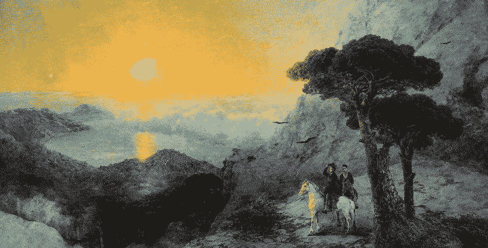
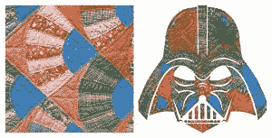

# 8 个简单而独特的数据科学项目，用于艺术创作、音乐创作等等！

> 原文：<https://medium.com/analytics-vidhya/8-simple-and-unique-data-science-projects-to-create-art-generate-music-and-much-more-76ab7b95e29f?source=collection_archive---------3----------------------->

# 概观

*   使用数据科学算法生成艺术和音乐？这 8 个人工智能项目会让你大吃一惊
*   通过这些项目挖掘你的创造力和艺术气质
*   每个数据科学艺术项目都包括帮助您在自己的机器上开始的链接

# 介绍

我一直对创造性艺术着迷。拿起一张白纸，让我的想象力激发我的创造力，这是一件非常令人愉快的事情。

但是这些天抽出时间来练习我的艺术？根本不可能。我相信任何在工作环境之外有爱好的人都会和我的情况有关！所以当我看到一些谷歌项目关于使用数据科学产生艺术时，我激动得无以复加。

我将数据科学与您的普通行业领域(金融、营销、医疗保健等)联系起来。但是数据科学对于创造性工作，比如艺术、写作、音乐甚至辩论来说呢？这听起来太超前了，与现在的数据科学家无关。

**我可以向你保证这种未来的场景就是现在！我们生活在一场精彩的人工智能艺术革命中。因此，如果你曾经想成为一名艺术家，或者甚至有一点点你想要引导的创造力——这篇文章就是为你准备的。**

我列出了一些我参与过或遇到的最有趣、最有创意的项目。我把它们归类为艺术类(包括绘画等)。)、音乐(作曲、器乐等。)最后是一些杂项项目，包括一个以人类智能水平进行辩论的漂亮机器。

这是创意艺术的[机器学习](https://courses.analyticsvidhya.com/courses/applied-machine-learning-beginner-to-professional?utm_source=blog&utm_medium=8-impressive-machine-learning-projects-create-art-music-debates)！

# 本文涵盖的项目

## 艺术数据科学项目

*   谷歌的快，画！
*   错综复杂的艺术世代
*   贝拉米一家

## 音乐数据科学项目

*   谷歌的 Magenta 项目
*   [人名]克莱拉
*   AI DJ 项目

## 杂项项目

*   IBM 项目辩手
*   麻省理工学院的“生成几乎任何东西”系列

# 艺术数据科学项目

画新的东西并用颜色填充它们是我们大多数人在童年时做的事情。我从来没有想到一台机器能够变出和我们生产的任何东西一样好的艺术品。但是我们在这里。

一个简单的神经网络在某种艺术或一组图像上训练，现在可以产生惊人的视觉图像。想象一下，在文艺复兴时期，莱昂纳多·达·芬奇会有多开心！

# 谷歌的快，画！

当然我们从谷歌开始。当谈到人工智能时，还有谁会名列最具创造力的名单之首？谷歌的创意实验室和谷歌的实验一起创造了这个简单的工具，它可以猜测你正在试图画什么。

> Douglas Eck 和 David Ha 提出了 Sketch-RNN，[一个递归神经网络](https://www.analyticsvidhya.com/blog/2019/01/fundamentals-deep-learning-recurrent-neural-networks-scratch-python/?utm_source=blog&utm_medium=8-impressive-machine-learning-projects-create-art-music-debates)，它可以生成常见物体的图形。

该模型在人类绘制的日常物体草图上进行训练，这些草图被表示为一个序列。该序列然后被输入到[序列到序列自动编码器](https://www.analyticsvidhya.com/blog/2018/03/essentials-of-deep-learning-sequence-to-sequence-modelling-with-attention-part-i/?utm_source=blog&utm_medium=8-impressive-machine-learning-projects-create-art-music-debates)。这反过来训练神经网络。

此外，该团队还维护了一个由 Quick，Draw！游戏。这里有一些资源可以帮助你快速入门。：

*   [数据集](https://github.com/googlecreativelab/quickdraw-dataset)
*   埃里克·哈和道格拉斯·埃克的论文
*   [张量流教程](https://www.tensorflow.org/tutorials/sequences/recurrent_quickdraw)

# 错综复杂的艺术世代

你听说过 Zentangles 吗？很有可能你没有意识到。我们有些人在书页角上画的错综复杂的图案，我们过去称之为“涂鸦”，实际上是 Zentangles。

它们最近在涂色书和流行艺术中变得非常受欢迎。然而，Zentagles 受到一些视觉规则和循环模式的约束。以下是各种 Zentangles 的几个例子:

帕洛阿尔托研究中心(之前是 PARC 施乐公司)的研究员 Kalai Ramea 认为，这种艺术是应用风格转移算法([神经风格转移](https://www.analyticsvidhya.com/blog/2018/12/guide-convolutional-neural-network-cnn/?utm_source=blog&utm_medium=8-impressive-machine-learning-projects-create-art-music-debates))的好领域。她想出的生成设计也非常独特和丰富多彩。

该项目涉及使用一种风格转移算法，并将其应用到一个图像。内容图像是我们想要应用 Zentangle 样式的图像的轮廓，而样式图像是任何图案(黑白或彩色)。**该算法基本上将样式图像的样式转移到内容图像。**神经类型转移的简要说明如下:

使用的权重来自一个名为 [VGGNet](https://www.analyticsvidhya.com/blog/2017/08/10-advanced-deep-learning-architectures-data-scientists/?utm_source=blog&utm_medium=8-impressive-machine-learning-projects-create-art-music-debates) 的预训练网络，这是一个由牛津大学视觉几何小组开发和训练的用于对象识别的深度卷积网络。

卡莱作品的一个例子，由一床被子和达斯·维德的形象构成:

太棒了，对吧？Kalai 还在 2017 年自组织机器学习会议(SOCML)上介绍了这项研究。你可以从这里开始了解更多关于复杂艺术生成的知识:

*   [GitHub 上的开源项目](https://github.com/PARC/intricate-art-neural-transfer)
*   [解释错综复杂的艺术生成是如何运作的文章](https://becominghuman.ai/creating-intricate-art-with-neural-style-transfer-e5fee5f89481)

# 贝拉米一家

[生成对抗网络(GANs)](https://www.analyticsvidhya.com/blog/2017/06/introductory-generative-adversarial-networks-gans/?utm_source=blog&utm_medium=8-impressive-machine-learning-projects-create-art-music-debates) 是当今深度学习社区的热门话题。gan 正被用于生成不存在的人的照片，甚至绘制风景和肖像。

> Gauthier Vernier、Pierre Fautrel 和 Hugo Caselles-Dupré三人组将 GANs 的应用向前推进了一步。作为总部设在巴黎的艺术家和机器学习研究人员集体 Obvious 的一部分，他们创作了一个来自甘斯的完全虚构的 Belamy 家庭的肖像。

这个“家庭”收藏了 11 幅不同家庭成员的肖像，其中最大的一幅是埃德蒙·德·贝拉米的肖像，在世界著名的佳士得拍卖行拍出了 43.25 万美元。

**肖像的古典本质源于这样一个事实，即训练数据由 14 世纪到 20 世纪的 15，000 幅肖像组成。**

最精彩的部分？Belamy 源自“Bel ami”，翻译为“I，Goodfellow”(来自 I. Goodfellow，GANs 的创建者)，每幅肖像都以 GAN 模型的损失函数公式结束。

*   [明显的集体](http://obvious-art.com/)
*   [文章从创作者处明显详细地解释了他们的方法](/@hello.obvious/ai-the-rise-of-a-new-art-movement-f6efe0a51f2e)

# 音乐数据科学项目

乍一看，使用人工智能算法生成音乐似乎是一个自然的选择。音乐本质上是音符的集合——人工智能在这种数据上蓬勃发展。因此，看到研究人员在人工智能音乐方面取得的进展并不奇怪。

## 谷歌的 Magenta 项目

啊，对了，又是谷歌。谷歌的 Magenta 项目于 2016 年夏天推出，最初在研究和人工智能爱好者中广为人知，但它在大众中成名是因为他们的巴赫涂鸦。该模型是为了庆祝 J.S. Bach 的 334 岁生日而创建的，它将按照 Bach 的风格协调任何用户的输入。

人工智能模型被称为 Coconet，这是一个[卷积神经网络](https://www.analyticsvidhya.com/blog/2017/06/architecture-of-convolutional-neural-networks-simplified-demystified/?utm_source=blog&utm_medium=8-impressive-machine-learning-projects-create-art-music-debates)，可以填充缺失的音乐片段。为了训练这个模型，团队使用了巴赫创作的 306 首合唱和声。该模型从训练集中删除一些随机的音符，并重新生成新的音符来填充空白。

巴赫涂鸦背后的团队解释说:

*   [谷歌的界面来试验这种模式](http://coconet.glitch.me/)
*   [链接到完整代码](https://glitch.com/edit/#!/coconet?path=README.md:1:0)
*   [谷歌 Magenta 博客上的深入解释](https://magenta.tensorflow.org/coconet)
*   [谷歌 Magenta 团队的其他令人敬畏的人工智能项目](https://magenta.tensorflow.org/demos)

## [人名]克莱拉

由 Christine McLeavey Payne(钢琴家兼 OpenAI 研究员)创建的 Clara 是一个创作钢琴和室内乐的神经网络。基于音乐也是一种语言的概念，克里斯汀开发了一个基于 LSTM 的神经网络，它可以预测我们接下来应该演奏什么音符或和弦。

为了完成这项工作，Christine 首先获得了一个 MIDI 文件数据集，并将它们转换成文本格式。文本文件然后被分成音符级或和弦级，这类似于字符级和单词级的[语言模型](https://www.analyticsvidhya.com/blog/2019/03/pretrained-models-get-started-nlp/?utm_source=blog&utm_medium=8-impressive-machine-learning-projects-create-art-music-debates)。

克里斯汀向我们展示了克拉拉的样片:

克里斯汀还创建了一个音乐评论家模型，将音乐分为人类生成的和机器生成的。

*   [在 GitHub 上开源](https://github.com/mcleavey/musical-neural-net)
*   [项目概述及更多详情](http://christinemcleavey.com/clara-a-neural-net-music-generator/)

## AI DJ 项目

你知道这个要来了——人工智能和 DJ 的混搭！这实际上是我听到人工智能和音乐时的第一印象。一个好的 DJ 可以完全改变现场观众的情绪——这是人工智能一直在对我们做的事情！

专注于计算创造力的日本公司 Qosmo 创建了 AI DJ 项目。这是人类和算法 DJ 创造新音乐的结合。

该项目包括三个阶段:

*   **音乐选择:**这包括一个神经网络，分别用于流派推断、乐器推断和鼓机推断。这些网络结合起来从人类 DJ 播放的音乐中提取特征
*   **节拍匹配:**这是使用[强化学习](https://www.analyticsvidhya.com/blog/category/machine-learning/reinforcement-learning/)实现的，使 AI 能够根据人类 DJ 播放的节拍控制转盘的速度
*   **大众阅读:**这个项目最有趣(也是最复杂)的部分。它使用运动跟踪和深度学习来衡量现场人群的情绪，并相应地改变音乐

查看详细解释这三个步骤的[项目页面](http://aidj.qosmo.jp/)。

# 杂项项目

人工智能在创造性艺术中的应用不仅仅局限于艺术和音乐。好奇想看看 AI 还能做什么你可能还没想到的事情？让我们来了解一下！

## IBM 的项目辩手

[自然语言处理(NLP)](https://courses.analyticsvidhya.com/courses/natural-language-processing-nlp?utm_source=blog&utm_medium=8-impressive-machine-learning-projects-create-art-music-debates) 如今，它从未远离任何人工智能榜单。IBM 的这个项目是这个列表中最复杂的项目。这个人工智能辩手的每个组成部分都探索了机器学习的概念。

掌握这一点——论点挖掘组件检测语料库中的主张和证据，并评估论点的质量。立场分类和情感分析模块处理对关于立场的专家意见进行分类，分析句子和习语的情感，甚至基于主张识别立场。

接下来，深度神经网络与弱监督一起预测相位突变，对论点评分，并进一步增强论点挖掘。最后，文本到语音系统告诉哪些单词和短语强调并生成有效的语音模式。

参加关于资助学前教育的辩论，Project Debater 与冠军辩手 Harish Natarajan 展开辩论:

*   [整个项目详解](https://www.research.ibm.com/artificial-intelligence/project-debater/how-it-works/)

## 麻省理工学院的“生成几乎任何东西”系列

尼尔·格申菲尔德(Neil Gershenfeld)教授的麻省理工学院最受欢迎的课程“如何制造(几乎)任何东西”的学生正在打破新的障碍，并以最巧妙的方式应用人工智能模型。

他们发布了一系列 6 集，每一集都有一个专家人类合作者与团队合作，探索人工智能可以用来推进他们领域的不同方式。这份名单包括人工智能生成的音乐、人工智能生成的时尚、涂鸦，以及迄今为止我最喜欢的:人工智能生成的披萨。

确保你浏览了[项目网站。](https://howtogeneratealmostanything.com/)

其他荣誉奖包括人工智能制作的短片《月食》:

另外，[这里有一个非常酷的资料库](https://thispersondoesnotexist.com/)，里面是用 GANs 创建的不存在的人脸。难以置信！

# 结束注释

数据科学如今能做的事情真的令人难以置信。这进一步说明了数据科学的边界尚未被探索。这对于那些想在自己的专业领域应用人工智能的人来说特别有用。

就我个人而言，我也发现这些项目对于学习我以前认为很难的概念非常有用。当你看到一个算法被应用到有趣的事情上时，理解它就容易多了。

你能想到数据科学可以应用的其他方式吗(但目前没有)？下面在评论区讨论吧！

你也可以在分析 Vidhya 的 Android 应用上阅读这篇文章

*原载于 2019 年 7 月 9 日*[*【https://www.analyticsvidhya.com】*](https://www.analyticsvidhya.com/blog/2019/07/8-impressive-data-science-projects-create-art-music-debates/)*。*