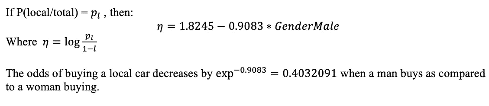
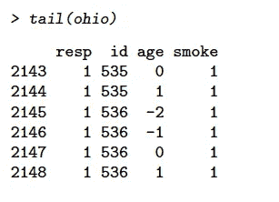

# 面向数据科学家的 R 中的 8 个统计模型

> 原文：<https://medium.com/analytics-vidhya/8-statistical-models-for-data-scientists-in-r-3342f0e2ef79?source=collection_archive---------14----------------------->

数据科学已经成为计算机科学和统计学的独特融合。大多数人至少在这些弟子中的一个方面受过训练，虽然我将在我的其他文章中写关于机器学习的大部分内容，但这一篇将简要概述人们可以使用 R 语言创建的不同统计模型，并将方便任何数据科学家。统计学本身就是一门庞大的学科，有时对没有受过这方面训练的人来说相当可怕。有很多关于这些模型的书籍，所以不可能在一篇文章中压缩所有的信息。因此，这将是建立您对这些数据模型关系的理解的起点。此外，本文将假设在所有本科统计学课程中教授的某些基本统计学定义。但是，如果您觉得先回顾它们更有信心，我鼓励您在自己的时间里研究这些概念，然后再回到本文。

以下 8 个模型将简要说明每个数据集，然后说明我们使用的最合适的模型。你不会找到关于这个模型的深入的细节，但是足够鼓励你自己去利用它们。这些例子要么直接取自 J.J. Faraway 的书( [1](https://www.amazon.com/Linear-Models-Chapman-Statistical-Science/dp/1584884258) & [2](https://www.amazon.com/Extending-Linear-Model-Generalized-Nonparametric/dp/149872096X) )，要么从书中获得灵感，我鼓励你也去看看。这两本书是理解统计模型及其在 R 中的实现的很好的资源，在你的职业生涯中会派上用场。

现在，在每个模型中，我将引入一个问题，简要概述我们必须分析的数据，并根据这些数据选择我们认为最合适的模型。

M **模型 1:有定量协变量的定量反应**

**数据:**[R 中的瑞士数据](https://stat.ethz.ch/R-manual/R-patched/library/datasets/html/swiss.html)包含了大约 1888 年瑞士 47 个法语省份的标准化生育率测量和 5 个社会经济指标。

**协变量:** (5 个连续变量)农业、考试、教育、天主教、婴儿。死亡率

**预测值:** (1 个连续变量)生育率

**模型:**无交互作用的线性回归模型(备选方案可以选择协变量作为定性变量)

模型 1:线性回归模型

最终模型和分析:

这是一个人能做的最基本的线性模型。由于我们没有考虑交互，所以很容易解释这个模型。

M **模型 2:有定量协变量的二元响应**

**资料:** [*wcgs*](http://search.r-project.org/library/faraway/html/wcgs.html) 在遥远的

**协变量:** *高度*和 *cigs*

**预测值(Y):** *冠心病*

**模型拟合和假设检验:**

首先，确定重要的协变量。这在统计学中是通过检验协变量参数全为零与不全为零的零假设来正式完成的。

小 p 值(<0.05) at 95% confidence level concludes here that there is a significant relationship between the predictor *高度*和 *cigs、*和响应 *chd* 。但是这两个协变量都重要吗？对此进行测试的一种方法是创建一个较小的模型，并使用偏差差异进行测试，如下所示。

模型 2:偏差检验分析

偏差表分析表明，使用似然比检验，在 95%置信水平下，在已经包括香烟(p 值=0.3374)的模型中，*高度*不显著。

**型号选择:**

一个最简单的方法是选择一个模型给定的协变量 R，是通过使用 [*步*](https://www.rdocumentation.org/packages/stats/versions/3.6.2/topics/step) 函数和 AIC (Akaike 信息准则)。选择所有候选模型中具有最小 AIC 值的模型。模型的拟合优度不能用二进制响应 GLM 中的偏差来衡量，所以我们可以使用霍斯默-莱梅休统计或 ROC 曲线。

M **模型 3:具有分类/定性协变量的二元响应，其中分类< =2**

**数据:**汽车——用户被问及他们是否购买了本地制造的汽车，并被分为他们的居住类型(城市与国家)和性别(男性与女性)

模型 3:数据表

**回应:**购买本地汽车的人数

**协变量:**性别和居住地

**模型:** Logistic 回归模型

我们如何决定性别和居住地是否与模型相关？

模型 3:参数相关性分析

这种使用卡方检验的异常分析表明，居住在没有性别的情况下是显著的，但在考虑性别因素后并不显著。然而，无论有无居住补贴，性别都很重要。

**最终模型和分析:**

M **模型 4:类别为> = 2** 的非二元分类响应变量

**数据:**与个人的职业、教育水平和资质相关的三向列联表

**回答:**不同教育水平的人数

**协变量:**职业、教育和能力作为分类协变量

**模型:**带对数环节的泊松回归模型

模型 4:数据表

**模型拟合的充分性:**

在三向或更高程度的表中，我们需要使用卡方检验找出哪个模型最合适。

模型 5:模型选择

形成偏差表:

模型 5:偏差和自由度表

现在，如果我们找出这些模型中每一个的 p 值 *(1-pchisq(偏差，df)* ，我们将观察到模型[OE][EA](解释:给定教育，职业独立于一个人的资质)提供了与数据的良好拟合(p 值=0.36)，但是模型[OE][OA][EA]提供了明显更好的拟合(1-pchisq(51–25，48–36)= 0.0107)

可以通过查看残差对数据进行进一步分析，以计算出教师(职业中的代码 2)的影响，以及当他们因为显示最大残差而被移除时会发生什么。此类表格的另一个方面是可折叠性，即我们试图折叠一个或多个模式因子上的高阶表格，以简化分析和进一步解释。2 表格可折叠性所需的重要关联如下:

考虑折叠表中因子 A 和 B 之间的关联将与三向表中的关联相同，当且仅当在三向表中:

1.没有三个因素的相互作用，

2.涉及 C 的两因子交互作用中至少有一个为零。

M

由于各种原因(采样零点与结构零点)，列联表有时可能不完整。我们如何对这样的数据建模？解决结构零点问题的一种方法是假设准独立。

**资料:** [Purum 人](https://en.wikipedia.org/wiki/Purum_people):印度曼尼普尔邦 Purum 人的权变表。Purums 只与选定的[同胞](https://en.wikipedia.org/wiki/Sib_(anthropology))结婚，允许的同胞由传统习俗决定。

模型 5: Purum 数据集

因此，为了拟合模型，我们转换数据并包含另一列频率，通常将非值指定为非常不同的异常频率(例如:99 ),而将 rest 指定为正常频率。一种方法是下表，然后如上拟合模型:

模型 5:数据转换

我们接下来看看偏差来分析参数。

模型 5:方差分析

基于 p 值，我们无法拒绝我们的零假设，即 *purum.1* 的参数是不重要的。因此，这种情况需要进一步调查，这里我们将只看残差，以得出一些初步结论。

模型 5:残差分析

排除那些不允许的婚姻类型，一些同胞的组合比其他的更受欢迎。更受欢迎的组合是那些具有大的正残差的组合，不太受欢迎的组合是那些具有大的负残差的组合。

M **模型 6:具有标称响应的多分类响应变量**

**数据:**在遥远的包中，数据集被称为*。我们将在下一个模型中使用相同的数据集。数据集存储了 371 名煤矿工人的信息，这些煤矿工人接受了放射检查，并被分为 3 类尘肺病:正常、轻度和重度，8 个组取决于他们在煤矿工作的年数。*

***反应变量**:尘肺状态*

***模型:**多元分类逻辑模型。这里我们使用库 [*nnet*](https://cran.r-project.org/web/packages/nnet/nnet.pdf) 和方法 *multinorm* 进行模型拟合。*

**

*模型 6:模型拟合*

*最终模型如下:*

**

*模型 6:模型方程*

***解释:**与正常状态相比，每年每增加一个单位，严重肺单胞菌病的比值比增加到 1.115497 或对数比值比增加到 0.1093。*

*M **模型 7:带有顺序响应的多分类响应变量***

***数据:**使用与上述相同的数据，但是具有来自数据的附加信息，即 3 个阶段:正常、轻度和重度是相互关联的。一个状态正常的人，在病情严重之前，会经历轻度状态。数据的这种固有属性称为有序性(有一个顺序)*

***模型**:对于顺序响应变量，我们将使用来自库*质量*的不同函数 [*polr*](https://www.rdocumentation.org/packages/MASS/versions/7.3-51.6/topics/polr) ，如下所示:*

**

*模型 7:模型拟合*

**

*当年数分类组增加 1 个单位时，检查中具有正常状态与不正常状态的优势比降低到当前的 exp(-0.0959) =0.9085 的因子。*

*M **模型 8:相关反应的多变量模型(纵向研究)***

***数据:**[*俄亥俄州*](https://www.rdocumentation.org/packages/faraway/versions/1.0.7/topics/ohio) 数据涉及来自俄亥俄州斯特本维尔的 537 名儿童，并被作为一项关于空气污染影响的研究的一部分，这些儿童从 7 岁到 10 岁参加了四年的研究。*

***反应变量:**反应是他们是否喘息。(1 =喘息声)*

***协变量:** ID 识别孩子、年龄和母亲的吸烟状况(1 =吸烟者)*

**

*模型 8:俄亥俄州数据*

***模型:**我们将用一个函数 [gee *glm*](https://www.rdocumentation.org/packages/geepack/versions/1.3-1/topics/geeglm) *(广义估计方程)*从包 [*geepack*](https://cran.r-project.org/web/packages/geepack/geepack.pdf) 来拟合一个模型。请注意，对于高斯响应，执行最大似然估计没有问题，因为均值和协方差的规格决定了似然函数。但是对于这种情况下的非高斯数据，提出了广义估计方法。这个包(以及另一个包[*gee*](https://cran.r-project.org/web/packages/gee/gee.pdf)*()*)确实存在一些问题，正在积极研发中。*

**

*模型 8:模型拟合*

**

*这里可以得出类似的解释，即母亲吸烟的 10 岁儿童与母亲不吸烟的 9 岁儿童的比值比为*

**

*如果你已经走了这么远，你会意识到从这些模型中可以推导出更多的信息，我鼓励你这样做。我在这篇文章中缺乏彻底性是为了让我可以将不同的数据场景放入一篇易读的文章中。在这些模型中，我留给读者去解决的一些主题是方差计算、参数估计置信区间和概率计算。*

*然而，这里提出了理解模型拟合问题的几个关键点，在结束之前，我想强调一些需要记住的简单步骤。首先，方差分析测试可以以多种方式使用，这里强调的三种方式是:*

> *参数充分性——寻找低(< 0.05) p-values;*
> 
> *Model adequacy compared to a null model where applicable — look for high p-values (> 0.05)的参数，*
> 
> *比较两个模型以获得更好的拟合度—如果 p 值较低(<0.05) chose the more complex model, if the p-value is high (> 0.05)，则在 95%的置信水平下选择更简单的模型。*

*其次，如果零模型(仅截距模型)显示更合适的拟合，请返回到您的数据并查看残差-可能有一些异常值需要移除或用作协变量中的另一个维度，然后再次拟合模型。*

*统计模型拟合需要数学理解、测试和耐心，在拟合的充分性和记忆的简单性之间总是有一个权衡。我希望我能够通过对数据和模型多样性的一瞥点燃一些好奇心。好奇想了解更多？—看书！*

*下次见！*