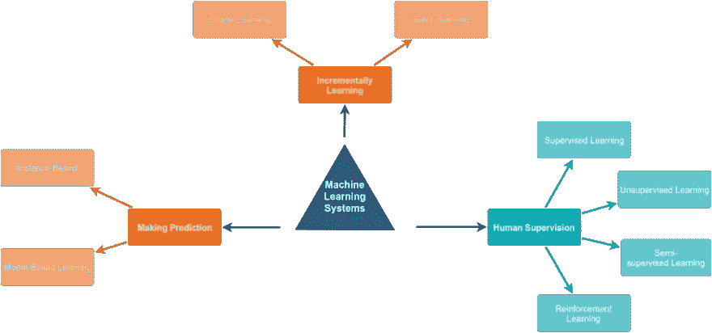
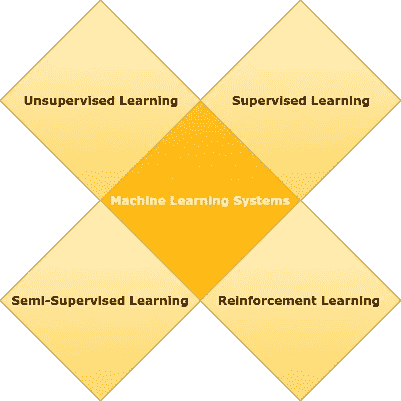
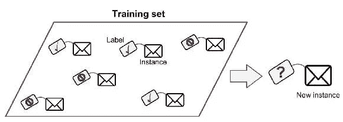
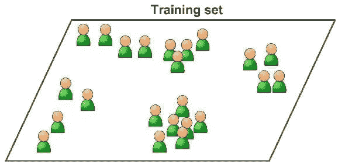
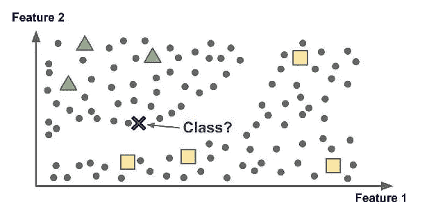
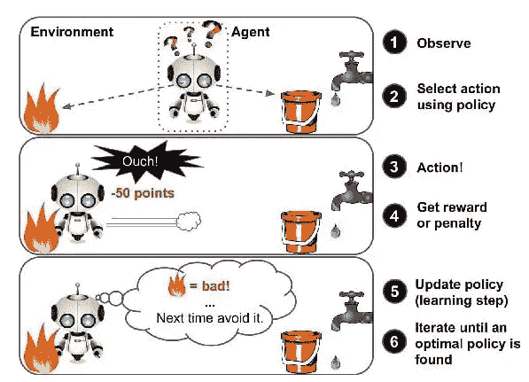
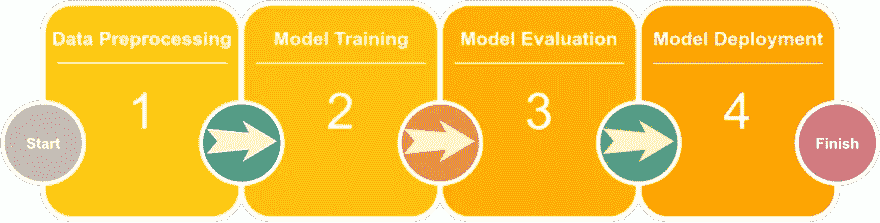
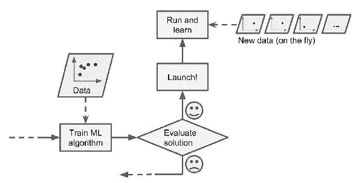
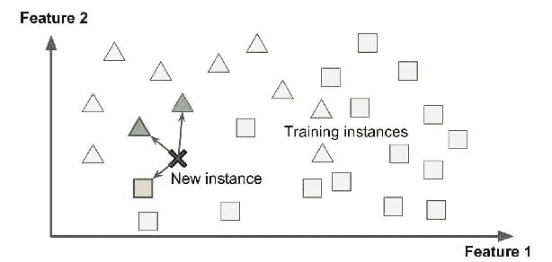
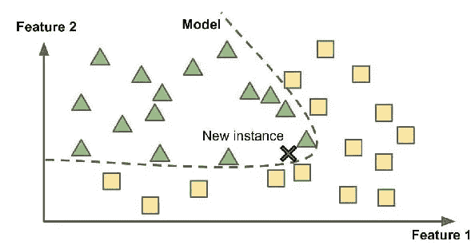

# 8 种机器学习系统你可能不知道它们来自哪里

> 原文：<https://medium.com/analytics-vidhya/8-types-of-machine-learning-systems-you-may-not-know-where-they-came-from-4d200ee0390b?source=collection_archive---------20----------------------->

# 介绍

许多人将机器学习系统分为监督学习和非监督学习，但事实是，机器学习系统可以分为许多类别，对它们进行分类的标准并不排斥所有的单个系统，并且都可以正确地标记为“机器学习系统的类型”。

图[1]ML 系统的类型

系统基于以下因素进行分类:

*   **人工监督**(监督、非监督、半监督和强化学习)。
*   **增量学习**(在线和批量学习)。
*   **做预测**(基于实例和基于模型的学习)。

让我们更深入地了解这些标准…

# 人工监督

图[2]基于人工监督的 ML 系统类型

机器学习系统可以根据它们执行的监督类型进行分类，并分为四个主要类别:

## 1.监督学习

图[3]监督学习

在监督学习中，引入系统的训练数据必须包括用于评估训练数据的每个样本的标签。与垃圾邮件分类器等分类问题非常相似，该算法使用带有标签的单个邮件来学习如何对新邮件进行分类。
在另一个房价预测的例子中，算法需要标记每个房屋规格，在这种情况下，房屋的标签将是价格，以允许系统能够根据房屋规格预测新的房价，这一任务被称为**回归**。

## 2.无监督学习

图 4 无监督学习

在无监督学习中，输入到系统的训练数据没有描述哪个样本属于哪个类别的标签，因此它必须依靠自身来确定样本的模式，这降低了算法的准确性，然而，这是这些类别中最重要的一个，因为大多数数据都是无标签的，需要在它们之间找到模式。
无监督学习中一些最常用的任务是**聚类**(根据数据点之间的相似模式将数据集分成组)；**异常检测**(发现数据集中不寻常的数据点并使用它，有助于发现欺诈性数据点，并在数据预处理阶段发现异常值)和**降维**(也用于数据预处理阶段以减少数据集中的特征数量)。

## 3.半监督学习

图[5]半监督学习

在半监督学习中，标记和未标记数据的混合允许模型与监督和非监督技术相结合，从而允许在同一环境中使用监督和非监督技术。这可以通过在模型训练中使用已标记的数据，然后使用已训练的模型对未标记的数据进行分类，然后馈入所有高概率预测数据，以用更大量的已标记数据重新训练模型来实现，这种技术称为 [**伪标记**](https://www.analyticsvidhya.com/blog/2017/09/pseudo-labelling-semi-supervised-learning-technique/) **。**

## 4.强化学习

图 6 强化学习

这个系统与其他类型的学习方式非常不同，因为一个*智能体*可以观察环境并从中学习，通过执行*动作*可以获得好动作的*奖励*或坏动作的*惩罚*。这个策略模式被称为*策略*，它定义了代理在给定情况下应该采取什么行动。

# 增量学习

对机器学习系统进行分类的另一个标准是基于从到来的数据流中进行增量学习的能力。

## 1.批量学习

图[7]批量学习

这种类型的系统需要对所有可用的数据进行训练，并使用可用的时间和计算资源(称为**离线学习**，因为它离线学习，然后投入生产并运行，无需学习)，然后当我们需要训练新版本的系统时，我们必须从所有数据的生产版本开始重新训练模型(旧的&新的)，然后用新的模型替换训练的模型。
此类系统的一个简单示例是构建猫对非猫图像分类器，在白天对猫图像进行训练，一段时间后，我们需要引入夜间图像，然后我们需要获取所有夜间和白天的猫图像，重新训练我们的模型，并在新版本中部署新模型。

## 2.在线学习

图 8 在线学习

在线学习背后的想法是通过按顺序或通过称为小批量的小组向系统提供数据点来逐步训练系统，在线学习非常适合于接收数据的系统，因为数据持续流动，需要快速适应新的变化，而不太关心长期历史，这种系统最著名的例子是“股票价格预测模型”，它在飞行中学习以适应股票价格的最近变化，而不必太担心太旧的读数。

但是这种类型的系统中的一个大的挑战是馈送给系统的质量差的数据，系统的性能将逐渐下降，坏数据的一些例子是股票价格中的错误读数或者某人向搜索引擎发送垃圾邮件以试图在搜索结果中排名靠前， 为了降低这种风险，我们需要添加监控层，如异常检测算法，它能够检测任何可能影响模型性能的异常数据，并在数据质量提高之前关闭学习，或者使用数据预期层，当数据质量低于预期时，它会发出警报，我将专门撰写一篇文章来详细讨论这一点。

# 做出预测

将机器学习系统分为两种类型的最后一个因素是模型如何概括为对以前从未见过的新数据进行预测。

## **1。基于实例的学习**

图 9 基于实例的学习

为了能够对新数据点进行分类，该算法会计算新数据点与数据集中其他两点之间的距离 3 或更多，然后预测新数据点所属的类别，这看起来很简单，但如果我们看看它的性能，我不认为你会太兴奋，这种类型最著名的算法是**K-最近邻**算法。

## **2。基于模型的学习**

图 10 基于实例的学习

从一组示例中进行归纳的另一种方法是从这些示例中构建一个模型，然后使用该模型进行预测。这被称为基于模型的学习，在这里建立模型意味着某些方程具有参数来调整替代的基于实例的学习，这取决于作为主要选择的相似性。

如果我们研究房价预测问题，并尝试将其纳入模型，我们可以发现两种情况:

*   第一种场景:使用新的房价来寻找和测量房价与所有标记的数据点之间的相似性，然后我们根据我们数据中最相似的房子或最相似的 k 个房子的平均值来设置新的房价，称为基于模型的学习。
*   第二种情况:根据特征构建方程并使用算法调整这些参数，可以拟合和概括房价数据，然后获得特征值并将其代入方程以获得新的房价。

最后，最常见的类别是从多个角度搜索机器学习系统，并扩展将现实生活中的问题与更多系统级类型相匹配的视野。

参考资料:

*   [Python 机器学习简介](https://www.oreilly.com/library/view/introduction-to-machine/9781449369880/)