# 80 个关于数据科学 Python 的面试问题

> 原文：<https://medium.com/analytics-vidhya/80-interview-questions-on-python-for-data-science-30313688505?source=collection_archive---------0----------------------->

Python — 34 个问题

熊猫——18 个问题

可视化— 8 个问题

数据清理— 5 个问题

机器学习——15 个问题

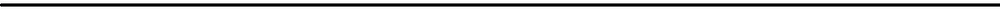

# Python — 34 个问题

**1。** **我们如何在 python 中创建数值变量？**

> 圆周率= 3.14159
> 
> 直径= 3

**2。** **我们如何在 python 中进行计算？**

> 半径=直径/ 2
> 
> 面积= pi *半径*半径

**3。** **举一个 python 中 BODMAS 的例子？**

> (8–3) * (2 — (1 + 1))
> 
> 输出为 0

**4。** **列举例子？**

> a = [1，2，3]→a 的长度:3
> 
> b = [1，[2，3]]→b 的长度:2
> 
> c =[]→c 的长度:0
> 
> d = [1，2，3][1:]→d 的长度:2

**5。** **我们如何互换两个列表的值？**

> a = [1，2，3]
> 
> b = [3，2，1]
> 
> b，a = a，b

6。 **我们如何从列表中提取值？**

> r = ["马里奥"，"布瑟"，"路易吉"]
> 
> r[0] →马里奥
> 
> r[-1] →路易吉

7。 **我们如何在 python 中使用 list 创建循环？**

> 下面的代码从列表中返回大于阈值的数字
> 
> def elementwise_greater_than(L，thresh):
> 
> res = []
> 
> 对于 L 中的 ele:
> 
> if ele > thresh: res.append()
> 
> 返回资源
> 
> elementwise_greater_than([1，2，3，4]，2)
> 
> 输出是[3，4]

8。 **举出字符串的例子？**

> a = "→a 的长度:0
> 
> b = "没事"→b 的长度:7
> 
> c = '没关系'→c 的长度:7
> 
> d = " "嘿" " "→d 的长度:3
> 
> e = ' \ n '→e 的长度:1

**9。** **举一个布尔的例子？**

> 布尔值只接受两个值:真和假
> 
> 0 < 1: True
> 
> 0 > 1:假

**10。** **我们如何对布尔进行运算？**

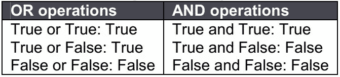

**11。****python 中有哪些函数？**

> 功能是一组有组织的、可重用的代码，用于执行单个相关的动作。
> 
> 定义 round_to_two_places(数字):
> 
> 返回回合(数字，2)
> 
> pi = round_to_two_places(3.14159)
> 
> 输出是 3.14

**12。** **用 python 计算余数？**

> 91 % 3
> 
> 输出为 1

**13。** **谁创造了 python？**

> Python 是一种解释型高级通用编程语言。
> 
> Python 是吉多·范·罗苏姆创造的

**14。****python 是什么时候创建的？**

> Python 是在 20 世纪 80 年代后期作为 ABC 语言的继承者而构想出来的
> 
> 第一个版本于 1991 年发布
> 
> Python 2.0 发布于 2000 年
> 
> Python 3.0 于 2008 年发布

**15。****python 提供了哪些内置类型？**

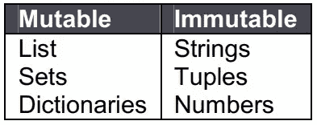

16。**Python 中 lambda 是什么？**

> 它是一个用作内联函数的单表达式匿名函数。
> 
> x =λa:a+10
> 
> x(5)
> 
> 输出是 15

**17。****Python 中的 pass 是什么？**

> Pass 的意思是，无操作 Python 语句。
> 
> 在复合语句中，它是一个占位符，不需要写任何东西。

**18。** **什么是切片？**

> 从列表、元组、字符串等序列类型中选择一系列项目的机制。被称为切片。
> 
> x[1，2，3，4，5]
> 
> x[0:2] → [1，2]
> 
> x[2:] → [3，4，5]

**19。****Python 中的负索引是什么？**

> Python 序列可以用正数和负数进行索引。
> 
> 对于正索引，0 是第一个索引，1 是第二个索引，依此类推。
> 
> 对于负索引，(-1)是最后一个索引，(-2)是倒数第二个索引，依此类推。

**二十。** **如何将一个数字转换成一个字符串？**

> 为了将数字转换成字符串，使用内置函数 str()。
> 
> 如果您想要八进制或十六进制表示，请使用内置函数 oct()或 hex()。

21。 **什么是测距功能？**

> range()函数返回一个数字序列，默认情况下从 0 开始，按 1 递增(默认情况下)，并在指定的数字前停止。
> 
> x =范围(6)
> 
> 对于 x 中的 n:
> 
> 打印(n)
> 
> 输出是 0，1，2，3，4，5

22。**Python 中如何生成随机数？**

> **库:**随机导入
> 
> **语法:** random.random()
> 
> **输出:**返回一个在[0，1]范围内的随机浮点数

**23。****Python 中的/和//运算符有什么区别？**

> //是地板除法运算符
> 
> 它用于将两个操作数相除，结果为只显示小数点前位数的商。
> 
> 10 / 3 = 3.33333
> 
> 10 // 3 = 3

**二十四。****Python 中的 split 函数有什么用？**

> Python 中 split 函数的用途是使用定义的分隔符将一个字符串分解成更短的字符串。
> 
> 它给出了字符串中所有单词的列表。

**25。** **列表和元组有什么区别？**

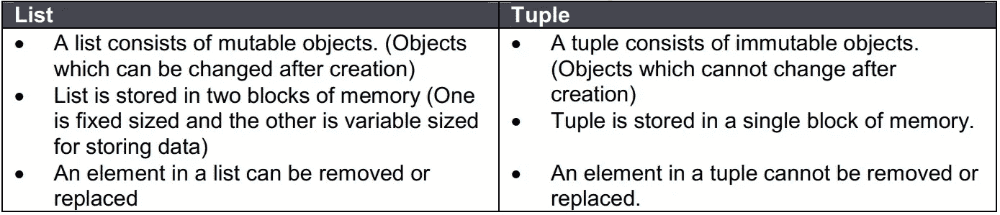

**26。** **数组和列表有什么区别？**

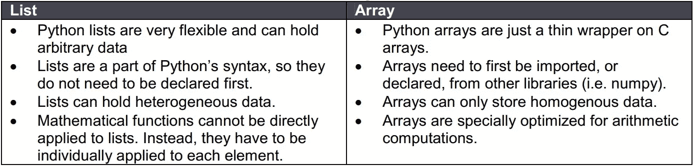

**27。如何将一个列表转换成一个数组？**

> 这是使用 numpy.array()完成的。
> 
> numpy 库的这个函数将一个列表作为参数，并返回一个包含列表中所有元素的数组。

**28。****NumPy 数组相比 Python 列表有什么优势？**

> NumPy 更方便。
> 
> 你会得到大量的向量和矩阵运算，这有时可以避免不必要的工作。
> 
> 你可以用 NumPy 得到很多内置函数，用于快速搜索、基本统计、线性代数、直方图等。

**29。****Python 中的全局和局部变量是什么？**

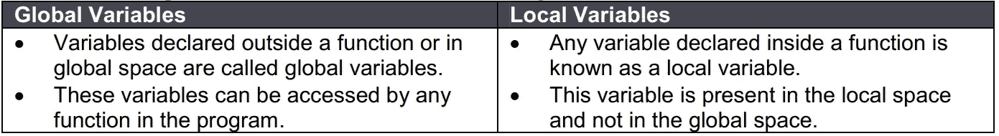

30。 **解释 Python 2 和 Python 3 的区别？**

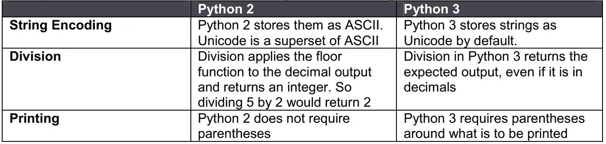

**31。****Python 中的字典理解是什么？**

> 字典理解是用 Python 创建字典的一种方式。
> 
> 它通过合并两组数据来创建一个字典，这两组数据要么是列表，要么是数组。
> 
> roll numbers =[122233353456]
> 
> names = ['alex '，' bob '，' can '，' don']
> 
> NewDictionary={ i:j for (i，j in zip(roll numbers，names)}
> 
> 输出是{(122，' alex ')，(233，' bob ')，(353，' can ')，(456，' don ')

**32。** **你会如何用 Python 对字典进行排序？**

> **Dictionary.keys() :** 只返回任意顺序的键。
> 
> **Dictionary.values() :** 返回一个值列表。
> 
> **Dictionary.items() :** 以键值对列表的形式返回所有数据。
> 
> 这个方法有一个强制参数和两个可选参数

33。 **如何在 Python 中反转一个字符串？**

> Stringname = 'python '
> 
> Stringname[::-1]
> 
> 输出是“nohtyp”

34。 **如何检查一个 Python 字符串是否包含另一个字符串？**

> 【Python 编程】**包含**“编程”
> 
> 输出为真
> 
> 【Python 编程】**包含**【语言】
> 
> 输出为假

# 熊猫——18 个问题

**35。** **如何从列表中创建数据帧？**

> 水果 _ 销量= pd。DataFrame([[35，21]，[41，34]]，columns=['苹果'，'香蕉']，index=['2017 年销售额'，' 2018 年销售额'])

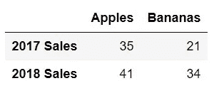

**36。** **如何从字典创建 dataframe？**

> 动物= pd。DataFrame({ '奶牛':[12，20]，'山羊':[22，19]}，index=['第 1 年'，'第 2 年'])

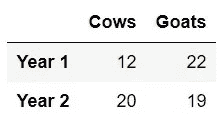

**37。** **如何导入 csv？**

> 进口熊猫作为 pd
> 
> cr_data = pd.read_csv("信贷 _ 风险 _ 数据集. csv ")

38。 **如何导出 csv？**

> 进口熊猫作为 pd
> 
> animals . to _ CSV(" cows _ and _ goals . CSV ")

39。如何从数据帧中选择列？

> 从“评论”数据框架中选择“描述”列
> 
> 评论['描述']

40。 **如何从数据帧中选择行？**

> 从“评论”数据框中选择第一行
> 
> 点评. iloc[0]

**41。** **如何从数据帧中同时选择行和列？**

> 从“评论”数据框架中选择“描述”列的第一行
> 
> 评论['描述']。iloc[0]

**42。** **如何根据索引选择行？**

> 从“回顾”数据框中选择第 1、2、3、5 和 8 行
> 
> 索引= [1，2，3，5，8]
> 
> sample _ reviews = reviews . loc[索引]

**43。** **如何求中值？**

> 从“评论”数据框架中查找“点数”列的中位数
> 
> 评论['点数']。中位数()

**44。** **你如何找到独特的价值观？**

> 从“评论”数据框架的“国家”列中查找所有独特的国家
> 
> 评论['国家']。唯一()

45。 **你如何找到计数的唯一值？**

> 从“评论”数据框架的“国家”列中查找唯一国家的计数
> 
> 评论['国家']。值计数()

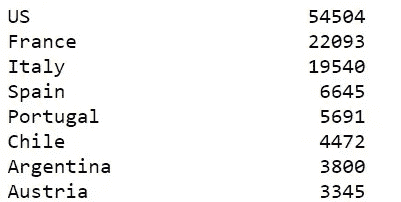

46。如何对特定变量进行分组？

> 从“评论”数据框架中找到“taster_twitter_handle”列的计数
> 
> reviews . group by(' taster _ Twitter _ handle ')。大小()

47。 **对特定变量分组后如何应用函数？**

> 从“评论”数据框中找出不同“品种”栏的“价格”的最小值和最大值
> 
> reviews.groupby('variety ')。['价格']。agg([最小，最大])

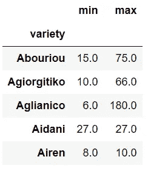

48。 **如何获取特定变量的数据类型？**

> 从“reviews”数据框架中获取“points”列的数据类型
> 
> 评论['点数']。数据类型

49。 **怎么掉列？**

> 从“评论”数据框架中删除“点数”和“国家”列
> 
> reviews.drop(['points '，' country']，axis=1，inplace=True)

**50。** **你是如何保住专栏的？**

> 从“评论”数据框架中保留“点数”和“国家”列
> 
> 评论=评论[['点数'，'国家']]

**51。** **如何重命名一列？**

> 将“区域 1”重命名为“区域”,将“区域 2”重命名为“区域设置”
> 
> reviews . rename(columns = dict(region _ 1 = ' region '，region_2='locale '))

**52。如何根据变量对数据帧进行排序？**

> 按降序对“region_1”进行排序
> 
> 评论['region_1']。sort_values(升序=False)

# 可视化— 8 个问题

53。 **如何绘制折线图？**

> 将 seaborn 作为 sns 导入
> 
> sns.lineplot(data=loan_amnt)

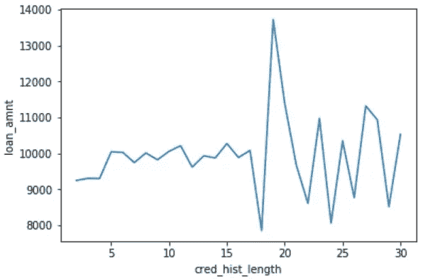

54。 **如何绘制条形图？**

> 将 seaborn 作为 sns 导入
> 
> SNS . bar plot(x = Cr _ data[' CB _ person _ default _ on _ file ']，y=cr_data['loan_int_rate'])

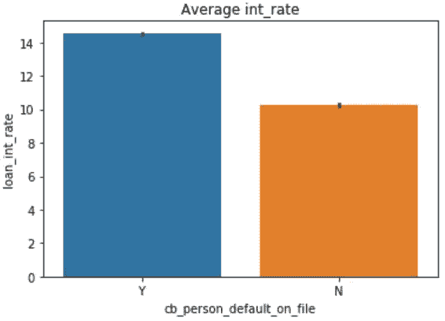

**55。** **如何绘制热图？**

> 将 seaborn 作为 sns 导入
> 
> sns.heatmap(num_data.corr()，annot=True)

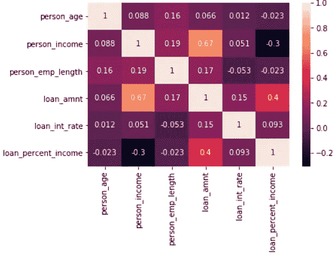

**56。** **如何绘制散点图？**

> 将 seaborn 作为 sns 导入
> 
> SNS . scatter plot(x = Cr _ data[' loan _ amnt ']，y=cr_data['person_income'])

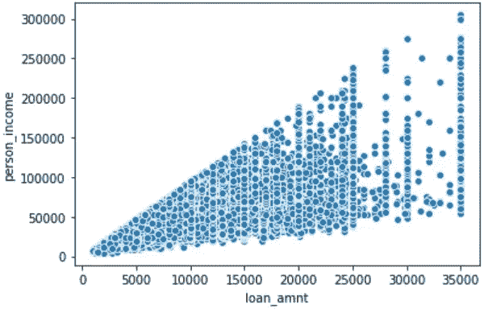

**57。** **你是如何绘制分布图的？**

> 将 seaborn 作为 sns 导入
> 
> SNS . distplot(a = Cr _ data[' person _ income ']，label="person_income "，kde=False)

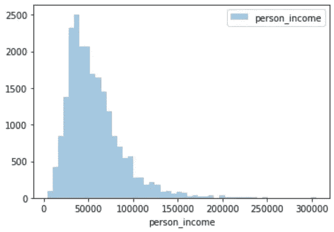

**58。** **如何给图表添加 x 标签和 y 标签？**

> 将 matplotlib.pyplot 作为 plt 导入
> 
> plt.xlabel("cred_hist_length ")
> 
> plt.ylabel("loan_amnt ")

59。 **如何给图表添加标题？**

> 将 matplotlib.pyplot 作为 plt 导入
> 
> plt.title("平均利息率")

60。 **如何给图表添加图例？**

> 将 matplotlib.pyplot 作为 plt 导入
> 
> plt .图例()

# 数据清理— 5 个问题

61。 **如何识别缺失值？**

> 用于识别缺失值的函数是 through。isnull()
> 
> 以下代码给出了数据框中缺失数据点的总数
> 
> missing _ values _ count = SF _ permissions . is null()。总和()

**62。** **如何对缺失值进行插补？**

> 用零/平均值替换缺失值
> 
> df['收入']。菲尔纳(0)
> 
> df['收入'] = df['收入']。菲尔娜((df['收入']。均值()))

63。 **什么是数据缩放？**

> **缩放使用公式=(值-最小值)/(最大值-最小值)**转换数据
> 
> 从 sklearn .预处理导入 MinMaxScaler
> 
> scaler = MinMaxScaler()
> 
> 原始数据= pd。data frame(kickstarters _ 2017[' USD _ goal _ real '])
> 
> scaled_data = pd。data frame(scaler . fit _ transform(original _ data))
> 
> **原始数据**
> 
> 最小值:0.01
> 
> 最大值:166361390.71
> 
> **缩放数据**
> 
> 最小值:0.0
> 
> 最大值:1.0

**64。** **什么是数据规格化？**

> **使用公式=(值-平均值)/标准偏差**换算转换数据
> 
> 来自 sklearn .预处理导入标准缩放器
> 
> scaler = StandardScaler()
> 
> 原始数据= pd。data frame(kickstarters _ 2017[' USD _ goal _ real '])
> 
> scaled_data = pd。data frame(scaler . fit _ transform(original _ data))
> 
> **原始数据**
> 
> 最小值:0.01
> 
> 最大值:166361390.71
> 
> **缩放数据**
> 
> 最小值:-0.10
> 
> 最大值:212.57

65。 **如何在 python 中处理日期？**

> 将日期从字符串转换为日期
> 
> 导入日期时间
> 
> 进口熊猫作为 pd
> 
> df[' Date _ parsed ']= PD . to _ datetime(df[' Date ']，format="%m/%d/%Y ")

# 机器学习——15 个问题

**66。** **什么是 logistic 回归？**

> 逻辑回归是一种用于分类的机器学习算法。在该算法中，描述单次试验可能结果的概率使用逻辑函数建模。

**67。** **逻辑回归的语法是什么？**

> **库:** sklearn.linear_model。物流回收
> 
> **定义模型:** lr = LogisticRegression()
> 
> **拟合模型:**模型= lr.fit(x，y)
> 
> **预测:** pred = model.predict_proba(测试)

68。 **在训练/测试中如何拆分数据？**

> **库:**sk learn . model _ selection . train _ test _ split
> 
> **语法:** X_train，X_test，y_train，y_test = train_test_split(X，y，test_size=0.33，random_state=42)

69。 **什么是决策树？**

> 给定一个数据的属性及其类别，决策树产生一系列可用于对数据进行分类的规则。

70。 **决策树分类器的语法是什么？**

> **库:**sk learn . tree . decision tree classifier
> 
> **定义模型:** dtc =决策树分类器()
> 
> **拟合模型:**模型= dtc.fit(x，y)
> 
> **预测:**pred = model . predict _ proba(test)

**71。** **什么是随机森林？**

> 随机森林分类器是一种元估计器，它在数据集的各种子样本上拟合多个决策树，并使用平均值来提高模型的预测准确性并控制过度拟合。子样本大小始终与原始输入样本大小相同，但样本是替换绘制的。

**72。** **随机森林分类器的语法是什么？**

> **库:**sk learn . ensemble . randomforestclassifier
> 
> **定义模型:** rfc = RandomForestClassifier()
> 
> **拟合模型:**模型= rfc.fit(x，y)
> 
> **预测:**pred = model . predict _ proba(test)

**73。** **什么是渐变助推？**

> 梯度推进是一种用于回归和分类问题的机器学习技术，它以弱预测模型(通常是决策树)的集合的形式产生预测模型。它像其他 boosting 方法一样以分阶段的方式构建模型，并通过允许优化任意可微分损失函数来概括它们。

74。 **梯度推进分类器的语法是什么？**

> **库:**sk learn . ensemble . gradientboostingclassifier
> 
> **定义模型:**gbc = GradientBoostingClassifier()
> 
> **拟合模型:**模型= gbc.fit(x，y)
> 
> **预测:**pred = model . predict _ proba(test)

**75。** **什么是 SVM？**

> 支持向量机是将训练数据表示为空间中的点，这些点被尽可能宽的清晰间隙分成多个类别。然后，新的例子被映射到相同的空间，并根据它们落在差距的哪一边来预测属于哪个类别。

**76。****KNN 和韩国有什么区别？**

> KNN:
> 
> 监督分类算法
> 
> 根据 k 数或最近的数据点对新数据点进行分类
> 
> **k 含义:**
> 
> 无监督聚类算法
> 
> 将数据分成 k 个簇。

77。 **如何看待分类变量？**

> 用每个类别的目标平均值替换类别变量

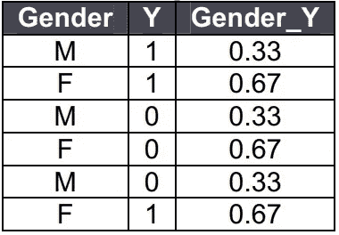

> 一个热编码

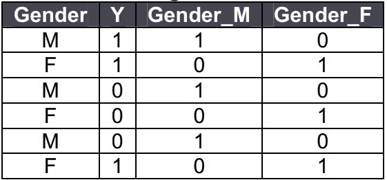

78。 **如何看待价值观缺失？**

> **删除缺少值的行**
> 
> DataFrame.dropna(axis=0，how='any '，inplace=True)
> 
> **删除列**
> 
> DataFrame.dropna(axis=1，how='any '，inplace=True)
> 
> **用零/平均值替换缺失值**
> 
> df['收入']。菲尔纳(0)
> 
> df['收入'] = df['收入']。菲尔娜((df['收入']。均值()))

79。 **如何对待离群值？**

> 四分位数间距用于识别异常值。
> 
> Q1 = df['收入']。分位数(0.25)
> 
> Q3 = df['收入']。分位数(0.75)
> 
> IQR = Q3 — Q1
> 
> df = df[(df['收入']> =(Q1–1.5 * IQR))&(df['收入'] <= (Q3 + 1.5 * IQR))]

**80。** **什么是偏差/方差权衡？**

> **定义**
> 
> 偏差-方差权衡与监督机器学习相关，特别是预测建模。这是一种通过分解预测误差来诊断算法性能的方法。
> 
> **偏差误差**
> 
> 偏差是模型的预期预测值和真实值之间的差异。
> 
> 这就是所谓的欠拟合。
> 
> 收集更多的数据点并没有改善。
> 
> **方差误差**
> 
> 方差是指算法对特定训练数据集的敏感度。
> 
> 这就是所谓的过度拟合。
> 
> 随着收集更多数据点而提高。