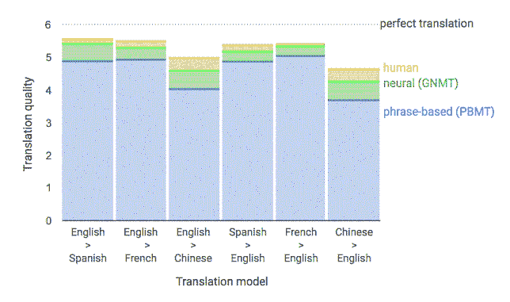
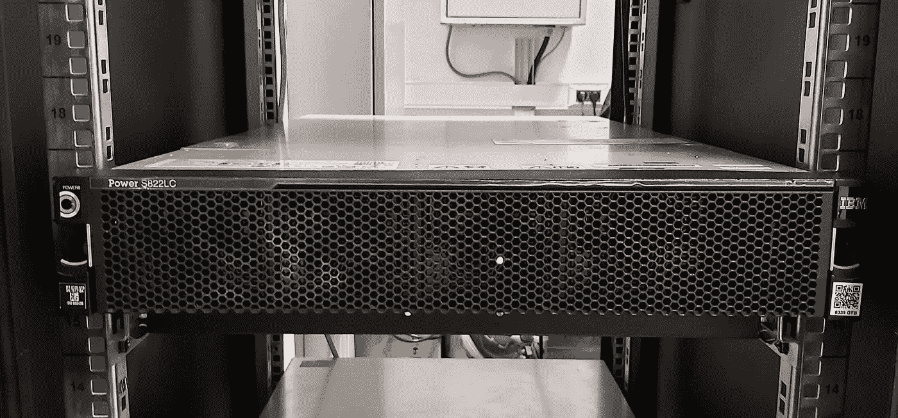
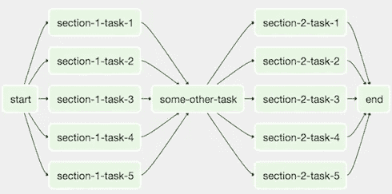

# 9 个常见的数据科学术语“∨”术语

> 原文：<https://medium.com/analytics-vidhya/9-common-data-science-terms-jargons-90212ea15d4e?source=collection_archive---------21----------------------->

## 常用数据科学术语词汇表

弗兰基·查马基在 [Unsplash](https://unsplash.com?utm_source=medium&utm_medium=referral) 上拍摄的照片

D 数据科学领域是一个快速扩展的增长空间，因为数据是一种资产，可以帮助企业做出更好的决策。对于每个领域，数据科学都有自己的行话，这意味着只有在某个领域的人才懂。在本文中，我想强调我们在现实生活中经常遇到的 9 个常见数据科学术语。

# 数据驱动的方法

第一个常见术语是数据驱动，这是一种重要的方法，通过数据而不是直觉或领域或个人专业知识来进步。如果你在一家咨询公司工作，你会接触到很多不同的行业和客户。大多数时候联系领域专家是困难的，因此，数据驱动的方法在这种情况下变得很重要。请注意，当你在 Linkedin 工作搜索中键入“数据驱动”时，你会看到全球超过 120，000 个结果。

视频:数据科学和大数据分析:做出数据驱动的决策

# 领域专业知识

第二个术语是领域专长或领域知识，即特定领域的专家。大多数情况下，他们是协助数据科学家使数据可以理解的重要人物。数据驱动的决策可能很耗时，但领域专家可以帮助数据科学家建立更准确的模型结果。

# 逐步改进

增量改进是通过持续改进达到显著累积影响的过程。谷歌的翻译程序就是一个很好的例子。这个程序使用了先进的人工智能技术。它于 2006 年推出。在项目的最初几年，它并不成功。但是，近几年来，它确实比老版本的程序好。另一个例子是反欺诈模型，这是增量改进模型的另一个好例子。

目前的准确性结果来自谷歌翻译。检索自:[https://ai . Google blog . com/2016/09/a-neural-network-for-machine . html](https://ai.googleblog.com/2016/09/a-neural-network-for-machine.html)

# 可解释性(白盒和黑盒)

可解释性是数据科学世界中的另一个重要术语，因为模型可解释性是机器学习中的最大问题之一，这在您创建模型时至关重要。传统方法简单且易于解释，如线性回归、逻辑回归和决策树。如果你正在研究高级机器或深度学习模型，这是一个很难解释的黑盒模型。

额外信息: SHAP、莱姆和 ELI5 是模型可解释性的流行框架。帮助提高模型的可解释性。

视频:PyData Tel Aviv Meetup:ML 可解释性的 SHAP 价值观— Adi Watzman

# CPU — GPU — TPU

当你处理海量数据和训练时，深度学习模型需要计算能力。因此，与 GPU 或 TPU 一起工作对于实现强大的模型性能起着重要的作用。

**CPU(中央处理器)**被称为每个根深蒂固的系统的大脑(【geeksforgeeks.org】T4)

**GPU(图形处理单元)**用于在电脑游戏中提供图像。GPU 比 CPU 的速度快，强调高吞吐量。”([geeksforgeeks.org](https://www.geeksforgeeks.org/))

**TPU(张量处理单元)**是谷歌定制开发的专用集成电路(ASICs)，用于加速机器学习工作负载。TPU 是从零开始设计的，受益于谷歌在机器学习方面的丰富经验和领先地位。”(cloud.google.com/tpu)。Kaggle 笔记本现在拥有 TPU 动力。[详细信息](https://www.kaggle.com/product-feedback/129828)

IBM S822LC 配 Nvidia Pascal GPU ( [详情链接](https://www.redbooks.ibm.com/redpapers/pdfs/redp5405.pdf))。我们*在*的一个项目中使用* IBM GPU 作为训练深度学习模型。*

# 规模

缩放是一个常用于数据科学的词，意思是“一组数字、数量等”。，用来衡量或比较某事物的水平”(剑桥词典)。特征缩放是一种统计方法，用于标准化数据的独立变量或特征的范围。在当前的一个项目中，我们使用 Dask 来并行化机器学习算法。Dask scales Python 的目标。

视频:与 Dask 一起扩展 PyData—Martin Durant 和 Jim Crist

# 部署

部署是一种方法，通过这种方法，您可以将机器学习模型集成到现有的生产环境中，以便开始使用它来基于数据做出实际的业务决策。这个地区的需求正在增长。最近出现了许多部署工具，如 Airflow、Kubeflow 和 Mlfow 是 ML 模型的流行开源部署工具。

视频:马特·戴维斯:气流实用介绍| PyData SF 2016

# 管道—工作流程

数据科学中的管道或工作流是清理、建模和解释步骤的序列，以使每个人都可以理解。在管道的帮助下，您可以减少生产中的开销并提高灵活性。下面的 PyData 视频解释了端到端的机器学习管道。

视频:Python 驱动的组织的端到端机器学习管道——尼克·哈维

高层管道示例。检索自:[https://airflow.apache.org/docs/1.10.2/concepts.html?高亮=触发](https://airflow.apache.org/docs/1.10.2/concepts.html?highlight=trigger)

# 最佳化

最后，优化广泛应用于数据科学领域。最优化的定义是充分利用一切。优化是数据科学中几乎所有机器学习和统计技术的核心。机器或深度学习模型有几个参数需要优化。例如，超参数优化或调整是一种为学习算法找到一组最佳超参数以提高模型准确性的技术。

视频:Dan Ryan:高效灵活的超参数优化| PyData 迈阿密 2019

# 摘要

在本文中，我试图解释您需要了解的 9 个常见数据科学术语。如果有不清楚的地方，请随时给我反馈或问我问题。我希望你喜欢读它。

我的第一篇文章是使用高斯混合模型为异常检测算法创建客户评分特性。[链接](/analytics-vidhya/creating-customer-scoring-feature-for-anomaly-detection-algorithms-using-gaussian-mixture-model-be00e0874c8b)

# G.附录

# G.1 .参考文献

 [## 生产规模的机器翻译神经网络

### 十年前，我们宣布推出谷歌翻译，并使用基于短语的机器翻译…

ai.googleblog.com](https://ai.googleblog.com/2016/09/a-neural-network-for-machine.html)  [## CPU 和 GPU 的区别——GeeksforGeeks

### 中央处理器(CPU):CPU 被认为是每个根深蒂固的系统的大脑。CPU 包括算术逻辑…

www.geeksforgeeks.org](https://www.geeksforgeeks.org/difference-between-cpu-and-gpu/)  [## 云张量处理单元(TPUs) |云 TPU |谷歌云

### 张量处理单元(TPU)是谷歌定制开发的专用集成电路(ASICs ),用于…

cloud.google.com](https://cloud.google.com/tpu/docs/tpus)  [## 剑桥英语词典中的 SCALE |含义

### 尺度定义:1。一组数字、数量等。，用来衡量或比较某事物的水平:2。的…

dictionary.cambridge.org](https://dictionary.cambridge.org/dictionary/english/scale)