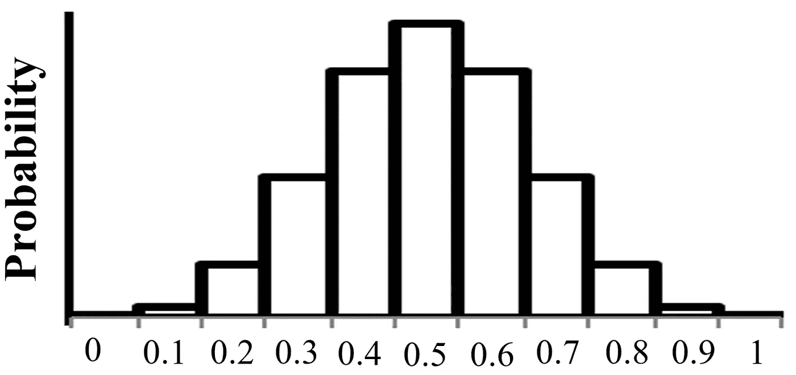

# 9 种带有均值和方差导数的常见概率分布

> 原文：<https://medium.com/analytics-vidhya/9-common-probability-distributions-with-mean-variance-derivations-ac353ba98490?source=collection_archive---------3----------------------->

> 我一直在寻找与各种概率分布相关的均值和方差公式的推导过程(就像你们很多人一样)。虽然，这样的派生词已经存在，但是是以一种分散的方式，所以我决定详细地浏览每一个派生词，并把我的解释集中起来，用每一个派生词的急需派生词来标注它们。当你读到这篇文章时，对随机变量概率分布及其均值和方差推导的端到端讨论的探索已经结束。

最后，在这篇博客中，你将会看到关于随机变量类型和它们不同类型的概率分布的详细结构，以及相关的例子。讨论的每个概率分布都有以下模式:

1.关于分布的特征

2.方程

3.带有示例的可视化表示(绘图)

4.均值和方差推导，以达到良好的公式填充

> 让我们开始吧！！！

我们将在两种数据类型的基础上讨论概率分布:

1.离散(随机变量)

2.连续的(随机变量)

(*图片作者*)

*   CMF 是累积质量函数，CDF 是累积密度函数
*   对于所有 x，0≤p(x)≤1**T5**

**离散随机变量:**

我们可以在计数(总和)或比例的基础上绘制概率图。例如

计数(总和)基准:

投掷硬币 10 次后，我们可以画出人头数的概率(0 个、1 个、2 个……10 个)

(*图片作者*)

比例基础:

投掷硬币 10 次后，我们可以画出正面比例的概率

(0/10 = 0, 1/10 = 0.1, 2/10 = 0.2 …………10/10 = 1)

(*图片作者*)

**连续随机变量:**

我们可以通过使用平滑的运行曲线连接大量频率仓的顶端(接近实际上是连续随机变量的实数值的∞点)来绘制概率分布。定义函数 f(x)的曲线值实际上只描述了特定点的高度，为了计算概率，我们需要计算曲线下的面积。

例如，基于实数频率:

绘制男性人口的身高变量。本例的假设范围为[150 厘米，200 厘米]，包含所有真实值，即 155.58 厘米，176.2 厘米等。

(*作者图片*)

为了计算结果的概率(真实值)，我们使用积分的概念:

值位于 x1 和 x2 之间的概率:

> 我希望现在你对离散和连续随机变量的概率表示已经有了清晰的认识。让我们来看看概率分布的类型:

**1。** **离散概率分布**

伯努利分布、二项式分布、几何分布、负二项式分布、超几何分布、泊松分布

**2。** **连续概率分布**

均匀分布、正态(高斯)分布、指数分布

> **离散概率分布**

# **伯努利分布:**

**特性—**

1.单一事件/审判

2.两种可能的结果——成功或失败(互斥且详尽)

3.p(成功)= p

4.p(故障)= 1- p

如果上述所有特征对 X 随机变量成立，那么它具有伯努利分布。

(*图片作者*)

# **二项分布:**

**功能—**

1.独立事件/审判

2.两种可能的结果——成功或失败(互斥且详尽)

3.p(成功)= p

4.p(故障)= 1- p

5.x 代表 n 次试验/事件的成功次数

如果上述所有特征对 X 随机变量成立，那么它具有二项分布。

(*作者图片*)

# **几何分布:**

**特色—**

1.独立事件/审判

2.两种可能的结果——成功或失败(互斥且详尽)

3.p(成功)= p

4.p(故障)= 1- p

5.x 代表获得第一次成功所需的试验次数

所以第 x 次试验的第一次成功是:

-第一次(x-1 次)试验必须失败

-第 x 次试验必须成功

P(X = x) = (1-p) x-1.p 对于 x = 1，2，3，……..

对于所有 x，σp(x)= 1。

(*图片作者*)

# **负二项分布:**

**功能—**

1.独立事件/审判

2.两种可能的结果——成功或失败(互斥且详尽)

3.p(成功)= p

4.p(故障)= 1- p

5.x 代表获得 rth 成功所需的试验次数

因此，为了在第 x 次试验中获得第 r 次成功:

*   第一次(x-1)试验必须有(r-1)次成功
*   第十次试验必须成功

# **超几何分布:**

**特性—**

1.事件是相关的(无替换的随机抽样)

2.从包含“a”次成功和“N-a”次失败的总体中随机抽取 N 个对象，不进行替换

3.x 代表样本中成功的次数

4.当抽样不超过总人口的 5%时，二项式分布提供了超几何分布的合理近似

(*图片作者*)

# **泊松分布:**

**特性—**

1.计数在给定的时间、距离、面积或体积单位内某一事件发生的次数

2.事件独立发生，在给定时间内发生的概率不会随时间而改变

3.x 代表固定时间单位内的事件数量

4.当 n ->∞时，二项分布趋向于泊松分布

，p -> 0，np 保持不变

(*图片作者*)

> **连续概率分布**

# **均匀分布:**

**特性—**

1.出现概率相等的实数输出(连续)

2.使用积分确定概率(曲线下面积)

(*图片作者*)

# **正态(高斯)分布:**

**功能—**

1.在偶然原因的影响下，出现概率不等(钟形)的实数输出(连续)

2.使用积分确定概率(曲线下面积)

(*作者图片*)

# **指数分布:**

**功能—**

1.泊松分布的逆

2.测量单个事件的时间(泊松过程中事件之间的时间)

3.事件以恒定的速率独立发生

4.x 代表连续事件发生所需的时间

我希望这篇博客对你有用，帮助你探索臭名昭著的概率分布公式的起源。我的博客到此结束，以后我会发布更多的内容…..

谢谢！！！