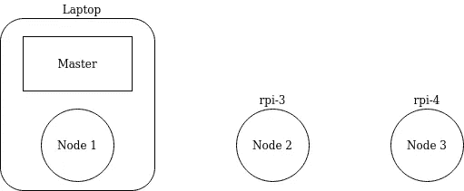
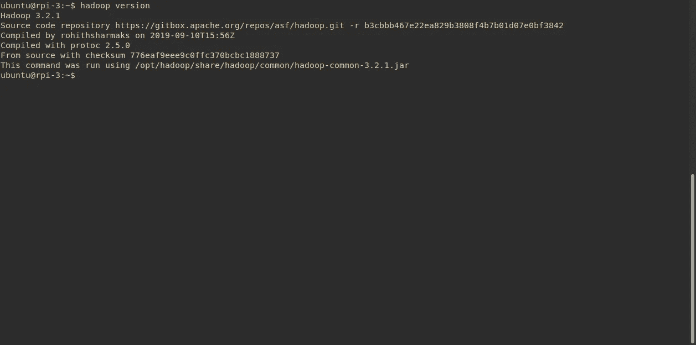
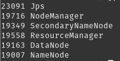

# 我第一次设置 Hadoop/Spark 集群时遇到的 9 个问题

> 原文：<https://medium.com/analytics-vidhya/9-issues-ive-encountered-when-setting-up-a-hadoop-spark-cluster-for-the-first-time-87b023624a43?source=collection_archive---------17----------------------->


[南安](https://unsplash.com/@bepnamanh?utm_source=medium&utm_medium=referral)在 [Unsplash](https://unsplash.com?utm_source=medium&utm_medium=referral) 拍摄的照片

在[之前的文章](/analytics-vidhya/how-i-set-up-my-first-hadoop-spark-cluster-preparation-663893486d12)中，我们已经讨论了如何准备 Hadoop/Spark 集群的设置。现在，准备集群只是开始。虽然有很多关于在集群上设置 Hadoop 的资源，但作为一个初学者，我发现它有时会令人困惑，我花了十几个小时才把它们全部组装起来。因此，在本文中，我将记录在设置 Hadoop/Spark 集群时遇到的问题以及如何解决它们。如果你想自己尝试一下，请查看我跟随的教程来设置这一切，这是我全心全意推荐的。

现在，为了让您了解一些背景，我的设置是由一台笔记本电脑(它将充当名称节点和数据节点)和另外两个数据节点 Raspberry Pis 组成的，如下所示:



注意，我将运行 Spark 2.4.5 和 Hadoop 3.2.1。

因此，我们已经将 hadoop 下载、解包并移动到/opt/hadoop。

让我们试着启动它

```
hadoop version
```

哎呀！

# JAVA_HOME_NOT_SET

首先，请检查你是否安装了 Java。如果你喜欢 Spark，请记住当前稳定的 Spark 版本与 Java 11 不兼容。

```
sudo apt install openjdk-8-jre-headless -y
```

然后，让我们看看环境变量。教程(为 Raspbian 构建)建议将这个环境变量设置为类似

```
export JAVA_HOME=$(readlink –f /usr/bin/java | sed "s:bin/java::")
```

然而下面的[灵感来自这里](https://stackoverflow.com/questions/14325594/working-with-hadoop-localhost-error-java-home-is-not-set/14462600#14462600)，让它为我工作(在 Ubuntu 上):

```
export JAVA_HOME=/usr/lib/jvm/java-1.8.0-openjdk-amd64
```

还请注意我已经添加到*中的环境变量。bashrc* :

```
export JAVA_HOME=/usr/lib/jvm/java-1.8.0-openjdk-arm64
export HADOOP_HOME=/opt/hadoop
export PATH=$PATH:$HADOOP_HOME/bin:$HADOOP_HOME/sbin
export HADOOP_CONF_DIR=$HADOOP_HOME/etc/hadoop
```

此外，我们需要将上面的 JAVA_HOME 添加到*/opt/Hadoop/etc/Hadoop/Hadoop-env . sh .*

现在让我们再试一次:

```
hadoop version
```



作品！向前看。

# `Permission denied (publickey,password).`

因此，一切都准备好脱离 Hadoop 集群。唯一的问题是跑步的时候

```
start-dfs.sh && start-yarn.sh
```

我一直收到以下错误:

```
localhost: Permission denied (publickey,password).
```

事实证明，这里发生了很多事情。首先，如果我的用户与从属节点上的用户名不同，那么我的 SSH 验证就会失败。为了解决这个问题，在主服务器上，[我必须在 ***建立一个配置文件***](https://stackoverflow.com/questions/51822209/hadoop-cluster-hadoop-user-ssh-communication/51830400#51830400)~/。ssh/config 如下:

```
Host rpi-3
HostName rpi-3
User ubuntu
IdentityFile ~/.ssh/id_rsaHost rpi-4
HostName rpi-4
User ubuntu
IdentityFile ~/.ssh/id_rsa
```

这清楚地表明了在使用 SSH 连接时我想要使用的用户。

但这还不是全部。然而更重要的是，我需要先用 SSH 进入本地主机，这样才能运行 start-dfs.sh 和 start-yarn。向前看。

# Hadoop 集群设置—Java . net . connect 异常:连接被拒绝

我们列表中的下一个错误花了我一个晚上去调试。所以当我试图用`start-dfs.sh` 启动集群时，我收到了一个连接被拒绝的错误。首先，不用想太多，我已经遵循了[这里](https://stackoverflow.com/questions/28661285/hadoop-cluster-setup-java-net-connectexception-connection-refused/33553214#33553214)的建议，将默认服务器设置为 0.0.0.0。

正确的答案实际上是将它设置为我的名称节点服务器的地址(在 **core-site.xml** 中)my，并确保在 **/etc/hosts** 中没有将它与 127.0.0.1 或 localhost 绑定的条目。Hadoop 不喜欢这样，我已经被警告过了。


# 未显示的节点

在多节点设置中，一些节点缺失可能是由多种原因造成的。错误的配置、环境差异甚至防火墙都可能导致问题。这里有几个如何理解它的技巧。

## 首先检查用户界面

在典型的 Hadoop 堆栈中有许多 web 接口。其中两个是在端口 8088 上公开的 Yarn UI 和在端口 9870 上公开的名称节点信息 UI。在我的例子中，我在 HDFS 有一个不同数量的节点，这让我调查并找到我的纱线设置的问题。

## 使用 jps 查看服务是否正在运行

Jps 是一个 Java 工具，但是您可以使用它来查看特定机器上运行了哪些 Hadoop 服务。



给定节点上的 DataNode 是否已启动？让我们继续前进。

## 深入了解 hadoop 日志

Hadoop 日志位于 logs 子文件夹中，所以在我的例子中是/opt/hadoop/logs。看不到特定的数据节点？Ssh 进入该机器，并分析该特定服务的日志。

## 检查配置文件

这是最可能产生问题的地方。查看日志，记录正确的配置并应用它们。配置文件位于 */opt/hadoop/etc/hadoop* 中。从与您试图调试的服务相对应的文件开始。

好了，我们现在对 Hadoop 还是比较满意的。火花呢？我已经下载了 Spark(没有 Hadoop)并且解包了。现在怎么办？一帆风顺？没那么快。

# 火花无法启动

如果你下载了 Spark standalone，你很可能会遇到和我一样的问题，所以一定要在`conf/spark-env.sh`中添加以下内容

```
export SPARK_DIST_CLASSPATH=$(/path/to/hadoop/bin/hadoop classpath)
```

该解决方案的积分在这里[到](https://stackoverflow.com/questions/42307471/spark-without-hadoop-failed-to-launch/42689980#42689980)。

# Pyspark 错误—不支持的类文件主要版本 55

说真的，我在上面已经警告过你，目前稳定的 Spark 版本只兼容 Java 8。[关于那个](https://stackoverflow.com/questions/53583199/pyspark-error-unsupported-class-file-major-version-55/53583241#53583241)的更多细节。

# Java . lang . numberformatexception:对于输入字符串:“0x100”

接下来，在启动 *spark-shell* 时，您会看到这条无害但恼人的消息，可以通过向**添加一个环境变量来轻松修复。bashrc** 。

```
export TERM=xterm-color
```

点击阅读更多信息[。](https://stackoverflow.com/questions/56457685/how-to-fix-the-sbt-crash-java-lang-numberformatexception-for-input-string-0x/56457806#56457806)

# **Spark UI 坏了 CSS**

当启动 spark-shell 或提交 spark 作业时，在 namenode 上的端口 4040 处提供 Spark 上下文 Web UI。在我的例子中，问题是 UI 有一个破损的界面，这使得使用它变得不可能。


斯达克弗洛又一次成了我的朋友。要对此进行排序，需要启动 spark-shell 并运行以下命令:

```
sys.props.update("spark.ui.proxyBase", "")
```

此处归功于解决方案[。](https://stackoverflow.com/questions/47875064/spark-ui-appears-with-wrong-format-broken-css/55466574#55466574)

# 属性火花.纱线.罐子

当在纱线簇上以簇模式运行 Spark 时，Spark。jar 类需要被运送到没有安装 Spark 的其他节点。也许我花了更多的时间来整理它，但是在我的情况下，解决方案是将它上传到 HDFS 内部的一个位置，并让节点在需要时从那里获取它。

创建归档:

`jar cv0f spark-libs.jar -C $SPARK_HOME/jars/ .`

上传到 HDFS

`hdfs dfs -put spark-libs.jar /some/path/`

然后，在 *spark-defaults.conf* 中设置

```
spark.yarn.archive      hdfs://your-name-node:9000/spark-libs.jar
```

此处归功于解决方案和解释[。](https://stackoverflow.com/questions/41112801/property-spark-yarn-jars-how-to-deal-with-it)

# 结论

以上总结了我们作为初学者在设置 Hadoop 和 Spark 时遇到的一些错误。我们将尝试一下我们的集群，对其进行测试，并在以后的文章中报告。感谢阅读，敬请关注！