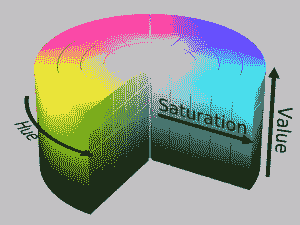

# 在 Python 中使用 skimage 处理图像数据的 9 个强大技巧

> 原文：<https://medium.com/analytics-vidhya/9-powerful-tricks-for-working-with-image-data-using-skimage-in-python-a84c3656663d?source=collection_archive---------7----------------------->

了解什么是 skimage 和它是如何工作的，以及 8 个强大的 skimage 技巧，让你成为计算机视觉专家。从这里开始学习 Python。

听到“图像预处理”，你首先想到的是什么？当我向一群数据科学爱好者提出这个问题时，他们投来了几个探询的目光。如果你想知道这是什么，请继续阅读！

我们非常熟悉结构化(表格)数据的预处理步骤。你发现并插入任何丢失的值，检测并处理异常值，等等。这有助于我们建立更好、更健壮的机器学习模型。但是，当我们处理图像数据时，这是如何工作的呢？

事实证明，预处理步骤是计算机视觉(图像、视频等)领域中至关重要的一步。skimage 是 scikit-learn 家族的一部分，是一个非常有用的库，可以帮助我们开始学习。


在本文中，我们将使用 Python 中的 skimage 来研究一些简单而强大的图像预处理技术。这是你计算机视觉之旅的一个好的起点，快乐学习吧！

*如果计算机视觉是你的职业选择，或者你想了解更多关于如何处理图像、构建物体检测模型等等，请查看以下课程:*

*   [*使用深度学习的计算机视觉*](https://courses.analyticsvidhya.com/courses/computer-vision-using-deep-learning-version2?utm_source=blog&utm_medium=8-powerful-tricks-for-working-image-data-skimage-python)

# 目录

1.  什么是 skimage，我们为什么要使用它？
2.  使用 skimage 在 Python 中读取图像
3.  更改图像格式
4.  调整图像大小
5.  高/低比例图像
6.  旋转不同的角度
7.  水平和垂直翻转
8.  图像裁剪
9.  改变图像亮度
10.  使用过滤器

# 什么是 skimage，我们为什么要使用它？

Python 中有多个库和框架可以让我们处理图像数据。那么我们为什么要使用 skimage 呢？这是一个公平的问题，所以在我们深入研究这篇文章之前，让我先回答一下。

> Scikit-image，或 skimage，是一个为图像预处理而设计的开源 Python 包。

如果你以前使用过 sklearn，那么开始使用 skimage 将是小菜一碟。即使您对 Python 完全陌生，skimage 也很容易学习和使用。

我真正喜欢 skimage 的是，它有一个结构良好的文档，列出了 skimage 中提供的所有模块、子模块和功能。下面是 skimage 包中所有子模块和函数的列表: [API 引用](https://scikit-image.org/docs/stable/api/api.html)。

# 1.使用 skimage 在 Python 中读取图像

让我们从基础开始。第一步是学习如何使用 skimage 在 Python 中导入图像。

一幅图像是由多个称为像素的小方块组成的。我下面展示的图片就是一个很好的例子。你在这里看到的小方块是像素:


我们可以看到，该图像沿垂直线有 22 个像素，水平方向有 16 个像素。因此，这个图像的大小应该是 22 x 16。

当我们使用 scikit-image(或任何其他包)读取或加载图像时，我们看到图像以数字的形式存储。这些数字被称为像素值，它们代表图像中每个像素的亮度。

# 从 skimage 加载图像

在 scikit-image 包中，*数据*模块中提供了几个样本图像。假设我们想要加载一个图像来执行一些实验。我们可以简单地加载包中提供的一个图像，而不是使用外部图像！

下面是实现这一点的 Python 代码:

```
from skimage.io import imread, imshow                       
from skimage import data                                               image = data.astronaut()                       
imshow(image)
```


注意，我在这里使用了 *imshow* 函数来查看笔记本中的图像。简单吧？

如果您想从您的机器而不是软件包中提供的加载一个映像，该怎么办？我相信这是你最终想要做的。为此，我们可以使用 *skimage* 中的 *imread* 函数。

我们可以阅读两种格式的图像——彩色和灰度。我们将看到这两者的实际应用，并理解它们的不同之处。

# 使用 skimage 从我们的系统中读取图像

*imread* 函数有一个参数“*as _ gray”*，用于指定图像是否必须转换为灰度图像。我们将从读取灰度格式的图像开始，将参数设置为 true:

```
from skimage.io import imread, imshow 
import matplotlib.pyplot as plt 
%matplotlib inline 
image_gray = imread(‘images.jpeg’, as_gray=True) imshow(image_gray)
```


我们可以使用 *imshow* 功能轻松查看图像。但是图像真的是这样存储的吗？让我们检查一下变量 *image_gray* 中的内容:

```
image_gray = imread(‘images.jpeg’, as_gray=True) print(image_gray.shape) 
print(image_gray)(258, 195)
[[0.73586314 0.77115725 0.7907651  ... 0.11822745 0.11822745 0.11430588]
 [0.65743176 0.70056902 0.72017686 ... 0.11822745 0.11430588 0.11430588]
 [0.41401176 0.45714902 0.48067843 ... 0.11430588 0.11430588 0.11038431]
 ...
 [0.73491725 0.73491725 0.73491725 ... 0.42055725 0.42055725 0.42055725]
 [0.72594314 0.72986471 0.72986471 ... 0.41750667 0.41750667 0.41750667]
 [0.72594314 0.72986471 0.72986471 ... 0.41750667 0.41750667 0.41750667]]
```

变量以数字矩阵的形式存储图像。如你所见，矩阵的形状是 259 x 195。这些数字被称为像素值，它们表示图像中像素的强度。

现在，我们将加载原始颜色格式的图像。为此，我们必须将参数*‘as _ gray’*设置为假:

```
from skimage.io import imread, imshow                       
import matplotlib.pyplot as plt                       
%matplotlib inline                                               image_color = imread('images.jpeg', as_gray=False)                       print(image_color.shape)                       
imshow(image_color)(258, 195, 3)
```


不错！我们这里有同样的彩色图片。现在您可能想知道这两者之间有什么区别，应该使用哪种格式？好问题——让我们一个一个地回答。

你注意到这种情况下图像的形状了吗？它是(258，195，3)，而之前的形状是(258，195)。**这里的三维表示图像中通道的数量。**对于彩色图像，最流行的图像存储格式是 RGB(红绿蓝)。

但是我们应该使用哪种格式呢？与灰度图像相比，彩色图像具有更多的信息，但是图像的尺寸非常大。RGB 的像素数量多了 3 倍。当我们受到低计算能力的限制时，这可能会带来相当大的挑战。

> ***因此，灰度图像常被用来降低计算复杂度。*** *所以如果你的数据集非常大，你可以选择灰度而不是彩色。*

# 2.更改图像格式

在上一节中，我们讨论了加载图像的两种重要格式——RGB 和灰度。在这一节中，我们将学习如何将图像从一种格式转换成另一种格式。首先，我们将读取 RGB 格式的图像，并将其转换为灰度格式。我们这里要用的函数是*RGB 2 gray*—

```
from skimage.color import rgb2gray                       
img = imread('images.jpeg')                       
img_new = rgb2gray(img)                            

plt.subplot(121), imshow(img)                       
plt.title('RGB Format')                                                plt.subplot(122), imshow(img_new)                       plt.title('Grayscale Format')                                                plt.show()
```


另外两种流行的格式是 HSV ( **色调、饱和度、值**)和 HSL ( **色调、饱和度、亮度**)，它们是 RGB 格式的替代表示。让我简单解释一下这些术语的含义。

*   色调是色轮上的度数，其中 0 代表红色，120 代表绿色，240 代表蓝色，360 代表红色。
*   饱和度表示该颜色的百分比，其中 0 表示白色，100 表示全色。
*   值表示颜色与不同数量的黑色或白色颜料的混合。
*   明度是显示图像阴影的另一种方式，其中 0 表示黑色，1 表示白色。

下图会让你的理解更加清晰-



来源:维基百科


来源:维基百科

将图像转换为这些格式中的任何一种，都与我们将图像转换为灰度格式是一样的。我们可以用函数 *rgb2hsl* 和 *rgb2hsv* 分别转换成 hsl 和 hsv 格式。这里我演示了图像到 HSV 格式的转换。

```
from skimage.color import rgb2hsv                       
img = imread('images.jpeg')                       
img_new = rgb2hsv(img) plt.subplot(121), imshow(img)                       
plt.title('RGB Format')                                                plt.subplot(122), imshow(img_new)                       plt.title('HSV Format')                                                plt.show()
```


# 3.使用浏览调整图像大小

计算机视觉面临的最大挑战之一是，我们需要大量数据来训练我们的模型。我们收集的数据通常来自不同的来源，这可能会导致图像大小的变化。在从影像中提取特征或使用这些特征进行数据扩充时，这可能是一个问题。

理想情况下，当我们构建模型时，图像的大小应该是相同的。如果我们使用的是[预训练模型](https://www.analyticsvidhya.com/blog/2018/07/top-10-pretrained-models-get-started-deep-learning-part-1-computer-vision/?utm_source=blog&utm_medium=8-powerful-tricks-for-working-image-data-skimage-python)，重要的是要调整输入数据的大小，并将其标准化为与网络最初训练时相同的格式。这就是为什么调整图像大小是一个重要的图像预处理步骤。

这里，我们将使用 skimage 中的 *resize* 函数。该函数的输入将是我们想要更新的图像和新图像所需的尺寸:

```
from skimage.transform import resize                       
img = imread('images.jpeg') #resize image                      
img_resized = resize(img, (300, 300)) #plot images                       
plt.subplot(121), imshow(img)                       plt.title('Original Image')                       plt.subplot(122), imshow(img_resized)                       plt.title('Resized Image')plt.show()
```


# 4.使用 skimage 重新缩放(放大/缩小)图像

重新缩放图像是另一种常见的计算机视觉技术。这意味着按特定因子缩放图像。例如，将每个图像的尺寸缩小一半(缩小)或增加两倍(放大)。

你可能会说我们可以简单地使用 resize 函数来完成这个任务，这有什么区别呢？

如果所有图像的原始尺寸都相同，比如说(300，300)，我们可以直接使用*调整*功能，并指定所需的尺寸(150，150)。**但是如果图像的大小不同(如下图所示)，则不能使用调整大小功能。**这是因为每个图像的“一半”会有所不同。


这是你在计算机视觉之旅中会遇到很多的用例。

所以在这里，我们可以使用 *rescale* 函数并指定缩放因子。基于图像的原始大小，所有图像都将按此因子进行缩放。这里有一个例子:

```
from skimage.transform import rescale                       
img = imread('images.jpeg')                       
img_rescaled = rescale(img, scale=(0.5, 0.5)) plt.subplot(121), imshow(img)                       plt.title('Original Image')                                               plt.subplot(122), imshow(img_rescaled)                       plt.title('Rescaled Image')
plt.show()
```


# 5.使用浏览将图像旋转不同的角度

到目前为止，我们已经看到了图像的大小调整和缩放。让我们把注意力转移到如何改变图像的方向上来。但是在我们深入研究之前，我们应该首先讨论为什么我们需要改变图像方向。

考虑下面的图片。第一个图像稍微倾斜(这可能是由于相机的方向)。


为了解决这个方向问题，我们需要将图像旋转一定的角度。我们可以使用 skimage 的*旋转*功能，并指定图像需要旋转的角度:

```
from skimage.transform import rotate                       
image = imread('tilt_image.png')                                               image_rotated = rotate(image, angle=45) 
imshow(image_rotated)
```


这看起来棒极了！方向问题都解决了。但是如果你仔细看，照片的边角被裁剪了。这是因为，在旋转过程中，图像的大小保持不变，导致拐角周围的区域被裁剪。

在这种情况下，我们不会丢失任何重要信息，但情况可能并不总是如此。该障碍由*旋转*功能中的*调整*参数处理(默认情况下，该参数值为假):

```
from skimage.transform import rotate                       
image = imread('tilt_image.png')                                               image_rotated = rotate(image, angle=45, resize=True)imshow(image_rotated)
```


我们也可以使用旋转概念来扩充数据。对于那些不熟悉这个术语的人来说，**数据扩充是一种使用可用数据生成更多样本来训练模型的技术。**

假设您正在构建一个[图像分类模型](https://www.analyticsvidhya.com/blog/2019/01/build-image-classification-model-10-minutes/?utm_source=blog&utm_medium=8-powerful-tricks-for-working-image-data-skimage-python)来识别猫和狗的图像。看看下面显示的示例图像。左边的图像将被分类为“狗”,而右边的图像将被分类为“猫”:


我们在这里改变了什么？我们简单地将图像旋转了 180 度，生成了新的图像。想想看，只需针对现有数据中的每个图像添加一个新图像，就可以使训练数据的大小翻倍！

# 6.水平和垂直翻转图像

我们可以水平和垂直翻转图像。这将创建一个沿水平/垂直轴的镜像。我们可以将这种技术用于图像预处理和图像增强。

虽然在 skimage 中没有直接的函数，但是我们可以使用 NumPy 来执行这个任务。

> NumPy 提供函数 **flipud** 和 **fliplr** ，分别用于在水平轴和垂直轴上翻转图像。

该函数的内部工作非常简单。对于水平翻转，行保持不变，而列中的条目被保留。让我们以同样的猫/狗为例，对其使用翻转功能:

```
from numpy import fliplr, flipud                       
dog = imread('Puppy.jpg')                       
cat = imread('whiskers.jpg') dog_flip = fliplr(dog)                       
cat_flip = fliplr(cat) plt.subplot(141), imshow(dog)                       plt.subplot(142), imshow(dog_flip)                       plt.subplot(143), imshow(cat)                       plt.subplot(144), imshow(cat_flip)
plt.show()
```


看起来不错！

# 7.裁剪图像

你一定无数次使用过手机的裁剪功能。我经常这么做！

您也可以使用 skimage 在 Python 笔记本中裁剪图像。我们裁剪图像以去除图像中不想要的部分，或者聚焦于图像的特定部分。

假设我们有一场篮球赛的下图(左图)。在目前的形式下，图像的形状是 1067 x 1600。现在，我想删除图像的所有 4 个方面的 100 个像素。这意味着我们从图像的顶部、底部、左侧和右侧移除 100 个像素，从而聚焦于中心的物体:


有两种方法可以实现这一点:

*   首先，**简单地指定你想要的新图像形状**。对于本例，它将是图像[100:967，100:1500]。这对于单个图像来说很好。如果我们有多个图像呢？我们将不得不提到每一个图像的新图像形状(不理想)。
*   另一种方式可以是**使用当前图像** **形状**计算裁剪的图像尺寸，这可以使用命令 *image.shape* 来确定。因此，新图像的高度将是[*100:img . shape[0]-100]*，宽度将是[*100:img . shape[1]-100]。*

因此，让我们使用第二种方法裁剪上面的图像:

```
image = imread('warriors.jpg')                                               # selecting part of the image only                        
cropped = image[100:(img.shape[0]-100),100:(img.shape[1]-100)]  

plt.subplot(121), imshow(image)                       plt.title('Original Image')                       plt.subplot(122),imshow(cropped)                       plt.title('Cropped Image')
plt.show()
```


# 8.使用浏览改变图像亮度

你多久会摆弄一次在光线不好的情况下拍摄的照片的亮度？尽管最近相机的功能有所进步，弱光成像仍然是一个令人头痛的问题。斯金奇会帮我们解决的。

> 不同亮度的图像可以用来使我们的计算机视觉模型对光照条件的变化具有鲁棒性。

这对于户外照明系统非常重要，例如交通信号上的闭路电视摄像机。

可以使用 skimage 中的 *adjust_gamma* 功能改变图像的亮度，该功能使用了一种叫做 **gamma correlation 的方法。**对于任何给定的图像，像素值首先在 0-1 之间归一化，然后乘以指定的伽马值。产生的像素值被缩放回 0-255 的范围。

对于大于 1 的 gamma，输出图像将比输入图像暗。而对于小于 1 的伽马，输出图像将比输入图像更亮。

```
from skimage import exposure                                               #adjusting brightness                       
image = imread('images.jpeg')                       
image_bright = exposure.adjust_gamma(image, gamma=0.5,gain=1)                       image_dark = exposure.adjust_gamma(image, gamma=1.5,gain=1) # plotting images                       
plt.subplot(131), imshow(image)                       plt.title('Original Image')                                               plt.subplot(132),imshow(image_bright)                       plt.title('Bright Image')                                               plt.subplot(133),imshow(image_dark)                       plt.title('Dark Image')
plt.show()
```


# 9.在浏览中使用过滤器

我们可以使用滤镜来修改或增强图像的特征。如果你曾经在社交媒体平台上摆弄过图片，你会对滤镜非常熟悉。

我们可以出于各种目的使用过滤器，例如平滑和锐化图像、去除噪声、突出图像中的特征和边缘等。

当我们对图像应用滤镜时，每个像素值都会被使用周围像素值生成的新值所替换。最简单的滤波器是*中值滤波器，*用相邻像素的中值替换像素值。

```
from skimage.filters import median                                               image = imread('images.jpeg', as_gray=True)                       image_median = median(image) # plotting images                       
plt.subplot(121), imshow(image)                       plt.title('Original Image')                                               plt.subplot(122),imshow(image_median)                       plt.title('Smooth Image')
plt.show()
```


另一个流行的过滤器是索贝尔过滤器。当我们想要突出图像的边缘时，我们使用这个。如果你想详细了解滤镜的工作原理，可以参考这篇文章。

*   [3 种使用 Python 从图像数据中提取特征的初学者友好技术](https://www.analyticsvidhya.com/blog/2019/08/3-techniques-extract-features-from-image-data-machine-learning-python/)

```
from skimage.filters import sobel_h                                               image = imread('images.jpeg', as_gray=True)                       image_sobelh = sobel_h(image) # plotting images                       
plt.subplot(121), imshow(image)                       plt.title('Original Image')                                               plt.subplot(122),imshow(image_sobelh, cmap = True)                       plt.title('Horizontal Edge')
plt.show()
```


# 结束注释

恭喜你迈出了计算机视觉的第一步！起初，这可能看起来是一个令人畏惧的领域，但如果你有一个结构化的思维模式，并对机器学习算法的工作方式有很好的理解，你将很快学会处理图像和视频数据的细微差别。

我们还可以使用 skimage 做其他事情，比如从图像中提取边缘，或者给图像添加噪声，等等。我想让你们先从这两个开始，用 Python 来尝试一下。你就是这样学习新概念的！

正如我在文章开头提到的，你应该看看我们关于计算机视觉的综合课程:

*   [使用深度学习的计算机视觉](https://courses.analyticsvidhya.com/courses/computer-vision-using-deep-learning-version2?utm_source=blog&utm_medium=8-powerful-tricks-for-working-image-data-skimage-python)

我期待听到您对本文的想法和反馈。请在下面的评论区与我联系！

*原载于 2019 年 9 月 16 日*[*【www.analyticsvidhya.com】*](https://www.analyticsvidhya.com/blog/2019/09/9-powerful-tricks-for-working-image-data-skimage-python/)*。*