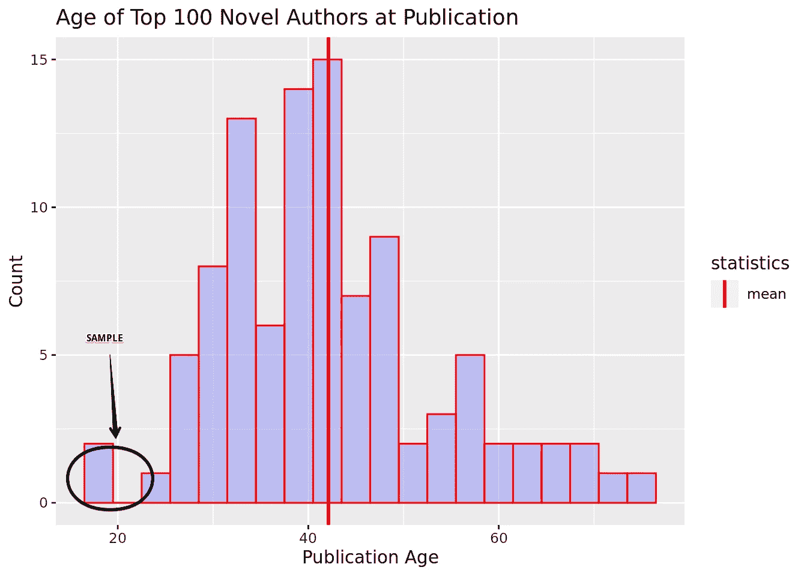
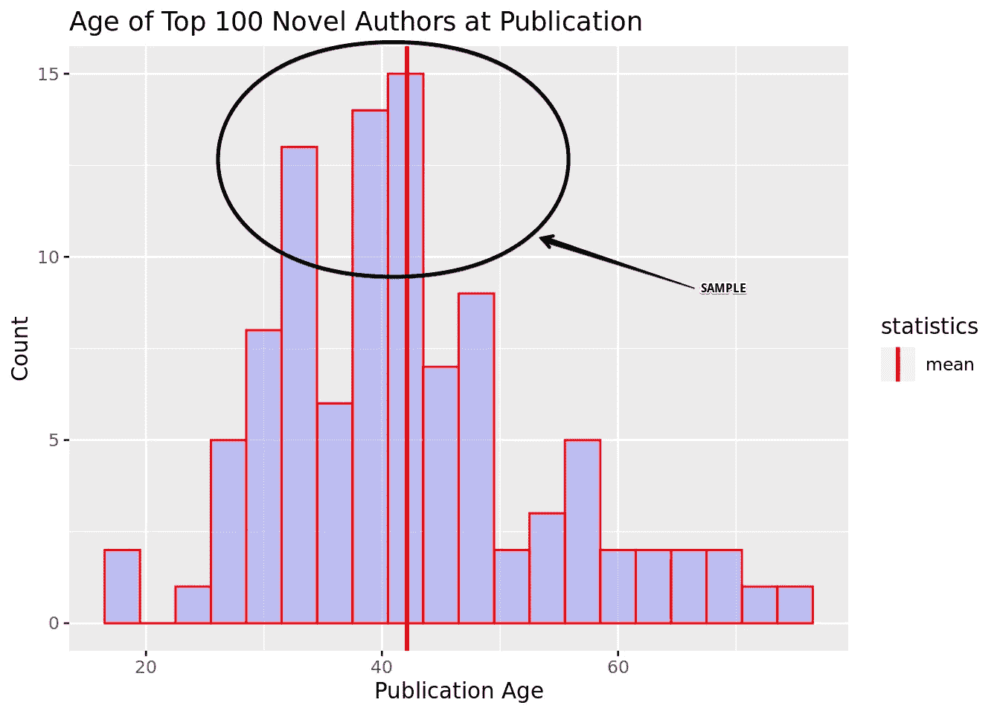
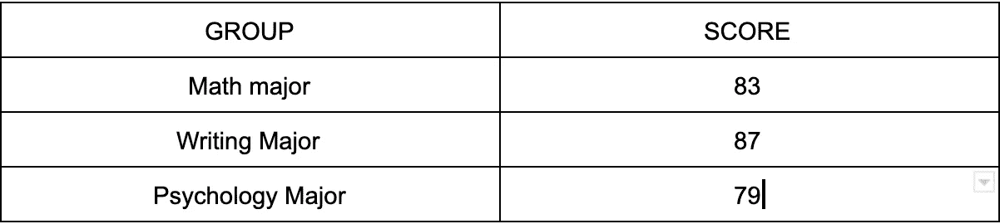

# 用 R 解释 A/B 假设检验

> 原文：<https://medium.com/analytics-vidhya/a-b-hypothesis-testing-explained-using-r-a44252f47149?source=collection_archive---------6----------------------->

## 样本、假说、P 值、显著性、误差和测试

## 序幕

在上一篇[文章](/@marco_17979/8-descriptive-statistics-concepts-explained-using-r-8e0d28115fcd)中，我谈到了对你的数据使用描述性统计的重要性。

如果你没有读上一篇文章，我强烈建议你去读。

以上讲解了 8 个著名的描述性统计概念，**本文中有些是想当然的，不再赘述**。

希望你仅仅通过看实际例子就能学到很多东西。

如果你用 R 自己做，你会学得更快。

现在，让我们深入第二篇文章。

听说过 CRO 吗？

它代表转化率优化，是当今数字营销的一个分支。

它基于这样一种假设，即你的网站可能会表现得更好，并就此采取行动。

CRO 顾问调整按钮、产品信息、文案、设计等等来增加你的转化率。

如果你是一个数学极客，你想先睹为快进入 CRO 世界，这篇文章是给你的。

如果您是 CRO 的顾问，并且想知道如何使用 R 进行简单的 A/B 测试，那么这篇文章就是为您准备的。

如果你只是好奇，想学习，这篇文章也适合你。

我们将使用 R 来解释 A/B 测试的基本概念:

*   抽样、样本大小和总体
*   假设创建和零假设
*   第一类和第二类错误
*   p 值和显著性水平
*   置信水平和能力
*   一个样本 T 检验和多个 T 检验
*   多重 T 检验问题和方差分析

## A/B 假设检验对你有什么帮助？

假设你在一家电子商务网站工作，你想了解 UX 最近的重新设计是如何影响你的用户参与度或购买率的。

你还不知道这是积极的还是消极的，但你手头有很多数据。

这就是假设检验发挥作用的地方。

它会帮助你评估这种变化是真实而持久的，还是只是一种随机波动。

假设检验为您提供了一个框架，您可以重复使用该框架根据数据做出明智的决策。

你的测试结果越好，你的*信心水平*就越高，说明改变你的网站是一个好的选择。

我们稍后会谈到这一点。

## 抽样、样本大小和总体

在进行测试之前，我们需要了解基本概念。

在统计学中，样本是原始总体的一部分。

我们为什么要这样做？

想想吧。

你想知道美国男性的平均身高是多少。

你能测量我们所有人吗？

你可以，但是效率不高:会花掉你好几年的时间。

取而代之的是，分析师通过一个叫做*抽样*的过程，从原始*人群*中抽取*样本*。

请记住，有一种叫做*采样误差*的东西，原因有几个。

看看下面的图表。



抽样误差—出版时间和法国前 100 名小说作者出版的书籍数量

你认为我们采集的样本会帮助我们对给定的人口做出准确的预测吗？

当然不是。

但是如果我们取这样的样本呢？



样本—出版年代和前 100 名法语小说作者出版的书籍数量

你猜对了。

这个样本将帮助我们对数据做出准确的预测，因为它几乎代表了总体。

我们无法在一个不完美的世界里谈论完美，但在统计学中，一切永远是“假设”。

你如何计算实验的最小样本量？

归结起来有三个因素:

*   您想要检测多大的差异
*   可信度
*   力量和可变性

你可能只熟悉第一个。

下面再讲另外两个。继续读！

## 假设创建和零假设

既然搞清楚了什么是样本和总体，那就来说说假设。

我记得在高中的时候，尝试提出三角形的假设是多么的无聊。

然而，在现实世界中，这一切要令人兴奋得多。

举个例子吧。

你认为在你的产品页面上改变你的产品形象会导致%的访问者将产品加入他们的购物车。

根据常识，你可以使用“真实”假设:

> "新产品形象提升了访客购物车细分市场的转化率."

相反，在统计学中，为了减少混乱，我们将使用零假设，它正好相反:

> "新产品形象不会对访客购物车细分市场的转化率产生任何影响."

这对我们很有帮助，尤其是在有错误的时候。

想想为什么 I 型和 II 型错误总是*假*想出自己的假设(null)。

写下来，我们看看你是否答对了。

## 第一类和第二类错误

我们现在开始使用 R，但是让我们先设计一个实验。

我们想知道

> “历史和化学学者对排球的兴趣相同”。

我们邀请 100 名历史专业和 100 名化学专业的学生加入一个排球队。

一周后，我们检查我们的订户。

39%的化学专业学生订阅，而只有 34%的历史专业学生订阅。

由于我们已经对我们的人口进行了抽样，我们想知道这个结果是否足够准确来预测整个人口的行为，或者它只是一个抽样误差。

我们再次分析我们的数据，并决定我们应该保持我们的零假设，因为这是一个抽样误差。

换句话说:

> “历史专业和化学专业的订阅率是一样的，任何差异都是由于抽样误差造成的。”

现在，一个更好的分析师(你刚刚开始学习)在做这个实验，他说你错了。

你保留了无效假设，但实际上，你应该拒绝它。

嗯，你的错误是一个*假阴性:*

> 当你保持零假设时，就会出现假阴性，但实际上你应该拒绝它。这个假设是错误的。

这被称为第二类错误。

所以现在你的结果改变了:

> “历史和化学专业的订阅率是不同的，我们应该拒绝零假设。”

现在让我们尝试另一个实验。

我们想知道参加 Coursera 认证的人是否更有可能获得加薪。

人口大约是 10000 人，但是我们为了效率取了一个样本。

我们打电话给 200 个参加了证书考试的人和 200 个没有参加的人。

我们随后发现，25%参加了证书考试的人获得了加薪，而没有参加证书考试的人只有 18%获得了加薪。

我们提出了我们的无效假设:

> “在加薪方面，参加过 Coursera 认证的人和没有参加的人之间没有明显的区别。”

你分析了数据，发现参加证书考试的人和没有参加证书考试的人在加薪方面有明显的差异。

你用简单的语言表达你的结果:

> “参加过 Coursera 认证的人和没有参加过的人在加薪方面存在差异。”

像以前一样，一个有 20 年经验的高级分析师来了，他说你错了。

为什么？

因为他发现了一个 I 型错误。

分析师:

> “你拒绝了无效假设，但实际上，你不应该这么做。现在我们有麻烦了。”

你:

> “我们今晚去你真正喜欢的夜总会吧…”

分析师:

> “住手！!"

他开始哭。

吃过午饭后，你分析数据，你发现他是对的。

第一类错误通常被称为假阳性。

正如分析师所说，这意味着你的零假设应该被保留，但事实上，你已经拒绝了它。

然后你用简单的语言表达新的结果:

> “经过精确的分析，参加过 Coursera 认证的人和没有参加过的人在加薪方面没有明显的差异。

*在 R 中，这些结果是使用函数 *intersect()得到的。**

*假设我们上一次实验的结果总结为四个数字向量:*

*   *实际正值*
*   *实际负值*
*   *实验阳性*
*   *实验阴性*

*前两个是真正的积极和消极。*

*最后一个是通过实验确定的。*

*在 R 中:*

```
*real_positive <- c(2, 5, 6, 7, 8, 10, 18, 21, 24, 25, 29, 30, 32, 33, 38, 39, 42, 44, 45, 47)real_negative <- c(1, 3, 4, 9, 11, 12, 13, 14, 15, 16, 17, 19, 20, 22, 23, 26, 27, 28, 31, 34, 35, 36, 37, 40, 41, 43, 46, 48, 49)experimental_positive <- c(2, 4, 5, 7, 8, 9, 10, 11, 13, 15, 16, 17, 18, 19, 20, 21, 22, 24, 26, 27, 28, 32, 35, 36, 38, 39, 40, 45, 46, 49)experimental_negative <- c(1, 3, 6, 12, 14, 23, 25, 29, 30, 31, 33, 34, 37, 41, 42, 43, 44, 47, 48)*
```

*为了检测假阳性或 I 型错误，我们将把 rea *l 阴性*与实验阳性*相交。**

*为什么？*

*嗯，你用你的*实验*拒绝了零假设，所以你得到了一个*正假设。**

*实际上，结果是否定的。*

*这就是原因。*

*在 R 中:*

```
*type_i_errors <- intersect(real_negative, experimental_positive)type_i_errors*
```

*为了检测假阴性或 II 型错误，我们将把*真实阳性*与*实验阴性相交。**

*为什么？*

*好吧，你在你的*实验中保持了零假设，*所以你得到了一个*否定。**

*实际上，结果是*积极的。**

*这就是原因。*

*在 R 中:*

```
*type_ii_errors <- intersect(actual_positive, experimental_negative)type_ii_errors*
```

*上面这几行代码将返回一个向量，其中第一个向量和第二个向量之间的元素作为输入。*

```
*[4  9 11 13 15 16 17 19 20 22 26 27 28 35 36 40 46 49] #Type I[6 25 29 30 33 42 44 47] #Type II*
```

*现在，让我们继续讨论 P 值和置信水平。*

## *p 值和显著性水平*

*P 值是从样本中获得差异的概率，如果真的所有人群都没有差异的话。*

*p 值有助于确定您在验证零假设时的自信程度。*

*举个例子吧。*

*你还记得历史和化学专业吗？*

*我们的排球队中，化学专业的注册率为 39%，历史专业的注册率为 34%，相差 5%。*

*我们对实验进行了测试，在其他数据中，我们发现 p 值为 4%。*

*这意味着，假设零假设为真(这是我们开始的地方)，由于抽样误差，我们在 100 次中只有 4 次会看到至少 5%的差异。*

*显著性水平是 P 值的阈值。*

*按照惯例，它被设置为 5%，所以你有 5%的概率得到一个假阳性。*

*当你进行 A/B 测试时，这是非常重要的。*

*然而，有时你会接受一个更高的重要性水平来继续快速前进。*

*如果你不想失去你的衬衫，那很好。*

*请记住，您的 P 值:*

*   *没有告诉你 B > A*
*   *当你选择 B 而不是 A 时，不会告诉你出错的概率*

*这些是常见的误解，需要强调。*

## *置信水平和能力*

*现在您已经找到了 P 值，您可以通过将其减去 100%来计算置信水平*

```
*P_value <- 4%Confidence_Level = 100% - P_valueprint(Confidence_Level) #96%*
```

*P 值和置信水平的主要区别在于时间:*

*   *p 值是在运行测试后获得的，它表示得到假阳性的概率*
*   *置信水平在运行测试之前设置，并影响置信区间。*

*现在，由于我们通常希望能够拒绝零假设，我们需要理解我们的“强大”是我们的测试。*

*这就是为什么我们需要引入统计能力的概念。*

*静态功率为:*

> *"当有一种效应需要检测时，研究检测到这种效应的可能性."*

*它由以下因素决定:*

*   *您想要检测的效果的大小*
*   *所用样本的大小*

*结果 1:*

> *影响越大越容易被发现。*

*结果 2:*

> *样本量越大，越容易检测。*

*当你有一个不准确的样本量时，你很可能进入一个*动力不足的* A/B 测试。*

*这意味着你没有足够的数据来准确地确定结果。*

*你得到假阴性 II 型错误的概率比它应该的要高。*

*事实上，你可以压倒一个动力不足的 A/B 测试来弥补差异，但不要太多。*

*为什么？*

*因为这样做，你实际上会得到相反的结果，得到一个假阳性 I 型错误。*

*那么我们如何监管呢？*

*通常，您希望将您的统计能力保持在 80%左右，这意味着您的 A/B 测试有 20%的可能性出现类型 II 错误。*

*现在让我们最后做一些测试！*

## *一个样本 T 检验和多个 T 检验*

*假设你经营一个博客，你估计你的读者的平均年龄是 *30* 。*

*昨天你有 500 个访客，平均年龄是 *32* 。*

*参观者的年龄是否比预期的要大，还是仅仅因为抽样误差？*

*首先，让我们设定一个无效假设:*

> *"样本属于具有目标均值的总体."*

*或者*

> *“样本和总体之间的平均年龄相等”*

*在 R 中，可以使用 t.test()函数对此进行测试。*

*t.test()函数将以下内容作为输入:*

*   *您的*样本的值**
*   *自变量 *mu* ，表示期望的平均值*
*   **expected_mean* ，表示您想要的平均值*

*让我们编码如下:*

```
*load("ages.Rda")ages # [33 34 29 30 22 39 38 37 38 36 30 26 22 22]ages_mean <- mean(ages)ages_mean #32results <- t.test(ages, mu = 30)results# data:  ages
# t = 0.59738, df = 13, p-value = 0.5605
# alternative hypothesis: true mean is not equal to 30
# 95 percent confidence interval:
# 27.38359 34.61641
# sample estimates:
# mean of x :32*
```

*P 值高于通常接受的显著性阈值，因此这意味着我们可能得到一个*假阳性*，因此在我们不应该拒绝假设的时候拒绝假设。*

*然而，在商界，我们可以接受 5-6%的 P 值。*

*在这种情况下，我们接受替代假设，因此真实平均值是 32，而不是 30。*

*现在，让我们看看多样本的 *t.test()* 是如何工作的。*

*您想要比较两个流量样本:*

*   *上周订单的平均年限*
*   *本周订单的平均年龄*

*使用 R 计算平均值:*

```
*last_week_mean <- mean(last_week)last_week_mean  # 25.44this_week_mean <- mean(this_week)this_week_mean # 29.02*
```

*你运行测试来找出:*

```
*results <- t.test(week_1,week_2)results # t = -3.5109, df = 94.554, p-value = 0.0006863
# alternative hypothesis: true difference in means is not equal to 0
# 95 percent confidence interval:
# -5.594299 -1.552718
# sample estimates:
# mean of x mean of y 
# 25.44806  29.02157*
```

*有了非常低的 P 值和正确的置信区间，我们可以肯定地说，两个样本均值之间存在差异，这种差异不是由于采样误差造成的。*

## *多重 T 检验和方差分析*

*我们实际上是一家 CRO 代理公司，我们的客户很着急。*

*他希望加快这个过程，并要求您在三个不同的样本之间运行多个 t.tests()。*

*你的客户认为 P 值会一直保持不变。*

*然而，你知道你的事情，你向他解释完全相反:*

**“运行****N****t . tests()意味着你必须将置信度减去 1 乘以* ***N*** *的次数，因此极大地增加了得到假阳性 I 型错误的几率。”**

*如果您的置信度为 95%，并且您在 3 个样本之间运行了 3 次测试，那么得到假阳性 I 型错误的概率为:*

```
*prob_error = 1 - (0.95*3)prob_error = 0.14* 
```

*这个误差在统计学上是不可接受的，你跟客户解释一下。*

*现在，如果你的客户坚持认为降低错误概率的唯一方法是使用 *ANOVA* 或*方差分析*。*

*在您比较平均值的情况下，ANOVA 测试您考虑的所有数据集具有相同平均值的零假设。*

*如果你用方差分析拒绝零假设，你是说你的样本中至少有一个有不同的均值，但它不会告诉你是哪一个。*

*如果你想知道哪一个是正确的，你需要进行[](/@seeve/machine-learning-factor-analysis-887436c0c648)**单因素分析。***

**在 R 中，ANOVA 函数是 *aov()* ，它将样本的两个向量作为输入，并将它们组合成一个新的数据帧，即一个表。**

**假设您想要测试大学中每个专业在给定游戏中的分数。**

****

**方差分析的数据框**

**在 R 中，您将使用:**

```
**results <- aov(score ~ group, data = df_scores)**
```

**注:*分数~分组*表示你要分析的关系或者每个专业与游戏*分数的关系。***

**要检索您需要的 P 值，您将运行以下代码:**

```
**summary(results)**
```

**在这种情况下，无效假设是**

> **“所有专业的学生在电子游戏中得分相同”**

**如果您拒绝零假设，您可以自信地声明一对数据集是显著不同的。**

**正如我们所说的，你知道哪些是。**

**你和客户谈过，现在他终于明白了。**

**您可以继续进行简单的 *A/B 测试*，而不是*多元 A/B 测试*。**

## **反馈**

**太棒了，这是我们文章的最后一部分。**

**我做得怎么样？**

**你到底懂不懂这些概念？**

**如果你有任何问题，请在下面的评论区告诉我。**

**现在，享受你的一天吧！**

**【男性名字】马可**