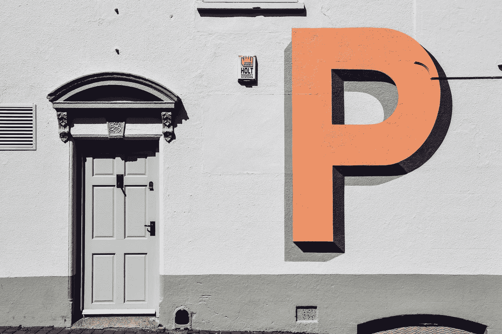

# A/B 测试:Python 方法(第 1 部分)

> 原文：<https://medium.com/analytics-vidhya/a-b-testing-a-python-approach-part-1-75fdb904f271?source=collection_archive---------7----------------------->

亚历克斯在 [Unsplash](https://unsplash.com?utm_source=medium&utm_medium=referral) 上阅读

这篇文章是写给那些想学习如何实现 A/B 测试的人的。如果你想回顾一下 A/B 测试，请查看我的另一篇[文章](/analytics-vidhya/a-b-testing-for-data-science-f1203e9503b6)。

## 概观

曲奇猫的数据集来自一个 Kaggle 挑战赛。这是一个手机益智游戏，相同颜色的瓷砖应连接到清除董事会，并赢得水平。穿越各种关卡后…