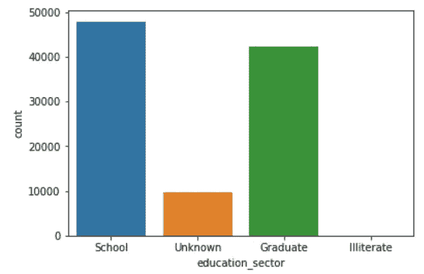
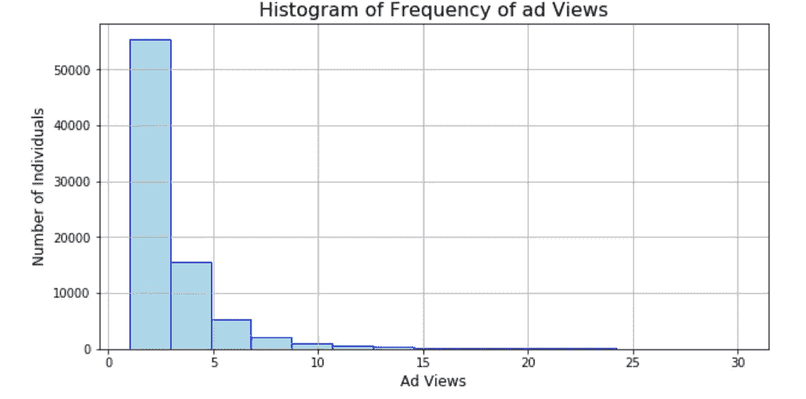

# A/B 测试:信用卡营销活动分析

> 原文：<https://medium.com/analytics-vidhya/a-b-testing-clearly-explained-56488430156?source=collection_archive---------1----------------------->

# 数据分析:Kailash 和 Pooja 的信用卡营销活动

Github 链接，包含完整的 python 笔记本和关于银行营销的 UCI 数据集-[https://github.com/kailash14](https://github.com/kailash14?tab=repositories)

# 内容:

*   方案
*   数据集描述
*   目标
*   数据字典
*   什么是 A/B 测试
*   我们需要什么来进行 A/B 测试
*   A/B 测试的详细步骤
*   A/B 测试工作
*   数据分布
*   确定哪些因素起了作用
*   假设检验
*   结论

# 方案

*   一家大型消费银行最近开展了一项直接营销活动，制作了一个信用卡优惠视频广告，以获得更多的信用卡申请。
*   在活动期间，他们还对登陆页面进行了分割测试。控制页面是他们默认的基于文本的页面，而测试页面以新的营销视频为特色。

# 数据集描述

数据集名称:bank_direct_marketing.csv

行数:100000

每行代表收件人的人口统计数据和回复。

变量数量:12

变量名称:

1.  用户的人口统计数据:年龄、工作、婚姻状况、教育、性别，
2.  用户的响应:建议、星期几、测试、频率、页面浏览量、上一次、y

# 目标

检查 A/B 测试，并查看测试页面(带有视频广告)的表现是否优于控制页面(textbase)。

# 数据字典:

**年龄:**类型—数字
接受者的年龄。

**工作:**类型——名义分类
接收人的工作类别。

**婚姻:**类型——名义分类
接受者的婚姻状况

**教育:**类型—接受者的名义分类教育水平。

**性别:**类型—名义分类
接收人的性别(男性为 1，女性为 0)。

**建议:**类型—名义分类
接收方是否超出银行的原始目标参数(即由算法建议)。

**测试:**类型—标称分类
一个带视频的测试登陆页面(控制页面为 0，测试页面为 1)。

**星期几:**类型——顺序分类
收件人看到广告的那一天。

**频率:**类型——数字
收件人看过活动广告的次数。

**page _ views:**type—Numerical
收件人在看到广告前的 90 天内在银行网站上浏览的页面数量。

**prev_y:** type —名义分类。
在收到之前的活动后，接收者是否申请了信用卡。
0-未申请信用卡。
1-申请了信用卡。
2-收件人从未收到过之前的活动。

**y ( *目标变量* )** :类型—类别
收款人是否申请该卡。
0-未应用
1-应用标称值

## 什么是 A/B 测试:

A/b 测试，也称为分割测试，是一项试验，您将客户/受众“分割”开来，以测试您开展的活动的许多特性，并确定哪一项表现更好

## 我们需要什么:

要运行 A/B 测试，您需要创建两个不同的版本(控制和实验),它们根据目标变量进行相应的更改，然后，您将在一段较长的时间内(足以做出准确的决定)向两个类似规模的受众展示这两个版本，并确定哪个版本的性能更好。

## A/B 测试的详细步骤:

**在 A/B 测试之前:**

**A)选择需要在**上测试的特性:可以测试多个变量，但有必要一次测试一个，但为了评估变化的有效性，您需要隔离一个“独立变量”并测量其性能——否则，您无法确定哪个变量对性能变化负责。

需要测试的例子:电子邮件主题行

**B)构建假设陈述:**每个人的测试可能有许多指标，但选择一个主要指标来关注是很重要的——在我们运行该测试之前，有必要基于此构建一个假设陈述来测试我们的预测和结果。

**C)** **创建控制和测试:**由于我们有关于自变量、因变量和所需变量的信息，我们将使用这些信息来设置控制和测试页面。

**D)** **确定你的样本量**:如果你正在对一封电子邮件进行 A/B 测试，你可能会想对你的列表中的一小部分进行 A/B 测试，以获得统计上有意义的结果。最终，你会选出一个获胜者，并将获胜的变体发送给列表中的其他人。

**在 A/B 测试期间:**

**E)同时测试两种变化**。无论是一天中的某个时间，一周中的某一天，还是一年中的某个月，时机在你的营销活动中扮演着重要的角色。如果您在一个月内运行版本 A，一个月后运行版本 B，您如何知道性能变化是由不同的设计还是不同的月份引起的？当您运行 A/B 测试时，您需要同时运行这两种变体，否则，您可能会对您的结果产生怀疑。

给 A/B 测试足够的时间来产生有用的数据:同样，你要确保你的测试运行足够长的时间，以获得足够大的样本量。否则，很难判断这两种变异之间是否有统计学上的显著差异。多久才算够长？

# A/B 测试

A/B 测试(也称为拆分测试或桶测试)是一种比较网页或应用程序的两个版本以确定哪一个性能更好的方法。AB 测试本质上是一个实验，其中一个页面的两个或更多变体被随机地显示给用户，并且统计分析被用来确定哪个变体对于给定的转换目标表现得更好。

# A/B 测试工作

在 A/B 测试中，你获取一个网页或应用程序屏幕，并修改它以创建同一页面的第二个版本。这种改变可以是简单的一个标题或按钮，也可以是整个页面的重新设计。然后，一半的流量显示的是页面的原始版本(称为控制)，另一半显示的是页面的修改版本(变化)。
当游客接受控制或变化服务时，他们对每种体验的参与度会被测量并收集在分析仪表板中，通过统计引擎进行分析。然后，您可以确定改变体验对游客行为有正面、负面还是没有影响。

# 数据分布

-对变量进行单变量分析，以了解数据的总体分布。
-还要了解活动中包括哪些类型的接收者。

## **年龄分布:**

## 观察结果:

几乎 **83%** 的领取者都属于 *20-50 岁*的年龄段。

## **婚姻状况分布:**

## 观察结果:

实际上也取决于年龄组的人口，人口主要包括*【单身】*和*【已婚】*阶层的人。

## **性别分布:**

## 观察结果:

男性和女性的接受者几乎平等地参与了这项运动。

## **一周中各天的分布:**

## 观察结果:

*   作为一家总部位于美国的银行，只有工作日(即周一至周五)包含在活动中。
    -从活动中记录的所有日期的响应几乎相等(即各 20%)。

    **注意:以上所有变量对于理解用户对活动的反应都没有给出任何重要的结果。**

## 教育部门的分布:

## 观察:

*   具有*‘学校’*和*‘研究生’*教育水平的受益人主要包括在该运动中，其中包括高达 91% 的运动人口。

## **工作行业分布:**

## 观察结果:

*   **76%** 的活动人群包括*【中】*和*【低】*收入接受者。

## **频率分布:**

## 观察:

*   **84%** 的收件人没有看过该活动广告，或者最多看过该广告 3 次。

## 上一个 Y:

## 观察结果:

*   此变量代表客户对之前活动的回应。
    -大约只有 **14%** 的人口是已知人口(即记录了世卫组织以前的活动响应)。
    -86%的**竞选人群是新的未知人群。**

## ****测试分布:****

****

## **观察结果:**

*   **分割测试不相等。向活动人群中的
    - **63.5k** 发送测试(即基于视频的链接)，向活动人群中唯一的 **36.5k** 发送控制(即基于文本的链接)**

## **目标变量(Y)的分布:**

****

## **观察结果:**

*   **该活动的总体成功率为 **11.2%****

## **确定哪些因素起作用:**

## **教育部门成功率分布**

**-为了理解真正影响接受者反应的因素，我们考虑了实际上向我们显示一些重要数据分布的变量。**

****

## **观察结果:**

*   **所有部门都显示出 10-14%的成功率。**

# ****假设检验:****

**提供以下信息:**

**-第 1 组的简单随机样本量(N ^ 1)= 30000，**

**-第 2 组的简单随机样本量(N ^ 2)= 30000**

**-组 1 中有利案例的数量= 4417**

**-第 2 组中有利案例的数量=**

**-计算出的样本比例=0.73，且**

**-显著性水平为α= . 95**

****测试统计****

**z 统计量的计算方法如下:**

********

**在进行欠拟合以消除偏差后，结果显示 z 值大于 z 临界值，因此我们可以说我们将拒绝零假设并接受替代方案，这表明基于视频的页面提供了更好的结果。**

**为了证实我们的解决方案，取数值和分类两者的最相关变量，并观察它是否与视频链接页面提供更好结果的陈述一致，这是在 z 分数测试的帮助下完成的。**

# **结论:**

**对于给定的数据，测试页(带有视频)提供了比控制页更好的结果。**

**与测试/控制相比，已经存在的客户没有表现出太大的差异，因此我们可以发送更多基于文本的页面并观察结果。**

**需要进一步的数据来做全面的分析**

## **此外，如果你想在任何数据集中自动绘制图表，请看看我的视频，里面有清楚的解释:[https://www.youtube.com/watch?v=9tanWQo4xlo](https://www.youtube.com/watch?v=9tanWQo4xlo)**

**[snkailashari](https://medium.com/u/eb5532a09945?source=post_page-----56488430156--------------------------------)**

**[Poojamore](https://medium.com/u/b0647ce2c77f?source=post_page-----56488430156--------------------------------)**