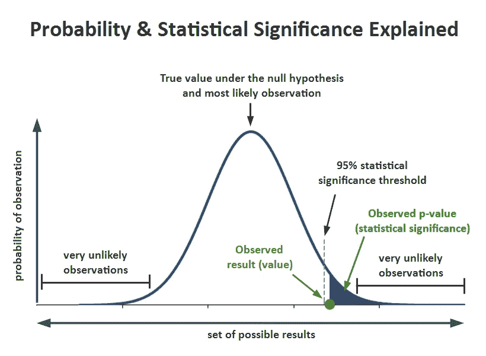
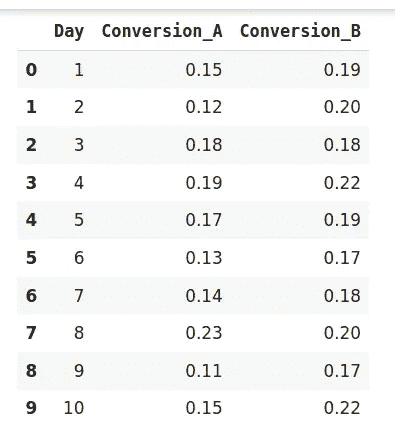
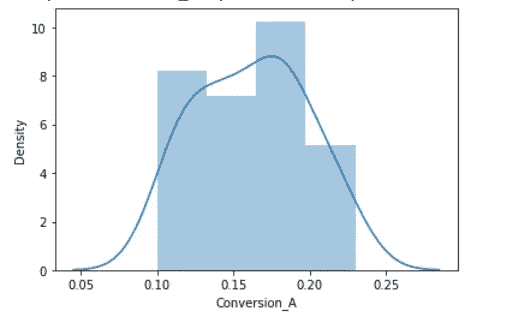
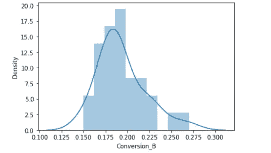

# 使用 Python 进行数据科学的 A/B 测试——数据科学家的必读指南

> 原文：<https://medium.com/analytics-vidhya/a-b-testing-for-data-science-using-python-a-must-read-guide-for-data-scientists-c54954910305?source=collection_archive---------17----------------------->

# 概观

*   A/B 测试是测试产品的一种流行方式，在数据科学领域也越来越流行
*   在这里，我们将了解什么是 A/B 测试，以及如何使用 Python 在数据科学中利用 A/B 测试

# 介绍

> 统计分析是我们预测我们不知道的结果的最好工具，利用我们知道的信息。

想象一下这个场景——你最近对你的网站做了一些改动。不幸的是，你无法完全准确地知道接下来访问你网站的 10 万人会有什么行为。这是我们*今天无法*知道的信息，如果我们等到那 10 万人访问我们的网站时，优化他们的体验就太晚了。

这似乎是一个典型的第 22 条军规的情况！

这是数据科学家可以掌控的地方。数据科学家收集和研究可用的数据，以帮助优化网站，获得更好的消费者体验。为此，必须知道如何使用各种统计工具，尤其是 A/B 测试的概念。


A/B 测试是当今大多数行业中广泛使用的概念，数据科学家处于实施这一概念的前沿。在本文中，我将深入解释 A/B 测试，以及数据科学家如何利用它来建议产品中的变化。

# 目录:

*   什么是 A/B 测试？
*   A/B 测试是如何工作的？
*   测试的统计显著性
*   进行 A/B 测试时我们必须避免的错误
*   何时使用 A/B 测试

# 什么是 A/B 测试？

A/B 测试是一个基本的随机对照实验。这是一种比较一个变量的两个版本的方法，以找出在受控环境中哪个表现更好。

例如，假设你拥有一家公司，想增加你产品的销量。在这里，要么你可以使用随机实验，要么你可以应用科学和统计方法。A/B 测试是最突出和最广泛使用的统计工具之一。

在上面的场景中，您可以将产品分为两部分— A 和 B。在这里，A 将保持不变，而您对 B 的包装进行了重大更改。现在，根据分别使用 A 和 B 的客户群的反应，你试着决定哪个表现更好。


它是一种假设的测试方法，用于根据样本统计数据估计总体参数的决策。**人口**指所有购买你的产品的顾客，而**样本**指参与测试的顾客数量。

# A/B 测试是如何工作的？

最大的问题！

在本节中，让我们通过一个例子来理解 A/B 测试概念背后的逻辑和方法。

假设有一个电子商务公司 XYZ。它想对它的时事通讯格式做一些改变，以增加其网站的流量。它获取原始新闻稿，将其标记为 A，并对 A 的语言进行一些更改，将其命名为 b。除此之外，两份新闻稿在颜色、标题和格式方面都是相同的。


# 目标

我们在这里的目标是检查哪个简讯给网站带来更高的流量，即转化率。我们会用 A/B 测试，收集数据来分析哪个简讯表现更好。

## 1.做出假设

在做假设之前，我们先了解一下什么是假设。

> 假设是对自然世界的初步洞察；一个尚未被证实的概念，但如果是真的，就能解释某些事实或现象。

这是对你周围世界的一种**式的猜测。它应该是可测试的，无论是通过实验还是观察。在我们的例子中，假设可以是“通过改变简讯的语言，我们可以在网站上获得更多的流量”。**

在[假设检验](https://www.analyticsvidhya.com/blog/2015/09/hypothesis-testing-explained/?utm_source=blog&utm_medium=ab-testing-data-science)中，我们要做两个假设，即零假设和备择假设。让我们来看看两者。

## 零假设或 H0:

替代假设挑战零假设，基本上是研究者认为正确的假设。另一个假设是你可能希望你的 A/B 测试证明是真的。

在我们的例子中，H a 是——“**简讯 B 的转化率高于收到简讯 A 的人**”。

现在，我们必须通过测试收集足够的证据来**拒绝零假设**。

## 2.创建对照组和测试组

一旦我们准备好了我们的无效假设和替代假设，下一步就是决定参与测试的客户群。这里我们有两个组——对照组**和测试组**。

对照组将收到简讯 A，测试组将收到简讯 b。

在这个实验中，我们随机选择了 1000 名客户——对照组和测试组各 500 名。

从总体中随机选取样本称为**随机抽样**。这是一种技术，群体中的每个样本都有平等的机会被选中。随机抽样在假设检验中很重要，因为它消除了抽样偏差，而**消除偏差也很重要，因为你希望你的 A/B 检验的结果能代表整个总体，而不是样本本身。**

我们必须注意的另一个重要方面是样本量。在进行 A/B 测试之前，我们需要确定测试的最小样本量，以便消除覆盖偏差下的**。**这是由于取样太少而产生的偏差。

## 3.进行 A/B 测试并收集数据

进行测试的一种方法是计算治疗组和对照组的**日转化率**。由于某一天一组中的转化率代表的是单个数据点，所以样本量实际上就是天数。因此，我们将测试测试期间每组每日平均转换率之间的差异。

当我们进行一个月的实验时，我们注意到对照组的平均转化率是 16%，而测试组的平均转化率是 19%。

# 测试的统计显著性

现在，主要的问题是——我们能从这里得出结论，测试组比控制组工作得更好吗？

答案很简单:不！为了拒绝我们的零假设，我们必须证明我们测试的统计显著性。

在我们的假设检验中可能会出现两种类型的错误:

1.  第一类错误:当零假设为真时，我们拒绝它。也就是说，当 B 的表现不如 A 时，我们接受它
2.  **第二类错误**:当假设为假时，我们未能拒绝零假设。这意味着当变体 B 比 A 表现得更好时，我们就断定它不好

为了避免这些错误，我们必须计算测试的统计显著性。

> *当我们有足够的证据证明我们在样本中看到的结果也存在于总体中时，一个实验就被认为是具有统计显著性的。*

这意味着您的控制版本和测试版本之间的差异不是由于一些错误或随机的机会。为了证明我们实验的统计显著性，我们可以使用[双样本 T 检验](https://www.analyticsvidhya.com/blog/2019/05/statistics-t-test-introduction-r-implementation/?utm_source=blog&utm_medium=ab-testing-data-science)。

**两个** - **样本 t** - **测试**是最常用的**假设**测试。用于比较**两组**的平均差异。



要理解这一点，我们必须熟悉几个术语:

1.  **显著性水平(α):**显著性水平，也表示为α或α，是当原假设为真时拒绝原假设的概率。通常，我们使用 0.05 的显著性值
2.  **P 值:**就是两个值的差异只是因为随机机会的概率。p 值是反对零假设的证据。p 值越小，拒绝 H0 的可能性越大。对于 0.05 的显著性水平，如果 p 值小于它，那么我们可以拒绝零假设
3.  **置信区间:**置信区间是一个观察到的范围，其中给定百分比的测试结果落在该范围内。我们在测试开始时手动选择我们想要的置信度。通常，我们取 95%的置信区间

接下来，我们可以使用下面的公式计算 t 统计量:


# 让我们用 Python 实现显著性测试

让我们看看显著性测试的 python 实现。这里，我们有一个虚拟数据，其中包含 30 天 A/B 测试的实验结果。现在，我们将使用 Python 对数据进行双样本 t 检验，以确保数据的统计显著性。

```
import pandas as pd 
import numpy as np 
import seaborn as sns 
import scipy.stats as ss 
data= pd.read_csv("ab_test.csv")
```

你可以在这里下载样本数据。

让我们来看看数据:

```
data.head(10)
```



让我们绘制目标和控制组的分布图:

```
sns.distplot(data.Conversion_A)
```



```
sns.distplot(data.Conversion_B)
```



最后，我们将执行 t 检验:

```
t_stat, p_val= ss.ttest_ind(data.Conversion_B,data.Conversion_A) t_stat , p_val(3.78736793091929, 0.000363796012828762)
```

在我们的例子中，观察值，即测试组的平均值是 0.19。假设值(对照组的平均值)为 0.16。在 t 分数的计算上，我们得到的 t 分数为 **.3787** 。并且 p 值为 **0.00036** 。

那么这一切对我们的 A/B 测试意味着什么呢？

这里，我们的 p 值小于显著性水平，即 0.05。因此，我们可以拒绝零假设。这意味着在我们的 A/B 测试中，简讯 B 比简讯 A 表现更好。因此，我们的建议是用简讯 B 替换我们当前的简讯，以增加我们网站的流量。

# 在进行 A/B 测试时，我们应该避免哪些错误？

我见过数据科学专业人士犯的一些关键错误。让我在这里为你澄清它们:

*   **无效假设**:整个实验取决于一件事，即假设。应该改变什么？为什么要改，预期结果是什么等等？如果你从错误的假设开始，测试成功的概率就会降低
*   **一起测试太多的元素:**行业专家警告不要同时运行太多的测试。一起测试太多的元素使得很难确定哪个元素影响了成功或失败。因此，测试的优先级对于成功的 A/B 测试是必不可少的
*   **忽略统计显著性:**你对测试的感受并不重要。不管任何事情，不管测试是成功还是失败，让它贯穿整个过程，以便达到它的统计显著性
*   **不考虑外部因素:**测试应在可比较的时间段内进行，以产生有意义的结果。例如，由于销售或假期等外部因素，将网站流量最高的日子与流量最低的日子进行比较是不公平的

# 我们什么时候应该使用 A/B 测试？

A/B 测试在测试增量变化时效果最好，比如 UX 变化、新特性、排名和页面加载时间。在这里，您可以比较修改前和修改后的结果，以确定更改是否按预期进行。

A/B 测试在测试重大变化时效果不佳，比如新产品、新品牌或全新的用户体验。在这些情况下，可能会有一些影响会推动高于正常的参与度或情绪反应，从而导致用户以不同的方式行事。

# 结束注释

总的来说，A/B 测试是至少有 100 年历史的统计方法，但以其目前的形式，它出现在 20 世纪 90 年代。现在，随着在线环境和大数据的可用性，它变得更加突出。公司可以更容易地进行测试，并利用结果来改善用户体验和性能。

有许多工具可用于进行 A/B 测试，但作为一名数据科学家，您必须了解其背后的工作因素。此外，为了验证测试并证明其统计显著性，您必须了解统计数据。

*要了解更多关于假设检验的知识，我建议你阅读下面这篇文章:*

如果你有任何疑问，请在下面的评论区联系我们。

*原载于 2020 年 10 月 27 日 https://www.analyticsvidhya.com*[](https://www.analyticsvidhya.com/blog/2020/10/ab-testing-data-science/)**。**