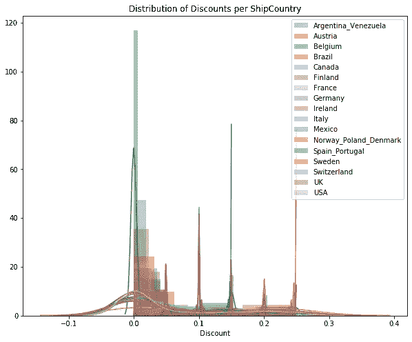

# 使用 Northwind 数据集进行 A/B 测试

> 原文：<https://medium.com/analytics-vidhya/a-b-testing-using-the-northwind-dataset-e564e9460927?source=collection_archive---------17----------------------->


照片由 [Unsplash](https://unsplash.com?utm_source=medium&utm_medium=referral) 上的[agency followeb](https://unsplash.com/@olloweb?utm_source=medium&utm_medium=referral)拍摄

在我最近的项目中，我的任务是使用虚构的 Northwind 数据集来展示假设或 A/B 测试。在这篇博文中，我想探究这样一个问题:“订单发往的国家对折扣有显著的统计影响吗？”

首先，我必须发展我的无效假设和替代假设。无效假设是基于订单运送目的地的折扣没有影响。这意味着所有国家的平均折扣值是相同的。另一个假设是，某些国家或高或低的平均折扣。

既然假设已经成立，就需要对数据进行探索。数据存储在 SQLite 文件中，需要转换成 pandas 数据帧，以便于查看和操作。

```
def query_to_df(query):
    “””Takes in a SQL query and returns a pandas dataframe with         column names”””
    cur.execute(query)
    df = pd.DataFrame(cur.fetchall())
    df.columns = [x[0] for x in cur.description]
    return df
```

上面的代码是一个函数，它接受一个 SQL 查询并返回一个 pandas 数据帧，该数据帧带有准备处理的列名。我需要的信息是订单发往的国家和每份订单的折扣。一个简单的 SQL 查询，如果您已经熟悉编写它们的话。关于 SQL 的提醒，你可以访问这个[帖子](/swlh/basics-of-sql-7f1e72772e63)。

```
query4 = “””SELECT ShipCountry, OrderId, Discount
            FROM [Order]
            JOIN OrderDetail
            ON [Order].Id = OrderDetail.OrderId;”””
```

有了 pandas 数据框架，我就能够确定所有向其发货的国家和给予的折扣级别。国家被视为分类变量，并将被视为分类变量。我要运行的第一个测试是 ANOVA 测试，比较“ShipCountry”列和“Discount”列

方差分析(ANOVA)是一种统计技术，用于检查两个或多个组的平均值是否存在显著差异。ANOVA 通过比较不同样本的平均值来检查一个或多个因素的影响。在这种情况下，样品将是每个“发货国家”,我们想看看每个订单的“折扣”的含义是否有任何不同。

在方差分析测试之前，我绘制了每个装运国的折扣分布图:

```
country_list = df4.ShipCountry.tolist()
country_list = np.unique(np.array(country_list))
plt.figure(figsize=(10,8))
plt.title(‘Distribution of Discounts per ShipCountry’)
for country in country_list:
    country_df = df4[df4[‘ShipCountry’] == country]
    sns.distplot(country_df.Discount, label=country)

plt.legend();
```



方差分析测试将告诉我们是否有来自发货国的统计显著性。方差分析测试相对容易操作，也容易解释。

```
import statsmodels.api as sm
from statsmodels.formula.api import olsformula = ‘Discount ~ C(ShipCountry)’
lm = ols(formula, df4).fit()
table = sm.stats.anova_lm(lm, typ=2)
print(table) sum_sq      df         F        PR(>F)
C(ShipCountry)   0.609834    16.0  5.662696  3.781260e-12
Residual        14.390506  2138.0       NaN           NaN
```

上面的代码返回一个干净的表，从中可以得出结论。两个重要的值是 F 值和 PR(>F)或 p 值。F 统计量测量不同样本的均值是否显著不同。使用 F 表，您可以找到 p 值，或者在这种情况下，它已经给出。值非常非常小(3.781260e-12)。远小于通常的 0.05 的阈值。可以拒绝零假设。某些国家之间可能存在显著差异，需要进行更多测试。

显示平均折扣值的条形图有助于直观显示平均折扣差异的大小:


为了评估每个国家，需要进一步分析。方差分析测试告诉我们，国与国之间存在显著差异；然而，ANOVA 测试并没有指定哪些国家。为了进一步探索，必须考虑事后测试。可供选择的几个测试是韦尔奇对每个国家进行的带有 Bonferroni 修正的 T 检验或图基的 HSD 检验。