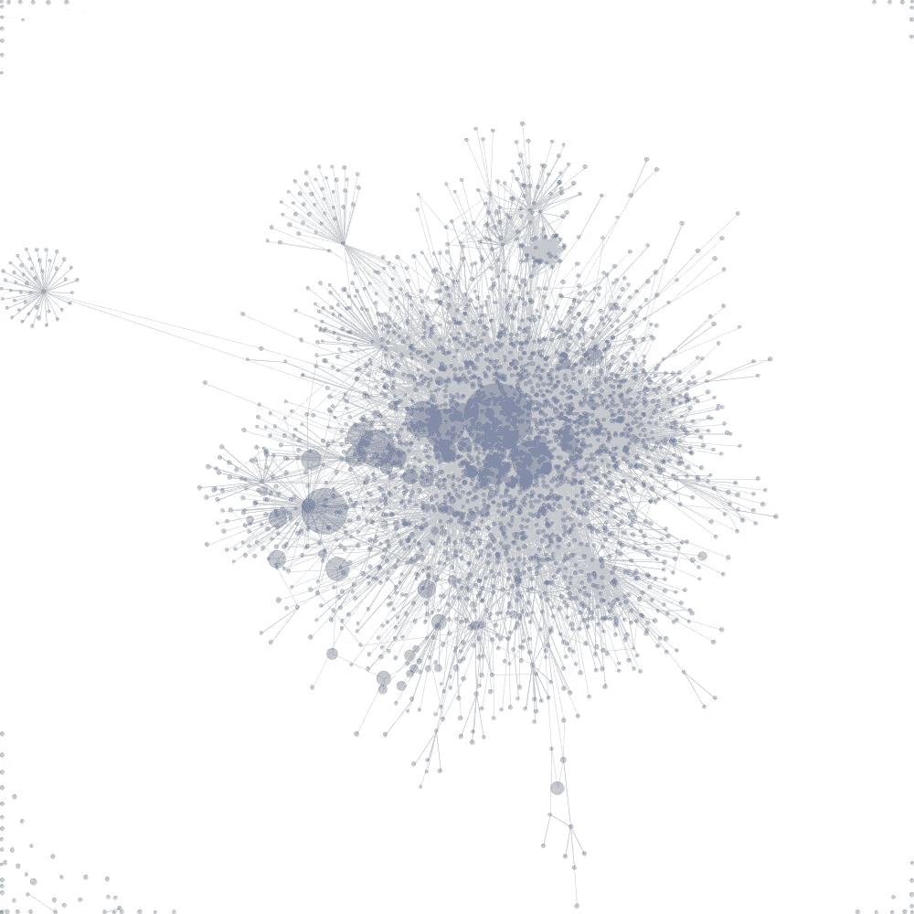
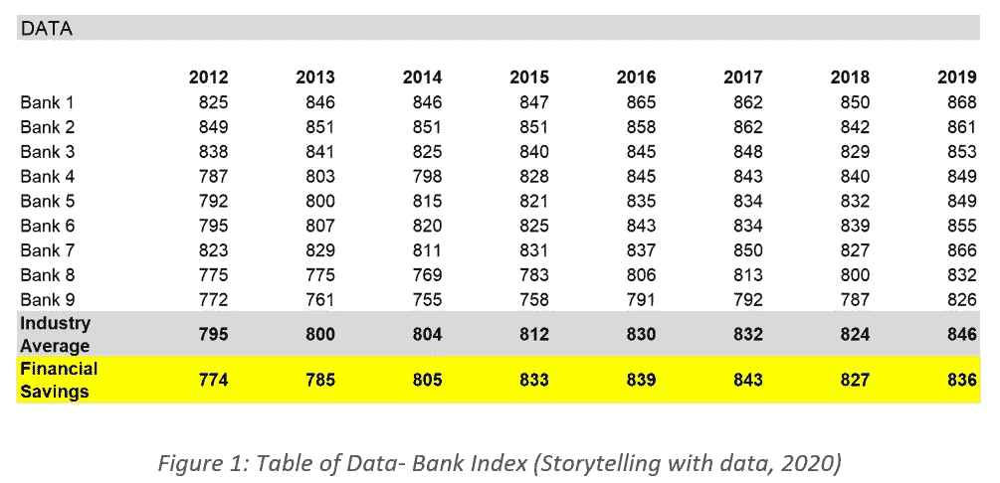
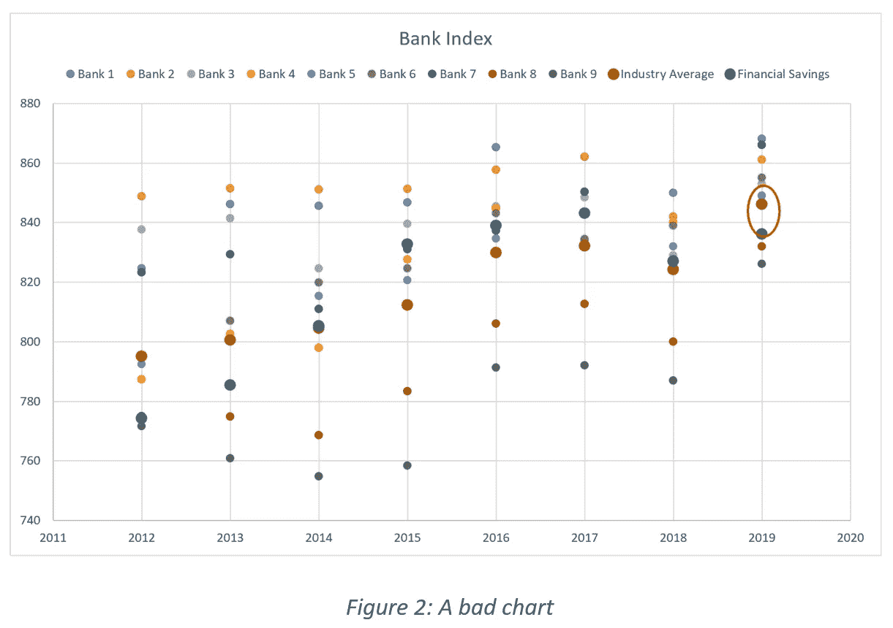
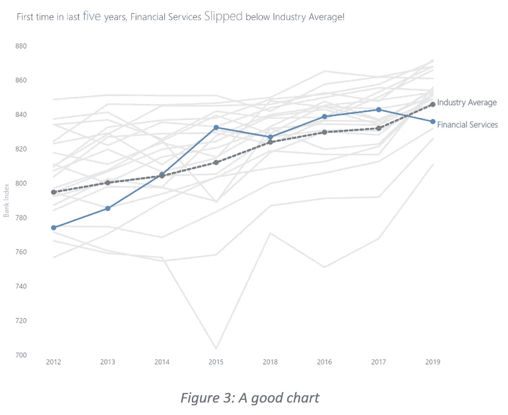
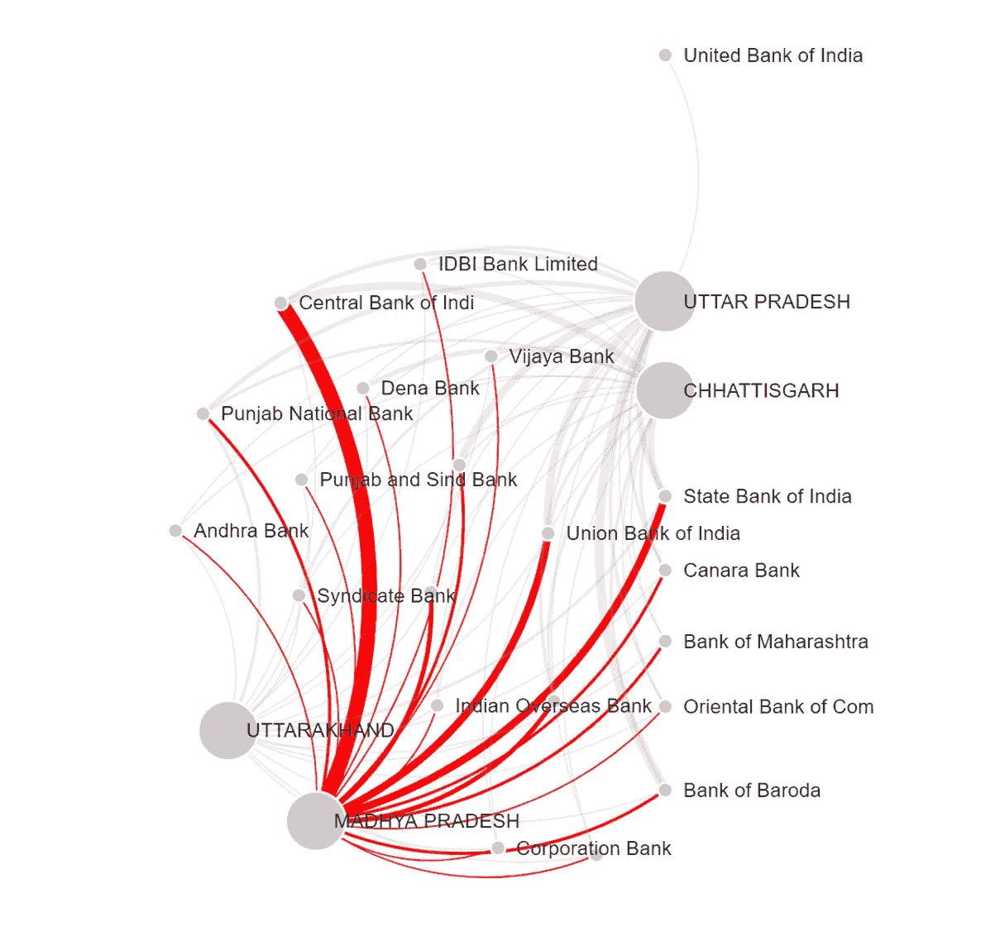
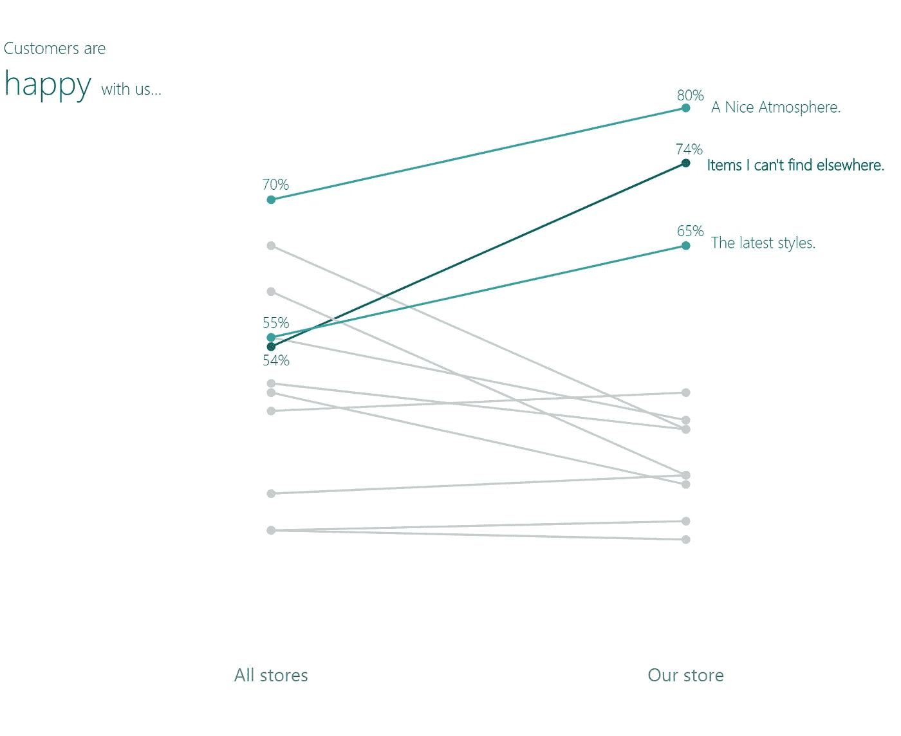
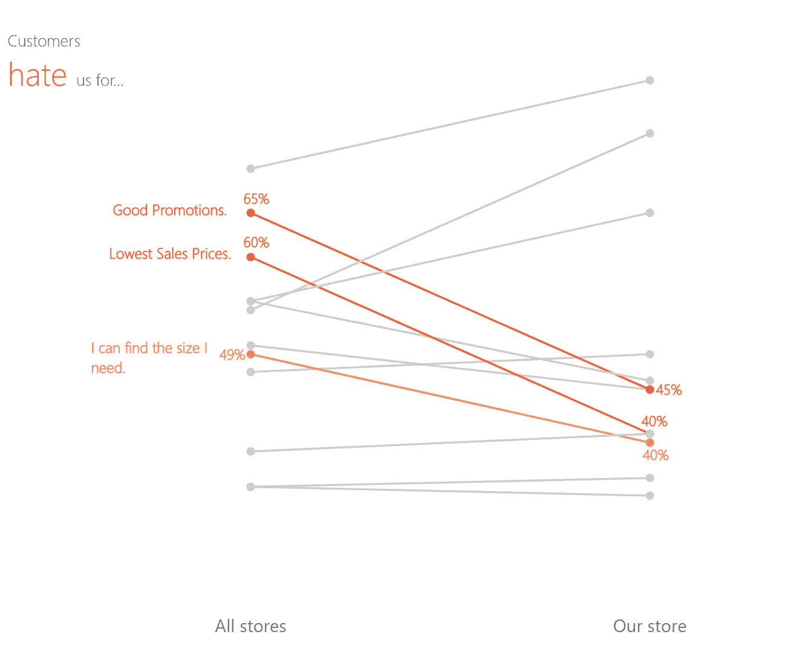

# 糟糕的图表

> 原文：<https://medium.com/analytics-vidhya/a-bad-chart-78eada929faa?source=collection_archive---------20----------------------->

(大卫，2009 年)

# 事实核查

Salesforce 为 Tableau 支付了 150 亿美元，谷歌为 Looker 支付了 25 亿美元。他们意识到需要一个好的可视化工具了吗？毫无疑问，我们都可以承认，微软的 Excel 通过其图表选项让我们的生活变得简单。选择数据，选择你选择的图表，你就有了，一个吸引人的图表。那么，为什么这两个科技巨头要花费数十亿美元来开发一个图表工具呢？这将是我们在这篇文章中的追求。

# 打破泡沫

随着每天注入的数据量，对优秀可视化工具的需求完全证明了公司愿意支付的巨额费用是合理的。分析数据，寻找模式，并将其可视化已经成为在任何市场中取胜的惯用手法。但是，如果投入数十亿美元会产生影响，谷歌或 Salesforce 会在世界各地发布他们的图表，但许多来自可视化社区的人会同意，像《经济学人》、《金融时报》、《HBR》这样的出版物是首屈一指的。

# 好与坏

“什么是好的图形，”。这是一个重要的问题，应该用“坏”图和“好”图来回答。除了形象化之外，下表还提供了一些银行以及“我们的”银行金融服务的银行指数数据。

让我们画一张糟糕的图表。

使用图表 1(图 2)回答下列问题。

1.  哪几年金融服务业的表现优于行业平均水平？
2.  哪一年金融服务的表现比行业平均水平差？
3.  哪一年金融服务指数增长最快？

很痛苦吗，你跳过最后一个问题继续读了吗？如果是的话，这确实是一个不好的图表。

再试一次，但使用下图，其中显示了相同的信息。

你是否在几秒钟内回答了这些问题，并且在回答的同时释放了多巴胺？你的大脑被设定为寻找捷径，因为它必须节省能量，你在图表上花的时间越多，它就变得越不可测量。根据最近的研究，人类的注意力持续时间已经下降到只有 8 秒。在这八秒钟里，我必须用一个图表来解释我的故事，这个图表可能包含来自成千上万个数据点的信息，同时你的大脑也应该能够理解它们。

为了画一张“好”的图表，我应该能够定义一张“坏”的图表，为了定义它，我应该理解任何大脑在看到图表时发生了什么。

# 我的大脑如何阅读图表？

我们的大脑(大多数人)被训练成从左向右阅读文本(不包括波斯语、阿拉伯语、乌尔都语等)。脚本)。但是当你看到一幅图像时，你的眼睛会被突出的地方吸引，比如山峰、明亮的颜色、粗体字或最大的馅饼。在上面这张糟糕的图表中，红色的圆圈可以吸引你的注意力，但许多颜色也可能令人不知所措，因此，作为演示者，我一下子就失去了你的注意力。接下来你的大脑会搜索这个红色的圆圈代表什么，你的眼睛会来回拉伸你的眼部肌肉，向你的大脑发送信号，“*真累人！*”。演示者必须告诉观众图表是关于什么的，包括为什么他/她有一个红圈。所以，下一次，当你在观众席上时，试着用图表来检查演讲者花了多少时间来表达他/她的观点。每当我在一篇文章或一份文件中遇到一个图表时，我都会做一次心理练习，问自己这个图表是关于什么的，我的眼睛首先去了哪里，我需要阅读相邻的段落来理解这个图表和类似的问题。这是值得的，因为当我必须画一张图表时，我的大脑会向我提出这些问题。

一个“好”的图表会带来巨大的不同，写完这篇文章后，我想当你看到一个“好”的图表时，你会喜欢它的。

# 怎样才能画出好的图表？

有大量的书籍告诉你，为了画出一张“好”的图表，你不应该做什么，应该做什么。这些书很棒，但它们不会为你提供合理的更好的图表的经验法则。

> "规则是创造力棺材上的另一颗钉子."
> 
> -沙鲁克

棘手的部分是，一个好的图表就像克里斯托弗·诺兰的电影，但有一个转折，一个好的图表，最终只会向观众发出一个信息，而诺兰的电影的结局让观众想知道他们的版本。该死的诺兰。！！

> 你的图表可能犯的最大错误是向观众发出多种信息。

让我们洗洗我们的罪恶，试着去理解一些更好制图的要素。我以几个 W 开头(这不是规矩！),

1.  我要传达的信息(或目标)是什么？
2.  我将使用什么渠道？
3.  我的听众对手头主题的知识水平如何？
4.  分析这张图表后，我的同事会问什么？
5.  更多，这可以帮助你把你的情况。

让我们来回答这些关于上表中数据的问题。

**1。我要传达的信息(或目标)是什么？**

*我想表达的是，金融服务低于行业平均水平，而其他银行则远高于行业平均水平。我希望我的观众只关注金融服务。*

**2。我将使用什么渠道？**

我将把它展示给现场观众，之后还会分享这副牌。

**3。我的听众对手头主题的知识水平如何？**

*我的听众包括高管和政府官员，这两类人的时间都不多。*

**4。分析这张图表后，我的同事会问什么？**

*如果这是一个糟糕的图表，我的同事会问，这个图表是关于什么的，这些其他颜色表示什么，很难区分颜色，最后一个人可能会说，“我是色盲，我看不出任何区别！”。每百人中有四人是色盲。*

让你的大脑稍微舒展一下，多想几个 w。

# 可能性无限

这篇文章谈到了良好的视觉效果和一个初步草案的重要性，让你能够区分一个好的图表和一个坏的图表。虽然，有一些公认的技巧和窍门来创造不同的视觉效果，这将是另一个故事。

# 继续你的探索

1.Scott Berinato 好图表 _ HBR 指南，制作更智能、更有说服力的数据可视化-哈佛商业评论出版社(2016)

2.Edward r . Tufte——定量信息的可视化显示——图形公关(2001 年)

# 我的一些图表照片

1.  印度很少有邦与他们的银行有联系。链接的粗细代表每家银行的账户持有人数量。

2.一项包含 12 个问题的调查结果显示，选择我们**的客户比例高于选择其他品牌**。

3.一份包含 12 个问题的调查结果显示，选择其他品牌**而不是我们**的客户比例。

如果你在这里，那么我成功地保持了你的注意力，我希望你在这之后探索更多。如果你有任何见解或反馈，请告诉我。

# 参考

(2020).从用数据讲故事中检索:[https://community . story telling with data . com/exercises/practice-provide-feedback](https://community.storytellingwithdata.com/exercises/practice-providing-feedback)

戴维斯，C. (2009 年)。检索自维基媒体:[https://upload . Wikimedia . org/Wikipedia/commons/9/90/Visualization _ of _ wiki _ structure _ using _ pre fuse _ Visualization _ package . png](https://upload.wikimedia.org/wikipedia/commons/9/90/Visualization_of_wiki_structure_using_prefuse_visualization_package.png)

*原载于 https://www.linkedin.com***。**