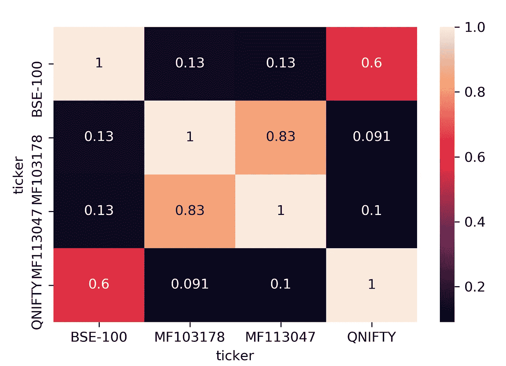

# 使用 Quontoian zipline 对印度股票和债券基金的平衡投资组合进行回溯测试

> 原文：<https://medium.com/analytics-vidhya/a-balance-portfolio-of-indian-equities-and-debt-funds-backtested-using-quontoian-zipline-fd3f36fec929?source=collection_archive---------21----------------------->

作者:萨比尔·贾纳

我决定在富兰克林邓普顿印度债务基金惨败后写这篇文章，因为这引起了很多关于印度债务基金投资的担忧。固定收益证券或债券基金在投资组合多样化中发挥着重要作用。在正常的市场环境下，高质量的债务基金与股票的相关性仍然很低，从而有利于分散风险。

在本文中，我们将采用一个非常基本的启发式投资组合，60%的股权和 40%的债务，并使用 Quontoian zipline 对其进行回溯测试，历时约九年半。然后，我们将它的性能参数与市场基准性能进行比较。使用 zipline 进行回溯测试需要将您的自定义数据包接收到 zipline 中。请参考我写的关于[如何将印度股票数据导入本地机器上的 zipline 的文章？](/@sabirh.jana/how-to-import-indian-equities-data-to-zipline-on-your-local-machine-3b8587aaf112)为此。你可以在我的 [Github](https://github.com/sabirjana/blog/tree/master/Portfolio%20Diversification) 资源库中找到这篇文章使用的 Jupyter 笔记本和数据。

所采用的方法如下:

1.  确定并选择合适的股票代理人和固定收益证券。
2.  建立一个由 60%的股票和 40%的债务组成的投资组合，并使用 zipline 进行回溯测试，每年进行一次再平衡。
3.  为投资组合和基准生成性能统计数据，以进行比较和对比。

**识别和选择股票和固定收益证券的合适代理人**

作为股票的代理，我使用了 Quantum Nifty 交易所交易计划( [QNIFTY](https://in.finance.yahoo.com/quote/QNIFTY.NS?p=QNIFTY.NS) )。QNIFTY 是一个非常小的 ETF，AUM 只有 9 cr，然而，它是印度最古老的跟踪 Nifty 50 的 ETF 之一。我选择这只 ETF 是为了让我们有 9 到 10 年的回望期。由于被动投资在印度仍在加快步伐，只有少数 ETF 拥有长期历史数据。

我使用了 [Aditya Birla Sun Life 公司债券(MF103178)](https://in.finance.yahoo.com/quote/0P00005V68.BO/history?p=0P00005V68.BO) 和 [HDFC 短期债务基金(MF113047)](https://in.finance.yahoo.com/quote/0P0000OQWT.BO/?p=0P0000OQWT.BO) 作为固定收益证券的代理。这两个都是高质量的债务共同基金，最大限度地投资于 AAA 级公司债券和主权证券。

我使用了 BSE 100 指数作为性能统计比较的基准。我已经提供了所有这些的历史价格数据。还有许多选项可以让您免费下载这些数据。

下面的代码片段将执行以下任务:

1.  进行必要的导入并读取历史价格数据文件，以制作熊猫数据框架。
2.  清理数据，保证日常频率。
3.  画出收盘价以直观显示累积回报。
4.  画出每日回报的斯皮尔曼相关矩阵。

```
# this is to display images in notebook
%matplotlib inline
%config InlineBackend.figure_format = ‘retina’# make necessary imports
import zipline
from zipline.api import (order_target_percent, symbol,
                         set_commission, set_slippage, 
                         schedule_function, date_rules, time_rules)
from zipline.finance.commission import PerDollar
from datetime import datetime
import pytz
from matplotlib import pyplot as plt
import pandas as pd
import pyfolio as pf
from trading_calendars import get_calendar
import seaborn as sns
import zipline
from os import listdir
idx = pd.IndexSlice# path to data files
path = 'data'# get the names of all .csv files in data folder
symbols = [f[:-4] for f in listdir(path)]# list symbols
symbols# read .csv files and build a pandas datafame
def get(tickers): 
    def data(ticker):
        print('Processing...', ticker)
        return pd.read_csv('{}/{}.csv'.format(path, ticker), index_col=[0], parse_dates=[0])
    datas = map(data, tickers)
    return(pd.concat(datas, keys=tickers, names=['ticker', 'date']))

symbols_df = get(symbols)# check the datafram head
symbols_df.head(2)# unstack the dataframe to get close prices
symbols_prices = symbols_df.unstack('ticker')['close'].asfreq('D', method='ffill').dropna()# quick verification of dataframe head and tail
symbols_prices.head(2).append(symbols_prices.tail(2))# rebase the data 
symbols_prices = symbols_prices/symbols_prices.iloc[0]
symbols_prices.head(2).append(symbols_prices.tail(2))# visulize the date for a quick comparision
fig, ax = plt.subplots(2, 1, sharex=True, figsize = (12,6))
ax[0].plot(symbols_prices['MF103178'], label = 'Aditya Birla Sun Life Corporate Bond')
ax[0].plot(symbols_prices['MF113047'], label = 'HDFC Short Term Debt')
ax[0].set(title = 'Aditya Birla Sun Life Corporate Bond vs HDFC Short Term Debt Growth', ylabel = 'Price')
ax[0].grid(True)
ax[0].legend()ax[1].plot(symbols_prices['QNIFTY'], label = 'Quantum Nifty Exchange Traded Scheme')
ax[1].plot(symbols_prices['BSE-100'], label = 'S&P BSE 100 INDEX')
ax[1].set(title = 'Quantum Nifty Exchange Traded Scheme vs S&P BSE 100 INDEX', ylabel = 'Price')
ax[1].grid(True)
plt.legend()plt.tight_layout();
plt.savefig('chart1', dpi=600)# visulize debt funds corelation with equity
fig = sns.heatmap(symbols_prices.pct_change().corr(method ='spearman'), annot=True)
plt.savefig('chart2', dpi=300)
```


历史累积回报



斯皮尔曼相关矩阵

两种债券基金的历史回报大致相同。QNIFTY 回报有跳跃。这是因为基金规模小导致流动性不足。债务基金和股票之间的相关性范围从 0.091 到 0.13，这是相当低的，有助于投资组合的多样化。

**建立一个 60%股权和 40%债务的投资组合，并使用每年再平衡的 zipline 进行回溯测试**

我们将使用 Quantopian zipline 创建初始投资组合，QNIFTY 的权重为 60%，Aditya Birla Sun Life 公司债券和 HDFC 短期债务增长的权重各为 20%。我们将使用 zipline 从 2011 年 1 月 1 日到 2020 年 6 月 9 日进行回溯测试，并确保它每年重新平衡一次，并遵守这些重量。

以下代码执行以下任务:

1.  在`initialize`函数中创建初始投资组合权重，交易费用为 0.4%。
2.  `rebalance_freq`和`rebalance`功能用于根据`initialize` 功能中定义的指定权重管理再平衡和下单。
3.  函数 `zipline.run_algorithm`触发回测算法，初始资金 20 万。

```
#Commission and Slippage Settings
enable_commission = True
commission_pct = 0.004 # 0.4% commission on buy/ selldef initialize(context):# Set commission
    if enable_commission:
        comm_model = PerDollar(cost=commission_pct)
    else:
        comm_model = PerDollar(cost=0.0)
    set_commission(comm_model)

    # counter for rebalance quarterly
    context.counter = 0

    # Securities and target weights
    context.securities = {'QNIFTY': 0.6,      # Quantum Nifty Exchange Traded Scheme
                          'MF103178' : 0.2,  # Aditya Birla Sun Life Corporate Bond Fund
                          'MF113047' : 0.2}  # HDFC Short Term Debt Growth

    schedule_function(rebalance_freq, 
                      date_rules.month_start(), 
                      time_rules.market_open())# rebalance once a year only
def rebalance_freq(context, data):  
    freq_month = 12  
    context.counter += 1  
    if context.counter == freq_month:  
        rebalance(context, data)  
        context.counter = 0# rebalance order percentages
def rebalance(context, data):
    # Loop through the securities
    for sec, weight in context.securities.items():
        sym = symbol(sec)
        # Check if we can trade
        if data.can_trade(sym):
            # Reset the weight
            order_target_percent(sym, weight)
            print('today...',zipline.api.get_datetime().date())# Fire the backtest
result = zipline.run_algorithm(
    start=start, # Set start
    end=end,  # Set end
    analyze=None, 
    initialize=initialize, # Define startup function
    capital_base=200000, # Set initial capital
    data_frequency = 'daily',  # Set data frequency
    bundle= 'nse_data')
```

**生成投资组合和基准的业绩统计，以进行比较和对比**

我们将使用 Quantopian Inc .的另一个开源软件 pyfolio 进行性能分析。pyfolio 可以很好地与 zipline 配合使用，尽管它也可以独立使用。

以下代码执行以下任务:

1.  从回溯测试结果中提取投资组合所需的输入。
2.  获取基准-S&P BSE-100 日收益率进行比较和对比。
3.  借助 pyfolio 生成性能统计数据。

```
# extract the inputs needed for pyfolio
returns, positions, transactions = pf.utils.extract_rets_pos_txn_from_zipline(result)# returns for the strategy
returns.name = 'Strategy'
returns.head(2)# get the benchmark returns
benchmark_rets = symbols_prices['BSE-100'].pct_change().dropna()
benchmark_rets.index = benchmark_rets.index.tz_localize('UTC')
benchmark_rets = benchmark_rets.filter(returns.index)
benchmark_rets.name = 'S&P BSE-100'
benchmark_rets.head(2)# generate performance stats with pyfolio
fig = pf.create_returns_tear_sheet(returns, benchmark_rets=benchmark_rets, positions=positions, transactions=transactions)
plt.savefig('chart3', dpi=800)# benchmark - S&P BSE-100 performace stats
pf.show_perf_stats(benchmark_rets)
```

让我们来看看 strategy 和 benchmark 的性能统计数据。


我们可以看到，与基准 S&P BSE-100 相比，该策略在所有参数上都表现出色，如年回报率、年波动性、夏普比率、稳定性和最大提款。我们还可以根据其中的一些参数来进一步可视化性能。


战略与基准


战略绩效

我在这项研究中使用了债务共同基金和 QNIFTY for equity ETF，因为我希望有一个更长的回顾期来进行回溯测试。印度市场现在有许多更大规模的 ETF 选择，包括债券和股票，供投资者选择。像这样的策略对于保守的投资者来说是个不错的选择。此外，如果投资组合在回顾期只有债务，投资者会做得更好。然而，我们需要记住，股票在历史上表现好于债券，过去十年可能是债券表现优于债券的一个特例。投资愉快:)

请注意:此分析仅用于教育目的，作者不对您的任何投资决策负责。