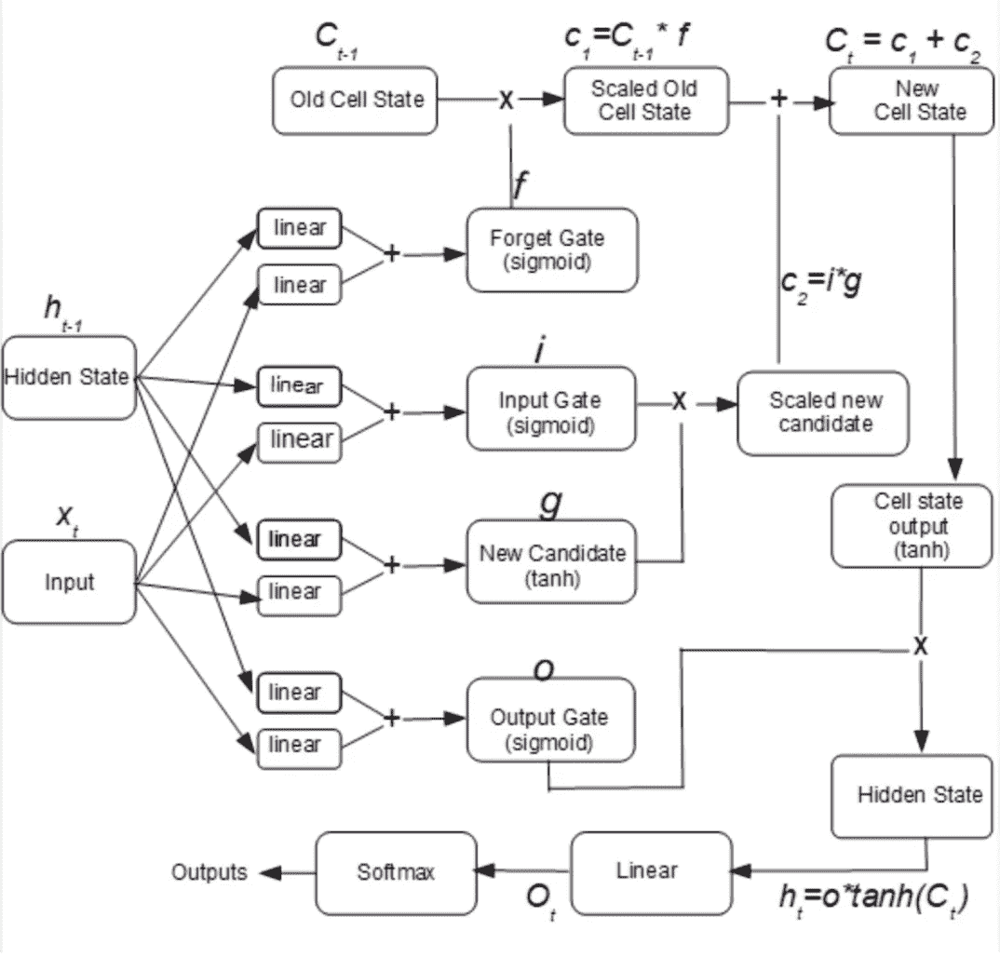
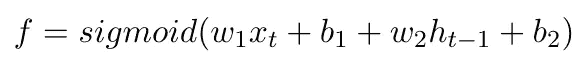
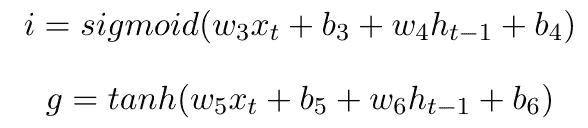
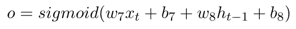

# 长短期记忆网络的基本介绍

> 原文：<https://medium.com/analytics-vidhya/a-basic-introduction-to-long-short-term-memory-networks-e408c00b3fc5?source=collection_archive---------29----------------------->

> “你永远无法通过对抗现有的现实来改变事情。要改变什么，就建立一个新的模型，让现有的模型过时。”
> ― **巴克明斯特富勒**

在本系列的前一篇文章中，我们讨论了构成消失和爆炸渐变的 RNNs 的缺点。这些都可以通过长短期记忆(LSTM)网络来克服。

LSTM 网络是特殊的 RNN 细胞，专门设计用于学习长期依赖性，而这是 rnn 所缺乏的。受生物大脑记忆长期依赖关系能力的启发，LSTM 网络试图将其纳入人工网络。为了实现这一点，它在由四个门表示的每个时间步长传递一个单元状态。

LSTM 建筑概述[1]

第一个门是遗忘门，它决定下一步要传递的信息。它是通过与旧单元状态逐元素相乘并进一步应用 sigmoid 激活来计算的。

遗忘门 f 的数学表示

输入门和缩放的新候选门共同确定将为下一状态保留的信息。将输入门(sigmoid 函数)乘以新的候选门(tanh 函数),以创建临时张量、缩放的新候选。这种方法有助于防止渐变消失的问题。

输入门 I 和新候选门 g 的数学表示

通过将缩放的新候选单元状态和缩放的旧单元状态相加来计算新单元状态，以便放大数据中的重要特征。最后一个门是输出门，它是一个 sigmoid 函数。输出生成过程包括通过双曲正切函数传递新的单元状态，并用输出门执行逐元素乘法以获得隐藏状态。这通过 sigmoid 和 Softmax 函数的非线性组合来产生最终输出[2]。

输出门 o 的数学表示

我们的人工神经网络系列到此结束。如果你能坚持到这里，谢谢你支持我的工作。我也会在其他领域写内容，所以请保持关注！

[1] Kostadinov，S. & Safari，一家奥莱利传媒公司，2018 年。递归神经网络与 Python 快速入门指南第 1 版。，Packt 出版公司。

[2]朱利安博士，2018。用 Pytorch 进行深度学习快速入门指南:学习用 Python 训练和部署神经网络模型，伯明翰:Packt。