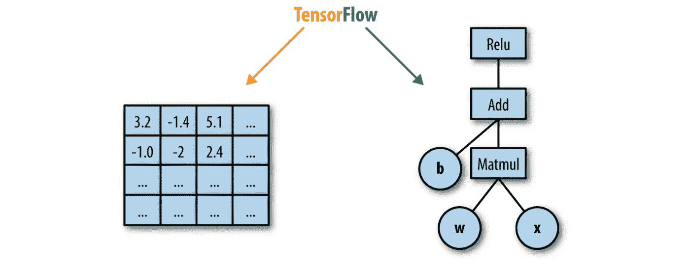
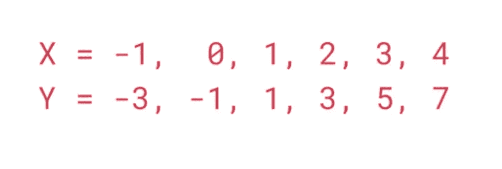
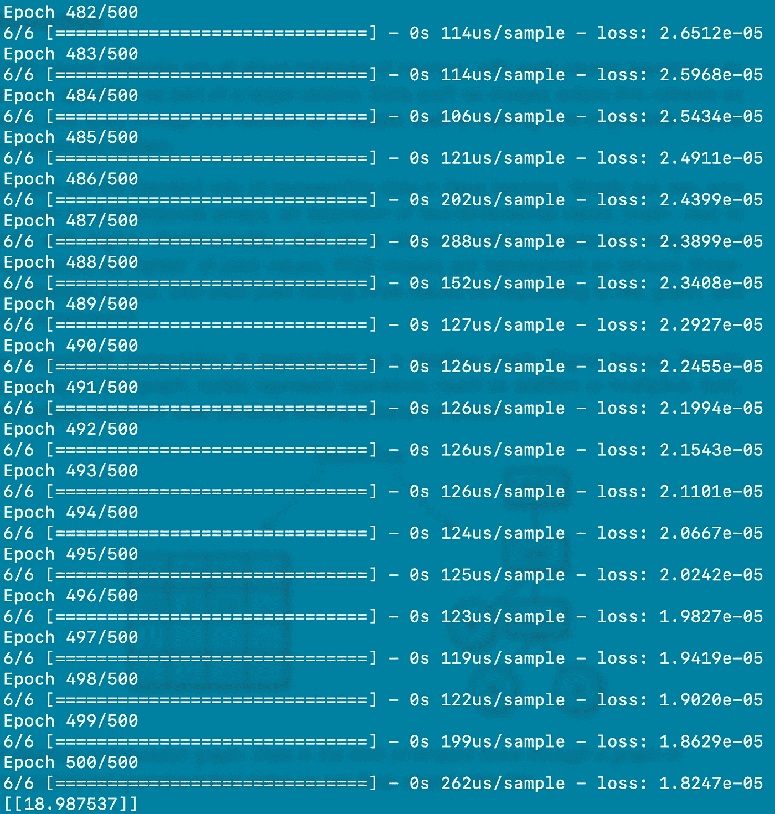

# 一个基本的神经网络！！

> 原文：<https://medium.com/analytics-vidhya/a-basic-neural-network-90a1655294bc?source=collection_archive---------31----------------------->

这篇文章包括一个使用 TensorFlow、Keras、Numpy 和 Python 的基本神经网络实现。

# 张量流

TensorFlow 是一个免费的开源软件库，用于数据流和一系列任务的差异化编程。它是一个符号数学库，也用于机器学习应用，如神经网络。

深度神经网络完全是关于神经元的网络，每个神经元都学习做自己的操作，作为更大画面的一部分。图像等数据作为输入进入该网络，并在网络中流动，因为它在训练时自适应或在部署的系统中预测输出。

张量是深度学习中表示数据的标准方式。简单来说，张量只是多维数组，是二维表格(矩阵)向更高维度数据的扩展。正如黑白(灰度)图像被表示为像素值的“表格”, RGB 图像被表示为张量(三维阵列),每个像素具有对应于红色、绿色和蓝色分量的三个值。

在 TensorFlow 中，计算被视为数据流图(如下图所示)。广义来说，在这个图中，节点代表运算(如加法或乘法)，边代表在系统中流动的数据(张量)。



*一个数据流计算图。张量形式的数据流经构成我们深度神经网络的计算操作图。*

# 张量流架构

TensorFlow 架构分为三个部分:

*   预处理数据
*   建立模型
*   训练和评估模型

之所以称为 TensorFlow，是因为它将输入作为多维数组，也称为 tensors。您可以构建一种想要对该输入执行的操作流程图(称为图形)。输入从一端进入，然后流经这个多重操作的系统，从另一端作为输出出来。

这就是为什么它被称为张量流，因为张量进去，它流过一系列操作，然后从另一边出来。

# 克拉斯

Keras 是一个用于深度学习的极简 Python 库，可以运行在 Theano 或 TensorFlow 之上。

它的开发是为了使深度学习模型的实现尽可能快速和简单，以便于研究和开发。

它运行在 Python 2.7 或 3.5 上，可以在给定底层框架的 GPU 和 CPU 上无缝执行。它是在许可的 MIT 许可下发布的。

# 装置

创建虚拟环境

```
pip3 install virtualenvvirtualenv -p ~/home tensorflow
```

激活虚拟环境

```
source ~/home/tensorflow/bin/activate
```

安装 TensorFlow

```
pip3 install tensorflow
```

安装 Keras

```
pip3 install Keras
```

安装 Numpy

```
pip3 install numpy
```

# 人工神经网络

通俗地说，人工神经网络是人脑如何工作的人工实现，它由我们称为节点或单元的神经元组成。

神经网络由许多通过链接连接的节点或单元组成。每个链接都有一个与之关联的数字权重。权重是神经网络中长期存储的主要手段，学习通常通过更新权重来进行。一些单元连接到外部环境，可以被指定为输入或输出单元。权重被修改，以便试图使网络的输入/输出行为与提供输入的环境的行为更加一致。

人工神经网络有不同的类型。如卷积神经网络(CNN)、递归神经网络(RNN)等。一个非常基本的单层神经网络被称为感知器。这里我们就不多赘述了。


# 履行

我们将从 X 和 y 之间一个非常基本的数学关系开始。



这里给出了 X 和 Y 的不同值。有一个公式将 X 映射到 y。手动计算有点困难，因为我们需要做大量的尝试才能得出结论。

结论是:

```
Y = 2X - 1
```

我们可以用神经网络在几秒钟内计算出来。神经网络将做的是一次又一次地猜测值，就像我们通过反复试验所做的那样。

下面是实现这一点的代码，

该代码将给出以下输出:



在这里，我们可以看到，对于 X = 10.0 的值，Y 的值为 18.987537。

我们应该得到 Y = 19.0，但是由于我们只训练了 500 个时期的模型，而且训练数据非常少，即只有 6 个 X 和 Y 值。因此，结果中的这些差异是常见的，也是意料之中的。

就像这样，人工神经网络可以用于许多方面，例如图像分类、自然语言处理、语音识别等等。

TensorFlow 是最新的非常可靠的构建神经网络的库或框架。它还包括可视化工具包，如 TensorBoard 和一个灵活的高性能服务系统，以服务/导出称为 TensorFlow 服务的模型。