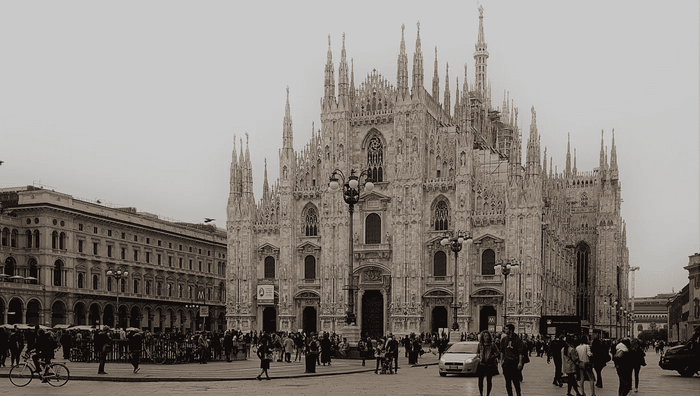

# 哪里的房子卖得更便宜:米兰街区之间的战争

> 原文：<https://medium.com/analytics-vidhya/a-battle-between-milan-neighborhoods-a777f6205e39?source=collection_archive---------0----------------------->

米兰大都市是意大利工业领域的领先城市，也是意大利真正的经济力量。

它以时尚和设计闻名，人口超过 100 万，是意大利人口最多的城市之一，也是第二大游客最多的城市，仅次于罗马。