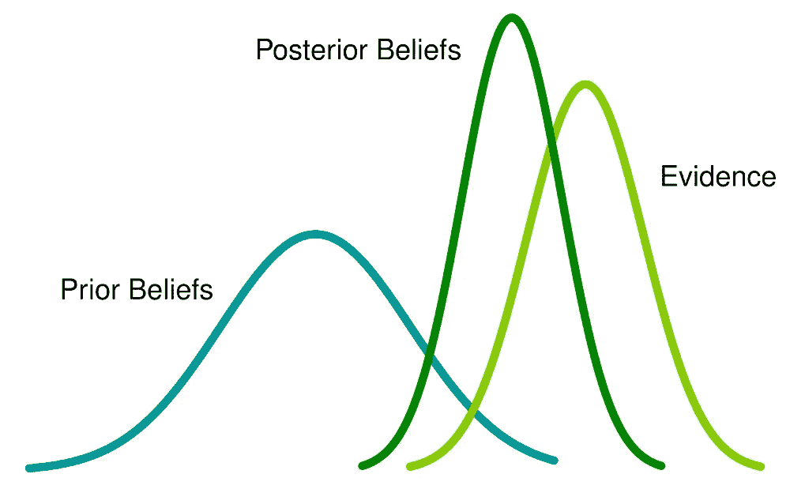

# 岭和套索回归的贝叶斯解释

> 原文：<https://medium.com/analytics-vidhya/a-bayesian-interpretation-of-ridge-and-lasso-regressions-d169134ade65?source=collection_archive---------4----------------------->

每个机器学习模型都被赋予了一个[方差-偏差权衡](/analytics-vidhya/the-bias-variance-trade-off-ee613811ba72?source=your_stories_page---------------------------):基本上，我们必须决定是训练一个非常适合训练数据的模型，因此它将具有低偏差(以高可变性为代价)还是让我们的模型“更平滑”，以更大的偏差为代价减少其方差。