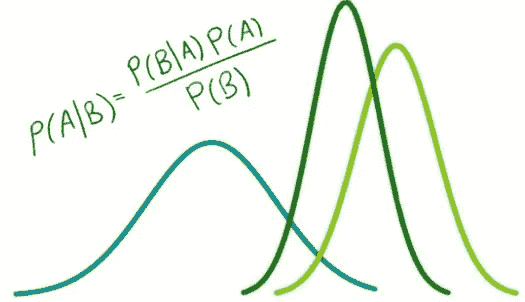
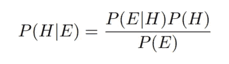
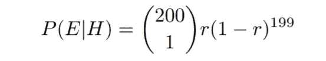
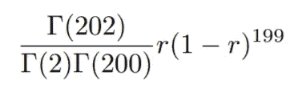
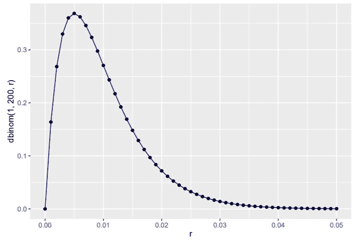

# 从贝叶斯角度看新冠肺炎疫情

> 原文：<https://medium.com/analytics-vidhya/a-bayesian-view-on-covid-19-outbreak-4250dbcda6e7?source=collection_archive---------40----------------------->

*茂物通勤线上的研究案例和估计新冠肺炎感染率的贝叶斯方法*



资料来源:LACOL.net

# 茂物通勤线上的新冠肺炎测试

通勤线路在当地被称为 *Kereta Rel Listrik* (KRL)，是 Jabodetabek 最繁忙的交通方式之一。它每天运送近 141，330 名乘客，即使是在物理距离遥远的“PSBB”。周一(2020 年 5 月 11 日)，茂物区政府对 **200 名 KRL 乘客**的样本进行快速拭子检测。根据检测，他们发现 **1 人**被检测为新冠肺炎阳性。大致可以估算出，每 200 名乘客中，就会有 1 人检测为阳性(感染率 0.5%)。然而，仅通过将这两个数字相除来估计感染率可能是不切实际的。

# 估计传染率的贝叶斯定理

贝叶斯定理在数学上表述为以下等式:



以“H”为假设，以“E”为证据，我们可以利用上面的等式来估计茂物 KRL 的感染率，给定周一的测试结果。我们的假设是:
*感染率将是检测呈阳性的人与可用总人数的比例，用 r 表示*
有证据显示，从接受检测的 200 名乘客中，只有 1 人新冠肺炎检测呈阳性。
假设假设为真，该证据出现的概率将表示为二项分布 PDF，如下所示



使用二项式模型和贝塔分布作为先验，我们可以通过使用贝叶斯定理找到后验。将上面的等式乘以β分布 PDF 后，我们知道后验概率也将是β分布，但具有更新的超参数(α= 1+1 且β= 1+200–1 的β分布)。

因为后验概率与先验概率属于同一个分布族，所以二项式模型的共轭先验概率就是贝塔分布。因此，后验分布将是β(2，200 ),表示为以下表达式



我们可以通过使用“for”循环或 r 中的 sapply()函数迭代 r 的每个可能值来生成 Beta 分布图。

```
#define function for P(E|H)
beta<-function(r){
  return(200*r*(1-r)^(199))
}
#possible values of r
r<-seq(from=0,to=5/100,by=0.1/100)
#for loop
p<-c()
for(i in 1:length(r)){
  p[i]<-print(beta(r[i]))
}
```

或者，我们也可以使用 dbinom()函数或 dbeta()函数直接生成 beta 分布图，两个函数将返回相同的图。

```
library(ggplot2)
r<-seq(from=0,to=5/100,by=0.1/100)
#density plot
dat<-data.frame(r,dbinom(1,200,r))
plot<-ggplot(dat,aes(r,dbinom(1,200,r)))+
  geom_point()+
  geom_line(col='darkblue')
plot
```



使用 ggplot2 包生成的图

以贝塔分布为后验 PDF，95%置信区间，通过寻找贝塔分布曲线下产生面积为 0.95 的上下界，我们可以说感染率的区间将为 0.00121 到 0.02741 ( **0.121%到 2.741%** )。

```
#lower bound (95% CI, two-tailed)
qbeta(0.025,2,200)#upper bound (95% CI, two-tailed)
qbeta(0.975,2,200)
```

因此，假设 KRL 列车内有 1000 人，大约有 **1 人，直到 27 人**新冠肺炎检测呈阳性。

# 结论

除了 SIR 模型，这是一种估计新冠肺炎行为的确定性方法，我们还可以使用贝叶斯定理作为一种不同的方法来估计感染人数。使用这种方法的主要思想是考虑到病毒行为的随机性和不确定性。这个研究案例只是新冠肺炎在 KRL 乘客身上传播的一个简单例子。这种方法确实可以成为决策者在 KRL 的火车、车站甚至更大范围内确定预防措施的一种方式。