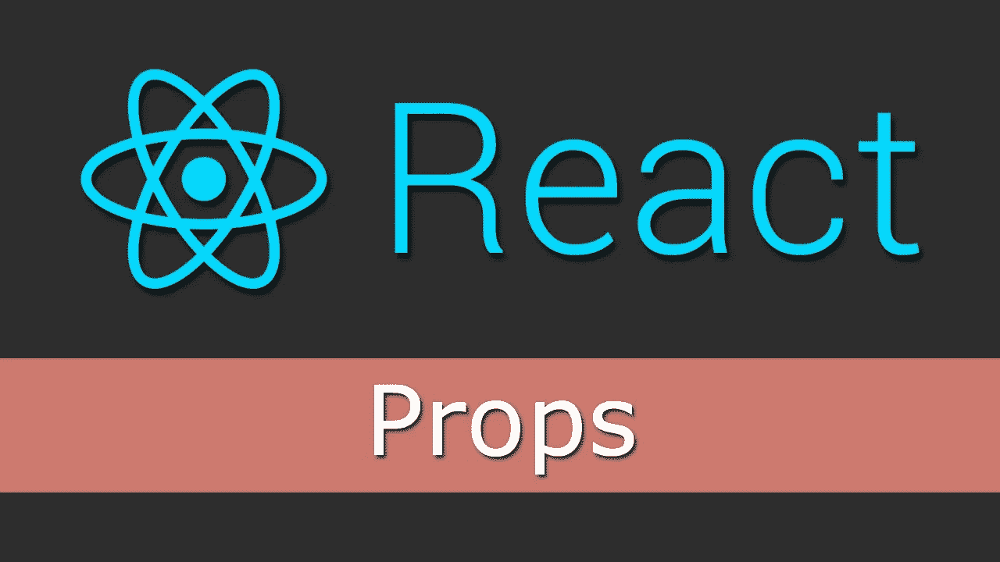
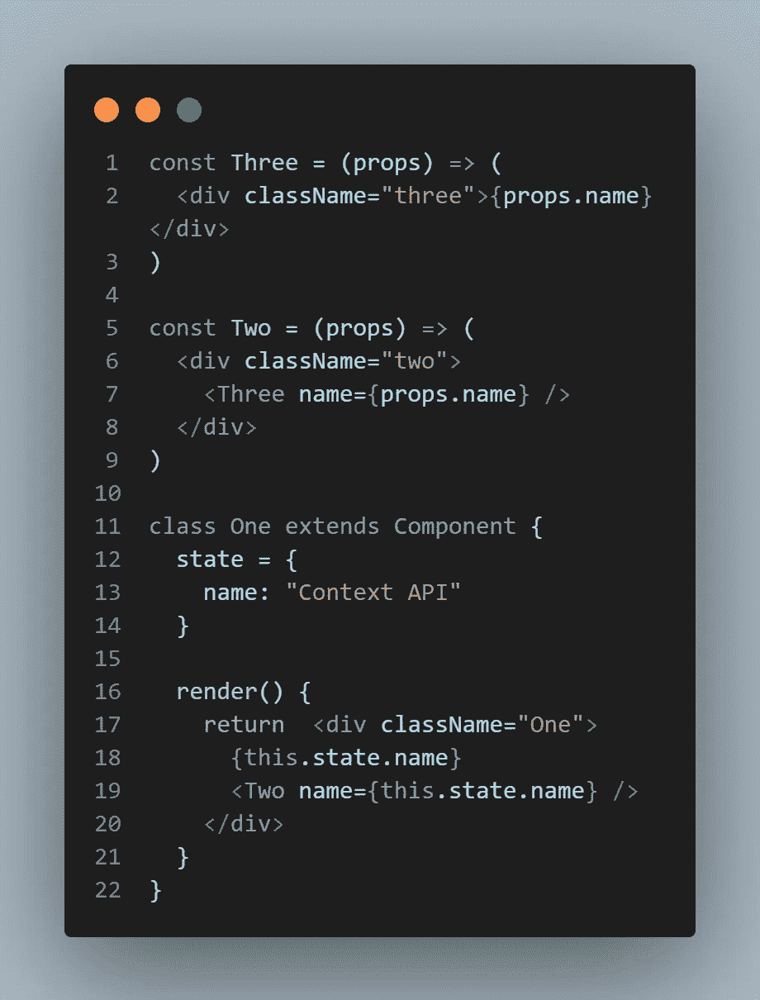
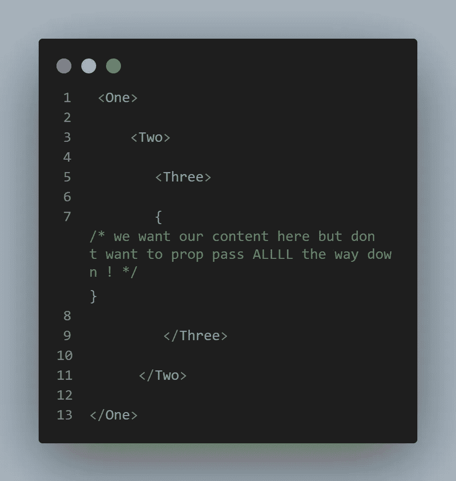
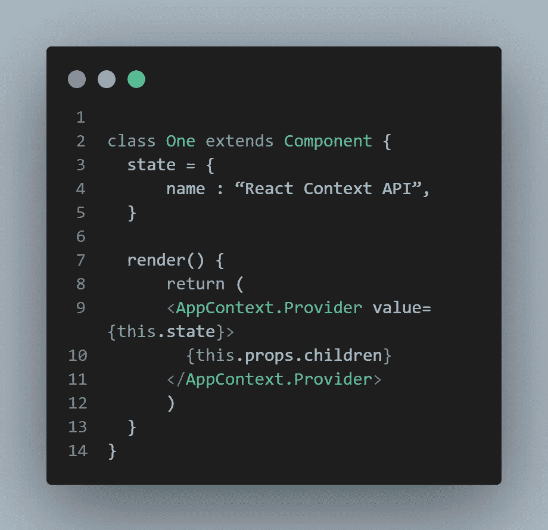
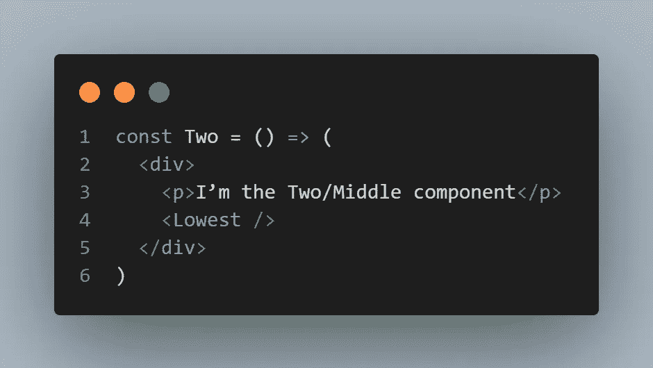
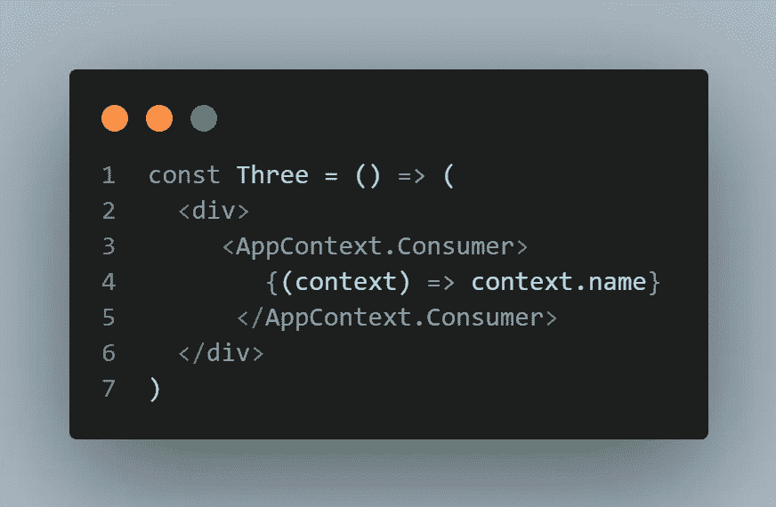

# React JS 中上下文 API 的初学者指南

> 原文：<https://medium.com/analytics-vidhya/a-beginner-guide-to-context-api-in-react-js-e7f9ea63c6?source=collection_archive---------8----------------------->

在这篇文章中，我们将努力使它变得简单，这将有助于你理解，什么是上下文 API？以及何时使用？

**所以让我们开始吧……**

在学习 React js 的时候，你可能对上下文 API 这个词很熟悉，但是没有很好地理解它。不要担心，只要仔细阅读这个……

**什么是上下文 API:** 在 React 16.3 之前我们没有访问上下文 API 的权限。官方建议开发人员避免使用它，但现在上下文 API 是一等公民，没有人告诉你要避免它。上下文 API 提供了一种在多个组件之间共享全局数据的简单方法，而不必将其作为道具传递。它解决了一个常见的问题，称为支柱钻井问题。并使前端开发人员在使用钻柱时比以前更容易。其中 props 需要被传递给树中的多个组件，以到达需要它的组件。

简而言之，我们可以说…引入上下文 API 是为了允许你在应用中传递状态，而不需要使用道具。

在许多情况下，它允许我们避免使用 Redux，大大简化了我们的应用程序，并学习如何使用 React。如果不在**评论区**敲打我，我希望你能清楚。

**何时使用上下文 API:**

上下文 API 对于在组件之间共享状态是很有用的，我们不容易用 props 来管理/共享。在给定的钻柱示例中，我们可以理解上下文 API 正在解决什么问题。

{ **在本文中我们忽略了安装和依赖部分，你可以很容易地在这里找到它**}

在这个例子中，我们将看到如何将信息从一个组件传递到子组件，然后传递到该组件的子组件。

这就是那些(一个->两个->三个)组件嵌套的方式。

像这样…

如果<one>想和<three>沟通对话，他们需要<two>做信使。这可以通过使用**反应上下文 API** 来解决。</two></three></one>

***用上下文 API 解析；)***

我们的 **<一个>** 组件会有状态。我们的状态将有一个名称，我们将希望将它传递给三个> 组件，而不必与两个**<>**组件对话:

我们希望将我们的子组件构建到那个称之为 **<** `**Two>**`的组件中:

它的子组件将被称为`<Three>`:

***就是这样，我们做到了！！！***

你会看到我们在 **<中有一个状态>** ，我们想把它传递给 **<三个>。我们有静态属性，允许我们声明我们想要的上下文。**

在这里,**提供者**持有该数据，以便当它被另一个组件**消费时，它知道该给它什么。在我们的 **<三>** 组件中，您会看到我们有消费者想要的数据，而不必首先将其传递给 **<两>** 组件。该组件只是挂起，声明 **<三个>** 是它的子组件。而且你可以用你喜欢的名字代替 **<一、二、三>** 为了更好的理解我们只是忽略了现实的名字。**

***这篇文章就这样了。肯特·c·多兹有一篇精彩的博客文章，我向你推荐。如果你有时间，请检查一下。相信我，它会让你的知识更上一层楼。***

下一个有趣的话题很快再见！！！！！

*🎉🎉🎉* ***如果你喜欢这个帖子，请*** 👏👏👏***在 Medium 上并在 Twitter 上分享。我会非常感激的。*T39*🎉🎉🎉***