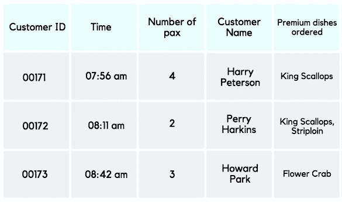
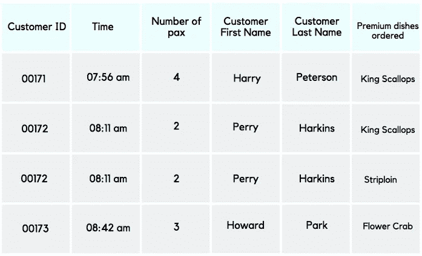

# 初学者理解数据规范化的尝试

> 原文：<https://medium.com/analytics-vidhya/a-beginners-attempt-at-understanding-data-normalization-bbbfc4f3a281?source=collection_archive---------9----------------------->

托拜厄斯·菲舍尔在 [Unsplash](https://unsplash.com?utm_source=medium&utm_medium=referral) 上的照片

我会完全诚实；处理数据对我来说一直是一种痛苦。因为我完全没有头绪，对任何与数据相关的东西都不感兴趣，除了有助于说明一个特别有趣的观点的统计数字。

在这个大学学期开始时，我选择了一个名为“制定有意义的指标”的模块。一开始是一场噩梦；在这个模块中，我跌跌撞撞、笨手笨脚地摆弄着数字和图表，对自己的理解能力感到恐慌和绝望，并意识到自己在从数据创作中获得深刻发现方面的失败。

天啊。回顾我是如何开始与数据打交道的，我真的不擅长这个。让我从现在的位置上移开的是多个 Tableau 教程视频，谷歌搜索和寻找可以帮助像我这样的“数据傻瓜”的资源，最重要的是，无论我是否要求，我的教授都会持续不断地支持我。教授一直在和我一起工作，他不是把我们每个人和班上其他人放在一个比较范围内，而是把我们和自己放在一个比较范围内。

上周，我做了一个数据可视化，并将其发送到 Reddit 上，希望收到反馈并与数据社区的其他用户进行对话，以便让自己在学习这个主题方面向前迈进。另一位用户向我简要介绍了数据规范化的概念，我兴奋地与我的教授分享了这个概念，最终导致了一阵恐慌。

因为我的教授随后不经意地给了我一个挑战；"为什么不写一篇关于数据规范化的中型文章呢？"尽管我有抵触情绪，但我知道我最终会这么做，因为我有一种令人讨厌的固执的特质，那就是在有挑战性的、可能会让我有所提高的任务面前“只管去做”。

所以现在开始。

# 理解数据规范化的初学者(我的)尝试。

这篇文章将让你看到我试图用自己的简单例子来解释关系数据库表的 3 种规范化程度之间的基本区别。

我选择解释我的创建过程的每一步，而不是向您展示最终产品，尽管这相对来说更有价值，因为我觉得利用我的错误来帮助您学习和理解数据标准化的一些基本注意事项更有价值。

当然，我真的仍然处于探索数据的最基本水平，并且很乐意从社区接收关于这个数据主题的反馈和知识。

图 1NF 的第一次(也是最糟糕的)尝试。

## 第一范式(1NF)

这是我想用来演示第一范式(1NF)的第一张表。但是在阅读了在线用户在谷歌上对 1NF 特征的一些解释后，这些是我为 1NF 确定的一些一般性特征；

1.  数据不能被进一步分解(原子的)。
2.  列没有重复数据(没有双胞胎)。
3.  每一行都是唯一的。
4.  每个字段都有一个唯一的名称。

在对这些特征有了更清晰的理解后，这是我对图 1 的修改版，用于 1NF 数据可视化。

图 1NF 数据可视化的更精确表示。

## 第二范式(2NF)

继续 2NF。

我观察到的被大多数在线资源认同的 2NF 的一些标准是这些；

1.  数据已经在 1NF 了(咄。)
2.  非键属性在功能上依赖于主键。

*   一切都应该依赖于一个键(例如，客户 ID)
*   在上面的例子中，“高级菜肴订购”不是，所以我将把这一列移到一个单独的表中，从而有 2 列；“客户 ID”和“高级菜肴订购”。

## 第三范式(3NF)

最后，我将介绍一下我对 3NF 的理解。

1.  已经在 2NF 了(不出意外)。
2.  并且没有传递依赖。

*   非键属性不应该依赖于其他非键属性。

如果社区感兴趣的话，我会在 3NF 上写一个更详细的帖子，并非常感谢您在评论区对这个特定的数据主题提出反馈和改进建议！

谢谢你读完这篇文章，这是令人鼓舞的:)