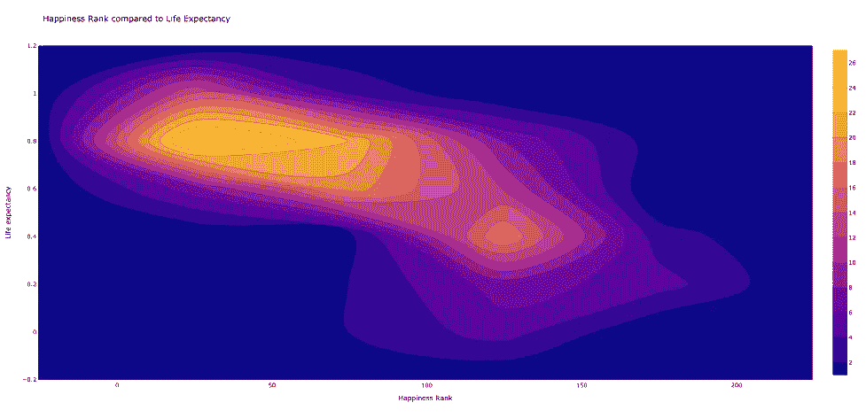

# 初学者指南:应用 Plotly 创建有效的数据可视化

> 原文：<https://medium.com/analytics-vidhya/a-beginners-guide-applying-plotly-to-create-effective-data-visualizations-ecb3d5756d41?source=collection_archive---------9----------------------->

格雷厄姆·沃特斯

布兰代斯大学研究生专业研究系

如果你对 plotly 能为你的业务做些什么感到好奇，并想尝试编写一些基本的 Plotly 可视化代码，那么这就是你要找的文章。如果你没有时间阅读…