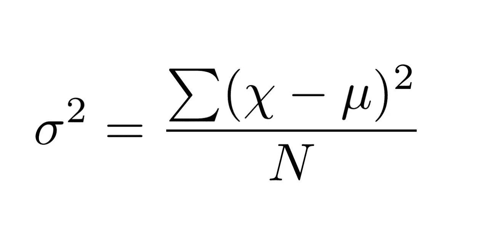
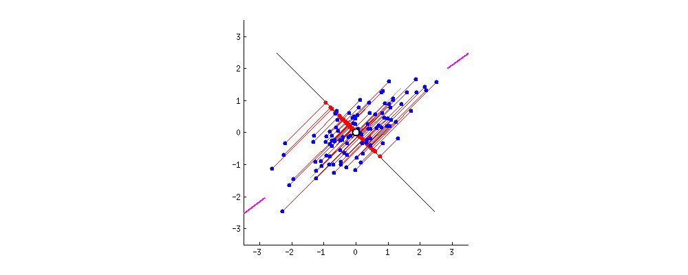

# 使用主成分分析(PCA)降维的初学者指南。

> 原文：<https://medium.com/analytics-vidhya/a-beginners-guide-for-dimensionality-reduction-using-principle-component-analysis-pca-c4c515ae49c1?source=collection_archive---------3----------------------->

在将数据放入模型之前，将数据可视化。


[维克多](https://unsplash.com/@victor_g?utm_source=medium&utm_medium=referral)在 [Unsplash](https://unsplash.com?utm_source=medium&utm_medium=referral) 上的照片

在进入正题之前，我有一个问题要问你。问题是——“**你有没有想过，当你第一次在学校或大学学习这些数学概念时，你为什么还要学习它们，比如直线方程、平面、特征值、特征向量等等，或者它们在现实世界中有什么应用。**

****

**坦率地说，当时我也不知道，但我向你保证，我们将一起解决这个谜:)**

**在解释这些话题的所有可能性中，今天我将尝试从数据科学|机器学习的角度来解释它们。让我们看一下目录:**

1.  **为什么是 PCA？**
2.  **主成分分析的几何直觉**
3.  **PCA(方差最大化)的数学目标函数**
4.  **PCA 的替代公式(距离最小化)**
5.  **特征值和特征向量**
6.  **PCA 代码**
7.  **PCA 的局限性**
8.  **五氯苯甲醚的其他用途**

> ****先决条件**:我假设你知道一些基础知识，比如什么是数据集，数据集中的特征是什么，以及一些高中数学知识。没什么！。**

*****为什么是 PCA？*****

**假设你有一个非常高维的数据集，比如 MNIST 数据集，它有 784 个维度。如果我说“可视化这些数据”呢。**

****

**照片由[帕特里克·福尔](https://unsplash.com/@patrickian4?utm_source=medium&utm_medium=referral)在 [Unsplash](https://unsplash.com?utm_source=medium&utm_medium=referral) 拍摄**

**当然，我们人类无法想象超过 3 个维度。这就是 PCA 发挥作用的地方。**

**除了可视化，PCA 还有其他的用途，我们会在继续学习这个概念的时候看到。**

*****几何直觉*****

**出于解释目的，让我们采用 2D 数据集来代替 784。假设我们有一个包含两个特征 f1 和 f2 的数据集。 **f1** 代表头发的黑度 **f2** 代表身高(我知道这没有意义但是请多包涵！)**

****

**这个数据是二维的，因为我们有两个特征。如您所见，分布在特征 f2 上的数据点比分布在 f1 上的数据点多。**

> **价差的数学术语叫做方差**

**如果我们被迫从 2D 到 1D，我们可以将这些点投影到特征 f2 上，并且简单地说这是数据的 1D 表示，因为**分布/方差**更多地在 f2 上。这是简单的权利。**

> **这次我们来看一个稍微棘手的数据:**

****

**如您所见，在这种情况下，f1 和 f2 保持相同的价差/方差。**

**如果选择 f1 或 f2，将会丢失 50%的信息。在这种情况下，你会怎么做？**

**一个想法是，我们将轴的 f1 和 f2 分别旋转为 f1 '和 f2 '，其中 f1' ⊥ f2 '，这样 f1 '比 f2 '具有最大的扩散(见下图):**

****

**因为我们找到了具有最大展开 f1’的轴。现在我们可以放下 F2’并将 Xi 的(数据点)完全投射到 f1’上。我们的目标现在实现了，即从二维走向一维。**

**这就是 PCA 的基本功能。它试图找到正确的方向，在这个方向上我们可以保留更多的数据信息，并删除不必要的维度。**

> **现在我们来看看这个伟大想法背后的数学原理:**

****T3【PCA】数学目标函数 ****

****

**符号和先决条件公式:**

1.  **我们将 f1’表示为“u1 ”,即最大方差轴，因为大多数在线解释更喜欢这种符号。**
2.  **所以，我们想找到单位向量 u1，即||u1||=1，它保持最大方差。**
3.  **u1 = u1^T.Xi 上 Xi 的投影(这是我们想弄清楚的。)**
4.  **我们假设数据是列标准化的，这意味着均值( **μ** )=0，标准差( **σ** )=1。**

> **来到数学方程式:**

**方差公式:**

****

**现在我们将上述公式与我们的问题联系起来:**

****

**我们想要找出 u1，使得投射到 u1 上的 Xi 的扩散/方差最大。**

**所以我们要求的函数如下(见左边的方程)。**

****

**因为我们假设数据是列标准化的，这意味着 mean=0，所以上述等式中的 **u1^T. x̄** 部分变为 0。**

****

**所以，这将是最终的优化函数，我们要解决的是，在 u1 是单位向量的约束下，找到方差最大的 u1。**

****五氯苯甲醚的替代配方:(距离最小化)****

****

**参考:https://stats.stackexchange.com/a/140579**

**从上图中可以看出，在这个距离公式中，我们必须将 Xi 点到 u1 的距离最小化。**

****

**相邻距离不过是 Xi 到 u1 的投影，斜边是 Xi 的长度。现在我们可以很容易地从毕达哥拉斯定理中找出距离 b/w Xi 和 u1，即 di。**

****

**现在，最终的距离优化函数如下，其中我们希望通过最小化点 Xi 到 u1 的距离来找到 u1。**

**之前的优化函数是方差最大化，而这个是距离最小化。**

****特征值和特征向量****

**我不打算在这里解释定义*(你有你的朋友谷歌！)*，不过我会解释为什么这些在 PCA 中有用。**

> **前提概念:协方差矩阵。**

**我们的优化函数的解可以通过使用由(λ1，λ2，λ3…表示的特征值和向量来获得。，λd)和(V1，V2，V3，…Vd)。记住特征值是标量。**

**Sklearn 库中有一个简单的函数，你必须给它一个协方差矩阵，它会返回相应的特征值和向量，其中λ1>λ2>λ3>…>λd。**

****

**这意味着对应于λ1 的向量，即 V1 具有解释的最高方差，然后是λ2，即 V2，它是解释的方差第二大的向量，依此类推。**

**所以我们试图从优化函数中得到的 u1，就是这里的 V1。**

****

**一个非常好的性质是，每一对本征向量都是相互垂直的。**

**这意味着如果我们取 V1 和 V2，即对应于最高特征值的最高两个向量，这类似于得到 f1 '和 f2 '。类似地，我们可以将“d”表示为 700 或 300 或 100 或 2 或 1，或者您想要减少到的任何数量的维度，它将返回数据集的顶部维度。**

**好吧！！理论说够了。让我们深入到代码部分。**

****PCA 代码****

> ****手动执行:****

**导入一些有用的库:**

```
import numpy as np
import pandas as pd
import matplotlib.pyplot as plt
```

**正在加载数据集:**

```
d0 = pd.read_csv(‘./mnist_train.csv’)
l = d0[‘label’]
d = d0.drop(“label”,axis=1)
```

**检查形状:**

```
print(d.shape)
print(l.shape)
```

**(42000，784)
(42000，)**

**正如你所看到的，有 784 个维度，每个维度代表图像中的一个像素**

**让我们看看图像在该数据集中是什么样子的:**

****

**首先，正如我之前所说，我们必须将数据标准化:**

```
from sklearn.preprocessing import StandardScaler
standardized_data = StandardScaler().fit_transform(data)
```

**构建协方差矩阵:**

```
sample_data = standardized_data
covar_matrix = np.matmul(sample_data.T , sample_data)print ( “The shape of variance matrix = “, covar_matrix.shape)The shape of variance matrix =  (784, 784)
```

**寻找特征值和向量:**

```
from scipy.linalg import eigh
values, vectors = eigh(covar_matrix, eigvals=(782,783))print(“Shape of eigen vectors = “,vectors.shape)
# converting the eigen vectors into (2,d) shape for easyness of further computations
vectors = vectors.Tprint(“Updated shape of eigen vectors = “,vectors.shape)
# here the vectors[1] represent the eigen vector corresponding 1st principal eigen vector
# here the vectors[0] represent the eigen vector corresponding 2nd principal eigen vector
```

> **特征向量的形状= (784，2)
> 更新的特征向量的形状= (2，784)**

**通过向量-向量乘法将原始数据样本投影到由两个主特征向量形成的平面上:**

```
import matplotlib.pyplot as plt
new_coordinates = np.matmul(vectors, sample_data.T)print (“ resultant new data points’ shape “, vectors.shape, “X”, sample_data.T.shape,” = “, new_coordinates.shape
```

> **生成的新数据点的形状为(2，784) X (784，15000) = (2，15000)**

```
# appending label to the 2d projected data
new_coordinates = np.vstack((new_coordinates, labels)).T# creating a new data frame for ploting the labeled points.
dataframe = pd.DataFrame(data=new_coordinates, columns=(“1st_principal”, “2nd_principal”, “label”))
print(dataframe.head())1st_principal  2nd_principal  label
0      -5.558661      -5.043558    1.0
1       6.193635      19.305278    0.0
2      -1.909878      -7.678775    1.0
3       5.525748      -0.464845    4.0
4       6.366527      26.644289    0.0
```

**绘图:**

```
# ploting the 2d data points with seaborn
import seaborn as sn
sn.FacetGrid(dataframe, hue=”label”, size=6).map(plt.scatter, ‘1st_principal’, ‘2nd_principal’).add_legend()
plt.show()
```

****

> *****Sklearn 的实现:*****

**Sklearn 有一个名为 decomposition 的包，可以简化我们的任务，而不是编写这么多代码:**

```
# initializing the pca
from sklearn import decomposition
pca = decomposition.PCA()# configuring the parameteres
# the number of components = 2
pca.n_components = 2
pca_data = pca.fit_transform(sample_data)# pca_reduced will contain the 2-d projects of simple data
print(“shape of pca_reduced.shape = “, pca_data.shape)
```

**pca_reduced.shape = (15000，2)的形状**

**绘图:**

```
# attaching the label for each 2-d data point 
pca_data = np.vstack((pca_data.T, labels)).T# creating a new data fram which help us in ploting the result data
pca_df = pd.DataFrame(data=pca_data, columns=(“1st_principal”, “2nd_principal”, “label”))
sn.FacetGrid(pca_df, hue=”label”, size=6).map(plt.scatter, ‘1st_principal’, ‘2nd_principal’).add_legend()
plt.show()
```

****

> **解释的差异与维度数量:**

****

**如您所见，仅使用 200 个特征/尺寸就可以解释或保留 90%的差异。因此，不要使用所有的 784 个维度来建模，你可以选择 200 个特征或者更好，即使你选择 400 个维度，你也可以保留 99%的信息。**

****PCA 的局限性****

> **一些失败案例包括:**

****

**参赛作品:[https://qr.ae/TWozmU](https://qr.ae/TWozmU)**

1.  **PCA 关注于寻找包含可能的最高方差的数据集的正交投影，以便在数据集的变量之间“寻找隐藏的线性相关性”。**

****

**参赛:https://qr.ae/TWozmU**

**但是如果你的特征不是线性的，比如说是螺旋形或者其他形状，那么 PCA 就不是你的最佳选择。**

****

**2.如果你的数据集遵循一个很好的结构，比如正弦波，如果你把它投影到 V1，我们就失去了关于结构的重要信息，这些信息可能在机器学习任务中有用，比如特征工程。**

****五氯苯甲醚的其他用途****

1.  ****缩减大小**:当我们有太多的数据，我们将使用随机森林、XGBoost 等过程密集型算法处理数据时，我们需要消除冗余。**
2.  **不同的视角:有时视角的改变比减少更重要。**

****

**参考:https://qr.ae/TWo65s**

> **如果你发现本博客有任何错误，欢迎在评论框中讨论。**

****

**[http://gph.is/19Mx2oF](http://gph.is/19Mx2oF)**

**我将会张贴越来越多的内容，以更简单的方式解释各种复杂的主题。直到那时再见:)**

**在 Linkedin 上关注我:[https://www.linkedin.com/in/dileep-teja-473088141/](https://www.linkedin.com/in/dileep-teja-473088141/)**