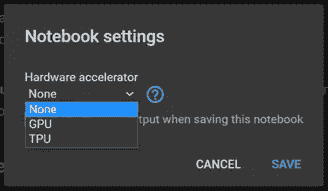

# 机器学习入门指南

> 原文：<https://medium.com/analytics-vidhya/a-beginners-guide-for-getting-started-with-machine-learning-7ba2cd5796ae?source=collection_archive---------5----------------------->

如果你看到了这篇文章，很可能你一直想知道机器学习是怎么回事，或者如何开始。不要担心，让我们在接下来的几分钟内完成所有这些！


图片来源:赛默飞世尔科技——机器学习是人工智能的一个子集

最近，似乎每次你打开浏览器或随意浏览新闻提要时，总有人写关于机器学习、它对人类的影响或人工智能的进步。这些嗡嗡声是怎么回事？你有没有想过从*虚拟助理解决方案*到*无人驾驶汽车** 和*机器人*的技术是如何运作的？

> ***关于自动驾驶汽车的更多信息，请查看我以前的文章—**
> [强化学习初学者指南及其从零开始的基本实现](https://tp6145.medium.com/a-beginners-guide-to-reinforcement-learning-and-its-basic-implementation-from-scratch-2c0b5444cc49)，[无需强化学习解决自动驾驶驾驶室问题](/nerd-for-tech/solving-the-self-driving-cab-problem-without-reinforcement-learning-5b07ac3c53ba)

不要担心！你在正确的地方得到你所有的问题的答案！

# AI 是什么？

> 外部行为像人类的程序？像人类一样内部运作的程序？具有智能行为的计算系统？

*人工智能(AI) 是计算机科学的一个广泛分支，涉及构建能够执行通常需要人类**智能的任务的智能机器— *来源:*** [*维基百科*](https://en.wikipedia.org/wiki/Artificial_intelligence) *。**

**机器学习是人工智能的子集！**

# *机器学习:精确介绍*

> *"学习是系统从经验中提高性能的任何过程."~希尔伯特·西蒙*

****机器学习*** 是 ***人工智能(AI)*** 的一个应用，它为系统提供了根据经验自动学习和改进的能力，而无需 ***显式编程—来源:***[*expert . AI*](https://www.expert.ai/blog/machine-learning-definition/)*

*机器学习不是什么新鲜事。事实上，这一历史可以追溯到 60 多年前，当时艾伦·图灵创造了 ***【图灵测试】*** 来确定一台计算机是否具有真正的智能。这个想法是——“*要被称为智能，机器必须产生与人类无法区分的反应。”**

**

*图片来源:zeol earn——机器学习的简要时间线*

*作为一个人，作为一个技术的使用者，你需要完成某些任务，这些任务需要你做出一个重要的决定或者对一些事情进行分类。例如，当你早上阅读收件箱时，你决定将那封*“点击此处，赢取免费汽车”*的邮件标记为垃圾邮件。计算机如何知道做同样的事情？*

*机器学习由算法组成，这些算法教会计算机执行人类每天自然完成的任务，比如这个！人工智能的第一次尝试包括通过编写一个规则/一组规则来教会计算机。*

**

*图片来源:inter systems——传统编程 vs 机器学习*

*如果我们想教计算机根据天气做出建议，那么我们可能会写一条规则说— *如果天气多云，降雨的可能性大于 50%，那么建议带一把伞。**

> *然而，传统专家系统中使用的这种方法的问题是，我们不知道对规则有多大的信心。有 50%的几率是对的吗？更少还是更多？*

**(你也可以参考上面图解* ***传统编程 vs 机器学习)****

# *机器学习的类型*

*根据问题的背景，它们可以分为三大类*

## *无监督学习*

*   ****后知后觉—描述性分析*** *(发生了什么？)**
*   **无标签**
*   **无反馈**
*   **查找数据中的隐藏结构**

## ****监督学习****

*   ****洞察—预测分析*** *(会发生什么？)**
*   **标签数据**
*   **直接反馈**
*   **预测结果/未来**

## *[***强化学习***](https://tp6145.medium.com/a-beginners-guide-to-reinforcement-learning-and-its-basic-implementation-from-scratch-2c0b5444cc49)********

*   ****远见—规定性分析*** *(怎样才能让它发生？)**
*   **决策过程**
*   **奖励系统**
*   **学习一系列动作**

# *机器学习的用途*

## *无监督学习*

****使用的算法——K-means 聚类、层次聚类、降维等。****

*   **组织计算集群**
*   **社交网络分析**
*   **市场细分**
*   **天文数据分析**

****相关博客:****

*   *[*关于 K 均值聚类你需要知道的一切*](/analytics-vidhya/everything-you-need-to-know-about-k-means-clustering-88ad4058cce0)*
*   *[*利用 K-means 聚类进行犯罪数据模式分析和可视化*](/analytics-vidhya/crime-data-pattern-analysis-and-visualization-using-k-means-clustering-ceeb963a2b47)*
*   *[*图像分割从零开始使用 K-means 聚类*](/analytics-vidhya/image-segmentation-using-k-means-clustering-from-scratch-1545c896e38e)*
*   *[*从零开始使用 K 均值聚类从图像中提取主色*](/analytics-vidhya/extracting-dominant-colours-in-an-image-using-k-means-clustering-from-scratch-2ce79a3eea5d)*

## *监督学习*

****使用的算法——回归、分类、决策树、随机森林、KNN、SVM、朴素贝叶斯等。****

*   **股票预测问题**
*   **房价预测**
*   **癌症预后(恶性或良性)**
*   **天气预报**

****相关博客:****

*   *[*关于线性回归你需要知道的一切*](/analytics-vidhya/everything-you-need-to-know-about-linear-regression-750a69a0ea50?source=your_stories_page-------------------------------------)*
*   *[*房价预测从零开始使用线性回归*](/analytics-vidhya/house-price-prediction-using-linear-regression-from-scratch-b2b48fd73689?source=your_stories_page-------------------------------------)*
*   *[*逻辑回归综合指南*](/analytics-vidhya/a-comprehensive-guide-to-logistic-regression-e0cf04fe738c?source=your_stories_page-------------------------------------)*
*   *[*从零开始的逻辑回归*](/swlh/logistic-regression-from-scratch-b69a2026536f?source=your_stories_page-------------------------------------)*
*   *[*决策树*](/analytics-vidhya/decision-trees-for-dummies-a8e3c00c5e2e?source=your_stories_page-------------------------------------)*
*   *[*从零开始的决策树*](/swlh/decision-tree-from-scratch-a72069240293?source=your_stories_page-------------------------------------)*
*   *[*随机森林:简体*](/analytics-vidhya/random-forest-simplified-98da251c7522?source=your_stories_page-------------------------------------)*
*   *[*从零开始随机森林*](/python-in-plain-english/random-forest-from-scratch-fcaeb0bed09a?source=your_stories_page-------------------------------------)*
*   *[*KNN 和 MNIST 手写数字识别入门使用 KNN 从零开始*](/analytics-vidhya/a-beginners-guide-to-knn-and-mnist-handwritten-digits-recognition-using-knn-from-scratch-df6fb982748a?source=your_stories_page-------------------------------------)*
*   *[*名人人脸识别从零开始使用 KNN*](/analytics-vidhya/celebrity-face-recognition-using-knn-from-scratch-76287bdab088?source=your_stories_page-------------------------------------)*
*   *[*人脸检测和识别从零开始使用 OpenCV 和 KNN*](/analytics-vidhya/face-detection-and-recognition-using-opencv-and-knn-from-scratch-dcba9b0fd07d?source=your_stories_page-------------------------------------)*
*   *[*SVM 入门*](/analytics-vidhya/a-beginners-introduction-to-svm-c641c3ff2769?source=your_stories_page-------------------------------------)*
*   *[*SVM 从无到有*](/swlh/svm-from-scratch-c2decb4a2d15?source=your_stories_page-------------------------------------)*
*   *[*朴素贝叶斯的机器学习路线图*](/analytics-vidhya/a-machine-learning-roadmap-to-naive-bayes-66437a48d9f3?source=your_stories_page-------------------------------------)*
*   *[*从零开始的朴素贝叶斯*](/swlh/naive-bayes-from-scratch-c0c93ed4b826?source=your_stories_page-------------------------------------)*

## *[强化学习](https://tp6145.medium.com/a-beginners-guide-to-reinforcement-learning-and-its-basic-implementation-from-scratch-2c0b5444cc49) **

****使用的算法——Q-Learning、SARSA、DQN、DDPG 等。****

*   **债权转让问题**
*   **玩游戏**
*   **迷宫中的机器人**
*   **平衡杆子**

*****相关博客:****

*   *[*强化学习初级指南及其从零开始的基本实现*](https://tp6145.medium.com/a-beginners-guide-to-reinforcement-learning-and-its-basic-implementation-from-scratch-2c0b5444cc49)*
*   *[*无需强化学习解决自动驾驶驾驶室问题*](/nerd-for-tech/solving-the-self-driving-cab-problem-without-reinforcement-learning-5b07ac3c53ba)*
*   *[*自动驾驶驾驶室问题 Q-Learning 简介*](/@tp6145/introduction-to-q-learning-for-the-self-driving-cab-problem-ee1dbf959b99)*

> *机器学习在过去几年中取得了巨大的进步，但我们距离达到人类水平的表现仍然非常遥远。很多时候，它仍然需要人类的协助来完成它的任务。*

# *机器学习入门*

## *需求和库*

****Python(最新版本— 3.9.0)*** 是机器学习最首选的语言。人们通常会观察到蟒蛇 3 比蟒蛇 2 更受青睐。 *GPU* 和*更大的 RAM* 通常是处理大量数据时的首选，否则需要更大的处理量，事实并非如此。*

****这里有一个对机器学习有用的库的列表—****

*   *[***熊猫***](https://pandas.pydata.org/docs/)***——****流行 Python 库进行数据分析。它提供了许多用于分组、组合和过滤数据的内置方法。**

****博客:*** [*统计分析在 Python 中使用熊猫*](/analytics-vidhya/statistical-analysis-in-python-using-pandas-27c6a4209de2)*

*   *[***Numpy***](https://numpy.org/doc/)***——****流行的 Python 库，用于矩阵处理和处理多维数组。**

****博客:*** [*熟悉 Numpy*](/analytics-vidhya/getting-familiar-with-numpy-854fc60ac497)*

*   *[***Matplotlib***](https://matplotlib.org/3.3.3/contents.html)***——****流行的用于数据可视化的 Python 库。**

****博客:*** [*数据可视化使用 Python Part-I*](/analytics-vidhya/data-visualization-using-python-part-i-19f9b76d43dc)*

*   *[***Seaborn***](https://seaborn.pydata.org/)**——又一个流行的数据可视化 Python 库。***

*****博客:*** [*数据可视化使用 Python Part-II*](/analytics-vidhya/data-visualization-using-python-part-ii-e00249fe2543)**

*   **[***Scikit-learn***](https://scikit-learn.org/)***——****机器学习入门的热门库，内置了大多数监督和非监督算法的函数。***
*   **[***Scipy***](https://www.scipy.org/docs.html)***——****它包含不同的模块，用于优化、线性代数、积分和统计，流行用于机器学习。***

*****相关博客(使用 Scipy):*** [*机器学习用数学 Part-1*](/datadriveninvestor/mathematics-for-machine-learning-part-1-5e210c138a12) *，* [*机器学习用数学 Part-2*](/datadriveninvestor/mathematics-for-machine-learning-part-2-fa36b6154dec) *，* [*机器学习用数学 Part-3*](/datadriveninvestor/mathematics-for-machine-learning-part-3-4acbc355fb03)**

*   **[***OpenCV***](https://docs.opencv.org/master/)*—一个用于计算机视觉和图像处理的开源计算机视觉和机器学习软件库。***

*****博客:*** [*计算机视觉与图像处理用 OpenCV*](/analytics-vidhya/computer-vision-and-image-processing-with-opencv-8868876618c3)**

*   **[***tensor flow***](https://www.tensorflow.org/api_docs)***——****流行用于 Google 开发的高性能数值计算。广泛用于深度学习应用。***
*   **[***Keras***](https://keras.io/api/)***—****拥有能够在 TensorFlow、CNTK 或 Theano 之上运行的高级神经网络 API。***
*   **[***py torch***](https://pytorch.org/docs/stable/index.html)***—****它拥有广泛的工具和库选择，支持计算机视觉、NLP 和许多机器学习程序。***
*   **[***the ano***](https://buildmedia.readthedocs.org/media/pdf/theano/latest/theano.pdf)***—****库，用于高效地定义、评估和优化涉及多维数组的数学表达式。***

> ****有关使用这些库的更多实现，请参考我的 GitHub Repos—**[https://github.com/tanvipenumudy/AI-ML-Weekly-Challenges](https://github.com/tanvipenumudy/AI-ML-Weekly-Challenges)[https://github.com/tanvipenumudy/Deep-Learning-Labs](https://github.com/tanvipenumudy/Deep-Learning-Labs)[https://GitHub . com/tanvipenumudy/Winter-Internity](https://github.com/tanvipenumudy/Winter-Internship-Internity)**

*****这里列出了一些有用的 IDEs 平台/编辑器/环境—*****

*   **[*谷歌合作实验室*](https://colab.research.google.com/)**
*   **[*Jupyter 笔记本*](https://jupyter.org/)**
*   **[*闲置*](https://docs.python.org/3/library/idle.html)**
*   **[*Spyder*](https://www.spyder-ide.org/)**
*   **[*皮查姆*](https://www.jetbrains.com/pycharm/)**
*   **[*原子*](https://atom.io/)**
*   **[PyDev](https://www.pydev.org/)**
*   **[*Visual Studio*](https://visualstudio.microsoft.com/)**

## **Google 协同实验室入门**

*****简称 Colaboratory 或‘Colab’***，是来自***Google Research***的产品。 *Colab* 允许任何人通过任何浏览器编写和执行任何任意 Python 代码，特别适合*机器学习、数据分析和教育—* ***来源:*** [*谷歌研究文档*](https://research.google.com/colaboratory/faq.html#:~:text=Colaboratory%2C%20or%20%E2%80%9CColab%E2%80%9D%20for,learning%2C%20data%20analysis%20and%20education.) *。***

****

**Colab 入门—快照 1**

**一打开 Colab，就会弹出一个菜单，其中包含以下选项卡:**

*   *****例题—*** *包含多个笔记本的各种例题。***
*   *****最近—*** *你最近用过的笔记本。***
*   *****Google Drive—****笔记本储存在你的 Google Drive 中。***
*   *****GitHub —*** *将您的 Colab 帐户与 GitHub 帐户连接后，您可以从 GitHub 存储库中添加笔记本。***
*   *****上传—*** *从您的本地目录上传。***

**否则，您可以点击 ***【新 Python3/Python2 笔记本】*** 来创建一个新笔记本**

****

**Colab 入门—快照 2**

**一个新文件被初始化为*‘untitled x’*，您也可以在文档左上角更改文件的描述。除此之外，还有从下拉菜单 ***【运行时】*** 改变你的 ***运行时类型/环境*** 为*无、GPU 或 TPU* (默认为无)，在一些版本中，也有可能在 *Python3* 和 *Python2* 之间切换，反之亦然。**

****

**Colab 入门—快照 3**

> **所有 Python/Jupyter Notebook 命令在 Google Colaboratory 上都是可用的。**

**通过点击*+代码*或*+文本*图标，您可以在笔记本中初始化一个新的*代码*或*文本单元格*。**

## **Google Colab 上常用的命令**

**这是谷歌实验室常用命令的列表—**

*****安装任意 python 库的命令*** *(仅限于该运行时)***

```
**! pip install PythonLibrary**
```

*****命令从一个链接中导入文件*** *(只限于那个运行时)***

```
**!wget link**
```

*****命令上传任意本地文件*** *(仅局限于运行时)***

```
****from** google.colab **import** filesuploaded **=** files.upload()**
```

# **附加主题:用于数据挖掘的 Google 工作表**

**简单来说， ***数据挖掘*** 定义为从一个较大的任意原始数据集中提取有用数据的过程。它意味着使用一种或多种软件分析大批量数据中的数据模式。为了*分割数据*和*评估未来事件的概率*，数据挖掘使用复杂的数学算法。**

****

**图片来源:MicroStrategy —数据挖掘讲解**

**数据挖掘在多个领域都有应用，比如科学和研究，它帮助企业更接近他们的目标，做出更好的决策。作为数据挖掘的应用，企业可以更多地了解他们的客户，并制定与各种业务功能相关的更有效的策略，进而以更优化和更有洞察力的方式利用资源。**

****

**图片来源:Zapier——Google Sheets 的插图**

*****Google Sheets*** 是一款在线 ***电子表格应用*** ，让你*与你的团队实时协作创建和格式化*电子表格。现在让我们了解一下 *Google Sheets* 如何被用于*数据挖掘。***

*   ***帮助协作***
*   ***用于文本分析的附件***
*   ***文本挖掘插件***
*   ***电动工具***
*   ***寻找模糊匹配***
*   ***谷歌分析***
*   ***支持社会数据挖掘***

> **Google Sheets 中的**内置插件**提供了 Google Sheets 中的**统计**和**数据分析**功能，避免了将数据下载到单独的定制统计应用程序的需要。**
> 
> **相反，你必须**选择你想要分析的变量**，并一次性完成整个分析。**

> **"机器智能是人类需要创造的最后一项发明."~尼克·博斯特罗姆**

# **额外资源**

***做检查* [***我的所有博客***](https://tp6145.medium.com/)**关于各种* ***机器学习算法/从零开始实现/迷你项目/库/机器学习背后的数学******

**[](https://github.com/tanvipenumudy/AI-ML-Weekly-Challenges) [## tanvipenumudy/AI-ML-周刊-挑战

### 每周挑战(DeepConnectAI)。为 tanvipenumudy/AI-ML-Weekly-Challenges 的发展做出贡献

github.com](https://github.com/tanvipenumudy/AI-ML-Weekly-Challenges) [](https://github.com/tanvipenumudy/Deep-Learning-Labs) [## tanvipenumudy/深度学习实验室

### 在 GitHub 上创建一个帐户，为 tanvipenumudy/深度学习实验室的发展做出贡献。

github.com](https://github.com/tanvipenumudy/Deep-Learning-Labs) [](https://github.com/tanvipenumudy/Winter-Internship-Internity) [## tanvipenumudy/Winter-实习-实习

### 用于跟踪每天分配的工作的存储库机器学习入门指南…

github.com](https://github.com/tanvipenumudy/Winter-Internship-Internity)**