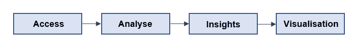

# 清除 R 中数据的初学者指南—第 1 部分

> 原文：<https://medium.com/analytics-vidhya/a-beginners-guide-to-cleaning-data-in-r-part-1-66dc431a3d42?source=collection_archive---------16----------------------->


我进入浩瀚数据世界的旅程是一次有趣而迷人的旅程。我一直粘在我的课程上，等着完成一门课程，以便继续下一门。在完成入门课程后，我转向了数据清理。众所周知，在任何数据科学项目中，大部分工作都是为了清理和整理数据集以供分析。因此，对这个话题有足够的了解是至关重要的。

首先，为了理解对干净数据的需求，我们需要查看一个典型的数据科学项目的工作流。首先访问数据，然后处理和分析数据。之后，洞察被提取出来，最后被可视化和报告。



典型项目工作流程

如果数据中存在错误，可能会在整个工作流程中产生错误。最终，用于制定关键业务决策的洞察是不正确的，这可能会导致金钱和业务损失。因此，如果不在第一步处理和纠正混乱的数据，复合效应可能是巨大的。

本指南将通过汇编所有必要的功能和应该采取的行动，作为数据清理的快速入门工具。我将简要描述三种常见的数据错误，然后解释如何在数据集中识别和纠正这些错误。我还将介绍一些强大的清理和操作库，包括 dplyr、stringr 和 assertive。只需在 RStudio 中编写以下代码，即可安装这些组件:

```
install.packages("tidyverse")
install.packages("assertive")
```

## 1.不正确的数据类型

导入数据时，RStudio 可能会错误地解释数据列类型，或者在提取过程中错误地标记了数据列。例如，一个常见的错误是当包含数字的数值数据被错误地标识和标记为字符类型时。

**a)识别**
首先，为了识别不正确的数据类型错误，使用**glow**函数检查所有列的数据类型。glimpse 功能是 **dplyr** 包的一部分，需要在使用 glimpse 之前安装。Glimpse 将返回所有列及其各自的数据类型。

```
library(dplyr)
glimpse(dataset)
```

另一种形式的逻辑检查包括**是**功能。is 函数可用于每种数据类型，并将返回一个逻辑输出(真/假)。我只提到了常见的 is 函数，但是它可以用于所有的数据类型。如果数字列是 is.numeric 函数的参数，则输出为 true，而如果字符列是 is.numeric 函数的参数，则输出为 false。

```
is.numeric(column_name)
is.character(column_name)
```

**b)修正**
在识别出所有不正确的数据类型列之后，可以通过使用**作为**函数，将它们简单地转换成正确的数据类型。例如，如果数字数据类型被错误地导入为字符数据类型，as.numeric 函数会将其转换为数字数据类型。

```
as.numeric(column_name)
```

## 2.逗号/百分比问题

在混乱的数据集中，数字可能与逗号或百分比一起导入。虽然这些都是有用的字符，有助于有效地识别大数字，但一个可能的错误是数据可能会被读取为字符类型。

**a)修正**
在这种情况下，必须先去掉不必要的字符，然后将数据类型改为正确的数据类型。这可以通过一个强大的字符串操作库 stringr 来实现。 **str_remove** 函数可用于纠正此类数据错误。它将目标列/字符串作为第一个参数，将要删除的字符作为第二个参数。

```
library(stringr)
str_remove(column_name, ",")
```

## 3.超出范围的值

在某些情况下，数据被限制在特定的范围内。例如，测试中的百分比限制在 0 到 100 之间。在这种情况下，范围被定义为 0

**a)标识**
为了估计一个数据集有多少超出范围的值，我们可以使用提供检查功能的**断言**包。首先，在使用 assert 函数之前，应该记下总行数。之后，使用 **assert** 函数，将目标列作为第一个参数，下限作为第二个参数，上限作为第三个参数。输出将是只包含输入范围内的值的目标列。现在，总行数的注释应该提供对总超出范围值的估计。

```
library(assertive)
assert_all_are_in_closed_range(column_name, lower = 0, upper = 100)
```

**b)校正**
识别出超出范围的值后，有几种可能性可以解决它们。这些值可以被删除、视为缺失值或替换为范围限制。

处理这些问题最常见的解决方案是通过使用 dplyr 包中的 **filter** 函数来过滤掉不在范围内的值，从而删除这些值。

```
filter(percentage >= 0, percentage <= 100)
```

为了将它们视为缺失值，我们需要将错误值替换为“不可用”，通常称为 NA。我们可以使用内置的**替换**功能来完成这一替换。第一个参数是目标列，第二个参数是条件，第三个参数是替换。以下输入将用 NA 替换所有小于 0 且大于 100 的值。

```
replace(column_name, percentage < 0, NA)
replace(column_name, percentage > 100, NA)
```

最后，超出范围的值可以由范围限制代替。例如，我们可以将 104%的错误数据值替换为 100%。以下输入将用 100 替换列中所有大于 100 的值。

```
replace(column_name, percentage > 100, 100)
```

这些只是数据清理过程中面临的三种最常见的错误。我希望我简单的识别然后改正的方法能帮助新来的人有效地解决这些问题。事实上，还有数百个必须格外小心处理的问题。随着我对它们的不断了解和解决，我一定会分享类似的故事，为数据社区做出贡献。

## 实践资源

为了练习你所学的内容，我创建了一个简单的练习数据集，名为“百分比”，包含考试分数，供你尝试这些技巧。你会面临上面提到的三种常见问题。**最终结果**应该是一个:数值数据集，没有百分比字符，也没有超出范围的值(0 <标志< 100)。

下载链接:[https://mega . NZ/file/cIoBHRDA # fsiyw 9 xw 5 S2 wjco 4 Wu Q3 wajys 1 ujod 6-bzvwqaoqc 4](https://mega.nz/file/cIoBHRDA#FsIYW9xw5Sx2WJco4Wuq3WAjys1UJOd6-bZvwQAoQC4)

在清理这个数据集时，你可能会面临一些问题，但这是学习过程的一部分。祝你好运！