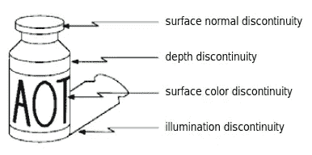
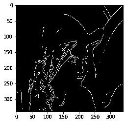

# 计算机视觉初学者指南(第二部分)——边缘检测

> 原文：<https://medium.com/analytics-vidhya/a-beginners-guide-to-computer-vision-part-2-edge-detection-4f10777d5483?source=collection_archive---------2----------------------->

了解边缘检测背后的算法及其实现。

这是我上一篇博客的延续，请在继续这个话题之前浏览一下。

[](/@t.bharathchandra/a-beginners-guide-to-computer-vision-part-1-filtering-3d95a1d51fb1) [## 计算机视觉初学者指南(第一部分)-过滤

### 计算机视觉是一个令人着迷的研究领域。它有着悠久的发展历史，被许多研究者所重视。

medium.com](/@t.bharathchandra/a-beginners-guide-to-computer-vision-part-1-filtering-3d95a1d51fb1) 

边缘的起源来源:[http://www1 . IDC . AC . il/toky/image proc-08/lectures/06 _ edge x4 . pdf](http://www1.idc.ac.il/toky/imageProc-08/lectures/06_edgeX4.pdf)

## 什么是边缘检测？


边缘检测意味着在图像中找到边界，如上图所示。

为了评估边缘检测器的质量，我们使用精度和召回曲线。


上面图像中的地面实况(GM)是由人绘制的，方法(RM)的结果是在目标图像上运行边缘检测器之后获得的。真正值是地面真值和方法结果(算法预测的边)的交集区域。精密度是真阳性与方法结果的比值。回忆是真实的积极的和地面真实的比率。下面是不同边缘检测器与人类比较的精确召回曲线。我们的目标是开发一种边缘检测器，其精度-召回曲线高于人类标记。


精度和召回曲线来源:【https://www.youtube.com/watch?v=7mEiTU-XgCo】T2&list = PLD 3 hlsjsx _ imkp 68 wfkzjviptd 8 ie 5 u-9&index = 3

## 图像的导数

连续函数的求导公式是你在高中学过的。


但是这个公式是针对连续函数的，图像是离散的！！。因此，当我们考虑像素在 x 方向的邻域时，如上式所示。那么δx 将等于 1。上面公式中的分子现在只是所考虑的像素和它前面的像素的亮度差。我们称之为向前差分导数。下面是用于查找图像在 x 方向的导数的遮罩。

```
Backward difference   [-1  1]
Forward difference    [1  -1]
Central difference   [-1 0 1 ]
```

我们可以通过上面的遮罩对图像进行卷积来找到图像的导数。为了得到更准确的结果，我们通常使用 3X3 的蒙版。下面是查找图像导数的代码片段。

```
dx = np.array([[-1,0,1],
               [-1,0,1],
               [-1,0,1]])
dy = np.array([[-1,-1,-1],
               [0,0,0],
               [1,1,1]])
dx_img = ndimage.convolve(guassian_img, dx)
dy_img = ndimage.convolve(guassian_img, dy)
```


## Prewitt 边缘检测器

任何边缘检测器流水线都是从滤波开始的。Prewitt 边缘检测器使用均值掩模进行滤波。滤波后，我们会找到图像在 X 和 Y 方向的导数。微分后，我们会找到你之前找到的两个导数的合力。然后，我们应用阈值强度，并将图像转换为二值图像。


Prewitt 边缘检测器流水线


## 索贝尔边缘检测器

它几乎类似于 Prewitt 边缘检测，唯一的区别是我们使用不同的掩模来过滤图像。下面的流程图显示了所使用的掩码。


Sobel 边缘检测流水线


## Marr Hildreth 边缘检测器(高斯拉普拉斯算子)

Marr Hildreth edge detector 的灵感来源于神经科学。Marr 的滤波器是拉普拉斯滤波器。拉普拉斯滤波器对噪声非常敏感。图像的拉普拉斯算子突出了快速强度变化的区域，因此经常用于边缘检测。因此，在应用拉普拉斯算子之前，我们需要使用高斯滤波器对图像进行适当的滤波。卷积(相关)运算是关联的，我们可以先将高斯平滑滤波器与拉普拉斯滤波器进行卷积，然后将这种混合滤波器与图像进行卷积，以达到所需的结果。结果如下图所示。


原木的形状像一顶倒置的帽子。上图还显示了 sigma = 1.4 时的 9X9 对数掩码。该掩模可以直接在图像上卷积，以获得该图像的对数。**获得图像的日志后我们做什么？**


来源:https://homepages.inf.ed.ac.uk/rbf/HIPR2/log.htm

上图是包含阶梯边缘的图像沿 x 轴的强度变化图。此图像的右侧显示了图像的对数图。当图像中存在边缘时，LoG 中存在零交叉。因此，这是一个明显的证据，证明我们可以从过零检测边缘。下面是对过零点应用阈值的代码片段。

```
log_img = ndimage.gaussian_laplace(gray_img, 1.4)
threshold =-0.05
log_final = np.zeros(log_img.shape)
w,h = log_img.shape
for x in range(1,w-1):
    for y in range(1,h-1):
        window = log_img[x-1:x+2,y-1:y+2]
        point = log_img[x,y]
        wmax = window.max()
        wmin = window.min()
        if point==0.0 and wmax>0.0 and wmin<0.0:
            zeroCross=1
        elite point>0.0:
            zeroCross= True if wmin<0.0 else False
        else:
            zeroCross= True if wmin<0.0 else False
        if (wmax-wmin)>threshold and zeroCross:
            log_final[x,y] = 1plt.imshow(log_final, cmap = plt.get_cmap('gray'))
plt.show()
```


应用日志过滤器后


在过零应用阈值后

## 边缘的质量

我们可以使用三个基本的质量来评估优势的质量。对噪声、定位和精确响应具有鲁棒性。Canny 边缘检测器是在牢记边缘质量的基础上开发的。


来源:【https://www.youtube.com/watch?v=7mEiTU-XgCo】T4&list = PLD 3 hlsjsx _ imkp 68 wfkzjviptd 8 ie 5 u-9&index = 3

## Canny 边缘检测器


Canny 边缘检测器也是从高斯滤波开始的。滤波后，图像将在 X 和 Y 方向上被区分。微分后，将计算大小和梯度矩阵。在该流水线中引入了一种称为非最大抑制(NMS)的新方法，以减少响应并使响应成为单个链。在 NMS 之后，我们应用一个阈值来将图像转换成二进制图像，但是我们以不同的方式实现它，以使边缘位被定位。

你已经熟悉了微分部分，我们用一个类似于下面代码片段所示的公式来计算梯度。

```
gradient = np.degrees(np.arctan2(dy_img,dx_img)) 
```

一条边的梯度垂直于它。如果梯度线是水平的，我们认为梯度为零。下面的图片会让你非常清楚地理解这个概念。


上图是用光谱颜色图绘制梯度矩阵后得到的图像。

在了解 NMS 之前，先看看它的实施情况


在 NMS，我们循环遍历图像的每个像素，找到它的类型，如上图所示。然后，我们将考虑中的像素(白色)与补丁中的其他像素(黑色)进行比较，如上图所示。如果考虑中的像素具有更高的亮度，那么我们考虑该像素并抑制剩余的像素。现在我们得到一个单像素边缘的图像。


NMS 之后

在滞后阈值方法中，我们保持两个阈值(低和高)。

如果一个像素的强度大于这个阈值，那么我们就认为这个像素是我们图像的一部分。

如果一个像素的亮度低于这个低阈值，那么我们就不认为这个像素是我们图像的一部分。

如果一个像素的亮度介于高阈值和低阈值之间，我们将查看它的任何相邻像素的亮度是否超过高阈值。如果结果是真的，那么我们就认为这个像素是我们图像的一部分。下图是应用滞后阈值后的图像



这里是我关于 canny 边缘检测器的特别视频，以便更好地理解它。

所有实现的代码都在这个链接中

[](https://github.com/tbharathchandra/A-Beginners-Guide-to-Computer-Vision/blob/master/Edge%20detection.ipynb) [## tbharathchandra/A-计算机视觉初学者指南

### permalink dissolve GitHub 是 4000 多万开发人员的家园，他们一起工作来托管和审查代码，管理…

github.com](https://github.com/tbharathchandra/A-Beginners-Guide-to-Computer-Vision/blob/master/Edge%20detection.ipynb) 

offfff..是的，这个关于边缘检测的博客到此结束。请继续关注更多关于计算机视觉的内容。