# 计算机视觉初学者指南(三)——Harris 兴趣点检测

> 原文：<https://medium.com/analytics-vidhya/a-beginners-guide-to-computer-vision-part-3-harris-interest-point-detection-15cdfb30104c?source=collection_archive---------6----------------------->

不使用 OpenCV 完成 Harris 兴趣点检测算法及实现。

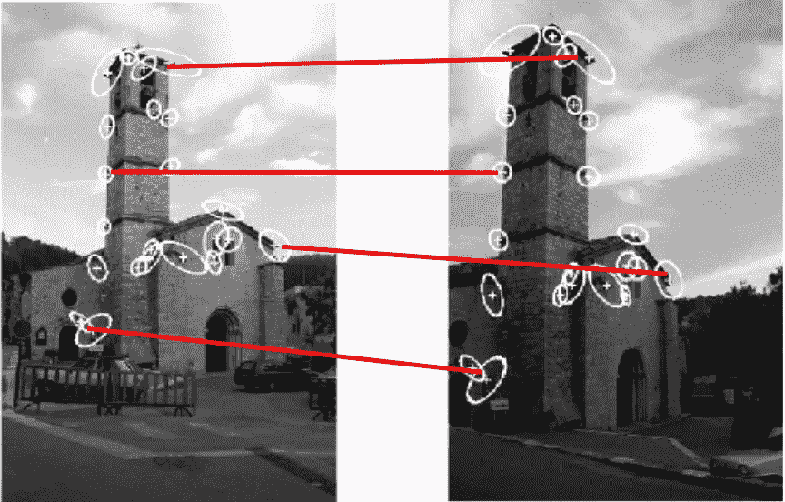

来源:http://www.cse.psu.edu/~rtc12/CSE486/lecture06.pdf

看看上面的例子，它在两个不同的视图中显示了一个建筑的图像。我们怎样才能让计算机意识到这两幅图像显示的是同一个建筑呢？兴趣点的概念来了。看看这两幅图像中的十字标记，即使相机的位置改变了，这些点(十字标记)的位置也没有改变。在两幅图像中的每个点周围开一个小窗口。假设您有一种机制，可以根据窗口的特征将一幅图像中的窗口映射到另一幅图像中的另一个窗口(特征提取)，那么我们就完成了识别对象的任务。现在不要担心特征提取，它将在以后的文章中讨论。让我们集中讨论本文中的兴趣点。

如果你仔细观察上面的例子，你会发现这些兴趣点仅仅是角点，可以在交叉点和突然的曲率变化处看到。所以我们需要一个算法来检测这些角点。

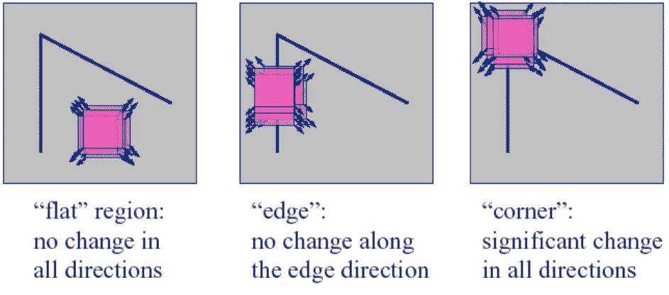

来源:http://www.cse.psu.edu/~rtc12/CSE486/lecture06.pdf

哈里斯算法完全依赖于他对拐角的一次观察。看上面的图片。如果我们在一个点周围开一个小窗口，通过向各个方向小幅度移动来移动窗口，哈里斯观察到的是，如果窗口是角点，强度会有显著的变化。就连你也能观察到这一点吧！！

## 哈里斯角点检测器的数学

使用平方差和(SSD)来获得强度变化。设 **I** 为灰度图像，你可以从下面的等式获得位移(u，v)的强度变化。这里(x，y)∈W 其中，W 是窗口。

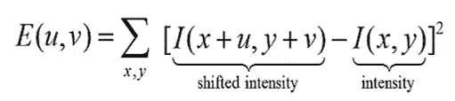

我们还使用了一个窗口函数，使上面的方程像一个加权平均。我们可以使用均匀窗口函数来赋予每个像素同等的重要性，或者使用高斯函数来赋予中心像素更多的重要性。然后上面的函数变成下面的函数。

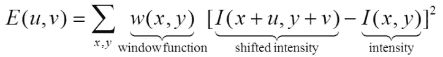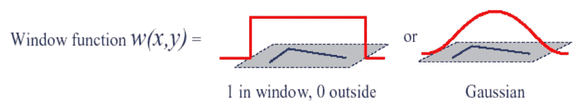

来源:[http://www.cse.psu.edu/~rtc12/CSE486/lecture06.pdf](http://www.cse.psu.edu/~rtc12/CSE486/lecture06.pdf)

下一步是用泰勒级数重写“移动强度”项。让我简单介绍一下泰勒级数。

## 泰勒级数

一个函数可以用它的泰勒级数的有限项来近似。如果你知道一个函数 a 在某点的输出，你可以用泰勒级数根据它的导数来近似这个函数。函数 f(x)的泰勒级数公式如下。

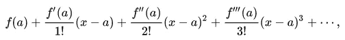

例如，f(x) = 1/ *x* 在 *a* = 1 时的泰勒级数为

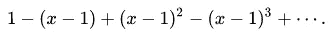

**回到我们的话题**

现在回到我们的强度变化方程 E(x，y ),我们可以用泰勒级数重写 I(x+u，y+v)项，方程结果如下

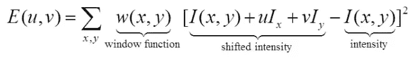

这里没有什么不可能发生的事，不要惊慌。我们只是在点(x，y)展开了项 I(x+u，y+v ),如下所示

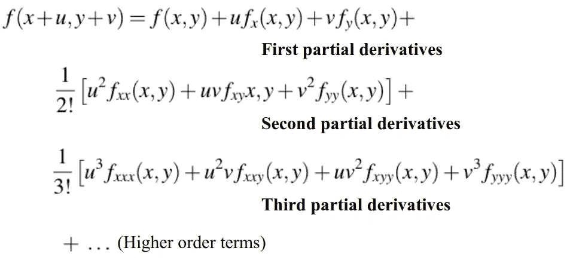

来源:[http://www.cse.psu.edu/~rtc12/CSE486/lecture06.pdf](http://www.cse.psu.edu/~rtc12/CSE486/lecture06.pdf)

我们通过只考虑一阶偏导数来近似这个函数。

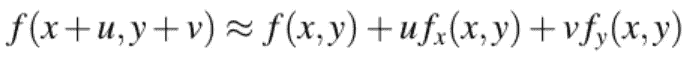

来源:[http://www.cse.psu.edu/~rtc12/CSE486/lecture06.pdf](http://www.cse.psu.edu/~rtc12/CSE486/lecture06.pdf)

现在等式可以改写为

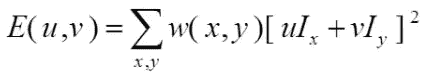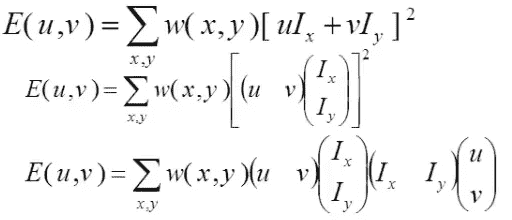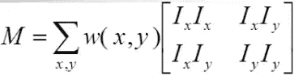

来源:[https://www.youtube.com/watch?v=_qgKQGsuKeQ&list = PLD 3 hlsjsx _ Imk _ BPmB _ h3aqjfkzs 9 xgzm&index = 6&t = 0s](https://www.youtube.com/watch?v=_qgKQGsuKeQ&list=PLd3hlSJsX_Imk_BPmB_H3AQjFKZS9XgZm&index=6&t=0s)

通过替换 E(x，y)中的' **M** '项，等式可以写成

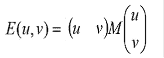

这是以 **M** 为协方差矩阵的椭圆的方程。经过大量的研究，哈里斯得出了一个结论，利用矩阵 **M** 的项，我们可以确定这个窗口是在一个角点还是在一个边缘或者图像中的其他地方。他想出了参数**响应(R)**

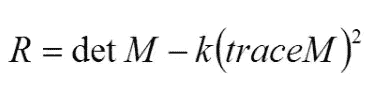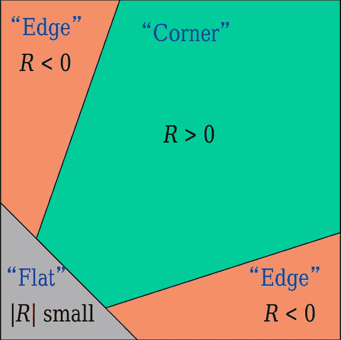

来源:[http://dept . me . umn . edu/courses/me 5286/vision/Notes/2015/me 5286-lecture 8 . pdf](http://dept.me.umn.edu/courses/me5286/vision/Notes/2015/ME5286-Lecture8.pdf)

所以如果在一个窗口中 R>0，那么这个点就是一个角点

如果 R <0 in a window, then that point is a part of a edge

if |R| is small in a window, then that point is a part of a flat region.

Many researcher also suggested other relation of **R** 其中一些是根据 m**m**的**本征值**甚至哈里斯给出的关系也可以根据本征值写成

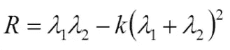

k 值应该在 0.04 到 0.06 之间

## Harris 角点检测算法

*   计算图像的 X 和 Y 导数(采用灰度)。如果你学习图像的微分，请阅读我以前的文章。下面给出的链接

[](/analytics-vidhya/a-beginners-guide-to-computer-vision-part-2-edge-detection-4f10777d5483) [## 计算机视觉初学者指南(第二部分)——边缘检测

### 了解边缘检测背后的算法及其实现。

medium.com](/analytics-vidhya/a-beginners-guide-to-computer-vision-part-2-edge-detection-4f10777d5483) 

原象

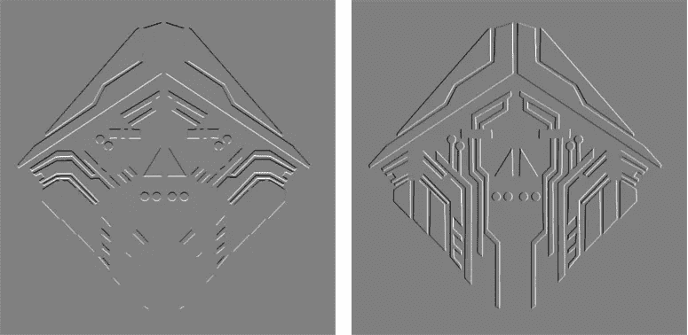

x 和 Y 导数

*   计算 Ix2、Ixy、Iy2 三幅图像，代码片段如下

```
ix2 = ix**2
ixy = ix*iy
iy2 = iy**2
```

*   对这三幅图像应用高斯滤波器(σ= 1)

如果你不知道高斯滤波的概念，这里有一个链接指向我写的关于它的文章

[](/@t.bharathchandra/a-beginners-guide-to-computer-vision-part-1-filtering-3d95a1d51fb1) [## 计算机视觉初学者指南(第一部分)-过滤

### 计算机视觉是一个令人着迷的研究领域。它有着悠久的发展历史，被许多研究者所重视。

medium.com](/@t.bharathchandra/a-beginners-guide-to-computer-vision-part-1-filtering-3d95a1d51fb1) 

```
#gkern gives you the gaussian kernal 
ix2 = ndimage.convolve(ix2, gkern(3,1))
iy2 = ndimage.convolve(iy2, gkern(3,1))
ixy = ndimage.convolve(ixy, gkern(3,1))
```

*   计算每个像素的导数乘积的和，并从中制作矩阵 **M** 。计算响应并相应地存储。请看下面的代码片段。

这些是结果


角落红色


蓝色边缘

*   现在计算角落图像中的局部最大值点，使用下面的代码片段

```
from skimage.feature import peak_local_max
coordinates = peak_local_max(corners, min_distance=10)
```

在坐标越过图像后，结果会是这样的


决赛成绩

我用 pyplot 把这些红点放在局部最大值处。

你可以在这里浏览全部代码

[](https://github.com/tbharathchandra/A-Beginners-Guide-to-Computer-Vision/blob/master/Interest%20point%20Detection.ipynb) [## tbharathchandra/A-计算机视觉初学者指南

### permalink dissolve GitHub 是 4000 多万开发人员的家园，他们一起工作来托管和审查代码，管理…

github.com](https://github.com/tbharathchandra/A-Beginners-Guide-to-Computer-Vision/blob/master/Interest%20point%20Detection.ipynb) 

是的，结束了。请继续关注更多关于计算机视觉的内容。