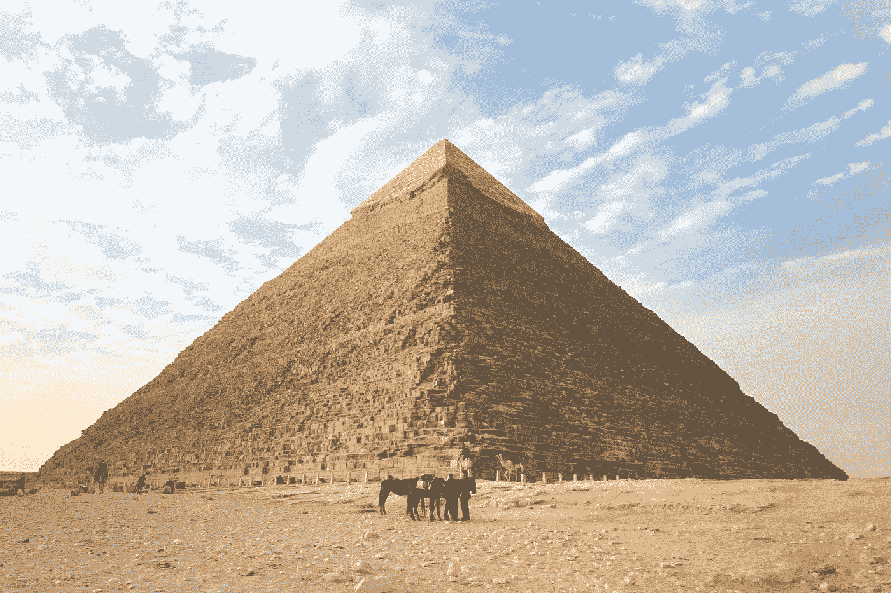

# 计算机视觉初学者指南(第四部分)-金字塔

> 原文：<https://medium.com/analytics-vidhya/a-beginners-guide-to-computer-vision-part-4-pyramid-3640edeffb00?source=collection_archive---------2----------------------->

了解影像金字塔及其实现



杰里米·毕晓普在 [Unsplash](https://unsplash.com?utm_source=medium&utm_medium=referral) 上的照片

金字塔，人类很久以来就熟知的形状。好了，这篇文章不是关于“形状金字塔”的，而是我们将要谈论的“**”**。

有时，为了检测图像中的对象(如人脸或汽车或任何类似的东西)，我们需要调整图像的大小或对图像进行子采样，并运行进一步的分析。在这种情况下，我们维护不同分辨率的相同图像的集合。我们称这个集合为**图像金字塔。称之为金字塔的原因是，当我们按照分辨率递减的顺序排列图像时，我们会得到一个类似金字塔的正方形底部。看看下面的图片，更详细地了解它。**


新楼层的面积将是其下楼层的 1/4。如果基础图像(高分辨率或级别 0)的大小是 M X N，那么它上面的级别的大小将是(M/2 X N/2)。

有两种金字塔:1)高斯金字塔和 2)拉普拉斯金字塔。

# 高斯金字塔

在高斯金字塔中，我们在对图像进行子采样之前应用 5 X 5 大小的高斯滤波器。这里有两种运算:缩小和扩大。顾名思义，在缩小操作中，我们将降低图像分辨率(宽度和高度的一半),在扩展操作中，我们将增加图像分辨率(宽度和高度的两倍)。

## 减少或减少

高斯金字塔中的归约操作是根据下面给出的关系完成的。


来源:[https://www.youtube.com/watch?v=KO7jJt0WHag&list = PLD 3 hlsjsx _ imkp 68 wfkzjviptd 8 ie 5 u-9&index = 5](https://www.youtube.com/watch?v=KO7jJt0WHag&list=PLd3hlSJsX_ImKP68wfKZJVIPTd8Ie5u-9&index=5)

其中 *l* 代表电平，w(m，n)是窗函数(高斯)。

归约和卷积运算之间的唯一区别是，卷积运算中的跨距值是 1，而归约运算中的跨距值是 2。我们用每一个交替的行和列卷积高斯掩模。为了进一步理解操作，请看下面的代码片段。

```
lowResImage = cv2.pyrDown(highResImage) # Reduce operation of OpenCV
```

## 扩展或向上

高斯金字塔中的扩展操作根据下面给出的关系来完成。


来源:[https://www.youtube.com/watch?v=KO7jJt0WHag&list = PLD 3 hlsjsx _ imkp 68 wfkzjviptd 8 ie 5 u-9&index = 5](https://www.youtube.com/watch?v=KO7jJt0WHag&list=PLd3hlSJsX_ImKP68wfKZJVIPTd8Ie5u-9&index=5)

其中 *l* 代表电平，w(p，q)是窗函数(高斯)。

为了更清楚地理解上述关系，让我们在一维情况下扩展上述关系。


来源:[https://www.youtube.com/watch?v=KO7jJt0WHag&list = PLD 3 hlsjsx _ imkp 68 wfkzjviptd 8 ie 5 u-9&index = 5](https://www.youtube.com/watch?v=KO7jJt0WHag&list=PLd3hlSJsX_ImKP68wfKZJVIPTd8Ie5u-9&index=5)

上述方程中的非整数项将被消除，最终方程将只有三项。看下面的图片


上图中的 a、b、c、d 和 e 项是一维的高斯权重。在扩展操作中，使用不同的高斯权重组合从相同的旧像素创建新像素。

```
highResImage = cv2.pyrUp(lowResImage) # Expand operation of OpenCV
```


# 拉普拉斯金字塔


在高斯金字塔中，我们应用高斯模糊并对图像进行子采样。在拉普拉斯金字塔中，我们应用高斯的拉普拉斯算子并对图像进行子采样。你可以回忆一下我上一篇文章中 Marr Hildreth 边缘检测器中的高斯拉普拉斯算子的概念。

[](/analytics-vidhya/a-beginners-guide-to-computer-vision-part-2-edge-detection-4f10777d5483) [## 计算机视觉初学者指南(第二部分)——边缘检测

### 了解边缘检测背后的算法及其实现。

medium.com](/analytics-vidhya/a-beginners-guide-to-computer-vision-part-2-edge-detection-4f10777d5483) 

在实践中，我们从高斯金字塔创建拉普拉斯金字塔。请看下面的公式以获得更多的理解。


EPIPHANY，JEBAMALAR LEAVLINE & Sutha，Shunmugam。(2014).快速多尺度方向滤波器组的 FIR 滤波器设计。国际 u-和 e-服务、科学和技术杂志。7.10.14257/ijunesst.2014.7.5.20

查看下面的代码片段，在拉普拉斯金字塔中生成一个级别。

```
laplaceLevel1 = gaussianLevel1 - cv2.pyrUp(gaussianLevel2)
```

是的，文章结束了，请继续关注更多关于计算机视觉的内容。金字塔的代码在下面的链接中。

[](https://github.com/tbharathchandra/A-Beginners-Guide-to-Computer-Vision/blob/master/Pyramids.ipynb) [## tbharathchandra/A-计算机视觉初学者指南

### permalink dissolve GitHub 是 4000 多万开发人员的家园，他们一起工作来托管和审查代码，管理…

github.com](https://github.com/tbharathchandra/A-Beginners-Guide-to-Computer-Vision/blob/master/Pyramids.ipynb)