# 计算机视觉初学者指南(第 5 部分)-尺度不变特征变换(SIFT)第 1 部分

> 原文：<https://medium.com/analytics-vidhya/a-beginners-guide-to-computer-vision-part-5-scale-invariant-feature-transform-sift-part-1-6a0e676cbe1a?source=collection_archive---------16----------------------->

计算机科学史上被引用最多的论文之一。让我们从头开始学习并用 python 实现它。

我们已经在我以前的文章中讨论过哈里斯兴趣点检测器。以防万一，如果你记不起来了，通读下面给出的文章。什么是 SIFT？

 [## 计算机视觉初学者指南(三)——Harris 兴趣点检测

### 不使用 OpenCV 完成 Harris 兴趣点检测算法及实现。

medium.com](/analytics-vidhya/a-beginners-guide-to-computer-vision-part-3-harris-interest-point-detection-15cdfb30104c) 

SIFT 是一个兴趣点检测器和描述符，该算法是由 David Lowe 开发的，其专利权属于不列颠哥伦比亚大学。这是计算机科学史上引用次数第四多的论文。SIFT 的完整形式是**尺度不变特征变换。**名字本身就给了我们很多信息。SIFT 是一种对尺度或任何仿射变换不变的检测器。它对噪声具有鲁棒性，对光照变化也不变。

SIFT 算法有四个主要步骤:1)尺度空间的极值检测，2)关键点定位，3)方向分配，4)关键点描述符

本文中的代码摘自这里的[这里的](https://github.com/robwhess/opensift)是用 C++实现的。

## 1)尺度空间的极值检测

**兴趣点应该对尺度或仿射变换不变。这意味着，我们应该在不同的尺度上寻找兴趣点。**

看看上面的图片。由于透视效果，离相机较近的花比离相机较远的花尺寸大。我们需要检测相机附近和远处的花。

你还记得我们在 Marr-Hildreth 边缘检测器中讨论的高斯(对数)滤波器的拉普拉斯算子吗？如果你不记得了，请浏览下面的链接。

 [## 计算机视觉初学者指南(第二部分)——边缘检测

### 了解边缘检测背后的算法及其实现。

medium.com](/analytics-vidhya/a-beginners-guide-to-computer-vision-part-2-edge-detection-4f10777d5483) 

高斯函数的拉普拉斯的形状会像一个倒置的墨西哥帽。看下图。

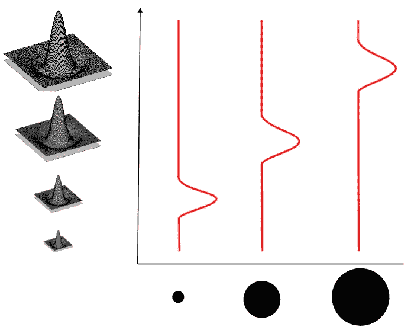

来源:[https://www . crcv . ucf . edu/WP-content/uploads/2019/03/Lecture-6-sift . pdf](https://www.crcv.ucf.edu/wp-content/uploads/2019/03/Lecture-6-SIFT.pdf)

我们在 X 轴上有三个尺寸递增的斑点，在 Y 轴上有尺寸递增的高斯滤波器的拉普拉斯算子。如果解释响应，则与斑点尺寸和高斯滤波器的拉普拉斯算子的尺寸相关。

从上面的直觉中，你可能会有一个想法，应用一个过滤器(一个西格玛)不会帮助你检测图像中的所有兴趣点。因此，我们生成一堆图像，这些图像是在应用具有递增 sigma 值的对数滤波器之后产生的。这一堆图像的离散函数会是这样的 f (x，y，sigma)。当我们在金字塔格式中做同样的事情时，它被称为尺度空间。

## 高斯差(DoG 或 D)是对数的近似值

> 高斯差分函数提供了高斯尺度归一化拉普拉斯的近似

你可以从热扩散方程中清楚地理解这个关系，

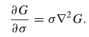

使用 kσ和σ处附近标度的差异重写上述等式。

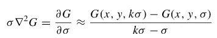

因此，

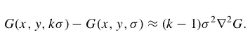

上面的等式表明，两个高斯图像之间的差可以近似高斯的拉普拉斯算子。我们利用这种现象来创造外部空间。看看下面的图片，更详细地了解它。

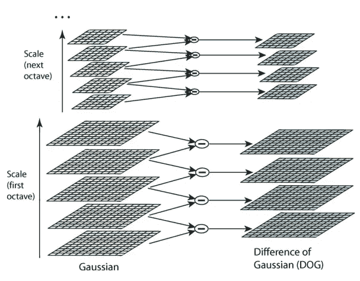

来源:[https://link . springer . com/article/10.1023/B:visi . 0000029664 . 99615 . 94](https://link.springer.com/article/10.1023/B:VISI.0000029664.99615.94)

Lowe 建议对第一幅图像使用 sigma 值 1.6，并通过将其乘以 k(其关系在下面给出)来增加 sigma，直到我们完成一个 ocatve(堆栈)。当我们移动到金字塔的下一级时，我们调整图像的大小，这将是前一个堆栈顶部的 2 个图像。我们称这一叠图像为 octave。这里有一个术语叫做区间数(s)，其值按建议值取为 3。每个八度音程的图像数量的公式由关系 s+3 给出。

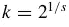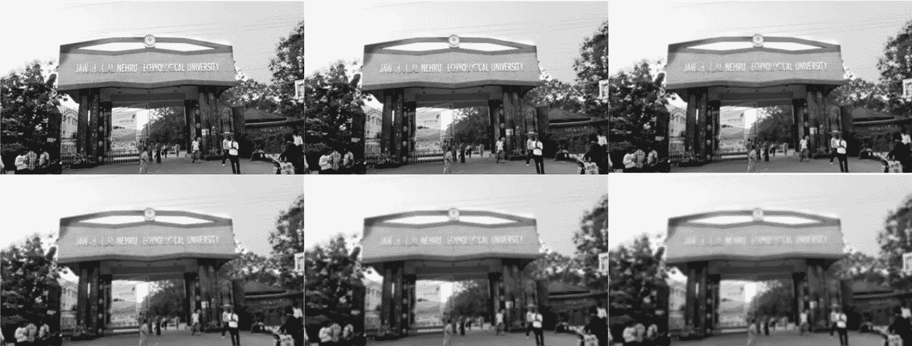

第一级高斯尺度空间

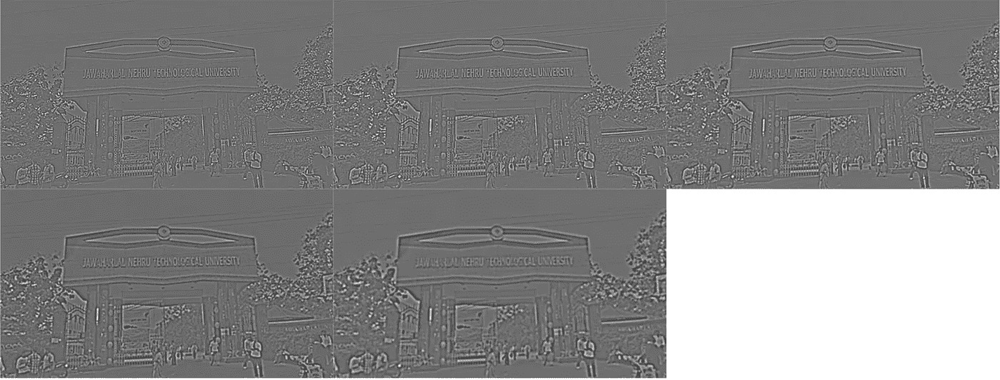

一级尺度空间

查看下面的代码片段，了解比例空间的生成。

## 局部极值检测

为了检测 D(x，y，σ)的局部最大值和最小值，将每个样本点与其在当前图像中的八个邻居以及在上下尺度中的九个邻居进行比较。看下图。

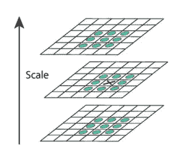

只有当它大于所有这些邻居或小于所有这些邻居时，它才被选为极值。

## 2)关键点定位

我们分两个阶段改进这些极值:1)去除由于低对比度引起的不稳定极值点，以及 2)去除不良的局部边缘响应。在进行关键点定位之前，关键点附近的像素应该被归一化。

## 去除由于低对比度引起的不稳定极值点

我们将尺度空间中的一个级别表示为 D(x，y，σ)。当我们用泰勒级数在样本点展开这个函数时。

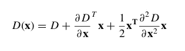

其中 **x** = [[x]，[y]，[σ]]。我们可以通过找到上述方程的导数并使其等于零来找到极值位置。这样做，我们将得到 x，y 和σ方向的位移矢量(x̂)。

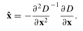

如果偏移 x̂在任何维度上都大于 0.5，则意味着极值更靠近不同的采样点。在这种情况下，采样点会发生变化，并在该点附近执行插值。最终偏移 x̂被添加到其采样点的位置，以获得极值位置的插值估计。极值 D(x̂处的函数值)等于

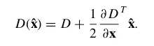

如果 D(x̂的值)小于 0.03，该关键点将被拒绝。

## 去除不良的局部边缘响应

高斯差函数中定义不明确的峰值将在边缘上具有大的主曲率，但在垂直方向上具有小的主曲率。主曲率可通过 2 × 2 Hessian 矩阵 H 计算得出，该矩阵在关键点的位置和比例处计算得出:

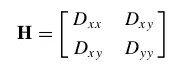

H 的特征值是 d 的主曲率的指标，我们已经在我的关于 Harris 兴趣点检测的文章中讨论了相同的概念。如果你不记得了，请浏览下面的链接。

 [## 计算机视觉初学者指南(三)——Harris 兴趣点检测

### 不使用 OpenCV 完成 Harris 兴趣点检测算法及实现。

medium.com](/analytics-vidhya/a-beginners-guide-to-computer-vision-part-3-harris-interest-point-detection-15cdfb30104c) 

设α为最大值的特征值，β为较小值。然后，我们可以根据 H 的迹计算特征值之和，并根据行列式计算它们的乘积:

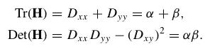

设 r 是最大特征值和较小特征值的比值。

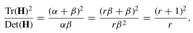

如果不满足下面给出的条件，我们将拒绝关键点。

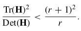

查看下面的代码片段，了解极值检测和定位。

对在我大学门口拍的照片进行分析。我们将得到如下所示的结果。

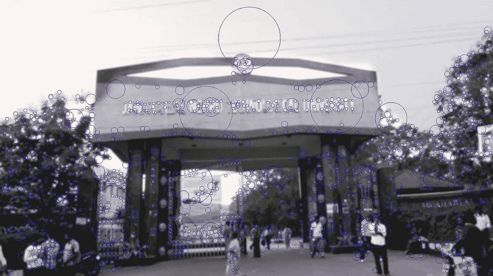

我们带着方向分配和描述符离开了。我将在这里结束这篇文章，并在下一部分继续剩余的主题。下面是本文中显示的代码的链接。

 [## tbharathchandra/A-计算机视觉初学者指南

### permalink dissolve GitHub 是超过 5000 万开发人员的家园，他们一起工作来托管和审查代码，管理…

github.com](https://github.com/tbharathchandra/A-Beginners-Guide-to-Computer-Vision/blob/master/SIFT.ipynb) 

请继续关注更多关于计算机视觉的内容:)