# 将文本数据转换成数字数据的初学者指南(第 1 部分)

> 原文：<https://medium.com/analytics-vidhya/a-beginners-guide-to-convert-text-data-to-numeric-data-part-1-e0e15666d9e5?source=collection_archive---------1----------------------->

来源:谷歌图片

让我们来理解为什么我们需要将文本数据转换成数字数据。

*   计算机只理解数字
*   一旦我们将文本转换成向量，我们就可以利用线性代数的优点。

我们将探讨完成这项任务的 5 种方法:

1.  单词袋(蝴蝶结)
2.  术语频率-逆文档频率(Tf-IDF)

在下一部分中，我们将看另外三种方式

3.Word2Vec (W2V)

4.平均 W2V

5.平均 TF-IDF

在我们继续之前，让我们先了解一下本帖中会经常用到的两个术语。

*   **文档**——它只是一个包含文本数据的文件。就数据集而言，每个记录或数据点都可以被视为一个文档。
*   **文集** -被称为文集的一组文件。就数据集而言，整个数据点或整个数据集可以被视为一个语料库。

现在我们可以走了！！

# 单词袋(蝴蝶结)

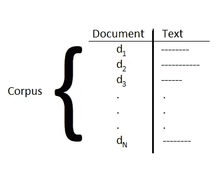

来源:我的电脑

在这种方法中，对应于每个文档，我们将创建一个 d =语料库中唯一单词的向量。

向量的每个单元对应一个唯一的单词，该单元中的值是该单词在该文档中出现的频率/次数。

让我们用一个例子来理解这一点:

d₁ :=“我很好”

d₂ :=“我饿了。我生病了”

d₃ :=“食物很好”

U =语料库中唯一的单词是:= {我，我，很好，饿了，病了，食物，是}

唯一字的数量= *n* (U) = d = 7

因此，我们将把每个文档转换成一个 7 维向量。

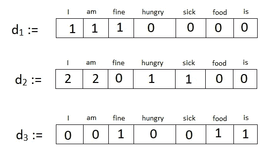

我的电脑

这就对了。你已经成功地学会了第一种方法。

在我们继续下一个方法之前，让我们快速看一下这个方法的一些优点和局限性

***优点:***

*   易于编码和理解。
*   可用于实现基线模型。
*   语料库小的时候可以用。

***局限性:***

*   每个向量都是稀疏向量。
*   它没有考虑单词的语义。

让我给你看一个支持最后一点的例子。

考虑两个文档

d₁ :=“食物很好吃”

d₂ :=“食物不好吃”

在对它们应用 BOW 之前，通过常识，我们知道这两个文档是完全相反的。直觉上，这两个文档应该彼此远离，尽可能保持最大距离。

现在让我们应用弓。

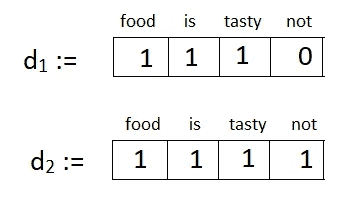

计算两个文档之间的欧几里德距离将得到:

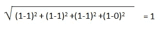

但是，两个文档之间的最大距离(考虑二进制弓)是:

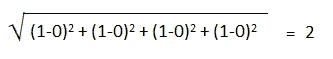

*现在，让我们看看一些提高 BOW 性能的方法*:

*   **删除停用词**
*   **将文本完全转换为小写(或大写)**
*   **炮泥**
*   **词汇化**

> 注意:这些文本预处理方法不仅仅局限于 BOW，而是可以应用在任何文本到数字的转换方法之前

# 术语频率-逆文档频率(TF-IDF)

首先，这个方法的名字是什么意思？我们来分解一下。

*   **词频:=** 定义为一个词在文档中出现的次数与该文档中总字数的比值

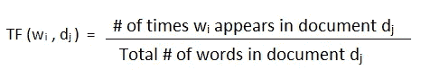

*   **逆文档频率** :=定义为语料库中的文档数量与该单词出现的文档数量之比的对数。

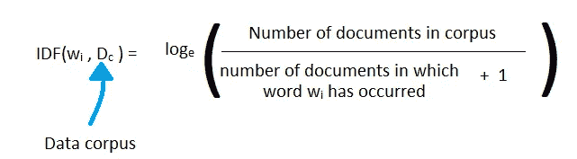

> 注意:在分母中加 1 只是为了避免被零除

与 BOW 中单词的频率不同，我们将单词的 TF* IDF 值放在一个向量中。

*但是 TF-IDF 值意味着什么呢？*

术语频率(TF)值显示该词在文档中出现的频率，IDF 值显示该词在其他文档中出现的频率

> IDF 值越高，该词在其他文档中就越少见。

让我们借助同一个例子来理解这一点

d₁ :=“我很好”

d₂ :=“我饿了。我生病了”

d₃ :=“食物很好”

我们已经看到了这一点

U =语料库中唯一的单词是:= {我，我，很好，饿，病，食物，是}

唯一字的数量= *n* (U) = d = 7

**步骤 1 :** 从空的 d 维向量开始

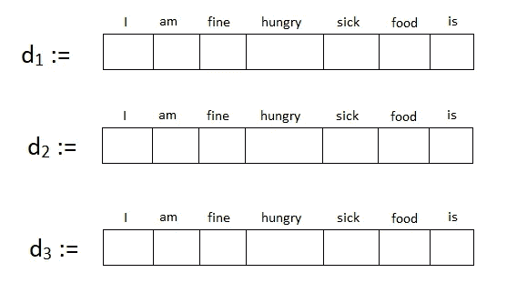

**步骤 2 :** 计算每个文档中每个词的词频

例如在第一份文件中，

tf("i",d₁)= tf("am",d₁)=tf("fine",d₁)= 1/3

在第二份文件中

TF("I",d₂) =TF("am",d₂) = 2/6

tf("hungry",d₂)=tf("sick",d₂)= 1/6

诸如此类…

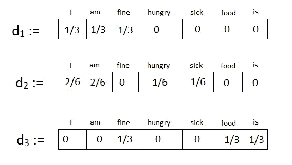

**步骤 3 :** 计算语料库中每个唯一词的 IDF 值

idf("i",d𝒸)=idf("am",d𝒸)==idf("fine",d𝒸

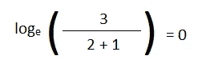

idf("hungry",d𝒸=idf("sick",d𝒸idf("food",d𝒸idf("is",d𝒸)=

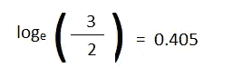

**第四步**:将向量中的每个值(包含 TF 值)乘以单词对应的 IDF 值

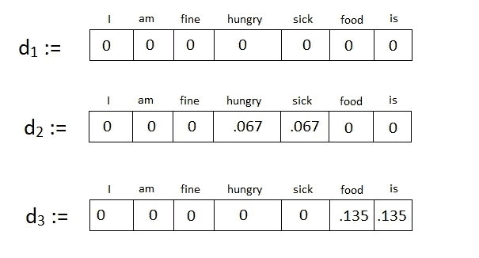

恭喜你。你已经成功地学会了第二种方法。

在使用第三种方法之前，让我们快速了解一下这种方法的优点和局限性。

***优点:***

*   易于编码和实现
*   给予较罕见的单词更大的重要性，并抑制频繁单词的贡献
*   用于信息检索-被谷歌用于搜索引擎优化。从我们的例子中可以清楚地看到，所有频繁出现的术语(在区分一个文档和另一个文档时没有重要性)都具有较低的 TF-IDF 值，相反，不太频繁出现的术语具有较高的 TF-IDF 值。当给定一些查询时，Google 基本上将你的文本转换成关键字，在它的数据库中找到这些关键字，按照 TF-IDF 值的降序对所有出现关键字的文档进行排序，并显示这些文档。(*显然谷歌使用了更高效快捷的方式来完成这项任务*)

***局限性:***

*   因为它是基于 BOW 方法，所以它也会生成稀疏向量。
*   它也没有考虑单词的语义。
*   它假设字数提供了某种相似性度量。
*   一开始有点难以理解。

好了，暂时就这样吧！我很快就会带着下一部分回来！

来源:谷歌图片