# 网络安全入门指南

> 原文：<https://medium.com/analytics-vidhya/a-beginners-guide-to-cyber-security-3d0f7891c93a?source=collection_archive---------5----------------------->

我们将讨论以下主题:

*   什么是网络、网络安全和网络空间
*   安全术语和术语
*   网络安全领域
*   网络模型
*   网络安全认证
*   网络威胁

“网络”一词的含义是什么？

网络意味着任何数字化的东西。执行数字计算的可能是你的设备。任何与互联网有关的东西都属于网络范畴。

**网络空间有多大？**

虽然网络空间不应与互联网混淆，但该术语用于表示身份或通信过程本身发生的事件。例如，想想一个网站，它也存在于网络空间。社交互动无论你是发帖、上传图片还是分享信息，所有这些社交互动都存在于网络空间，而这个网络空间不是在几分钟内而是在几秒钟内扩大。所有这些事件都不是发生在他们的物理位置上，而是发生在“网络空间”。您可以在下面看到一幅图像，其中包含通过互联网连接的各种数字设备。他们所有的交流都存在于网络空间。

**什么是网络安全？**

网络安全一词是指通过在线服务提供的保护你的在线信息的安全

网络安全是指旨在保护计算机、网络和数据免受网络罪犯通过互联网进行的未经授权的访问、漏洞和攻击的技术和流程

然而，网络安全对于网络、数据和应用安全非常重要

**网络安全需求:**

网络安全是必要的，因为它有助于保护数据免受数据窃取或滥用等威胁，还能保护您的系统免受病毒侵害

随着越来越多的人接入互联网，造成巨大危害的安全威胁也在增加。

**证券术语和术语**

**安全与信息安全:**

安全可以是任何物理安全，它包括安全中的一切，信息安全可以是任何数字安全，并与信息绑定。

**IT 安全与网络安全:**

信息安全(IT)的范围更广，它包括 web、网络以及与之相关的任何事物，而网络安全是与网络绑定在一起的。**系统安全**包括手机、电脑等设备的安全。

**网络安全 vs IT 安全:**

网络安全包括数字安全，IT 安全包括网络安全，也包括系统的物理安全，其中网络安全不包括系统的物理安全。

**注:**

InfoSec 是信息安全的简称，Pentest 是渗透测试的简称。

**网络安全领域**

以下是网络安全的领域:

1.  访问控制系统和方法
2.  电信和网络安全
3.  业务连续性规划和灾难恢复规划
4.  安全管理实践
5.  安全架构和模型
6.  法律、调查和伦理
7.  应用程序和系统开发安全性
8.  密码系统
9.  计算机操作安全
10.  人身安全

**1-门禁系统和方法:**

网络安全的主要目的是保护你的数据。因此，首先将了解更多关于数据和什么是各种访问控制系统和方法。

**数据质量评估的六个维度:**

数据质量(DQ)维度是一个公认的术语，用于描述数据的特征，可以根据定义的标准进行评估或衡量，以衡量数据的质量。

六个核心数据质量维度是:

1.一致性
2。完整性
3。正确性
4。可达性
5。时效性
6。准确(性)

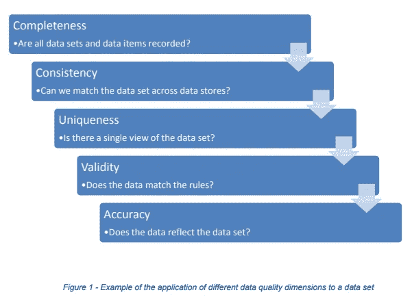

**数据状态:**

了解数字数据的不同状态有助于您选择不同种类的安全措施和加密技术来应用于数据。这里我们将讨论数据的三种状态。

**1-静态/存储数据:**

静态数据是指存储在某种物理介质或备份介质上的数据，如存储在硬盘甚至移动设备上的数据。使其数据处于静止状态的原因是数据处于非活动状态，并且当前没有被传输或处理。

**2-运动/传输中的数据:**

数据的第二阶段正在进行。运动中的数据当前正在网络上传输，或者位于计算机的 RAM 中，准备被读取、更新或处理。它可以是通过 FTP 或 SSH 传输的电子邮件或数据。

**3-处理中的数据:**

第三阶段的数据正在处理或使用中。这种数据状态不是被动地存储在存储介质上。这是一个或多个应用程序正在处理的数据。这是当前正在生成、更新、追加或删除的数据。

**CIA(保密性-完整性-可用性)**

机密性、完整性和可用性也称为 CIA triad，是一种旨在指导组织内信息安全策略的模型。我们将在这三个方面进行更深入的探讨。

**1-保密性:**

它确保与计算机相关的资产只能由授权方访问，有时被称为**保密**或**隐私**

为防止敏感信息被错误的人获取并确保授权人员可以访问而采取的措施。

使用的技术是**加密**

**加密以确保机密性:**

假设我们想要单词“HELLO ”,我们可以应用加密技术将 HELLO 的每个字母替换为它的相邻字母，如 H 替换为 I，E 替换为 F，等等，这使得单词没有意义。然后我们用另一边使用的相同技术解密

**Bitlocker** 是一种磁盘/驱动器级加密。我们无法在文件上应用 BitLocker。

**Windows** 使用 NTFS 文件系统。还有 **EFS(加密文件系统)——文件级加密**。右键单击文件(压缩蓝色内容)。

**EFS 的特点:**有两种颜色表示加密和解密。

这整个过程都要靠政策。保留数据备份。当一名员工辞职时，公司会格式化系统，这也会丢失 BitLocker 密钥和其他东西。

**加密类型**

有两种顶级类型的加密。对称和非对称

**1-对称加密:**

*   使用相同的密钥加密或解密数据。
*   考虑一个桌面密码管理应用程序。你输入你的密码，他们用你自己的个人密钥加密。当要检索数据时，使用相同的密钥，并解密数据

**2-非对称加密:**

*   使用私钥和公钥对
*   两个密钥都可以加密，但单个密钥无法解密自己的解密数据。要解密，您需要配对密钥。
*   不对称加密用于 HTTPS 使用的传输层安全性(TLS)和数据签名

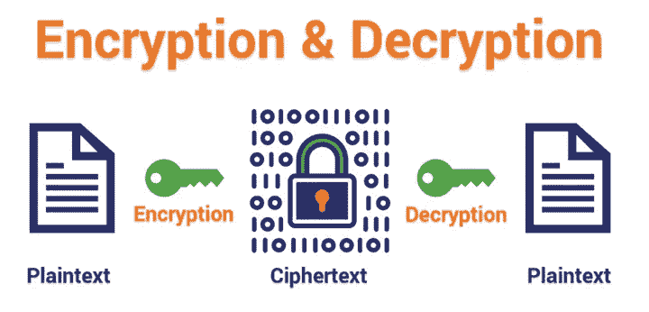

**访问控制:**

**访问控制**验证和授权个人访问他们被允许查看和使用的信息

1.  你知道的东西—(你知道密码)
2.  你是什么——(生物特征扫描)
3.  你有的东西—(提款卡)
4.  你做的事情—(签名风格)

**数据的完整性:**

**完整性:**是指资产只能由授权方或以授权方式修改。确保信息的格式真实正确，符合其原始目的。它涉及到在数据的整个生命周期中维护数据的一致性、准确性和可信性。

使用的技术是**散列**

**Hash: Hash 计算器**，以文件为输入，应用算法。哈希的目的是表明原始文件没有被修改。

让我们用微软的文件校验和完整性校验器来实际实现散列。你可以从网上下载。

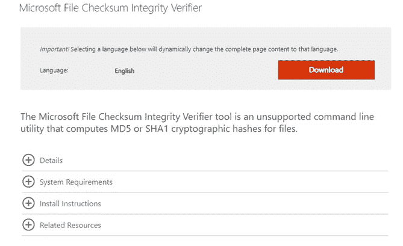

您必须在文件所在的目录中打开命令提示符。我们将检查文本文件的完整性。要应用这种散列技术:

**fciv“带扩展名的文件名”哈希算法= > fciv readme.txt -sha1**

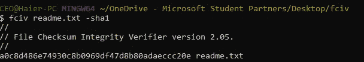

在这里，您可以看到该文件生成的哈希代码。现在，我们将通过在文本文件中添加一些字母来修改文件，并将再次对同一文件应用散列技术。

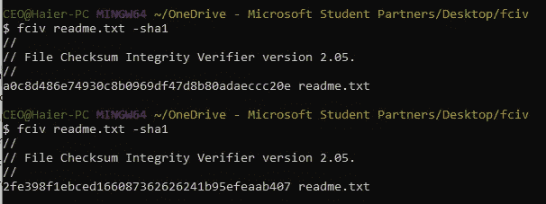

在这里你可以看到散列码已经改变，这表明文件已经被修改，不再是原来的形式。如果我们恢复在文件中所做的更改，并再次应用散列技术，让我们看看会发生什么。

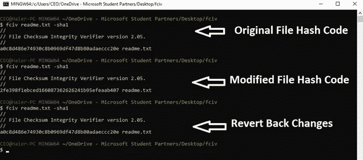

下面你可以看到一个图表，有一个应用了哈希函数的明文，应用哈希函数后生成一个哈希文本。这种散列技术也被用于网络取证。

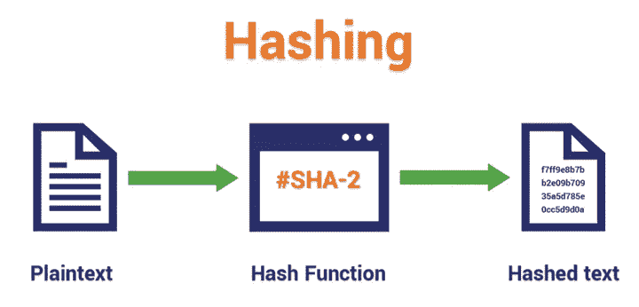

**数据可用性:**

这意味着授权方可以在适当的时间访问资产。**(99.9%)高可用性其中 0.1%是错误率，当增加了 99.999 的正常运行时间和 0.0001 的错误率。它是通过硬件维护、软件修补和网络优化等方法实现的。**

**恶意参与者丧失可用性的一个典型例子是**拒绝服务攻击(DOS)。****

****SLA:服务水平协议**是具有约束力的文件。这是服务提供商和客户之间的承诺。服务的特定方面—质量、可用性、责任由服务提供商和服务用户商定。如果服务用户没有及时收到文件，服务提供商将被罚款。**

**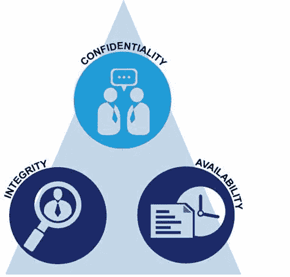**

**在讨论 DOS 攻击的类型之前，我们先来看看 **Ping 命令**。**

****Ping 命令:****

**Ping 是一种计算机网络管理软件实用程序，用于测试主机在互联网协议网络上的可达性。验证计算机可以通过网络与另一台计算机或网络设备通信的简单方法**

****Ping 127.0.0.1 (127.0.0.1 是一个环回地址)****

**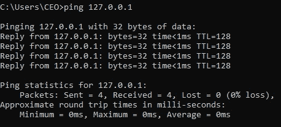**

****拒绝服务攻击的类型:****

**将讨论一些 DOS 攻击**

**1-死亡之乒**

**洪水的 2 平**

**3-Smurf 攻击**

**4-Fraggle 攻击**

****1-死亡之乒:****

**Ping of Death 攻击是一种[拒绝服务](https://www.imperva.com/learn/application-security/denial-of-service/) (DoS)攻击，攻击者通过发送大于最大允许大小的数据包来破坏目标机器，导致目标机器冻结或崩溃。**

**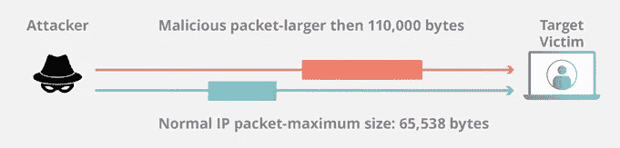**

****洪水 2 平:****

**Ping flood，也称为 ICMP flood，是一种常见的[拒绝服务](https://www.imperva.com/learn/application-security/denial-of-service/) (DoS)攻击，攻击者通过向受害者的计算机发送大量 ICMP 回应请求(也称为 Ping)来摧毁它。例如:教育委员会网站。**

**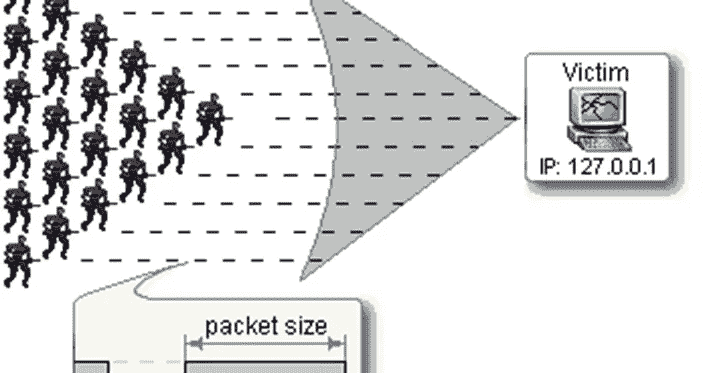**

****Fraggle 攻击:****

**Fraggle 攻击是一种 DOS 攻击，攻击者向网络中路由器的广播地址发送大量欺骗的 UDP 流量。**

**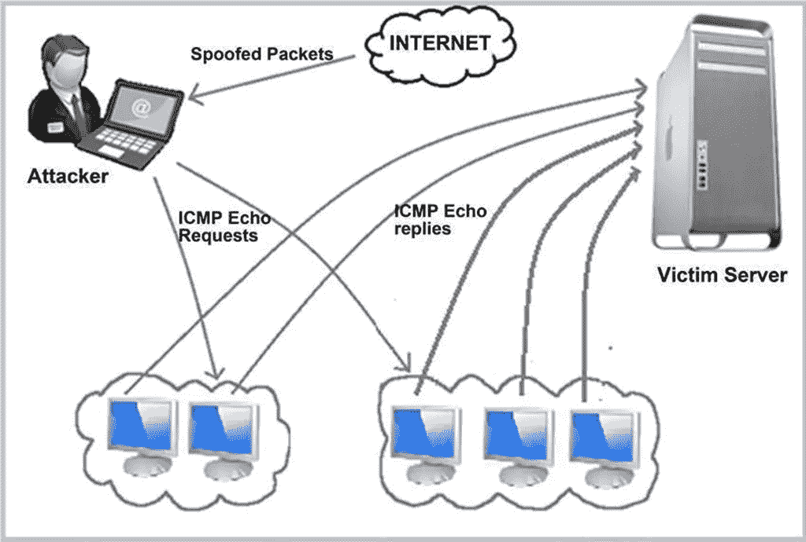**

****注:****

**第一个已知的计算机病毒出现在 **1971 年**，被命名为“**爬虫病毒**”。该病毒最终用一个名为“**收割者**的程序删除了，但需要注意的是，收割者实际上是一个病毒本身。**

****电信和网络安全:****

**侧重于通信、协议和网络服务，以及与每项相关的潜在漏洞。它涉及为防止和监控对计算机网络和网络可访问资源的未授权访问和滥用而采取的做法和政策。**

****协议:****

**网络协议是一组以简单、可靠和安全的方式管理信息交换的规则。下面给出了三种类型的网络协议:**

1.  **传输控制协议**
2.  **OSI 模型**
3.  **思科分层模型**

****TCP/IP VS OSI 模型****

**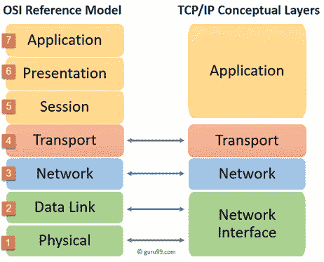**

**TCP/IP 和 OSI 模型是使用最广泛的两种网络协议。它们之间的主要区别 OSI 是一个概念模型，而 TCP/IP 是一个实用模型，用于建立安全连接和通过网络进行通信。**

****思科分层模型:****

**思科开发了一个三层的分层模型来设计可靠的基础设施。它的每一层都有自己的功能和特性，有助于降低网络复杂性。**

**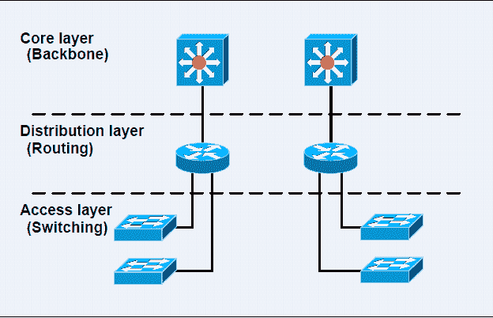**

****1-接入层**:**

**控制用户和工作组对网络资源的访问。这一层通常包含第 2 层交换机。**

****2-分布层:****

**用作接入层和核心层之间的通信点。这一层通常由多层交换机组成。**

****三芯层:****

**也称为主干层，这一层负责快速传输大量流量。**

****应急计划:****

1.  ****IR(事件响应)——**低级别问题有多个环节，第一步是识别、遏制、调查(取证)、执行补救、报告(记录)**
2.  ****灾难恢复(DR):**高级别问题，重大中断，如洪水、地震。**
3.  ****BCP(业务连续性规划):**当一切都在灾难中被摧毁，那么如何继续业务**

****法律、调查和道德****

**更有趣的安全领域之一是法律、调查和道德。顾名思义，这个安全域涵盖了与计算机安全相关的法律问题。**

**2016 年巴基斯坦网络法**

****密码术****

**当今使用最广泛的安全技术之一是加密技术，即对数据的加密。加密安全域旨在帮助您了解如何以及何时使用加密。**

**下一步是什么？**

**本文旨在为您提供网络安全基础知识的快速介绍和入门指南。请随意尝试。**

**让我们连接起来…**

**https://www.facebook.com/saad.aslam.7355 脸书**

**领英:[https://www.linkedin.com/in/saad-aslam-a83889152/](https://www.linkedin.com/in/saad-aslam-a83889152/)**