# 分层聚类以及如何在 Python 中执行分层聚类的初学者指南

> 原文：<https://medium.com/analytics-vidhya/a-beginners-guide-to-hierarchical-clustering-and-how-to-perform-it-in-python-3ea26de2bc20?source=collection_archive---------0----------------------->

在任何行业，了解客户行为都是至关重要的。去年，当我的首席营销官问我——“你能告诉我我们的新产品应该瞄准哪些现有客户吗？”

那对我来说是一个相当长的学习曲线。作为一名[数据科学家](https://courses.analyticsvidhya.com/courses/applied-machine-learning-beginner-to-professional?utm_source=blog&utm_medium=beginners-guide-hierarchical-clustering)，我很快意识到对客户进行细分是多么重要，这样我的组织才能量身定制并制定有针对性的战略。这就是集群概念如此方便的地方！

像细分客户这样的问题通常看起来很棘手，因为我们没有考虑任何目标变量。我们正式进入了无监督学习的领域，在这里我们需要找出模式和结构，而没有固定的结果。作为一名数据科学家，这既具有挑战性，又令人激动。

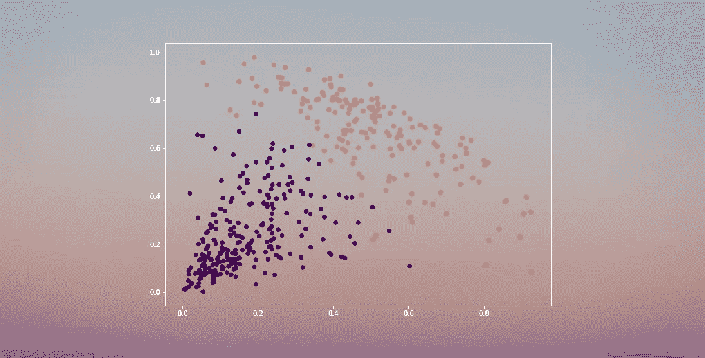

现在，有几种不同的方法来执行集群(如下所示)。在本文中，我将向您介绍这样一种类型——层次聚类。

我们将了解什么是层次聚类，它相对于其他聚类算法的优势，不同类型的层次聚类以及执行它的步骤。我们将最终采用一个客户细分数据集，然后用 Python 实现层次聚类。我喜欢这种技术，我相信你看完这篇文章后也会喜欢的！

*注意:如前所述，有多种方法可以执行聚类。我鼓励你去看看我们关于不同类型集群的指南:*

*   [*聚类介绍和不同的聚类方法*](https://www.analyticsvidhya.com/blog/2016/11/an-introduction-to-clustering-and-different-methods-of-clustering/?utm_source=blog&utm_medium=beginners-guide-hierarchical-clustering)

# 目录

1.  监督与非监督学习
2.  为什么要分层聚类？
3.  什么是层次聚类？
4.  层次聚类的类型
    1。凝聚层次聚类
    2。分裂层次聚类
5.  执行分层聚类的步骤
6.  层次聚类中如何选择聚类个数？
7.  使用层次聚类解决批发客户细分问题

# 监督与非监督学习

在我们深入到层次聚类之前，理解监督学习和无监督学习的区别[无监督学习](https://courses.analyticsvidhya.com/courses/applied-machine-learning-beginner-to-professional?utm_source=blog&utm_medium=beginners-guide-hierarchical-clustering)是很重要的。让我用一个简单的例子来解释这个区别。

假设我们想估计一个城市每天出租的自行车数量:

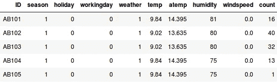

或者，假设我们想预测泰坦尼克号上的一个人是否幸存:

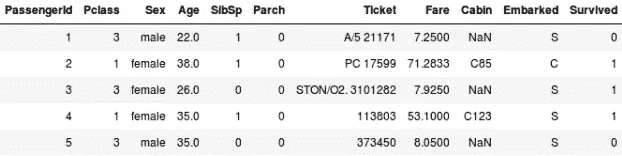

在这两个例子中，我们都有一个要实现的固定目标:

*   在第一个例子中，我们必须根据季节、假日、工作日、天气、温度等特征来预测自行车的数量。
*   在第二个例子中，我们预测一名乘客是否幸存。在“幸存”变量中，0 表示该人没有幸存，1 表示该人确实活着出去了。这里的自变量包括 Pclass、性别、年龄、票价等。

> *所以，当我们给定一个目标变量(上面两个例子中的计数和存活率)时，我们必须根据一组给定的预测因子或独立变量(季节、假期、性别、年龄等)进行预测。)，这样的问题叫做监督学习问题。*

让我们看下图来直观地理解这一点:

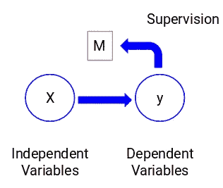

这里，y 是我们的因变量或目标变量，X 代表自变量。目标变量依赖于 X，因此也称为因变量。**我们使用目标变量的监督中的独立变量来训练我们的模型，因此命名为监督学习。**

在训练模型时，我们的目标是生成一个将独立变量映射到所需目标的函数。一旦模型被训练，我们可以传递新的观察集，模型将为它们预测目标。简单来说，这就是监督学习。

> 可能会出现我们没有任何目标变量可预测的情况。这样的问题，没有任何明确的目标变量，被称为无监督学习问题。在这些问题中，我们只有自变量，没有目标/因变量。

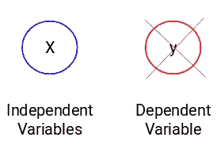

在这些情况下，我们尝试将整个数据分成一组。这些组被称为集群，并且形成这些集群的过程被称为**集群**。

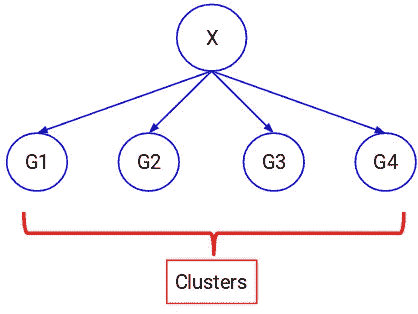

这种技术通常用于将群体聚类成不同的组。一些常见的例子包括细分客户、将相似的文档聚集在一起、推荐相似的歌曲或电影等。

无监督学习还有很多应用。如果你遇到任何有趣的应用程序，请在下面的评论区分享它们！

现在，有各种算法可以帮助我们做出这些聚类。最常用的聚类算法是 K-means 和层次聚类。

# 为什么要分层聚类？

在深入研究层次聚类之前，我们应该先了解 K-means 是如何工作的。相信我，这将使分层集群的概念变得更加简单。

以下是 K-means 工作原理的简要概述:

1.  决定聚类的数量(k)
2.  从数据中随机选择 k 个点作为质心
3.  将所有点指定给最近的聚类质心
4.  计算新形成的簇的质心
5.  重复步骤 3 和 4

这是一个反复的过程。它将继续运行，直到新形成的簇的质心不变或达到最大迭代次数。

但是 K-means 也有一定的挑战。它总是试图制造相同大小的簇。此外，我们必须决定在算法的*开始*的聚类数。理想情况下，在算法开始时，我们不知道应该有多少个聚类，因此这对于 K-means 是一个挑战。

这是一座缺口层次分明、泰然自若的聚类桥梁。它消除了必须预先定义集群数量的问题。听起来像一场梦！那么，让我们看看什么是层次聚类，以及它是如何改进 K-means 的。

# 什么是层次聚类？

假设我们有以下几点，我们想将它们分组:

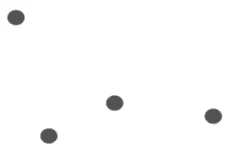

我们可以将这些点中的每一个分配给一个单独的集群:


现在，基于这些聚类的相似性，我们可以将最相似的聚类组合在一起，并重复这个过程，直到只剩下单个聚类:

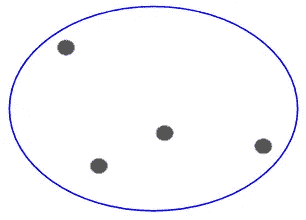

我们实际上是在构建集群的层次结构。这就是为什么这个算法叫做层次聚类。我将在后面的小节中讨论如何决定集群的数量。现在，让我们看看不同类型的层次聚类。

# 层次聚类的类型

主要有两种类型的分层聚类:

1.  凝聚层次聚类
2.  分裂层次聚类

我们来详细了解一下每一种类型。

# 凝聚层次聚类

在这种技术中，我们将每个点分配给一个单独的簇。假设有 4 个数据点。我们将这些点中的每一个点分配给一个聚类，因此开始时将有 4 个聚类:

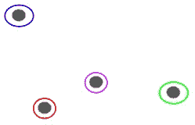

然后，在每次迭代中，我们合并最近的一对聚类，并重复此步骤，直到只剩下一个聚类:

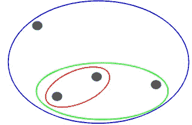

我们在每一步都在合并(或添加)集群，对吗？因此，这种类型的聚类也被称为**加性层次聚类。**

# 分裂层次聚类

分裂式层次聚类的工作方式正好相反。不是从 n 个聚类开始(在 n 个观察值的情况下)，而是从单个聚类开始，并将所有点分配给该聚类。

所以，我们有 10 或 1000 个数据点并不重要。所有这些点在开始时将属于同一个集群:


现在，在每次迭代中，我们分割聚类中最远的点，并重复这个过程，直到每个聚类只包含一个点:


我们在每一步都分裂(或划分)聚类，因此命名为分裂式层次聚类。

凝聚聚类在工业中应用广泛，这将是本文的重点。一旦我们掌握了聚集类型，分裂的层次聚类将是小菜一碟。

# 执行分层聚类的步骤

我们在层次聚类中合并最相似的点或聚类——我们知道这一点。现在的问题是——我们如何决定哪些点是相似的，哪些是不相似的？这是聚类中最重要的问题之一！

这里有一种计算相似性的方法——计算这些簇的质心之间的距离。距离最小的点被称为相似点，我们可以合并它们。我们也可以称之为基于**距离的算法**(因为我们正在计算聚类之间的距离)。

在层次聚类中，我们有一个叫做**邻近矩阵**的概念。这存储了每个点之间的距离。让我们举一个例子来理解这个矩阵以及执行层次聚类的步骤。

# 树立榜样


假设一位老师想把她的学生分成不同的小组。她有每个学生在作业中的分数，基于这些分数，她想将他们分组。至于有多少组，这里没有固定的目标。由于老师不知道什么类型的学生应该被分配到哪个组，所以它不能作为监督学习问题来解决。因此，我们将尝试应用层次聚类，将学生分成不同的组。

让我们以 5 名学生为样本:

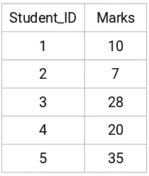

# 创建邻近矩阵

首先，我们将创建一个邻近矩阵，它将告诉我们这些点之间的距离。由于我们正在计算每个点与其他每个点之间的距离，我们将得到一个形状为 n X n 的方阵(其中 n 是观察次数)。

让我们为我们的例子制作一个 5×5 的邻近矩阵:

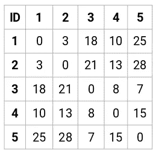

这个矩阵的对角元素将总是 0，因为一个点与其自身的距离总是 0。我们将使用欧几里德距离公式来计算其余的距离。假设我们想计算点 1 和点 2 之间的距离:

√(10–7)² = √9 = 3

同样，我们可以计算所有的距离并填充邻近矩阵。

# 执行分层聚类的步骤

**第一步:**首先，我们将所有的点分配给一个单独的聚类:


这里不同的颜色代表不同的集群。您可以看到，我们的数据中的 5 个点有 5 个不同的聚类。

**第二步:**接下来，我们将查看邻近矩阵中的最小距离，并将距离最小的点进行合并。然后，我们更新邻近矩阵:

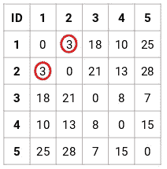

这里，最小距离是 3，因此我们将合并点 1 和 2:

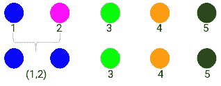

让我们看看更新后的聚类，并相应地更新邻近矩阵:

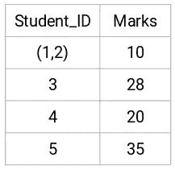

这里，我们采用两个标记(7，10)中的最大值来替换该组的标记。除了最大值，我们也可以取最小值或平均值。现在，我们将再次计算这些集群的邻近矩阵:

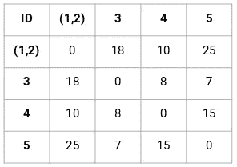

**步骤 3:** 我们将重复步骤 2，直到只剩下一个集群。

因此，我们将首先查看邻近矩阵中的最小距离，然后合并最接近的聚类对。重复这些步骤后，我们将得到如下所示的合并集群:

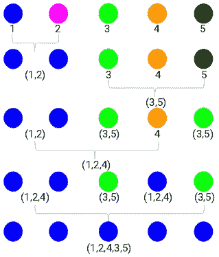

我们从 5 个集群开始，最后只有一个集群。**这就是凝聚层次聚类的工作原理**。但是迫切的问题仍然存在——我们如何决定集群的数量？让我们在下一节中理解这一点。

# 在层次聚类中应该如何选择聚类的个数？

准备好最终回答这个从我们开始学习以来就一直悬而未决的问题了吗？为了获得层次聚类的聚类数，我们使用了一个很棒的概念，叫做**树状图**。

> *树状图是记录合并或拆分顺序的树状图表。*

让我们回到我们的师生例子。每当我们合并两个聚类时，树状图将记录这些聚类之间的距离，并以图形的形式表示出来。让我们看看树状图是什么样子的:

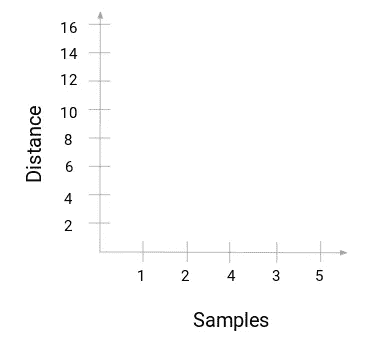

x 轴是数据集的样本，y 轴是距离。**每当两个聚类合并时，我们将在这个树状图中连接它们，连接的高度将是这些点之间的距离。**让我们为我们的示例构建树状图:


花一点时间来处理上面的图像。我们从合并样本 1 和 2 开始，这两个样本之间的距离是 3(参考上一节中的第一个邻近矩阵)。让我们在树状图中画出来:

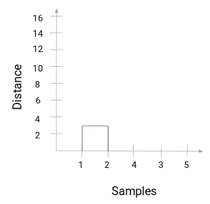

在这里，我们可以看到我们已经合并了样本 1 和样本 2。垂直线代表这些样本之间的距离。类似地，我们绘制了合并聚类的所有步骤，最后，我们得到了这样的树状图:

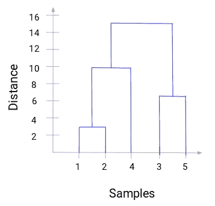

我们可以清楚地看到层次聚类的步骤。**树状图中垂直线的距离越大，这些聚类之间的距离越大。**

现在，我们可以设置一个阈值距离，并绘制一条水平线(*一般情况下，我们尝试以这样的方式设置阈值，使其切割最高的垂直线*)。让我们将这个阈值设置为 12，并画一条水平线:

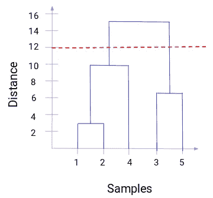

**聚类的数量将是与使用阈值绘制的线相交的垂直线的数量。**在上面的例子中，由于红线与 2 条垂直线相交，我们将有 2 个集群。一个分类有一个样本(1，2，4)，另一个有一个样本(3，5)。很简单，对吧？

这就是我们如何在层次聚类中使用树状图来决定聚类的数量。在下一节中，我们将实现分层集群，这将帮助您理解我们在本文中学到的所有概念。

# 利用层次聚类解决批发客户细分问题

是时候接触 Python 了！

我们将研究批发客户细分问题。可以使用 [**这个链接**](https://archive.ics.uci.edu/ml/machine-learning-databases/00292/Wholesale%20customers%20data.csv) 下载数据集。这些数据存放在 UCI 机器学习资料库中。这个问题的目的是根据批发分销商的客户在不同产品类别(如牛奶、食品杂货、地区等)上的年度支出对他们进行细分。

让我们先研究一下数据，然后应用层次聚类对客户进行细分。

我们将首先导入所需的库:

```
import pandas as pd                       
import numpy as np                       
import matplotlib.pyplot as plt
%matplotlib inline
```

加载数据并查看前几行:

```
data = pd.read_csv('Wholesale customers data.csv')                       
data.head()
```

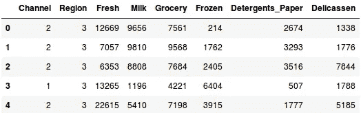

有多种产品类别——生鲜、牛奶、杂货等。这些值表示每个客户为每种产品购买的单位数量。**我们的目标是从这些数据中建立聚类，将相似的客户划分在一起**。当然，我们将使用层次聚类来解决这个问题。

但是在应用层次聚类之前，我们必须对数据进行归一化，以便每个变量的规模都相同。为什么这很重要？嗯，如果变量的规模不一样，模型可能会偏向于更高幅度的变量，如新鲜或牛奶(参考上表)。

因此，让我们首先将数据标准化，并将所有变量纳入同一范围:

```
from sklearn.preprocessing import normalize                       
data_scaled = normalize(data)                       
data_scaled = pd.DataFrame(data_scaled, columns=data.columns)                       
data_scaled.head()
```

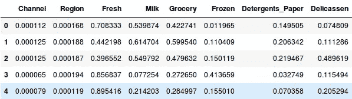

在这里，我们可以看到所有变量的规模几乎是相似的。现在，我们可以走了。让我们首先绘制树状图来帮助我们决定这个特定问题的聚类数:

```
import scipy.cluster.hierarchy as shc                       
plt.figure(figsize=(10, 7))                         
plt.title("Dendrograms")                         
dend = shc.dendrogram(shc.linkage(data_scaled, method='ward'))
```

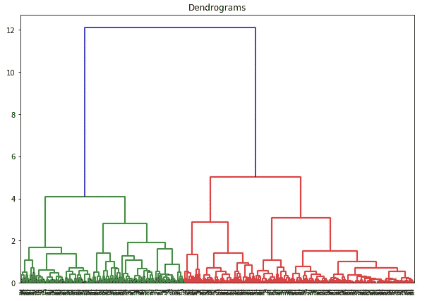

x 轴包含样本，y 轴表示这些样本之间的距离。距离最大的垂直线是蓝线，因此我们可以决定阈值为 6，并切割树状图:

```
plt.figure(figsize=(10, 7))                         
plt.title("Dendrograms")                         
dend = shc.dendrogram(shc.linkage(data_scaled, method='ward'))                       
plt.axhline(y=6, color='r', linestyle='--')
```

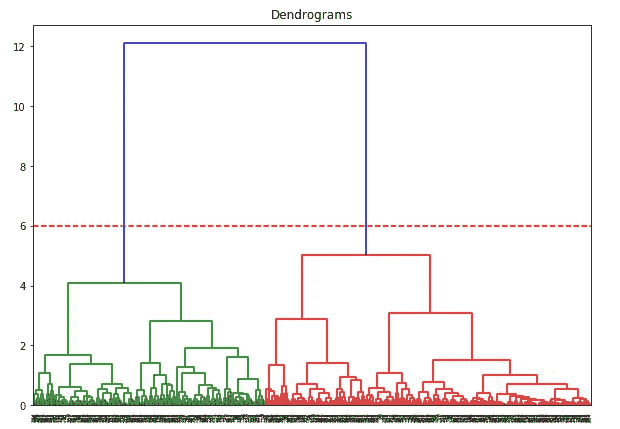

我们有两个集群，因为这条线在两个点切割树状图。现在让我们对两个集群应用分层集群:

```
from sklearn.cluster import AgglomerativeClustering                       
cluster = AgglomerativeClustering(n_clusters=2, affinity='euclidean', linkage='ward')                         
cluster.fit_predict(data_scaled)
```

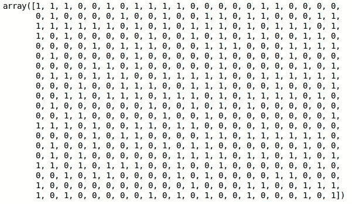

我们可以在输出中看到 0 和 1 的值，因为我们定义了 2 个集群。0 表示属于第一类的点，1 表示第二类中的点。现在让我们想象一下这两个集群:

```
plt.figure(figsize=(10, 7))                         
plt.scatter(data_scaled['Milk'], data_scaled['Grocery'], c=cluster.labels_)
```

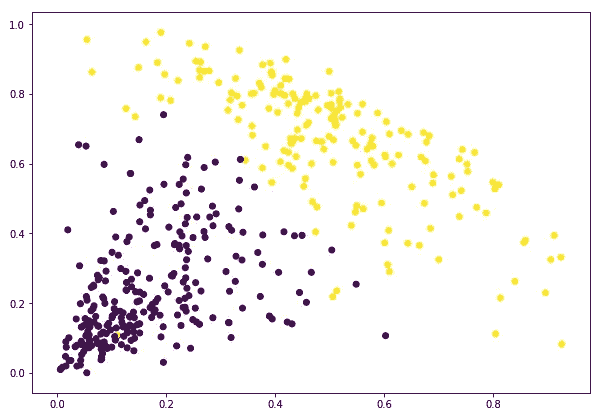

厉害！我们可以清楚地看到这两个星团。这就是我们如何在 Python 中实现层次聚类。

# 结束注释

等级聚类是分割观察结果的一种非常有用的方法。不必预先定义聚类数的优点使它比 k-Means 更有优势。

如果你对数据科学还比较陌生，我强烈推荐你参加 [**应用机器学习**](https://courses.analyticsvidhya.com/courses/applied-machine-learning-beginner-to-professional?utm_source=blog&utm_medium=beginners-guide-hierarchical-clustering) 课程。这是你在任何地方都能找到的最全面的端到端机器学习课程之一。分层聚类只是我们在课程中涉及的众多主题之一。

你对层次聚类有什么想法？你觉得有更好的方法来使用更少的计算资源创建集群吗？在下面的评论区联系我，我们一起讨论！

*原载于 2019 年 5 月 27 日*[*https://www.analyticsvidhya.com*](https://www.analyticsvidhya.com/blog/2019/05/beginners-guide-hierarchical-clustering/)*。*