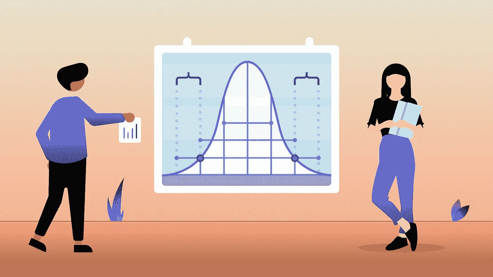
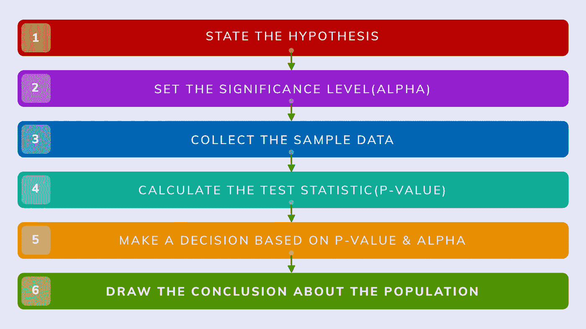
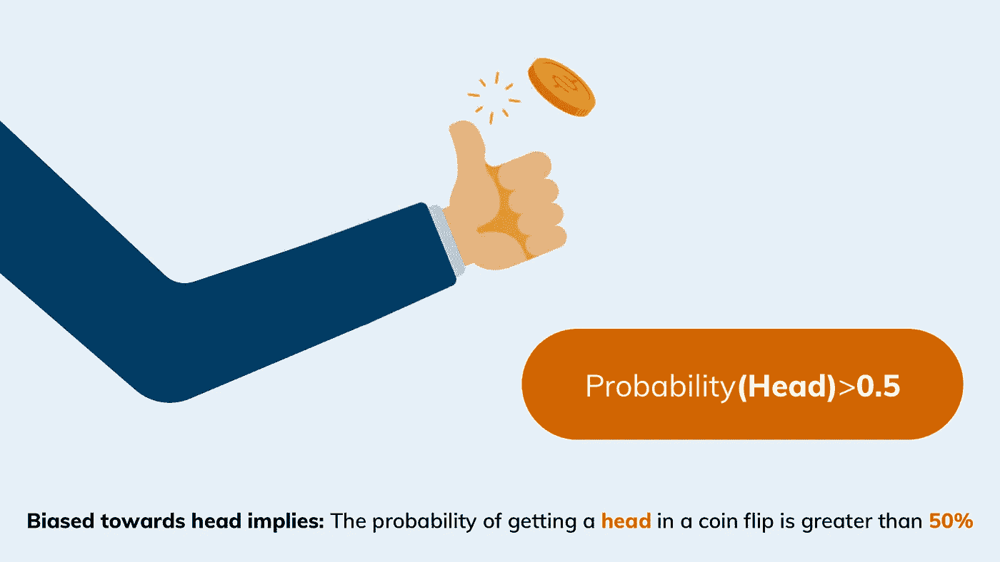
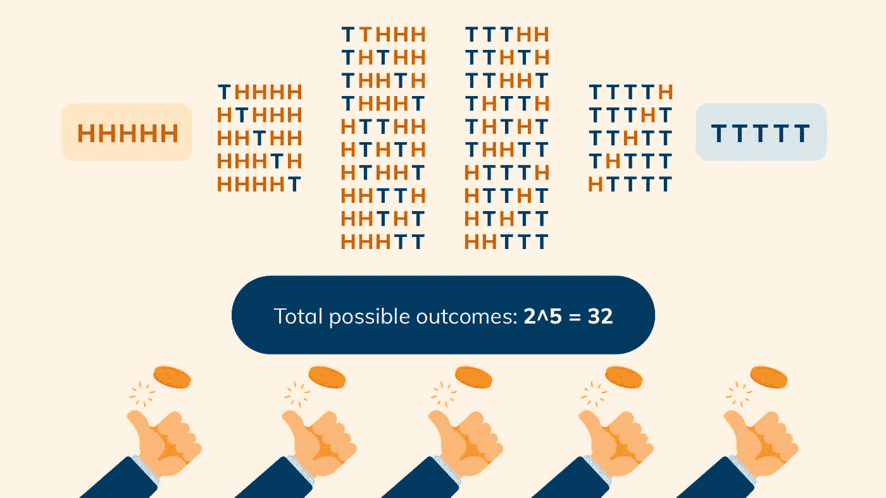
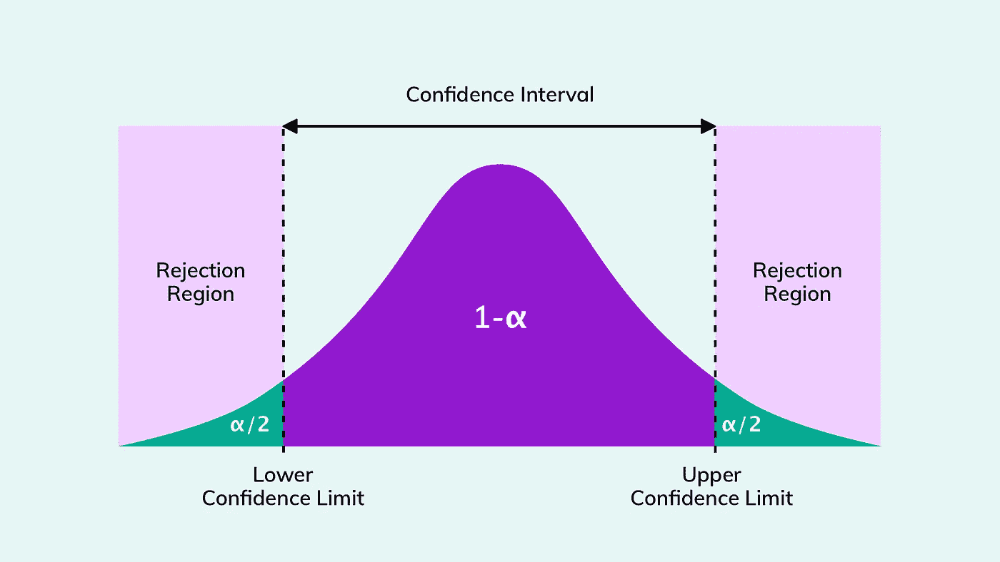
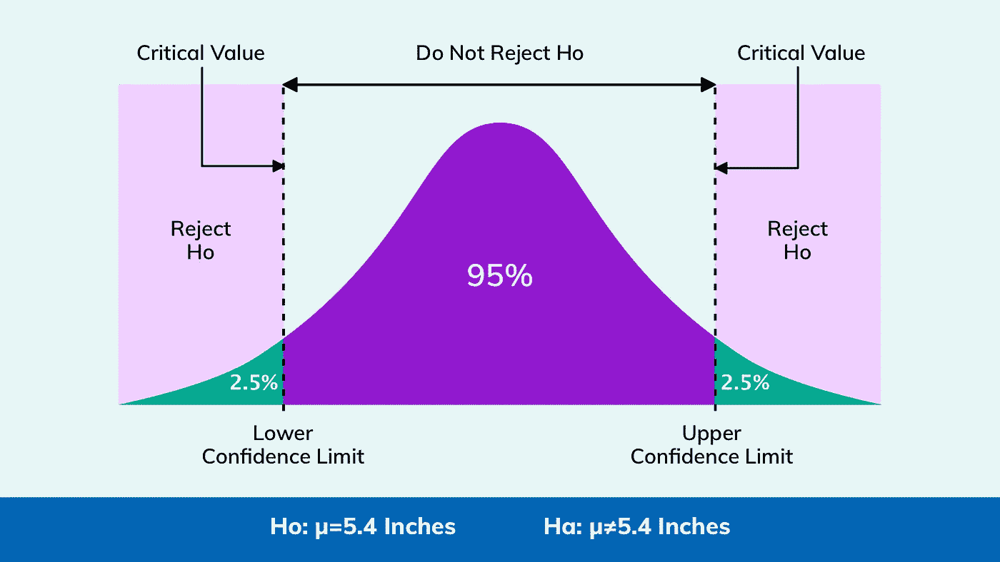
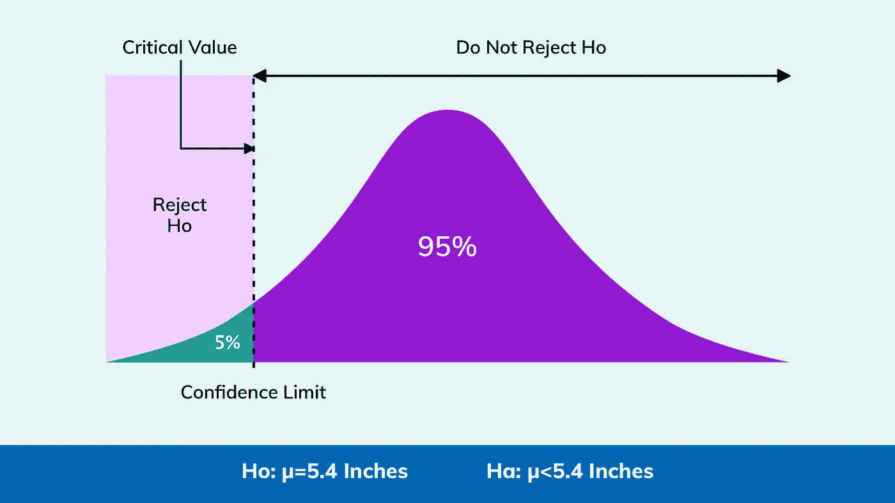
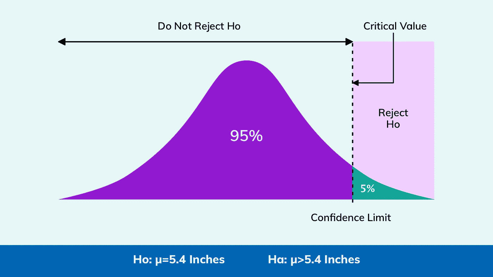
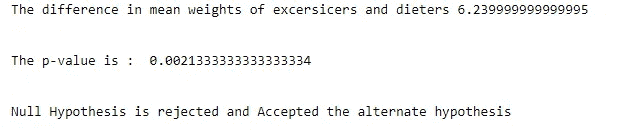

# 假设检验初学者指南

> 原文：<https://medium.com/analytics-vidhya/a-beginners-guide-to-hypothesis-testing-f34d6332c1cc?source=collection_archive---------7----------------------->

统计假设检验是检验所作的假设(假设)，得出关于总体的结论。这是通过测试代表整个群体的样本并基于获得的结果来完成的；假设要么被拒绝，要么被接受。

> **“假设是一个可以被检验的想法”**

# **进行假设检验的步骤**

# **零假设和替代假设**

无效假设和替代假设分别由 Ho 和 Ha 表示。

> 假设 0 (Ho): 对需要检验的总体所做的假设，在找到相反的证据之前被认为是正确的
> 
> **假设 1 (Ha):** 与所做的假设相反，当前者被拒绝时被接受。

让我们通过抛硬币的实验来理解这两个术语，并确定硬币是否偏向正面。

## **零备假设是:**

***Ho:*** *硬币不偏头像。*

***哈:*** *硬币偏向头像。*

# **显著性水平，P 值&置信水平**

显著性水平由希腊字母 alpha (α)表示。

常用的α值为 0.1%、1%、5%和 10%。较小的α值表明对零假设的解释更可靠，如 1%或 0.1%。

假设检验返回一个称为 **p 值**的概率值。使用这个值，我们可以拒绝零假设，接受替代假设，或者接受零假设。

***p 值=概率(数据|零假设* )**

***p 值< = alpha*** :拒绝空值，接受备选假设

***p 值>α***:未能拒绝零假设

让我们将一枚硬币抛五次，以此来验证上述假设。

**进行的实验:**

抛了五次硬币后，我们连续得到五个头像(X) = 5

考虑到α= 0.05

p 值:概率(X=5 |Ho)

**结果:**

所有五个头的可能结果中的事件数= 1

所以，P(X=5 |Ho) = 1/32 = 0.03

0.03 表示只有 3%的机会连续得到五个头像，这个概率小于α。

P(X= 5 |Ho) = 0.03 < alpha( 0.05)

As the ground truth observed cannot be rejected, hence ***拒绝原假设(Ho)，接受备择假设。***

***置信水平*** 可以通过给定的观测样本数据的 1 减去假设的显著性水平得到。

**置信水平= 1 —显著性水平(α)**

# **双尾假设检验**

双尾假设与方向无关，因为在两个方向上都测试了效果。显著性水平在分布的两个尾部之间分成两半。因此，如果太大或太小，它将拒绝测试分数。

***让我们以“印度女性平均身高为 5.4 英寸”的假设来理解这一点。*** *设显著性值为 0.05，样本量为 50，标准差为 0.2 英寸*

***何:平均身高(μ) = 5.4 英寸***

***Ha:平均身高(μ) ≠ 5.4 英寸***

# **单尾假设检验**

单尾假设检验也称为方向性和单侧检验，因为您只能在一个方向上检验效果。当您执行单尾检验时，整个显著性水平百分比位于分布的任何一个尾部的末端。

单尾假设分为两种分布:

1.左尾分布

**2。**右尾分布

## **左-t** 分配失败

如果假设是“ ***印度女性平均身高小于 5.4 英寸”***

***Ho:平均身高(μ) = 5.4 英寸***

***Ha:平均身高(μ) < 5.4 英寸***

## 右尾分布

如果假设是 ***【印度女性平均身高大于 5.4 英寸】***

***Ho:平均身高(μ) = 5.4 英寸***

***Ha:平均身高(μ) > 5.4 英寸***

# 使用重采样和排列测试的 p 值:

让我们考虑一个假设，即只节食的人比只锻炼的人体重减轻得多。因此，节食者的平均体重低于锻炼者的平均体重。

## 进行的实验:

假设本实验的显著性水平/α为 0.05。

考虑两个样本 A 和 B，每个样本大小为 50。a 代表节食者的体重，B 代表锻炼者的体重。

## 检验统计/观察

节食者和锻炼者的平均体重之差(δ)= 6 公斤

## 无效和替代假设是:

胡先生:节食者和锻炼者的平均体重没有区别。

Ha:节食者和锻炼者的平均体重有显著差异

## p 值

p 值为 **p(x > =6|Ho)** ，这意味着假设零假设成立，找到平均体重差异(δ>= 6 千克)的概率为真，即节食者和锻炼者的平均体重没有差异。

## 使用重采样和置换计算 p 值

1.合并集合 A 和集合 B，并将它们混洗以形成数据集 s。

2.从数据集 s 中随机抽取新集合 A '和 B '

3.在假设 Ho 为真的情况下，找出组 A '和组 B '的平均重量差δ，即节食者和锻炼者之间的平均重量差。

4.保存δ的值。

5.重复**步骤 1、2、3 & 4** 达 **k** 次(比如 10000)。

6.现在按升序对 k δs 进行排序。这些是δ的模拟值，H0 为真。

7.检查δ(地面实况)在模拟δ排序列表中的位置。

8.计算 p 值。

9.现在将 p 值与 alpha 值进行比较，然后做出决定。

**参考文献:**

[https://machine learning mastery . com/statistical-hypothesis-tests/](https://machinelearningmastery.com/statistical-hypothesis-tests/)

[https://www.khanacademy.org/math/statistics-probability/](https://www.khanacademy.org/math/statistics-probability/)

[https://user page . fuberlin . de/soga/200/2070 _ Hypothesis _ tests/20713 _ The _ Critical _ Value _ and _ The _ p-Value _ Approach _ to _ Hypothesis _ testing . html](https://userpage.fuberlin.de/soga/200/2070_hypothesis_tests/20713_The_Critical_Value_and_the_p-Value_Approach_to_Hypothesis_Testing.html)

[https://www.youtube.com/results?search _ query = stat quest+假设+测试](https://www.youtube.com/results?search_query=statquest+hypothesis+testing)