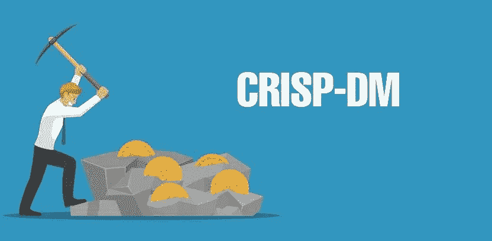
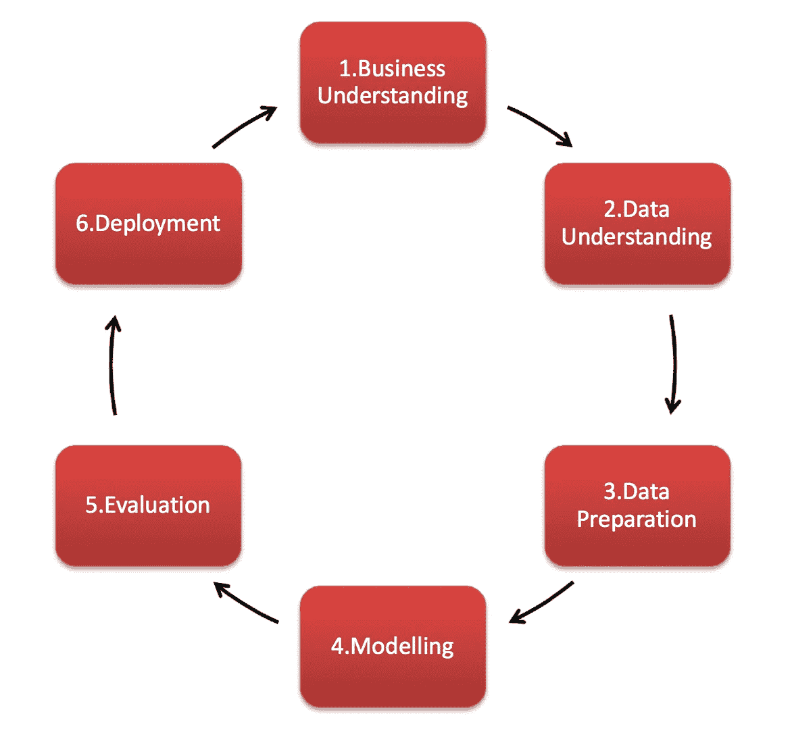
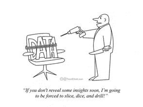
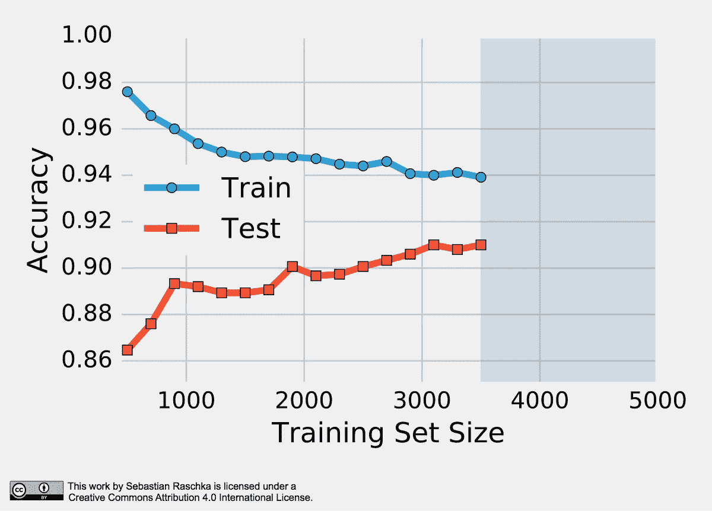
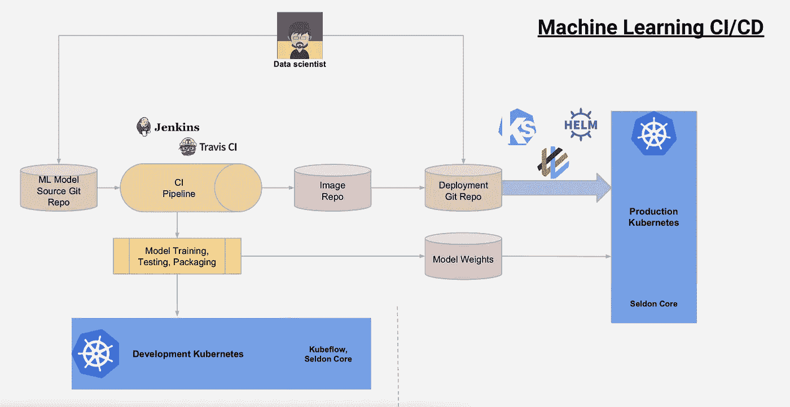

# 数据挖掘行业标准过程初学者指南:CRISP-DM

> 原文：<https://medium.com/analytics-vidhya/a-beginners-guide-to-industry-standard-process-of-data-mining-crisp-dm-c1d7d50e57c3?source=collection_archive---------4----------------------->

数据挖掘的跨行业标准过程

数据挖掘是通过分析大量数据来发现隐藏的、有价值的知识的过程。此外，我们必须将数据存储在不同的数据库中。因此，需要一个标准的数据挖掘过程。

CRISP-DM(数据挖掘的跨行业标准流程)是一种强大且经过充分验证的方法，它提供了一种结构化的方法来解决几乎任何行业中的任何分析问题。

它为任何人——从新手到数据挖掘专家——提供了进行数据挖掘项目的完整蓝图。

CRISP-DM 框架的流程:

CRISP-DM 将数据挖掘项目的生命周期分为六个阶段。

# **1)业务理解**

***“我从未失败过一次。这只是碰巧是一个 2000 步的过程。”***

框架的第一阶段是发展业务理解。为此，我们必须执行以下两个步骤

**A)确定业务目标**

对于数据分析师来说，**了解业务**及其具体问题至关重要。你应该清楚地理解这个问题，把它转化成一个定义明确的分析问题。只有这样，你才能制定出一个绝妙的策略来解决这个问题

**B)确定数据分析的目标**

必须评估当前情况，并从这些见解中，定义执行流程的目标。这应该在制定计划之后进行。

# 2)数据理解

***“数据！数据！数据！没有粘土我做不了砖！”***

CRISP- DM 框架的数据理解阶段侧重于收集数据、描述和探索数据。

此阶段包括四个关键步骤，以理解可用数据，并识别新的相关数据，从而解决业务问题

*   收集相关数据:您需要识别和收集可用于分析的正确数据集。
*   描述数据——获取明确的信息:一旦您确定了数据集，您就需要描述它的内容并探索洞察力，以更好地理解数据及其业务含义。
*   通过绘制图表探索数据:理解数据的一个关键部分是*通过绘制图表探索数据。*通过图表可以获得以下类型的洞察力。a *发现异常值 b)
    观察变量的趋势(增加/减少)等 c)观察变量之间的相关性*
*   验证数据质量以消除错误:一旦理解了数据结构，接下来就可以检查数据质量并解决各种因素

# 3)数据准备

***“给我六个小时砍树，我会用前四个小时磨利斧头。”***

数据通常分布在不同的文件中。整理这些文件并根据业务理解选择所需的行和列是数据准备的主要步骤。在整理数据集后，我们处理缺失值和异常值。这被认为是最关键的一步，因为模型将建立在这里创建的数据集上。

数据准备任务可能会多次执行，并且没有任何规定的顺序。任务包括表、记录和属性选择，以及为建模工具转换和清理数据。

它由以下步骤组成:

1.  选择相关数据
2.  整合数据
3.  干净的数据
4.  构造数据:衍生新要素
5.  格式化数据

# 4)数据建模

建模是数据分析的核心。

其执行方式如下:

1.  选择建模技术是第一步
2.  接下来是生成测试场景来验证模型的质量。
3.  在那之后，很少更多的模型被生成。
4.  然后对所有模型进行评估，以确保它们符合业务计划。

# 5)模型评估

真正的天才存在于对不确定的、危险的和矛盾的信息进行评估的能力中 

这是框架的第五个阶段——模型评估。

可以对预测模型进行测试，以评估它们解决问题的有效性。建模和评估是一个反复的过程，在这个过程中，模型被调整，直到获得满意的评估结果。

# 6)模型部署

***“目标是将数据转化为信息，将信息转化为洞察力。”***

这是框架的最后一个阶段，在这里模型被转化为商业策略。业务数据被输入到模型中，模型结果被用于持续地通知业务决策。

# CRISP-DM 框架的优势

CRISP-DM 框架提供了一个统一的框架

*   指南和经验文档
*   CRISP-DM 可灵活应对不同的业务/机构问题和不同的数据。