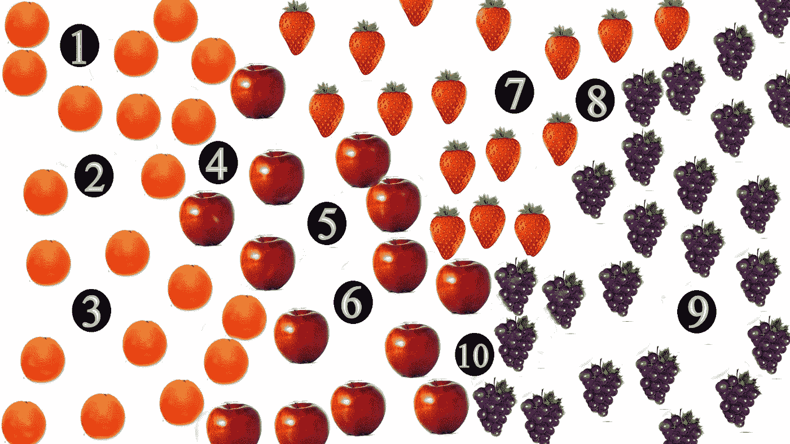
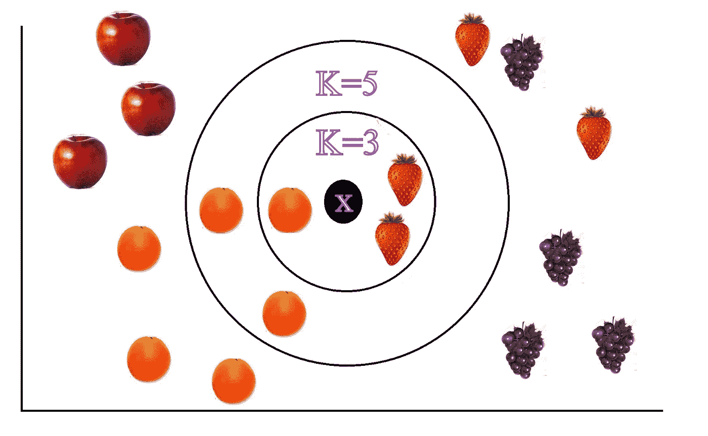
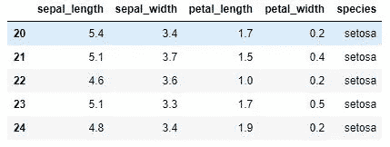
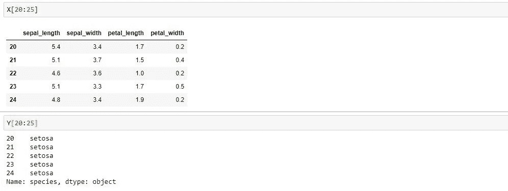
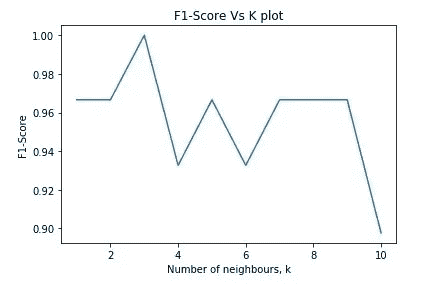

# 带代码的 K 最近邻(KNN)算法初学者指南

> 原文：<https://medium.com/analytics-vidhya/a-beginners-guide-to-k-nearest-neighbor-knn-algorithm-with-code-5015ce8b227e?source=collection_archive---------0----------------------->

今天，让我们讨论机器学习中最简单的算法之一:K 最近邻算法(KNN)。在本文中，我将解释 KNN 算法的基本概念，以及如何在 Python 中使用 KNN 实现一个机器学习模型。

机器学习算法可以大致分为两类:

1.监督学习

2.无监督学习

在**监督学习**中，我们在一组带标签的数据上训练我们的模型，并要求它预测未标记点的标签。例如，一个癌症预测模型是根据许多被标记为阳性或阴性的临床测试结果来训练的。然后，经过训练的模型可以预测未标记的测试结果是阳性还是阴性。

另一方面，**无监督学习**是在无标签数据集上完成的。

KNN 属于监督学习。话虽如此，我们将在接下来的 5 分钟里把机器学习和 KNN 放在一边，让我们去镇上鲍勃新开的水果店。作为促销优惠，Bob 设置了一个难题，并向解决该难题的人赠送免费水果。这个谜题解释如下。



鲍勃的难题

鲍勃排列了 4 种水果:苹果、橘子、草莓和葡萄，如上图所示。他用一块黑布盖住了一些水果，并给它们编号。谁能正确预测这些隐藏水果的名字，谁就可以免费领取！但是做一个错误的预测会让你失去你所拥有的一切。如果不确定，可以将其标记为不确定。现在暂停一下，试试看你能不能把它做好。

一旦你做出了预测，让我们用下面的来核对一下:

1，2，3 →橙子

4→不确定是橘子还是苹果

5，6→苹果

7→草莓

8→不确定是葡萄还是草莓

9→葡萄

10→不确定是苹果还是葡萄

如果你的预测与上面的相符，那么你已经知道什么是 KNN，并且已经实现了！想知道怎么做？为了理解这一点，让我们仔细看看你是如何做出预测的。

在图像中，我们观察到相似的水果排列在一起。对于 1、2 和 3，我们可以很容易地将它们归类为橙子，因为它们被橙子单独密集地包围着，因此隐藏的橙子也很有可能是橙子。换句话说，隐藏的那些将大部分是与它们的大多数 ***邻居*** 相同的类型。同样的逻辑也适用于 5、6、7 和 9。

对于 10，我们不确定它是苹果还是葡萄。这是因为，它被苹果和葡萄包围着。或者我们可以说，10 的邻居属于苹果和葡萄。所以 10 可以是苹果也可以是葡萄。对于 4 和 8 也是如此。

简而言之，KNN 算法基于其邻居的标签来预测新点的标签。KNN 依赖于相似数据点在空间坐标中更接近的假设。在上面的例子中，基于邻居的标签(苹果、橘子、草莓、葡萄)，我们可以预测新数据点的标签(隐藏的水果)。

# **最近邻居**

KNN 中的 k 是我们在进行预测时考虑的最近邻的数量。我们根据一个点到考虑中的点的距离(例如:欧几里德距离、曼哈顿距离等)来确定该点的接近度。例如，如果 K=5，我们考虑 5 个最近的点，并将这 5 个点中大多数的标签作为预测标签。



让我们检查一下在前面的例子中是如何估计邻居的。考虑上图。我们的目标是预测标记为 X 的点的标签。如果 K=3，在 X 的 3 个相邻点中，2 个是草莓，1 个是橙子。所以我们预测 X 的标签是草莓。如果 K=5，在 X 的 5 个相邻点中，3 个是橙子，2 个是草莓。所以我们预测 X 的标签为橙色。

从上面的例子，我们可以看到，随着 K 的变化，预测的标签不同。因此，K 是 KNN 的超参数，其将被调整以找到最佳值。在标记的训练数据上，我们用不同的 K 值进行实验，并选择给出最佳结果的 K 值。一旦 K 值固定，该值可以在以后用于预测未标记的数据点。

# **我们来编码吧……**

我们将在 iris 数据集上实现 KNN 模型。Iris 数据集包含 3 种鸢尾花的数据，即 Setosa、Versicolour 和 Virginica。每个数据点有 4 个特征和一个与之相关的标签(物种)。特征是
萼片长度、萼片宽度、花瓣长度、花瓣宽度。基于这些特征，我们需要预测输出标签，即花的种类。

您可以从以下链接下载虹膜数据集:[*https://raw . githubusercontent . com/uiuc-CSE/data-fa14/GH-pages/data/iris . CSV*](https://raw.githubusercontent.com/uiuc-cse/data-fa14/gh-pages/data/iris.csv)

下载完成后，将数据集加载到 Python 代码中。我用过 Jupyter 笔记本做编码。

```
import pandas as pd
import numpy as np
iris=pd.read_csv('iris.csv')
```

下面是数据集的一个例子。

```
iris[20:25]
```



来自 iris 数据集的样本数据

我们需要首先从数据集中分离出物种(标签)列。

```
X=iris.drop(columns=['species'])
Y=iris['species']
```

x 包含特征，Y 包含物种。



输入要素和输出标注

在机器学习中，我们在训练数据上训练我们的模型，并使用交叉验证(CV)数据上的模型性能来调整超参数(KNN 的 K)。因此，让我们使用 sklearn 库中的 train_test_split()函数将数据分成 train 和 CV 数据集。你可以从这个[链接](https://scikit-learn.org/stable/modules/generated/sklearn.model_selection.train_test_split.html)了解更多。

```
from sklearn.model_selection import train_test_split
X_train,X_val,y_train,y_val=train_test_split(X,Y,test_size=0.2,stratify=Y,random_state=20)
```

由于 KNN 是基于数据点之间的距离来工作的，因此在训练模型之前对数据进行标准化非常重要。标准化有助于避免规模带来的问题。我们使用 sklearn 的 StandardScaler()函数进行数据标准化。你可以通过这个[链接](https://scikit-learn.org/stable/modules/generated/sklearn.preprocessing.StandardScaler.html)了解更多信息。

```
scaler = StandardScaler()
scaler.fit_transform(X_train)
scaler.transform(X_val)
```

现在让我们用一个随机的 K 值来训练我们的 KNN 模型，比如 K=10。这意味着我们考虑 10 个最近的邻居来进行预测。多亏了 sklearn，我们只用 3 行代码就能训练出 KNN 模型！！！你可以从这个[链接](https://scikit-learn.org/stable/modules/generated/sklearn.neighbors.KNeighborsClassifier.html)中阅读更多关于 sklearn 中 KNeighborsClassifier()函数的内容

```
from sklearn import neighbors
KNN_model=neighbors.KNeighborsClassifier(n_neighbors=best_k,n_jobs=-1)
KNN_model.fit(X_train,y_train)
```

让我们检查我们的训练模型在预测交叉验证数据的标签方面表现如何。

```
pred=KNN_model.predict(X_val)
print("Accuracy={}%".format((sum(y_val==pred)/y_val.shape[0])*100))
```

输出:精确度=90.0%

这意味着该模型可以准确预测 90%的数据点的标签。让我们检查一下是否可以通过将超参数 K 调整到最佳值来提高这种精度。

在下面的代码片段中，对于每个 K 值，使用 F1 分数来评估模型性能。F1 分数是用于评估模型的性能指标。F1 分数的值在 0-1 的范围内。模型性能随着 F1 分数的增加而增加。你可以从这个[链接](https://scikit-learn.org/stable/modules/generated/sklearn.metrics.f1_score.html)中读到更多关于 F1-Score 的内容。

```
from sklearn import neighbors 
from sklearn.metrics import f1_score,confusion_matrix,roc_auc_score
f1_list=[]
k_list=[]
for k in range(1,10):
    clf=neighbors.KNeighborsClassifier(n_neighbors=k,n_jobs=-1)
    clf.fit(X_train,y_train)
    pred=clf.predict(X_val)
    f=f1_score(y_val,pred,average='macro')
    f1_list.append(f)
    k_list.append(k)
```

让我们绘制 F1 分数与 K 值的关系图。



让我们得到能给出最大 F1 分数的最佳 K 值

```
best_f1_score=max(f1_list)
best_k=k_list[f1_list.index(best_f1_score)]        
print("Optimum K value=",best_k," with F1-Score=",best_f1_score)
```

输出:最佳 K 值= 3，F1 得分= 1.0

现在，让我们使用最佳 K 值(即 K=3)进行预测，并检查准确性

```
KNN_model=neighbors.KNeighborsClassifier(n_neighbors=3,n_jobs=-1)
KNN_model.fit(X_train,y_train)
pred=KNN_model.predict(X_val)
print("Accuracy={}%".format((sum(y_val==pred)/y_val.shape[0])*100))
```

输出:精确度=100.0%

因此，我们可以看到，通过使用最佳 K 值，我们获得了 100%的精度。请注意，我们得到了 100%的准确性，因为我们使用的数据集很简单。对于复杂得多的真实生活数据集，我们可能无法获得如此高的精确度。

# **KNN 的优势**

*   不需要培训时间
*   它简单且易于实现
*   由于不需要模型训练，新的数据点可以随时添加到训练数据集中。

# **KNN 的缺点**

*   需要特征缩放
*   当维度较高时，效果不佳。
*   对异常值敏感
*   预测在计算上是昂贵的，因为我们需要计算所考虑的点和所有其他点之间的距离。