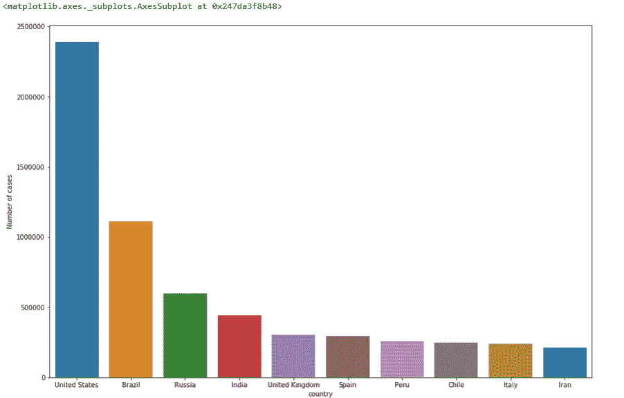

# 用 python 学习 web 抓取和数据可视化的初学者指南

> 原文：<https://medium.com/analytics-vidhya/a-beginners-guide-to-learn-web-scraping-with-python-and-data-visualization-5c7c5329a95e?source=collection_archive---------4----------------------->

在本教程中，我使用了 Beautifulsoup 和 texttable 等库


尼古拉斯·皮卡德在 [Unsplash](https://unsplash.com?utm_source=medium&utm_medium=referral) 上拍摄的照片

## 为什么是网络抓取？

Web 抓取用于从网站上收集大量信息进行分析。

想象一下，你必须从网站上获取大量的数据，并且你想尽可能快地完成它。如果不手动访问每个网站并获取数据，你会怎么做？嗯，“网络抓取”就是答案。网络抓取只是使这项工作更容易和更快。

## 用于网页抓取的库

*   **Beautiful Soup**:Beautiful Soup 是一个解析 HTML 和 XML 文档的 Python 包。它创建有助于轻松提取数据的解析树。
*   Pandas 是一个用于数据操作和分析的库。它用于提取数据并以所需的格式存储数据。

## **用于数据可视化的库**

*   Matplotlib
*   海生的

在本教程中，我将使用[**world ometers**](https://www.worldometers.info/coronavirus/countries-where-coronavirus-has-spread)**来提取 COVID 案例的数量，然后我们将进行数据分析并创建一些可视化。**

****我们开始****

```
# importing modules 
import requests 
from bs4 import BeautifulSoup 

# URL for scrapping data 
url = '[https://www.worldometers.info/coronavirus/countries-where-coronavirus-has-spread/'](https://www.worldometers.info/coronavirus/countries-where-coronavirus-has-spread/')

# get URL html 
page = requests.get(url) 
soup = BeautifulSoup(page.text, 'html.parser') 

data = [] 

# soup.find_all('td') will scrape every element in the url's table 
data_iterator = iter(soup.find_all('td'))  
# data_iterator is the iterator of the table 

# This loop will keep repeating till there is data available in the iterator 
while True: 
    try: 
        country = next(data_iterator).text 
        confirmed = next(data_iterator).text 
        deaths = next(data_iterator).text 
        continent = next(data_iterator).text 

        # For 'confirmed' and 'deaths', make sure to remove the commas and convert to int 
        data.append(( 
            country, 
            (confirmed.replace(', ', '')), 
            (deaths.replace(',', '')), 
            continent
        )) 
    # StopIteration error is raised when there are no more elements left to iterate through 
    except StopIteration: 
        break
```

**运行上述代码后，您可以从网站中提取数据，现在我们将创建一个熊猫数据框以供进一步分析。**

```
# Sort the data by the number of confirmed cases 
data.sort(key = lambda row: row[1], reverse = True)import pandas as pd
dff=pd.DataFrame(data,columns=['country','Number of cases','Deaths','Continment'],dtype=float)
dff.head()dff['Number of cases'] = [x.replace(',', '') for x in dff['Number of cases']]
dff['Number of cases'] = pd.to_numeric(dff['Number of cases'])dff
```

****

**数据帧**

```
dff.info()
```

****

**数据类型**

**创建新列 Death_rate:**

```
dfff=dff.sort_values(by='Number of cases',ascending=False)dfff['Death_rate']= (dfff['Deaths']/dfff['Number of cases'])*100
dfff.head()
```

## **数据可视化**

****

**弗兰基·查马基在 [Unsplash](https://unsplash.com?utm_source=medium&utm_medium=referral) 拍摄的照片**

```
import seaborn as sns
import matplotlib.pyplot as pltfrom pylab import rcParams
rcParams['figure.figsize'] = 15, 10from matplotlib.pyplot import figure
figure(num=None, figsize=(20, 6), dpi=80, facecolor='w', edgecolor='k')
sns.pairplot(dfff,hue='Continment')
```

****

**配对图**

```
sns.barplot(x='country',y='Number of cases',data=dfff.head(10))
```

****

**条形图**

```
sns.regplot(x='Deaths',y='Number of cases',data=dfff)
```

****

**Regplot**

```
sns.scatterplot(x="Number of cases", y="Deaths",hue="Continment",data=dfff)
```

****

**散点图**

```
sns.boxplot(x='country',y='Deaths',data=dfff.head(10),hue='Continment')
```

****

**箱形图**

```
dfg=dfff.groupby(by='Continment',as_index=False).agg({'Number of cases':sum,'Deaths':sum})
dfgg=dfg[1:]df1=dfgg.sort_values(by='Number of cases',ascending=False)df1['Death_rate']=(df1['Deaths']/df1['Number of cases'])*100df1.sort_values(by='Death_rate',ascending=False)
```

****

```
sns.barplot(x='Continment',y='Death_rate',data=df1.sort_values(by='Death_rate',ascending=False))
```

****

```
import texttable as tt# create texttable objecttable = tt.Texttable() 
table.add_rows([(None, None, None, None)] + data)  # Add an empty row at the beginning for the headers 
table.set_cols_align(('c', 'c', 'c', 'c'))  # 'l' denotes left, 'c' denotes center, and 'r' denotes right 
table.header((' Country ', ' Number of cases ', ' Deaths ', ' Continent ')) 

print(table.draw())
```

****

**桌子**

****结论****

**Web 报废在尽可能快地从网站中提取大量数据方面非常有用。然后进行数据分析，并根据您的业务需求创建有洞察力的可视化效果。**

**我希望这篇文章能帮助你并节省大量的时间。如果你有任何建议，请告诉我。**

**快乐编码。**

*****Prabhat Pathak****(*[*Linkedin 简介*](https://www.linkedin.com/in/prabhat-pathak-029b6466/) *)是协理分析师。***

****

**在 [Unsplash](https://unsplash.com?utm_source=medium&utm_medium=referral) 上由 [Austin Chan](https://unsplash.com/@austinchan?utm_source=medium&utm_medium=referral) 拍摄的照片**