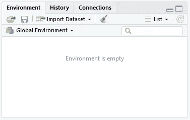
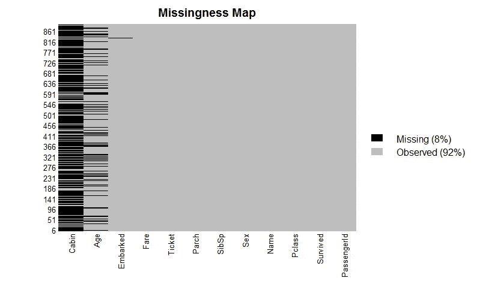
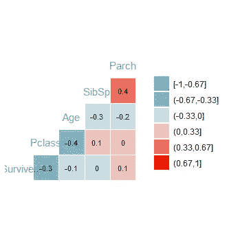
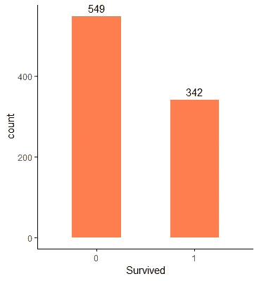
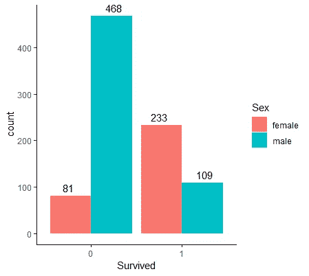
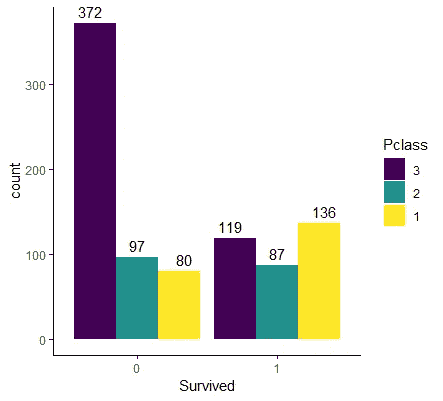
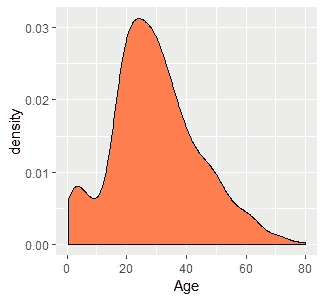
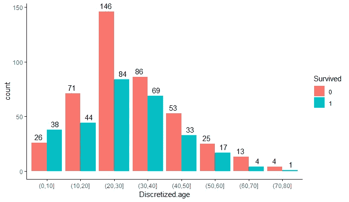
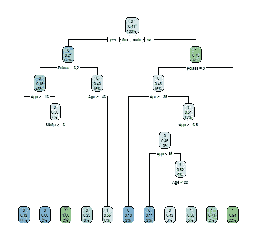

# 用泰坦尼克号数据集学习 R 的初学者指南

> 原文：<https://medium.com/analytics-vidhya/a-beginners-guide-to-learning-r-with-the-titanic-dataset-a630bc5495a8?source=collection_archive---------1----------------------->

这是一个初学者的学习指南，我假设你有一些机器学习的基础知识。

最近因为课程要求，开始学习 R 语言。我有一些用 Python 做 ML 的经验。因此，对于那些试图学习数据科学所需的 R 基础知识或想要过渡到 R 的人来说，这是一个快速入门指南。这个指南也将描述我学习和理解 r 的过程。所以让我们快速地开始吧！


皇家邮轮泰坦尼克号，由 F.G.O .斯图亚特(1843-1923)设计

# **安装 R and R 工作室**

这里可以安装[的 R，这里](https://cran.rstudio.com/)可以安装[的 R Studio。](https://rstudio.com/products/rstudio/download/)

我会推荐使用 [Anaconda](https://www.anaconda.com/distribution/) 来安装。如果您已经安装了 Anaconda，那么您可以创建一个 R 环境并在该环境上安装 R Studio。

打开 Anaconda 导航器。转到环境。创建新环境:


创建环境后，在 Anaconda Navigator 上转到 home。在下拉列表中选择 Applications on : r_env。

你会看到一张 R 工作室的卡片。点击安装。安装成功后，启动 R Studio。现在让我们从 r 开始。

# 一些非常有用的 R 函数和信息

> 索引从 r 中的 1 开始。

## 数据帧、矩阵、向量

与 Python 类似，数据框存储不同数据类型的值。矩阵存储相同数据类型的值。向量是一维数组。

## 赋值运算符

你可以使用

## The c( ) function

The c() function is a very handy function used to create vectors (or 1-d array) or concatenate two or more vectors.

```
myarray <- c( 1, 2, 3.4, c(2, 4))
```

## The paste( ) function

The paste function is used to concatenate strings. It is useful for printing results with a message:

```
paste(“The dimensions of the data frame are “, paste (dim(data.frame), collapse = ‘, ‘))
```

## %> %运算符

%>%用于创建管道。

```
argument %>% function 
```

无非是

```
function(argument)
```

## 访问行和列

您可以使用' $ '访问数据框的列。使用以下命令访问名称列:

```
data.frame$Name
```

若要获取行和列的子集，请使用“:”。例如，为了获得第 10 至 12 行和第 4 至 5 列，

```
data.frame[10:12,4:5]
```

若要访问不连续的行或列，请使用“c()”。例如，为了获得第 1 至 5、7 和 11 行以及第 3 至 4 和 7 列，

```
data.frame[c(1:5, 7, 11), c(3:4, 7)]
```

## 访问满足特定条件的行

为了获得 Pclass 列的值为 1 的行的第 4 到第 6 列，

```
data.frame[data.frame$Pclass == 1, 4:6]
```

这也可以通过使用，

```
subset(data.frame[,4:6], data.frame$Pclass==1)
```

## 行数

```
number.of.rows = nrow(data.frame)
```

## 计算 NA 值

NA 值的数量可以使用 is.na()和 sum()函数来计算。如果值为 na，则 is.na()返回布尔值 true，否则返回 false。sum()，顾名思义，给出传递的值的总和。数据集中 NA 值的数量:

```
sum(is.na(data.frame))
```

## 删除列

您可以使用以下方法删除列:

```
data.frame$ColumnName <- NULL
```

## 删除行

您可以使用以下命令删除第 1、3 和 4 行:

```
data.frame <- data.frame[-c(1,3,4)]
```

# 这个圆点是怎么回事？

所以当我第一次看到 R 中的一些函数时，我认为它们的名字中包含了一个点，这是 OOP 风格。(点)运算符。后来在编码时，有很多这样的例子。(点)。我做了一些谷歌搜索，发现圆点只是(大部分)为了方便而使用。它不代表任何种类的运算符。但是，也有一些例外，更多细节可以在[这里](https://stackoverflow.com/questions/7526467/what-does-the-dot-mean-in-r-personal-preference-naming-convention-or-more)找到。

# 1.加载泰坦尼克号数据集

## 导入数据集

数据集可以在这里获得【https://www.kaggle.com/c/titanic/data 



在 R Studio 中导入数据集非常容易。您只需点击导入数据集按钮，选择要导入的文件或输入 URL。

还可以使用 red.csv()函数加载数据集。这里我们传递了参数 na.string= " "以便空值被读取为 na 值

```
data.frame = read.csv(“.../path_to_/train.csv”, na.strings = “”)
```

# 2.安装软件包

这一步更通用，取决于您将需要的库。出于我们的目的，我们将需要以下库:

psych，GGally，dplyr，ggplot2，rpart，rpart.plot，Amelia

这些包各自提供了什么将在后面讨论。您可以使用以下命令安装和加载这些软件包

```
install.packages(‘psych’)library(psych)
```

# 3.清理和准备数据集

首先，让我们使用，

```
View(data.frame)
```

凭第一直觉，我们发现列舱和年龄有许多 NA 值。所以让我们画一个缺失图，一个显示缺失值的图。为了绘制缺失图，我们需要加载 Amelia 库。

```
library(Amelia)
missmap(data.frame, col=c(“black”, “grey”))
```



正如我们所见，Cabin 列有许多 NA 值，我们将删除它。由于 PassengerID 是记录的唯一标识符，我们将删除它。直觉上，名字、票价、上船和船票栏不会决定生存，所以我们也将它们删除。因此，我们将使用 select()函数从 dplyr 库中选择剩余的列:

```
library(dplyr)
data.frame = select(data.frame, Survived, Pclass, Age, Sex, SibSp, Parch)
```

现在，我们需要处理年龄列中的 NA 值。我们将使用以下方式删除这些行:

```
data.frame = na.omit(data.frame)
```

我们可以使用 str()检查数据的结构:

```
> str(data.frame)'data.frame': 891 obs. of  6 variables: 
$ Survived: int  0 1 1 1 0 0 0 0 1 1 ... 
$ Pclass  : int  3 1 3 1 3 3 1 3 3 2 ... 
$ Age     : num  22 38 26 35 35 NA 54 2 27 14 ... 
$ Sex     : Factor w/ 2 levels "female","male": 2 1 1 1 2 2 2 2 1 1 ... 
$ SibSp   : int  1 1 0 1 0 0 0 3 0 1 ... 
$ Parch   : int  0 0 0 0 0 0 0 1 2 0 ...
```

我们可以看到 Survived 和 Pclass 列都是整数。但它们实际上是分类变量。要将它们转换成分类变量(或因子)，请使用 factor()函数。

```
data.frame$Survived = factor(data.frame$Survived)data.frame$Pclass = factor(data.frame$Pclass, order=TRUE, levels = c(3, 2, 1))
```

Survived 是一个名词性分类变量，而 Pclass 是一个序数分类变量。对于顺序变量，我们提供 order=TRUE 和 levels 参数，以值的升序排列(Pclass 3 < Pclass 2 < Pclass 1)。

# 4.可视化数据

现在让我们通过绘制一些图表来可视化数据。我们将主要关注条形图，因为它们很容易解释。

## 相关图

```
library(GGally)ggcorr(data.frame,
       nbreaks = 6,
       label = TRUE,
       label_size = 3,
       color = “grey50”)
```



## 幸存计数

```
library(ggplot2)
ggplot(data.frame, aes(x = Survived)) +
  geom_bar(width=0.5, fill = "coral") +
  geom_text(stat='count', aes(label=stat(count)), vjust=-0.5) +
  theme_classic()
```



ggplot 函数将 data.frame 作为输入。x 轴和 y 轴变量使用 aes()函数指定。因为我们只对计数感兴趣，所以没有提供 y 值。+运算符用于指定绘图中的附加组件。geom_bar()用于条形图，width 指定条形的宽度，fill 指定条形的颜色。geom_text()用于用 stat=count 标记条形，vjust 是文本的垂直对齐方式。theme_classic()是一个提供配色方案的内置工具。

## 按性别统计幸存人数

在前面的情节中，我们可以通过添加男性和女性幸存者的计数来添加更多信息。

```
ggplot(data.frame, aes(x = Survived, fill=Sex)) +
 geom_bar(position = position_dodge()) +
 geom_text(stat=’count’, 
           aes(label=stat(count)), 
           position = position_dodge(width=1), vjust=-0.5)+
 theme_classic()
```

这里，我们简单地为 fill 参数提供了性别属性。这个属性应该是一个因素。为了并排显示条形，我们将位置称为 position_dodge()。



我们可以推断，幸存的人数很少，而幸存的女性人数多于男性。

类似地，我们绘制了更多的图表。

## 通过 Pclass 生存

```
ggplot(data.frame, aes(x = Survived, fill=Pclass)) +
 geom_bar(position = position_dodge()) +
 geom_text(stat=’count’, 
           aes(label=stat(count)), 
           position = position_dodge(width=1), 
           vjust=-0.5)+
 theme_classic()
```



我们可以推断头等舱乘客的生还机会比其他人多。

## 年龄密度

可以使用 geom_density 创建密度图。

```
ggplot(data.frame, aes(x = Age)) +
 geom_density(fill=’coral’)
```



大多数乘客年龄在 20 到 40 岁之间。

## 按年龄分列的存活率

```
# Discretize age to plot survival
data.frame$Discretized.age = cut(data.frame$Age, c(0,10,20,30,40,50,60,70,80,100))# Plot discretized age
ggplot(data.frame, aes(x = Discretized.age, fill=Survived)) +
  geom_bar(position = position_dodge()) +
  geom_text(stat='count', aes(label=stat(count)), position = position_dodge(width=1), vjust=-0.5)+
  theme_classic()data.frame$Discretized.age = NULL
```



这里我们创建了一个名为 Discretized.age 的临时属性来绘制分布图。我们使用 cut()函数将年龄离散化，并在向量中指定切割。绘制后丢弃的临时属性。

# 5.创建培训和测试数据

我们可以编写如下函数，将数据分为训练集和测试集。我们传递一个分数参数，它决定了必须选择的记录的分数。

```
train_test_split = function(data, fraction = 0.8, train = TRUE) {
  total_rows = nrow(data)
  train_rows = fraction * total_rows
  sample = 1:train_rows
  if (train == TRUE) {
    return (data[sample, ])
  } else {
    return (data[-sample, ])
  }
}
```

然后使用函数创建训练集和测试集，如下所示:

```
train <- train_test_split(data.frame, 0.8, train = TRUE)
test <- train_test_split(data.frame, 0.8, train = FALSE)
```

# 6.决策树模型

```
library(rpart)
library(rpart.plot)
fit <- rpart(Survived~., data = train, method = ‘class’)
rpart.plot(fit, extra = 106)
```

rpart 库中提供了决策树模型。该模型是使用 rpart()构建的。第一个参数定义了目标标签和特征。“~”左侧的属性指定目标标注，左侧的属性指定用于训练的特征。“data”参数是您的训练数据，method =“class”表示我们正在尝试解决一个分类问题。下一个函数绘制了如下的决策树。



# 7.准确(性)

```
predicted = predict(fit, test, type = type)
table = table(test$Survived, predicted)
dt_accuracy = sum(diag(table_mat)) / sum(table_mat)
paste("The accuracy is : ", dt_accuracy)
```

训练完模型后，我们使用 predict()函数在测试集上进行预测。我们通过拟合的模型、测试数据和 type = 'class '进行分类。它返回一个预测向量。table()函数生成实际标签与预测标签的表格，也称为混淆矩阵。

```
 predicted
    0  1 0 113 19  |  (TN)   (FP)1  18 65  |  (FN)   (TP)
```

使用(TP + TN)/(TP + TN + FP + FN)计算精度。我得到了 81.11%的准确率

## 微调

您可以通过选择 minsplit(决策的最小样本数)、minbucket(叶节点的最小样本数)、maxdepth(树的最大深度)来使用控制参数微调决策树。

```
control = rpart.control(minsplit = 8,
                         minbucket = 2,
                         maxdepth = 6,
                         cp = 0)
tuned_fit = rpart(Survived~., data = data_train, method = ‘class’, control = control)
dt_predict = predict(tuned_fit, test, type = ‘class’)
table_mat = table(test$Survived, dt_predict)
dt_accuracy_2 = sum(diag(table_mat)) / sum(table_mat)
paste(“The accuracy is : “, dt_accuracy_2)
```

经过微调，准确率上升到 87.41%

# 8.逻辑回归模型

为了建立逻辑回归模型，我们使用广义线性模型 glm()进行分类。

```
data_rescale = mutate_if(data.frame,
                          is.numeric,
                          list(~as.numeric(scale(.))))
r_train = train_test_split(data_rescale, 0.7, train = TRUE)
r_test = train_test_split(data_rescale, 0.7, train = FALSE)
logit = glm(Survived~., data = r_train, family = ‘binomial’)
summary(logit)
lr_predict = predict(logit, r_test, type = ‘response’)# confusion matrix
table_mat = table(r_test$Survived, lr_predict > 0.68)
lr_accuracy = sum(diag(table_mat)) / sum(table_mat)
paste(“The accuracy is : “, lr_accuracy)
```

我们可以使用 as.numeric()和 scale()函数对数据进行缩放。“.”(点)在这里指定了完整的数据集。它会自动忽略因素。你可以用 summary()得到模型的概要。我们使用 type = 'response '的 predict 函数来获取概率，从而获得预测。在 table()函数中，我们传递了一个参数 predict>0.68，这是一个阈值，表示如果预测的概率大于 0.68，则我们将该记录分类为 1(幸存)。

我得到了 80%的准确率。

# 9.朴素贝叶斯模型

e1071 库中有朴素贝叶斯模型。

```
library(e1071)
nb_model = naiveBayes(Survived ~., data=train)
nb_predict = predict(nb_model,test)
table_mat = table(nb_predict, test$Survived)
nb_accuracy = sum(diag(table_mat)) / sum(table_mat)
paste(“The accuracy is : “, nb_accuracy)
```

我得到了 81.81%的准确率。

# 10.kNN 模型

kNN 模型在“类”库中可用。但是，首先，

*   knn()需要数字变量。如果在数据框中使用因子，则会引发错误。
*   knn()只接受矩阵或数据帧作为训练和测试参数，而不接受向量。

```
library(class)
library(dummies)# one hot encoding using dummy
ohdata = cbind(data.frame, dummy(data.frame$Pclass))
ohdata = cbind(ohdata, dummy(ohdata$Sex))# drop original factor variables
ohdata$Pclass = NULL
ohdata$Sex = NULL
ohtrain = train_test_split(ohdata, 0.8, train = TRUE)
ohtest = train_test_split(ohdata, 0.8, train = FALSE)
train_labels = select(ohtrain, Survived)[,1]
test_labels = select(ohtest, Survived)[,1]# drop labels for prediction
ohtrain$Survived=NULL
ohtest$Survived=NULL
knn_predict = knn(train = ohtrain,
                  test = ohtest,
                  cl = train_labels,
                  k=10)
table_mat = table(knn_predict, test_labels)
accuracy_knn = sum(diag(table_mat)) / sum(table_mat)
```

我们可以使用 dummy()为 Pclass 和 Sex 属性创建一次性编码。原始因子属性被删除。训练、测试特征和标签被分离，并且幸存属性从训练、测试集中被丢弃。

注意 train_labels 和 test_labels 的“[，1]”。这是因为 select()返回的是一个向量。但是我们需要一个数据框架(或者矩阵)。

最后，我们应用 kNN 并计算准确率。我得到了 85.3%的准确率

# 11.结论

嗯，R 的学习曲线一开始很陡，但是一旦你掌握了它，你就会很容易上手。这只是机器学习过程中对 R 的一个基本介绍，你可以用 R 做更多的事情。话虽如此，我仍然更喜欢 Python，因为它的易用性和多功能性。

在机器学习部分，决策树模型表现最好，准确率约为 87%。另一种基于决策树的算法是随机森林算法。看看决策树的性能，我们可以预期使用随机森林的集成方法会有相似或更好的性能。